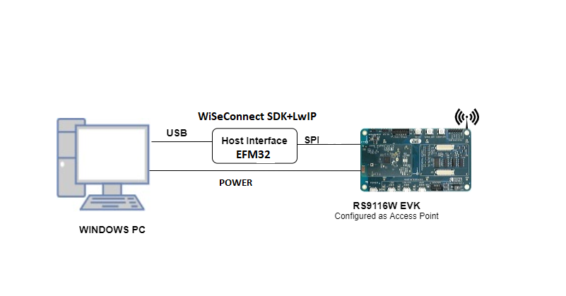

# Access Point

## 1. Purpose / Scope

This application demonstrates how to configure the RS9116W EVK as a soft Access point and allows stations to connect to it and enables TCP data transmission from the connected Wi-Fi station to Silicon Labs Access Point.

## 2. Prerequisites / Setup Requirements

Before running the application, the user will need the following things to setup.

### 2.1 Hardware Requirements 
  
* Windows PC with Host interface (SPI).
* Silicon Labs [RS9116 Wi-Fi Evaluation Kit](https://www.silabs.com/development-tools/wireless/wi-fi/rs9116x-sb-evk-development-kit)
* Host MCU Eval Kit. This example has been tested with:
  - Silicon Labs [WSTK + EFM32GG11](https://www.silabs.com/development-tools/mcu/32-bit/efm32gg11-starter-kit)



### 2.2 Software Requirements

- WiSeConnect SDK already part of this project.

- Embedded Development Environment.

   - For Silicon Labs EFM32, use the latest version of [Simplicity Studio](https://www.silabs.com/developers/simplicity-studio).

## 3. Application Build Environment

### 3.1 Platform

The Application can be built and executed on below Host platforms
* [WSTK + EFM32GG11](https://www.silabs.com/development-tools/mcu/32-bit/efm32gg11-starter-kit)

### 3.2 Host Interface

* By default, the application is configured to use the SPI bus for interfacing between Host platforms(EFM32GG11) and the RS9116W EVK.

### 3.3 Project Configuration

The Application is provided with the project folder contains Simplicity Studio project files.

  - EFM32GG11 platform
    - The Simplicity Studio project is used to evaluate the application on EFM32GG11.
      - Project path:`LwIP_AP_Mode_baremetal/platforms/EFM32/Simplicity/Projects/SPI/tcp_ip_bypass`

### 3.4 Bare Metal/RTOS Support

This application supports bare metal at the moment.

## 4. Application Configuration Parameters

The application can be configured to suit user requirements and development environment. Read through the following sections and make any changes needed.

### 4.1  Open ap_mode_bypass.c file 

#### 4.1.1 The desired parameters are provided below. User can also modify the parameters as per their needs and requirements.

SSID refers to the name of the Access point to be created.

```c
#define SSID                                 "SILABS_AP"
```

CHANNEL_NO refers to the channel in which AP would be started

```c
#define CHANNEL_NO                           11
```

SECURITY_TYPE refers type of security. Access point supports Open, WPA, WPA2 securities.

   Valid configurations are:

   - RSI_OPEN - For OPEN security mode

   - RSI_WPA - For WPA security mode

   - RSI_WPA2 - For WPA2 security mode

```c
#define SECURITY_TYPE                        RSI_WPA2
```

ENCRYPTION_TYPE refers to the type of Encryption method. Access point supports OPEN, TKIP, CCMP encryption methods.

Valid configurations are:

   - RSI_CCMP - For CCMP encryption

   - RSI_TKIP - For TKIP encryption

   - RSI_NONE - For open encryption

```c
#define ENCRYPTION_TYPE                      RSI_CCMP
```

PSK refers to the secret key if the Access point to be configured in WPA/WPA2 security modes.

```c
#define PSK                      "1234567890"            
```

BEACON_INTERVAL refers to the time delay between two consecutive beacons in milliseconds. Allowed values are integers from 100 to 1000 which are multiples of 100.

```c
#define BEACON_INTERVAL                      100
```

DTIM_INTERVAL refers DTIM interval of the Access Point. Allowed values are from 1 to 255.

```c
#define DTIM_INTERVAL                        4
```


GLOBAL_BUFF_LEN refers the memory length for driver

```c
#define GLOBAL_BUFF_LEN                      15000
```

RECV_BUFFER_SIZE refers receive data length

```c
#define RECV_BUFFER_SIZE                      1000
```
```c
/************************** Access Point Static Default ****************************/
#define AP_IP_ADDR0   (uint8_t) 192    ///< Static IP: IP address value 0
#define AP_IP_ADDR1   (uint8_t) 168    ///< Static IP: IP address value 1
#define AP_IP_ADDR2   (uint8_t) 1     ///< Static IP: IP address value 2
#define AP_IP_ADDR3   (uint8_t) 1     ///< Static IP: IP address value 3

/*NETMASK*/
#define AP_NETMASK_ADDR0   (uint8_t) 255 ///< Static IP: Netmask value 0
#define AP_NETMASK_ADDR1   (uint8_t) 255 ///< Static IP: Netmask value 1
#define AP_NETMASK_ADDR2   (uint8_t) 255 ///< Static IP: Netmask value 2
#define AP_NETMASK_ADDR3   (uint8_t) 0   ///< Static IP: Netmask value 3

/*Gateway Address*/
#define AP_GW_ADDR0   (uint8_t) 192        ///< Static IP: Gateway value 0
#define AP_GW_ADDR1   (uint8_t) 168        ///< Static IP: Gateway value 1
#define AP_GW_ADDR2   (uint8_t) 1        ///< Static IP: Gateway value 2
#define AP_GW_ADDR3   (uint8_t) 1        ///< Static IP: Gateway value 3
```

### 4.2 Open rsi_wlan_config.h file. User can also modify the below parameters as per their needs and requirements.


```c
#define CONCURRENT_MODE                      RSI_DISABLE
#define RSI_FEATURE_BIT_MAP                  FEAT_SECURITY_PSK
#define RSI_TCP_IP_BYPASS                    RSI_ENABLE
#define RSI_TCP_IP_FEATURE_BIT_MAP           TCP_IP_FEAT_BYPASS
#define RSI_BAND                             RSI_BAND_2P4GHZ
```

## 5. Testing the Application

User has to follow the below steps for the successful execution of the application. 

### 5.1 Loading the RS9116W Firmware

Refer [Getting started with a PC](https://docs.silabs.com/rs9116/latest/wiseconnect-getting-started) to load the firmware into RS9116W EVK. Choose the firmware file from the latest WiSeConnect release of GitHub.


### 5.2 Building the Application on Host Platform

#### 5.2.1 Using EFM32

Refer [Getting started with EFX32](https://docs.silabs.com/rs9116-wiseconnect/latest/wifibt-wc-getting-started-with-efx32/), for settin-up EFM host platform

- Open Simplicity Studio and import the EFM32 project from `LwIP_AP_Mode_baremetal/platforms/EFM32/Simplicity/Projects/SPI/tcp_ip_bypass`
    - Follow the project import procedure mentioned in section **Section 3.3**.
- Compile and flash the project in to Host MCU
- Debug the project
- Check for the RESET pin:
  - If RESET pin is connected from EFM32 to RS9116W EVK, then user need not press the RESET button on RS9116W EVK before free run
  - If RESET pin is not connected from EFM32 to Rs9116W EVK, then user need to press the RESET button on RS9116W EVK before free run
- Free run the project
- Then continue the common steps from **5.3**

### 5.3 Common Steps

1. After program gets executed, RS9116W EVK will be created as an Access Point with configured **SSID** ( Ex: "**SILABS_AP"**).

2. The LwIP stack will addign the IP to the RS9116 device.

3. Connect a client to RS9116 AP and IP will be configured by the Dhcp server running in the application.

## 5.4 Importing the project

1. Open Simplicity Studio v5 and click on `File`.
2. Click on `Import`.
3. Click on `More Import options`.
4. Navigate to `LwIP_AP_Mode_baremetal/platforms/EFM32/Simplicity/Projects/SPI/tcp_ip_bypass` path and select the folder.
5. A project will be appeared in SSv5. Select it.
6. To view the project, `Navigate to Window-> Prespective-> Resource`.