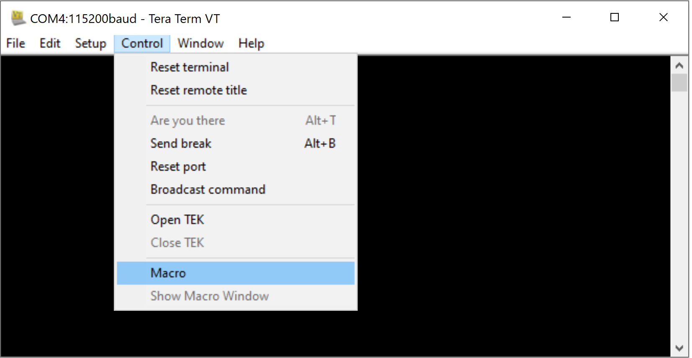
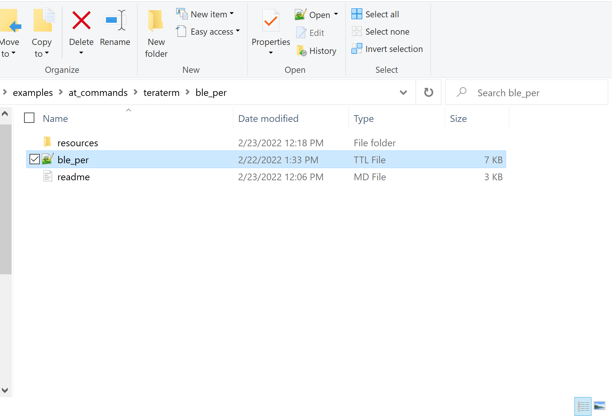
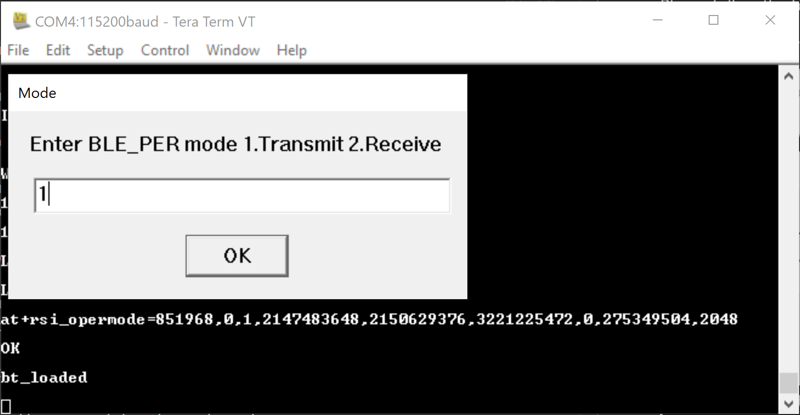
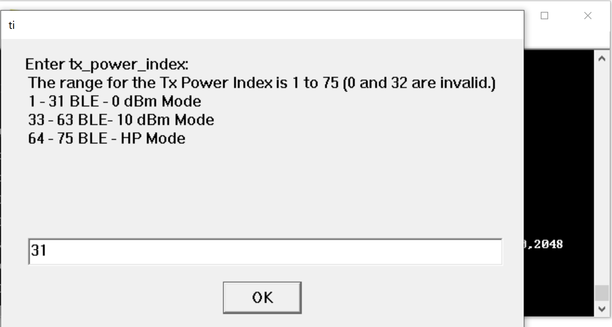
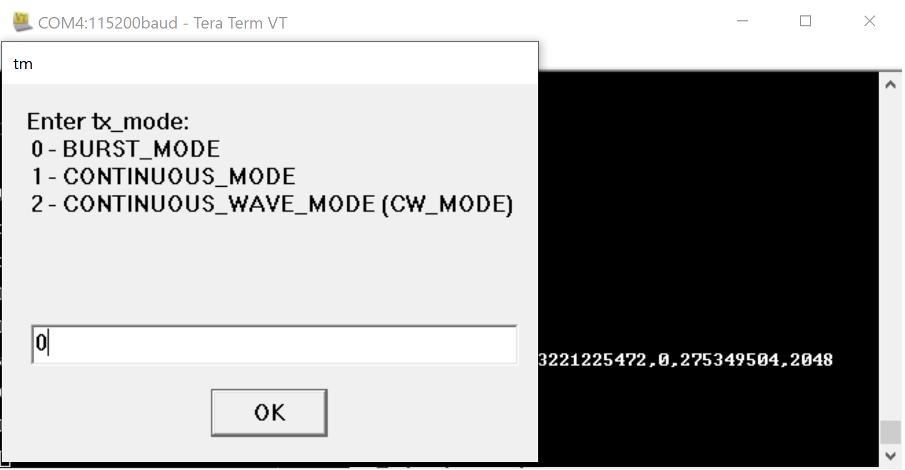
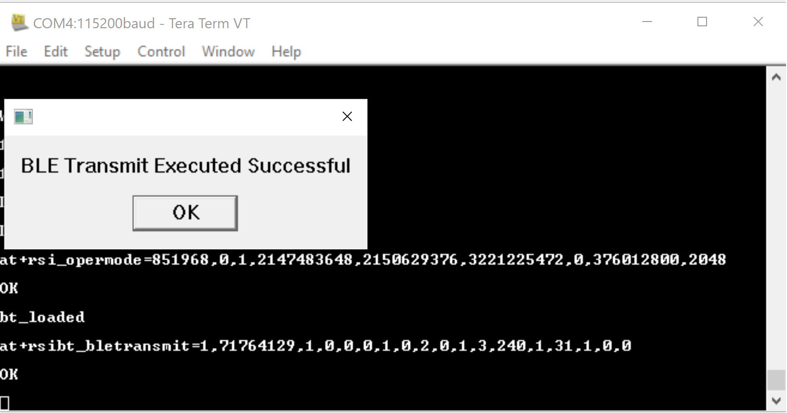
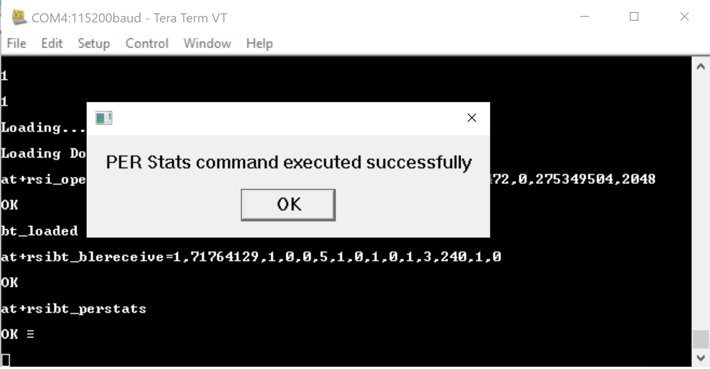

## BLE PER Mode Tera Term Script
This application demonstrates how to configure the RS9116W EVK in BLE PER mode.

Before continuing, ensure the RS9116W EVK is plugged into your computer and is connected via Tera Term as described in [Getting Started with PC using AT Commands](http://docs.silabs.com/rs9116-wiseconnect/latest/wifibt-wc-getting-started-with-pc/). 

## Contents
  - [Setting up the RS9116](#setting-up)
  - [Transmit PER instructions](#transmit-per-instructions)
  - [Receive PER instructions](#receive-per-instructions)

## Setting up

**STEP 1.** Reset the RS9116W EVK.

**STEP 2.** In the Tera Term menu select `Control->Macro`.

	
**STEP 3.** Navigate to the folder `<SDK>/examples/at_commands/teraterm/ble_per` containing the example script and select the file `ble_per.ttl`.

**STEP 4.** After selecting the `ble_per.ttl` script, a popup shows to indicate the BLE PER script is running. Two additional popups then show to indicate auto baud and the `opermode` command is successul.  

## Transmit PER Instructions
The following steps describe how to configure the RS9116W for BLE Transmit PER measurement.

**Step 1.** Enter `1` to run the script in transmit PER mode.

**STEP 2.** Enter `1` to enable PER mode.

**Step 3.** Enter the 32-bit device address in hex format. In the following example, the access address of the BLE PER packet is `0x71764129`.

**Step 4.** Enter the desired PHY data rate.

**Step 5.** Enter the Receive (Rx) and then Transmit (Tx) channel numbers.

**Step 6.** Enter the scrambler seed according to the PER mode.

**Step 7.** Enter the desired `le channel type`.

**Step 8.** Enter the desired `hopping type`.

**Step 9.** Enter the desired `antenna type`.

**Step 10.** Enter the desired `rf chain`.

**Step 11.** Enter the desired `payload type`.

**Step 12.** Enter the desired `tx power`.

**Step 13.** Enter the desired PER transmission mode.

**Step 14.** Enter the desired number of packets to transmit.

With all inputs successfully entered, PER packet(s) are transmitted.  

### BLE CW-Mode Selection

**Step 15.** To run the BLE_CW mode all the parameters you need to enter as mentioned step by step procedure in above
method. But "Scrambler_seed" parameter you need to give input as 5.

**Step 16.**  After "Scrambler_seed" parameter script will ask all the inputs as mentioned in above BLE_Trasmit method, you
need to enter .

**Step 17.** All the necessary inputs are completed , final input will ask for "Continuous Wave" selection you need to enter
2.Like as below pic.

**Step 18.** After giving all the inputs BLE CW mode Transmit command executed successfully.

## Receive PER Instructions
The following steps describe how to configure the RS9116W for BLE Receive PER measurement.

**Step 1.** Enter `2` to run the script in PER receive mode.

**STEP 2.** Enter `1` to enable PER mode.

**Step 3.** Enter the 32-bit device address in hex format. In the following example, the access address of the BLE PER packet is `0x71764129`.

**Step 4.** Enter the desired PHY data rate.

**Step 5.** Enter the Receive (Rx) and then Transmit (Tx) channel numbers.

**Step 6.** Enter the scrambler seed according to the PER mode.

**Step 7.** Enter the desired `le_channel type`.

**Step 8.** Enter the desired `hopping type`.

**Step 9.** Enter the desired `antenna type`.

**Step 10.** Enter the desired `rf_chain`.

**Step 11.** Enter the desired extended data length option.

**Step 12.** Enter the desired loop back mode option.

**Step 13.** Enter the desired duty cycling option.

**Step 14.** With all inputs successfully entered, the RS9116W waits to receive packets.   

### BLE CW-Mode Selection

**Step 15.** To run the BLE_CW mode all the parameters you need to enter as mentioned step by step procedure in above
method. But "Scrambler_seed" parameter you need to give input as 5.

**Step 16.**  After "Scrambler_seed" parameter script will ask all the inputs as mentioned in above BLE_Trasmit method, you
need to enter .

**Step 17.** All the necessary inputs are completed , final input will ask for "Continuous Wave" selection you need to enter
2.Like as below pic.

**Step 18.** After giving all the inputs BLE PER CW mode Receive command executed and PER stats command also executes simultaneously.

Refer to the [BLE Programming Reference Manual](https://docs.silabs.com/rs9116/wiseconnect/rs9116w-ble-at-command-prm/latest/08-ble-commands) for further details on how to change the parameters.