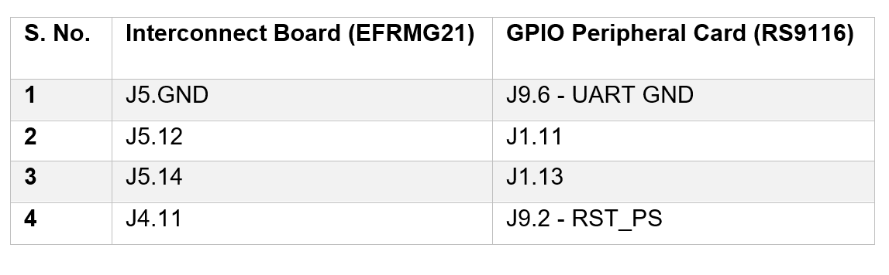

# Wi-Fi Provisioning over BLE using AT commands in UART interface (EFR)

<!-- TOC -->

- [Introduction](#introduction)
   - [About](#about)
   - [Application Design Flow](#application-design-flow)
   - [Terminologies](#terminologies)
- [Prerequisites](#prerequisites)
    - [Hardware](#hardware)
    - [Software](#software)
    - [Setup Diagram](#setup-diagram)
- [Application Build Environment](#application-build-environment)
    - [Platform](#platform)
    - [Host Interface](#host-interface)
    - [Project Configuration](#project-configuration)
- [Testing the Application](#testing-the-application)
    - [Loading the RS9116 NCP Firmware](#loading-the-rs9116-ncp-firmware)
    - [ Building the Application on the Host Platform](#building-the-application-on-the-host-platform)
    - [Project Configuration](#project-configuration)
- [Troubleshoot](#troubleshoot)
- [Limitations](#limitations)
- [References](#references)

<!-- /TOC -->

#  Introduction
##  About 
 This project helps to securely send Wi-Fi network credentials from a Provisioning Tool to RS9116 NCP module over BLE. The communication between Provisioning Tool and RS9116 NCP module happens using AT commands via UART/USB-CDC interface with PC as the Host Platform. Wi-Fi Provisioning over BLE offers numerous advantages, notably interoperability and ease of implementation. It provides a wide range of useful applications, such as Wi-Fi enabled Garage Door opener, smart led bulb, Wi-Fi Speakers and other smart home appliances.     

##  Application Design Flow

## Terminologies

   -  WLAN    : Wireless Local Area Network
   -  BLE     : Bluetooth Low Energy
   -  GUI     : Graphical User Interface
   -  AP      : Access Point
  

# Prerequisites
This section details on the hardware and software required for running the applciation.

## Hardware

- Silicon Labs [RS9116 Wi-Fi Evaluation Kit](https://www.silabs.com/development-tools/wireless/wi-fi/rs9116x-sb-evk-development-kit?tab=overview) 
 
- Silicon Labs [WSTK + EFR32MG21](https://www.silabs.com/development-tools/wireless/efr32xg21-bluetooth-starter-kit) with Wireless Gecko (Base Board BRD4001A) and 
Radio Card (BRD4180A/BRD4180B)   
 
- Mini-USB cable
- Micro-USB cable 
- GPIO Peripheral Board
- Interconnect Board 
- Jumper Wire (Female to Female): 4 
- PC/Laptop
- Wi-Fi Access Point
- Smartphone with EFR Connect App

## Software

- [WiSeConnect SDK](https://github.com/SiliconLabs/wiseconnect-wifi-bt-sdk/)
    
- Embedded Development Environment: [Simplicity Studio](https://www.silabs.com/developers/simplicity-studio). 
   - Follow [Simplicity Studio user guide](https://docs.silabs.com/simplicity-studio-5-users-guide/1.0/) to install Simplicity Studio
   
- Smartphone with [EFR Connect App](https://www.silabs.com/developers/efr-connect-mobile-app)  for testing the BLE applications. 

## Setup Diagram
  

# Application Build Environment

## Platform

The application can be built and executed on below Host platform:
*	[WSTK + EFR32MG21](https://www.silabs.com/development-tools/wireless/efr32xg21-bluetooth-starter-kit) 

## Host Interface

The application is configured to use UART for interfacing between Host platform(EFR32MG21) and the RS9116 NCP module. The connections are as follows:

   

## Project Configuration

The application is provided with the project folder containing Simplicity Studio project files.

*	Simplicity Studio
	- The Simplicity Studio project is used to evaluate the application on EFR32MG21.
   - Create a folder named `EFR` in the latest Release at location:  
   `<SDK>/examples/at_commands`
   - Extract the zip folder **wifi_provisioning_over_ble.zip** at location:  `<SDK>/examples/at_commands/EFR`
   - Project path:  
       - Radio Board version is mentioned as given below: 
             

		- If the Radio Board is **BRD4180A**, then access the path: 
       `<SDK>/examples/at_commands/EFR/wifi_provisioning_over_ble/projects/wifi_provisioning_over_ble-brd4180a-mg21.slsproj`
		- If the Radio Board is **BRD4180B**, then access the path:  
      `<SDK>/examples/at_commands/EFR/wifi_provisioning_over_ble/projects/wifi_provisioning_over_ble-brd4180b-mg21.slsproj`           

# Testing the Application

This section lists the steps to be followed for the successful execution of the application.

## Loading the RS9116 NCP Firmware

Refer [Updating RS9116 NCP Firmware](https://docs.silabs.com/rs9116-wiseconnect/latest/wifibt-wc-getting-started-with-pc/update-evk-firmware) to load the firmware into RS9116 NCP module. The firmware binary is located in `<SDK>/firmware/`

## Building the Application on the Host Platform

1. Configure EFR32xG21 and the RS9116 NCP module as described in <a href="#connection">Section 3.2</a>. Power RS9116 using micro-USB cable and EFR using mini-USB cable from PC.

2.	Launch Simplicity Studio on your PC and import the EFR32/EFM32 project from the below location:  
`<SDK>/examples/at_commands/EFR/wifi_provisioning_over_ble/projects` 
Refer [EFx32 Getting Started](https://docs.silabs.com/rs9116-wiseconnect/latest/wifibt-wc-getting-started-with-efx32/), for setting-up EFR host platform.

3. Select the appropriate .slsproj as per Radio Board type mentioned in <a href="#boardtype">Section 3.3</a> for EFR32 board.
4.  Debug the project.
5. Free run the project.

6. Run the EFR Connect mobile application. The following interface will appear:
     

7. If BLE is not enabled, enable it using the following option:
   

8. Switch to **Demo** Section as shown below:
   

9. Select **Wi-Fi Commissioning** from the list of available options in the EFR Connect mobile application as shown below:
      

10. Select **BLE_Configurator** from the list of available options:
   

11. The WLAN scan results will be fetched to the EFR Connect application as shown below:
   

12. Select the desired AP and enter the password (if any). Click on **Connect**.
   

13. If correct credentials are provided, the RS9116 NCP module will be connected to the AP and a green symbol will be highlighted across the selected AP in the EFR Connect application:
   

14. The WLAN MAC address and IP address is mentioned below the name of the AP:
   

15. For WLAN Disconnection from the AP, select the connected AP in the EFR Connect application and click on **Yes**.
      

# Troubleshoot 
1.	Make sure Bluetooth is enabled on the Provisioning Tool.
2. Check for the RESET pin:
	- If RESET pin is connected from EFR32 to RS9116 NCP module, then user need not press the RESET button on RS9116 NCP module before free run.
	- If RESET pin is not connected from EFR32 to RS9116 NCP  module, then user need to press the RESET button on RS9116 NCP module before free run.
3.	If any error occurs, terminate the application, reset the RS9116 NCP module, and re-run the application.

> **Note:** Enable Console prints in Simplicity Studio which provide details about the ongoing process in the application. 

 
# Limitations

1. Maximum 11 APs can be displayed at a time.

2. Length of password should be greater than 7 and less than or equal to 17.

3. If a password of length \> 17 is entered in EFR Connect App, it stops responding.

4. The RS9116 NCP radio is configured only for 2.4 GHz band.

5. The RS9116 NCP module works as a normal client that can connect to an Access Point with security modes: Open, WPA and WPA2.   

# References

1. [RS9116 NCP BLE AT Command Programming Reference Manual](https://docs.silabs.com/rs9116/wiseconnect/rs9116w-ble-at-command-prm/latest/)
2. [RS9116 NCP BT Classic AT Command Programming Reference Manual](https://docs.silabs.com/rs9116/wiseconnect/rs9116w-bt-classic-at-command-prm/latest/)
3. [RS9116 Wi-Fi AT Command Programming Reference Manual](https://docs.silabs.com/rs9116/wiseconnect/rs9116w-wifi-at-command-prm/latest/)   

  