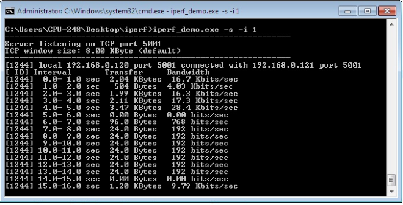

# Dual Mode Switcher

## 1. Purpose / Scope

This application demonstrates how to configure the RS9116W EVK to switch between Wi-Fi Station mode and Access Point mode and explains the data transfer in both modes.

## 2. Prerequisites 

Before running the application, the user will need the following things to setup.

### 2.1 Hardware Requirements

* Windows with Host interface(UART/ SPI/ SDIO).
* Silicon Labs [RS9116 Wi-Fi Evaluation Kit](https://www.silabs.com/development-tools/wireless/wi-fi/rs9116x-sb-evk-development-kit)
* Host MCU Eval Kit. This example has been tested with:
  - Silicon Labs [WSTK + EFR32MG21](https://www.silabs.com/development-tools/wireless/efr32xg21-bluetooth-starter-kit)
  - Silicon Labs [WSTK + EFM32GG11](https://www.silabs.com/development-tools/mcu/32-bit/efm32gg11-starter-kit)
  - [STM32F411 Nucleo](https://st.com/)
* Wireless Access Point.
* Windows PC2 (Remote PC) with iperf application.
* Windows PC as Wifi Station.  


### 2.2 Software Requirements

- [WiSeConnect SDK](https://github.com/SiliconLabs/wiseconnect-wifi-bt-sdk/) 
- Embedded Development Environment
  
   - For STM32, use licensed [Keil IDE](https://www.keil.com/demo/eval/arm.htm)

   - For Silicon Labs EFx32, use the latest version of [Simplicity Studio](https://www.silabs.com/developers/simplicity-studio)

- [Iperf Application](https://iperf.fr/iperf-download.php) in Windows PC (Remote PC)

## 3. Application Build Environment

### 3.1 Platform

The Application can be built and executed on below Host platforms
* [STM32F411 Nucleo](https://st.com/)
* [WSTK + EFR32MG21](https://www.silabs.com/development-tools/wireless/efr32xg21-bluetooth-starter-kit) 
* [WSTK + EFM32GG11](https://www.silabs.com/development-tools/mcu/32-bit/efm32gg11-starter-kit)

### 3.2 Host Interface

* By default, the application is configured to use the SPI bus for interfacing between Host platforms(STM32F411 Nucleo / EFR32MG21) and the RS9116W EVK.
* This application is also configured to use the SDIO bus for interfacing between Host platforms(EFM32GG11) and the RS9116W EVK.

### 3.3 Project Configuration

The Application is provided with the project folder containing Keil and Simplicity Studio project files.

* Keil Project
  - The Keil project is used to evaluate the application on STM32.
  - Project path: `<SDK>/examples/snippets/wlan/concurrent_mode/projects/concurrent_mode-nucleo-f411re.uvprojx`

* Simplicity Studio
  - The Simplicity Studio project is used to evaluate the application on EFR32MG21.
  - Project path: 
    - If the Radio Board is **BRD4180A** or **BRD4181A**, then access the path `<SDK>/examples/snippets/wlan/concurrent_mode/projects/concurrent_mode-brd4180a-mg21.slsproj`
    - If the Radio Board is **BRD4180B** or **BRD4181B**, then access the path `<SDK>/examples/snippets/wlan/concurrent_mode/projects/concurrent_mode-brd4180b-mg21.slsproj`
    - User can find the Radio Board version as given below 

 

  - EFM32GG11 platform
    - The Simplicity Studio project is used to evaluate the application on EFM32GG11.
      - Project path:`<SDK>/examples/snippets/wlan/concurrent_mode/projects/concurrent_mode-brd2204a-gg11.slsproj`


### 3.4 Bare Metal/RTOS Support

This application supports bare metal and RTOS environment. By default, the application project files (Keil and Simplicity studio) are provided with bare metal configuration in the SDK.

## 4. Application Configuration Parameters

The application can be configured to suit user requirements and development environment. Read through the following sections and make any changes needed.

1. Rename **iot-pa-wifi-dual_mode_switcher** to **dual_mode_switcher** and place the  project folder in the downloaded SDK at path: <SDK_path> → examples → snippets → wlan. 


2. Launch the Simplicity Studio IDE on your PC.

### 4.1 Open dual_mode_switcher.c file

#### 4.1.1 The desired parameters are provided below when RS9116W is acting as Access Point. User can also modify the parameters as per their needs and requirements.

AP_SSID refers to the name of the WiSeConnect Access point would be created.

```c
#define AP_SSID                       "SILABS_AP"
```

AP_CHANNEL_NO refers to the channel in which AP would be started

```c
#define AP_CHANNEL_NO                 11
```

> Note: 
> 1. Valid values for CHANNEL_NO are 1 to 11 in 2.4GHz band and 36 to 48 & 149 to 165 in 5GHz. In this example default configured band is 2.4GHz. If user wants to use 5GHz band then user has to set RSI_BAND macro to 5GHz band in rsi_wlan_config.h file.
> 2. In concurrent mode, STA and AP should be configured in same channel. Configure the AP_CHANNEL_NO to same channel in which Wireless Access point (to which WiSeConnect STA connects) exist.

AP_SECURITY_TYPE refers to the security type of the WiSeConnect Access Point. Access point supports OPEN, WPA-PSK, WPA2-PSK security modes.

   Valid configurations are:

   - RSI_OPEN - For OPEN security mode

   - RSI_WPA - For WPA security mode

   - RSI_WPA2 - For WPA2 security mode

```c
#define SECURITY_TYPE                   RSI_WPA2
```

AP_ENCRYPTION_TYPE refers to the type of Encryption method .Access point supports OPEN, TKIP and CCMP methods.

Valid configurations are:

   - RSI_CCMP - For CCMP encryption

   - RSI_TKIP - For TKIP encryption

   - RSI_NONE - For open encryption

```c
#define AP_ENCRYPTION_TYPE                RSI_CCMP
```

AP_PSK refers to the secret key if the Access point to be configured in WPA/WPA2-PSK security modes.

```c
#define AP_PSK                           “1234567890”
```

BEACON_INTERVAL refers to the time delay between two consecutive beacons in milliseconds in AP mode. Allowed values are integers from 100 to 1000 which are multiples of 100.

```c
#define BEACON_INTERVAL                    100
```

DTIM_INTERVAL refers DTIM interval of the Access Point. Allowed values are from 1 to 255.

```c
#define DTIM_INTERVAL                       10
```

MOD_DEVICE_PORT refers to internal TCP client port number.

```c
#define MOD_DEVICE_PORT                        5001
```

MOD_DEVICE_IP refers to IP address of the module.

```c
#define MOD_DEVICE_IP                        "192.168.10.1"
```
MOD_GATEWAY refers to IP address of Gateway for module.

```c
#define MOD_GATEWAY                        "192.168.10.1"
```
MOD_NETMASK refers to IP address of netmask for module.

```c
#define MOD_NETMASK                        "255.255.255.0"
```

The following parameters are configured if OS is used. WLAN task should be of low priority

```c
#define RSI_WLAN_TASK_PRIORITY                   1
```
   
Driver task should have the highest priority among all threads

```c
#define RSI_DRIVER_TASK_PRIORITY                 2
```

WLAN Task stack size is configured by this macro
	 
```c
#define RSI_WLAN_TASK_STACK_SIZE           500
```

Driver Task stack size is configured by this macro
	 
```c
#define RSI_DRIVER_TASK_STACK_SIZE         500
```

GLOBAL_BUFF_LEN refers the memory length for driver

```c
#define GLOBAL_BUFF_LEN                      15000
```

NUMEBR_OF_PACKETS refers how many packets to send from TCP client to TCP server

```c
#define NUMBER_OF_PACKETS                 1000
```

DHCP_MODE refers whether IP address configured through DHCP or STATIC in STA mode

```c
#define DHCP_MODE                         1
```

> Note:
> If user wants to configure STA IP address through DHCP then set DHCP_MODE to 1 and skip configuring the following DEVICE_IP, GATEWAY and NETMASK macros.
> (Or)
> If user wants to configure STA IP address through STATIC then set DHCP_MODE macro to "0" and configure following DEVICE_IP, GATEWAY and NETMASK macros.

IP address to be configured to the device in STA mode should be in long format and in little endian byte order.

   Example: To configure "192.168.0.10" as IP address, update the macro DEVICE_IP as 0x010AA8C0.

```c
#define DEVICE_IP                       0X0A00A8C0
```

IP address of the gateway should also be in long format and in little endian byte order.

   Example: To configure "192.168.0.1" as Gateway, update the macro GATEWAY as 0x0100A8C0

```c
#define GATEWAY                         0x0100A8C0
```

IP address of the network mask should also be in long format and in little endian byte order

   Example: To configure "255.255.255.0" as network mask, update the macro NETMASK as 0x00FFFFFF

```c
#define NETMASK                         0x00FFFFFF
```

> Note:
> 1. This application is not providing the facility to configure the Access Point’s IP Parameters. Default IP address of the Silicon Labs Access point is “192.168.100.76”
> 2. In concurrent mode, IP networks of Silicon Labs STA and Silicon Labs Access  Point both should be different. Configure Wireless Access Point IP network(Ex: 192.168.0.1) other than Silicon Labs Access point IP network.

#### 4.1.2 The desired parameters are provided below when RS9116W is acting as Station. User can also modify the parameters as per their needs and requirements.

SSID refers to the name of the Access point.

```c
#define SSID                          "AP_SSID"
```

STA_SECURITY_TYPE refers to the type of security. In concurrent mode STA supports Open, WPA and WPA2 securities.

Valid configurations are:

   - RSI_OPEN - For OPEN security mode

   - RSI_WPA - For WPA security mode

   - RSI_WPA2 - For WPA2 security mode

```c
#define STA_SECURITY_TYPE             RSI_WPA2
```

STA_PSK refers to the STA secret key to connect with the secured Access Point.

```c
#define STA_PSK                       "12345678"
```

SERVER_PORT port refers remote TCP server port number which is opened in Windows PC2.

```c
#define SERVER_PORT                        5001
```

SERVER_IP_ADDRESS refers remote peer (Windows PC2) IP address to connect with TCP server socket.

   IP address should be in long format and in little endian byte order.

   Example: To configure "192.168.0.100" as remote IP address, update the macro **SERVER_IP_ADDRESS** as **0x6400A8C0**.

```c
#define SERVER_IP_ADDRESS                  0x6400A8C0
```

### 4.2 Open rsi_wlan_config.h file.User can also modify the below parameters as per their needs and requirements.


```c
#define CONCURRENT_MODE                 RSI_ENABLE
#define RSI_FEATURE_BIT_MAP             FEAT_SECURITY_PSK
#define RSI_TCP_IP_BYPASS               RSI_DISABLE
#define RSI_TCP_IP_FEATURE_BIT_MAP      (TCP_IP_FEAT_DHCPV4_SERVER | TCP_IP_FEAT_DHCPV4_CLIENT)
#define RSI_CUSTOM_FEATURE_BIT_MAP      0
#define RSI_EXT_CUSTOM_FEAT_BIT_MAP     0
#define RSI_BAND                        RSI_BAND_2P4GHZ
#define RSI_VAP_ID                      0
```

## 5. Testing the Application

Follow the steps below for the successful execution of the application.

### 5.1 Loading the RS9116W Firmware

Refer [Getting started with a PC](https://docs.silabs.com/rs9116-wiseconnect/latest/wifibt-wc-getting-started-with-pc/update-evk-firmware) to load the firmware into RS9116W EVK. The firmware file is located in `<SDK>/firmware/`

### 5.2 Building the Application on Host Platform

#### 5.2.1 Using STM32

Refer [Getting started with STM32](https://docs.silabs.com/rs9116-wiseconnect/latest/wifibt-wc-getting-started-with-stm32/)

- Open the project `<SDK>/examples/snippets/wlan/concurrent_mode/projects/concurrent_mode-nucleo-f411re.uvprojx` 
- Build and Debug the project
- Check for the RESET pin:
  - If RESET pin is connected from STM32 to RS9116W EVK, then user need not press the RESET button on RS9116W EVK before free run.
  - If RESET pin is not connected from STM32 to RS9116W EVK, then user need to press the RESET button on RS9116W EVK before free run.
- Free run the project
- Then continue the common steps from **5.3**

#### 5.2.2 Using EFX32

Refer [Getting started with EFX32](https://docs.silabs.com/rs9116-wiseconnect/latest/wifibt-wc-getting-started-with-efx32/), for settin-up EFR & EFM host platforms

- Open Simplicity Studio and import the EFR32/EFM32 project from `<SDK>/examples/snippets/wlan/concurrent_mode/projects`
    - Select the appropriate .slsproj as per Radio Board type mentioned in **Section 3.3** for EFR32 board.
   (or)
    - Select the *.brd2204a-gg11.slsproj  for EFM32GG11 board.
- Compile and flash the project in to Host MCU
- Debug the project
- Check for the RESET pin:
  - If RESET pin is connected from EFX32 to RS9116W EVK, then user need not press the RESET button on RS9116W EVK before free run
  - If RESET pin is not connected from EFX32 to RS9116W EVK, then user need to press the RESET button on RS9116W EVK before free run
- Free run the project
- Then continue the common steps from **5.3**

### 5.3 Common Steps

1. Configure the access point in OPEN/WPA-PSK/WPA2-PSK mode to connect RS9116W EVK in STA mode.

2. After program gets executed, RS9116W EVK will be created as an Access Point with configured **AP_SSID** ( Ex: "**SILABS_AP"**) and opens TCP server socket on **DEVICE_PORT** and waits for TCP connection request from TCP client. Now scan and connect to Device Access Point (Ex: "SILABS_AP" is the AP name) from laptop.

2. After successful connection, open iperf application from remote PC command Prompt.

3. Connect to TCP Server running on RS9116W EVK using below command 

    `iperf.exe -c <DEVICE_IP> -p <DEVICE_PORT> -i 1 -t 100`


4. The RS9116W EVK accepts connection request and receives data on the TCP server port and exit after receiving configured NUMBER_OF_PACKETS.


5. The rsi_wlan_ap_stop() API is used to turn off the module's soft Access Point, then its Wi-Fi network closes the connection with all connected clients and it stops beaconing its Wi-Fi network of specified SSID.

6. Now RS9116W acts as station and connects to the configured AP(AP_SSID). Open iperf application in Windows PC2(Remote PC) command prompt which is connected to the configured access point.

7. Now RS9116W EVK acts as TCP client socket and sends configured NUMBER_OF_PACKETS to remote TCP server once connected. 

8. Now Open TCP server using the below command in command prompt.

  `iperf.exe –s -p <SERVER_PORT> -i 1`
  
9. Refer the below image for reception of TCP data on TCP server.



## Compressed Debug Logging

To enable the compressed debug logging feature please refer to [Logging User Guide](https://docs.silabs.com/rs9116-wiseconnect/latest/wifibt-wc-sapi-reference/logging-user-guide)