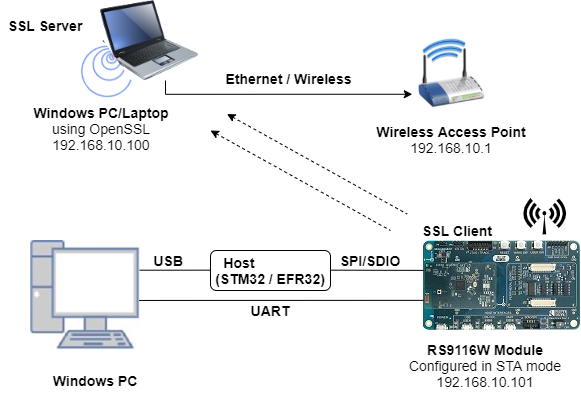
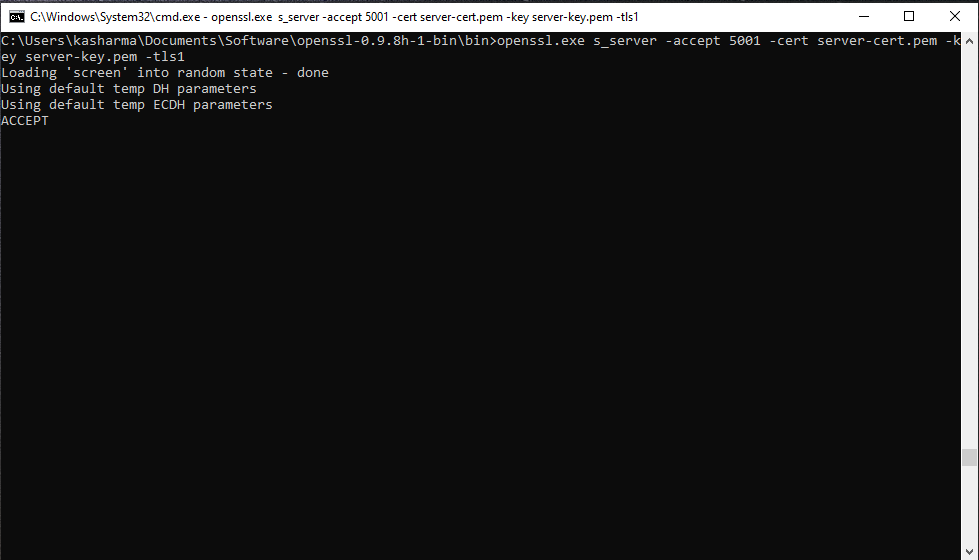
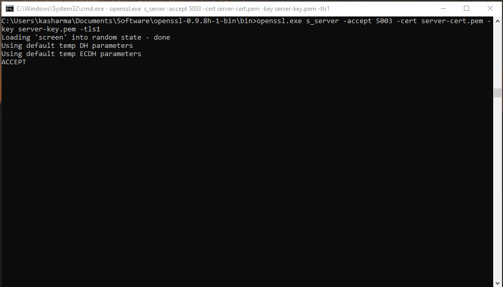
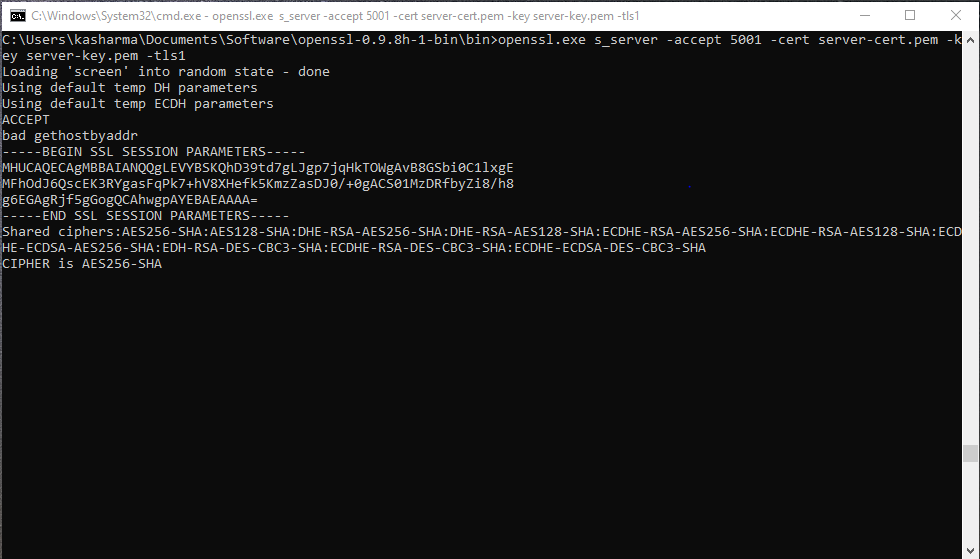
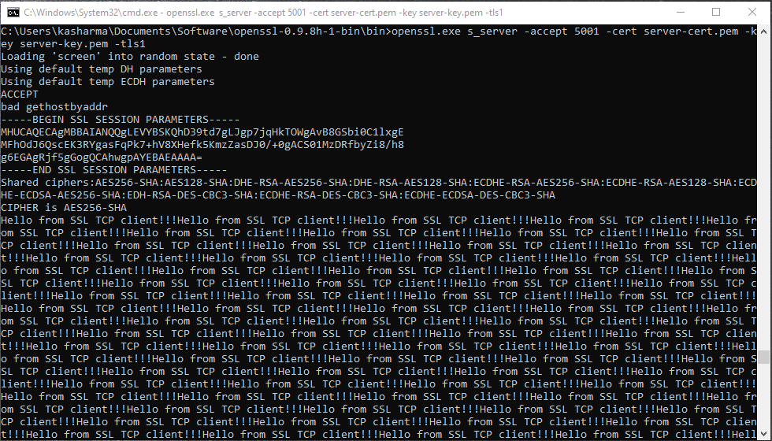
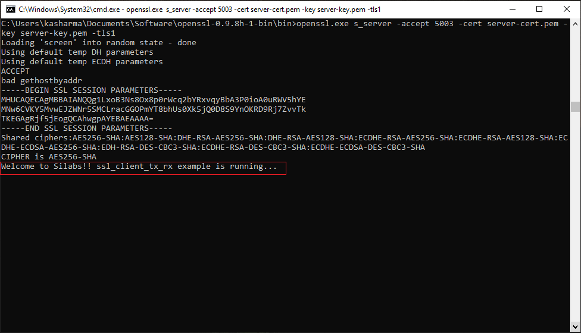
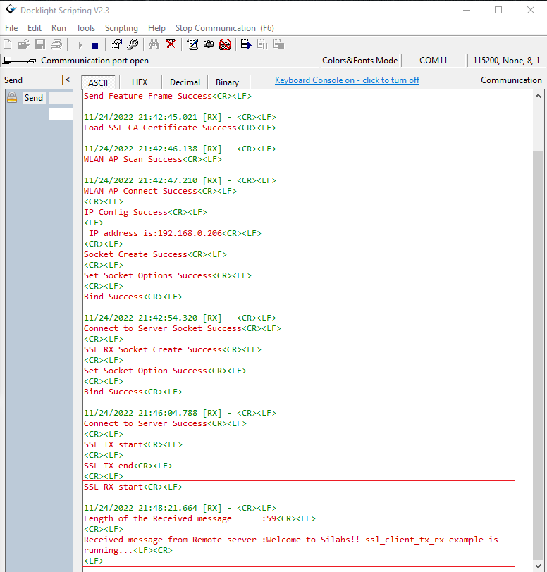

# SSL Client Tx RX

## 1. Purpose / Scope

This application demonstrates how to open and use a standard TCP client socket with a secure connection using SSL. By using this application user can send TCP data from the WiSeConnect device to a remote device (TCP Server socket1) and receive TCP data from a remote device (TCP Server socket2) to the Wiseconnect device.

#### SSL Overview

SSL stands for Secure Sockets Layer. SSL is the standard security technology for establishing an encrypted link between a web server and a browser. This link ensures that all data passed between the web servers and the browsers remain Private & Integral. Data encryption, Server authentication, Message integrity, and Optional client authentication for a TCP / IP connection are the main objectives of SSL protocol.

#### Sequence of Events

This Application explains to the user how to:

- Connect the device to an Access point and get an IP address through DHCP
- Open TCP Server socket1 & socket2 with the different port over SSL using OpenSSL
- Establish TCP connection over SSL with TCP server1 & server2 opened on a remote peer
- Send TCP data from the WiSeConnect device to the remote device (TCP Server socket1)
- Receive TCP data from a remote device (TCP Server socket2) to Wiseconnect device

## 2. Prerequisites / Setup Requirements

Before running the application, the user will need the following things to set up.

### 2.1 Hardware Requirements

- Windows PC with Host interface (UART / SPI / SDIO).
- Silicon Labs [RS9116 Wi-Fi Evaluation Kit](https://www.silabs.com/development-tools/wireless/wi-fi/rs9116x-sb-evk-development-kit) 
- Host MCU Eval Kit. This example has been tested with:
  - Silicon Labs [WSTK + EFR32MG21](https://www.silabs.com/development-tools/wireless/efr32xg21-bluetooth-starter-kit)
  - Silicon Labs [WSTK + EFM32GG11](https://www.silabs.com/development-tools/mcu/32-bit/efm32gg11-starter-kit)
  - [STM32F411 Nucleo](https://st.com/)
- Wireless Access Point
- TCP server over SSL running in Windows PC2 (This application uses OpenSSL to create TCP server over SSL)

  


### 2.2 Software Requirements

- [WiSeConnect SDK](https://github.com/SiliconLabs/wiseconnect-wifi-bt-sdk/)

- Embedded Development Environment
   - For STM32, use licensed [Keil IDE](https://www.keil.com/demo/eval/arm.htm)
   - For Silicon Labs EFx32, use the latest version of [Simplicity Studio](https://www.silabs.com/developers/simplicity-studio)  
   - [OpenSSL Application](http://ufpr.dl.sourceforge.net/project/gnuwin32/openssl/0.9.8h-1/openssl-0.9.8h-1-bin.zip) in Windows PC (Remote PC).


## 3. Application Build Environment

### 3.1 Platform

The Application can be built and executed on below Host platforms
* [STM32F411 Nucleo](https://st.com/)
* [WSTK + EFR32MG21](https://www.silabs.com/development-tools/wireless/efr32xg21-bluetooth-starter-kit) 
* [WSTK + EFM32GG11](https://www.silabs.com/development-tools/mcu/32-bit/efm32gg11-starter-kit)

### 3.2 Host Interface

* By default, the application is configured to use the SPI bus for interfacing between Host platforms (STM32F411 Nucleo / EFR32MG21) and the RS9116W EVK.
* This application is also configured to use the SDIO bus for interfacing between Host platforms(EFM32GG11) and the RS9116W EVK.

### 3.3 Project Configuration

The Application is provided with the project folder containing Keil and Simplicity Studio project files.

* Keil Project
  - The Keil project is used to evaluate the application on STM32.
  - Project path: `<SDK>/examples/snippets/wlan/ssl_client_tx_rx/projects/ssl_client_tx_rx-nucleo-f411re.uvprojx`

* Simplicity Studio
  - The Simplicity Studio project is used to evaluate the application on EFR32MG21.
  - Project path:
    - If the Radio Board is **BRD4180A**, then access the path `<SDK>/examples/snippets/wlan/ssl_client_tx_rx/projects/ssl_client_tx_rx-brd4180a-mg21.slsproj`
    - If the Radio Board is **BRD4180B**, then access the path `<SDK>/examples/snippets/wlan/ssl_client_tx_rx/projects/ssl_client_tx_rx-brd4180b-mg21.slsproj`
    - User can find the Radio Board version as given below

  

  - EFM32GG11 platform
    - The Simplicity Studio project is used to evaluate the application on EFM32GG11.
      - Project path:`<SDK>/examples/snippets/wlan/ssl_client_tx_rx/projects/ssl_client_tx_rx-brd2204a-gg11.slsproj`

### 3.4 Bare Metal/RTOS Support

This application supports bare metal and RTOS environments. By default, the application project files (Keil and Simplicity studio) are provided with bare metal configuration in the SDK.

## 4. Application Configuration Parameters

The application can be configured to suit user requirements and development environment. Read through the following sections and make any changes needed.

### 4.1 Open rsi_ssl_client_tx_rx.c file

#### 4.1.1 User must update the below parameters  

SSID refers to the name of the Access point:
```c   
#define SSID                                           "SILABS_AP"
```

CHANNEL_NO refers to the channel in which device should scan. If it is 0, device will scan all channels:
```c
#define CHANNEL_NO                                       0
```

SECURITY_TYPE refers to the type of security. In this application STA supports Open, WPA-PSK, WPA2-PSK securities.

  Valid configuration is:

  - RSI_OPEN - For OPEN security mode
  - RSI_WPA  - For WPA security mode
  - RSI_WPA2 - For WPA2 security mode
```c   
#define SECURITY_TYPE                                  RSI_WPA2
```

PSK refers to the secret key if the Access point configured in WPA-PSK / WPA2-PSK security modes:
```c   
#define PSK                                            "1234567890"
```

DEVICE_PORT port refers TCP client port number:
```c   
#define DEVICE_PORT                                     5001
```

SERVER_PORT port refers remote TCP server port number which is opened in Windows PC2:
```c   
#define SERVER_PORT                                     5001
```

DEVICE_PORT2 another device port refers TCP client port number:
```c
#define DEVICE_PORT2                                    5003
```

SERVER_PORT2 another server port refers remote TCP server port number which is opened in Windows PC2:
```c
#define SERVER_PORT2                                    5003
```

SERVER_IP_ADDRESS refers remote peer IP address to connect with TCP server socket.
```c   
#define SERVER_IP_ADDRESS                            "192.168.10.100"
```

NUMEBR_OF_PACKETS refers how many packets to receive from TCP client
```c   
#define NUMBER_OF_PACKETS                               1000
```

SOCKET_ASYNC_FEATURE refers enable/disable the Asynchronous socket creation

  0 - Disabled the Asynchronous socket creation
  
  1 - Enabled the Asynchronous socket creation
```c 
#define SOCKET_ASYNC_FEATURE                              0
```

#### 4.1.2 The desired parameters are provided below. User can also modify the parameters as per their needs and requirements:

Application memory length which is required by the driver:
```c
#define GLOBAL_BUFF_LEN                                 15000
```

LOAD_CERTIFICATE refers to load certificates into flash

  0 - Already certificates are there in flash so no need to laod.
  1 - Certicates will load into flash.

```c   
#define LOAD_CERTIFICATE                                  1
```

> Note:
> If certificates are not there in flash then ssl handshake will fail.

DHCP_MODE refers whether IP address is configured through DHCP or STATIC:
```c   
#define DHCP_MODE                                         1
```

> Note:
> If user wants to configure STA IP address through DHCP then set **DHCP_MODE** to "1" and skip configuring the following **DEVICE_IP, GATEWAY** and **NETMASK** macros.
> (Or)
> If user wants to configure STA IP address through STATIC then set **DHCP_MODE** macro to "0" and configure following **DEVICE_IP, GATEWAY** and **NETMASK** macros.

IP address to be configured to the device in STA mode.
```c
#define DEVICE_IP                                     "192.168.10.10"
```

IP address of the gateway.
```c
#define GATEWAY                                       "192.168.10.1"
```

IP address of the network mask.
```c
#define NETMASK                                       "255.255.255.0"


### 4.2 Open rsi_wlan_config.h file. User can also modify the below parameters as per their needs and requirements.

```c
#define CONCURRENT_MODE                               RSI_DISABLE
#define RSI_FEATURE_BIT_MAP                           FEAT_SECURITY_OPEN
#define RSI_TCP_IP_BYPASS                             RSI_DISABLE
#define RSI_TCP_IP_FEATURE_BIT_MAP                    (TCP_IP_FEAT_DHCPV4_CLIENT | TCP_IP_FEAT_SSL)
#define RSI_CUSTOM_FEATURE_BIT_MAP                    0
#define RSI_EXT_CUSTOM_FEATURE_BIT_MAP                0
#define RSI_EXT_TCPIP_FEATURE_BITMAP                  0
#define RSI_BAND                                      RSI_BAND_2P4GHZ
```

>Note:
> The **rsi_wlan_config.h** file is already set with desired configuration in respective example folders user need not change for each example.

## 5. Testing the Application

Follow the below steps for the successful execution of the application.

### 5.1 Loading the RS9116W Firmware

Refer [Updating RS9116W Firmware](https://docs.silabs.com/rs9116-wiseconnect/latest/wifibt-wc-getting-started-with-pc/update-evk-firmware) to load the firmware into RS9116W EVK. The firmware file is located in `<SDK>/firmware/`

### 5.2 Building the Application on the Host Platform

#### 5.2.1 Using STM32

Refer [Getting started with STM32](https://docs.silabs.com/rs9116-wiseconnect/latest/wifibt-wc-getting-started-with-stm32/)

- Open the project `<SDK>/examples/snippets/wlan/ssl_client_tx_rx/projects/ssl_client_tx_rx-nucleo-f411re.uvprojx`
- Build and Debug the project
- Check for the RESET pin:
  - If the RESET pin is connected from STM32 to RS9116W EVK, then the user need not press the RESET button on RS9116W EVK before the free run
    - RESET pin configuration for STM32: CN10 (pin number 6) to RS9116 (CN J9 RST_PS)
  - If the RESET pin is not connected from STM32 to RS9116W EVK, then the user needs to press the RESET button on RS9116W EVK before the free run
- Free run the project
- Then continue the common steps from **5.3**

#### 5.2.2 Using EFX32

Refer [Getting started with EFX32](https://docs.silabs.com/rs9116-wiseconnect/latest/wifibt-wc-getting-started-with-efx32/), for settin-up EFR32 & EFM32 host platforms.

- Open Simplicity Studio and import the EFR32/EFM32 project from `<SDK>/examples/snippets/wlan/ssl_client_tx_rx/projects`
    - Select the appropriate .slsproj as per the Radio Board type mentioned in **Section 3.3** for the EFR32 board.
   (or)
    - Select the *.brd2204a-gg11.slsproj  for EFM32GG11 board.
- Compile and flash the project into Host MCU
- Debug the project
- Check for the RESET pin:
  - If the RESET pin is connected from EFR32/EFM32 to RS9116W EVK, then the user need not press the RESET button on RS9116W EVK before the free run
    - RESET pin configuration for EFR32: Interconnect board (J4 GPIO header pin number 11) to RS9116 (CN J9 RST_PS)
    - RESET pin configuration for EFM32: Pin number 11 to RS9116 (CN J9 RST_PS)
  - If the RESET pin is not connected from EFX32 to RS9116W EVK, then the user needs to press the RESET button on RS9116W EVK before the free run
- Free run the project
- Then continue the common steps from **5.3**

### 5.3 Common Steps

1. Configure the Access point in OPEN / WPA-PSK / WPA2-PSK mode to connect RS9116W EVK in STA mode.

2. Copy the certificates server-cert and server-key into Openssl/bin folder in the Windows PC2 (Remote PC).

> Note:
> All the certificates are given in the SDK. Path: `<SDK>/resources/certificates`

>Note:
> Instead of using PC2, the user can use the same PC where Keil/Simplicity studio code is running. Just make sure the Access point should be connected to the same PC through wireless.

3. In Windows PC2 which is connected to AP through LAN, Download the Openssl package from above mentioned link and run the 2 SSL server by giving following command:

  > `openssl.exe s_server -accept <SERVER_PORT> –cert <server_certificate_file_path> -key <server_key_file_path> -tls<tls_version>`

  Example:

  openssl.exe s_server –accept **5001** –cert server-cert.pem -key server-key.pem –tls1

  openssl.exe s_server –accept **5003** –cert server-cert.pem -key server-key.pem –tls1

  

  

4. After the program gets executed, RS9116W EVK would be connected to access point having the configuration same as that of in the application and get IP.

5. The RS9116W EVK which is configured as SSL client will first connect to a remote SSL server1 (port configured 5001) & later it will connect to a remote SSL server2 (port configured 5003).

  

  

6. After the connection with the SSL server1 (port configured 5001), the RS9116W device will sends number of packets configured in **NUMBER_OF_PACKETS**.

  
 
7. After sending all the packets from RS9116W to SSL server1, now user can sends the data packets from SSL server2 (port configured 5003) to RS9116W device.

  

  
