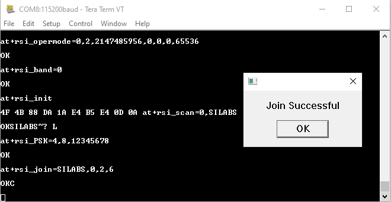

# Station Mode with TCP/UDP/PING protocols Tera Term Language (TTL) Script

## Purpose / Scope 

This TTL script demonstrates the procedure to configure the RS9116 NCP module in WLAN station mode and open a TCP/UDP Server socket or make an ICMP request to a specified host name/IP address.
The script takes you through the steps where the RS9116 NCP module gets connected to a specified Access Point, gets an IP address, and opens a TCP/UDP Server socket to listen to remote TCP/UDP Client or makes an ICMP ping to a target IP address. 

## Hardware Requirements

- RS9116 Evaluation board (RS9116W-SB-EVK1/RS9116W-DB-EVK1)
- Micro-USB Type-A cable
- Windows PC/Laptop 
- Access Point in WPA2 security mode

## Software Requirements

- [Tera Term Software](https://tera-term.en.softonic.com/download)
- [TCP/UDP test tool for Andriod](https://play.google.com/store/apps/details?id=jp.gr.java_conf.tcp_udp_testtool&hl=en_IN&gl=US)
- [UDP/TCP/Rest Network Test Utility for iOS](https://apps.apple.com/in/app/udp-tcp-rest-network-test-utility/id1246823651)

## Procedure for executing the application

Before continuing, ensure that the RS9116 EVK is plugged into your PC and Tera Term is configured as described in [Getting Started with PC using AT Commands](https://docs.silabs.com/rs9116-wiseconnect/latest/wifibt-wc-getting-started-with-pc/) and [Setup Tera Term](https://docs.silabs.com/rs9116-wiseconnect/latest/wifibt-wc-getting-started-with-pc/tera-term-setup).

**STEP 1.** Reset the RS9116 EVK.

**STEP 2.** In the Tera Term menu, go to `Control -> Macro` and browse to the `station_mode_with_tcp_udp_ping_protocol.ttl` script .


**STEP 3.** Tera Term begins executing the `station_mode_with_tcp_udp_ping_protocol.ttl` script.

**STEP 4.** The following command configures the RS9116 NCP module as a Wi-Fi client. The module responds with *OK*.
```
  at+rsi_opermode=0,2,2147485956,0,0,0,65536
```  


**NOTE:** To know about each parameter in the above AT command, refer to the [documentation](https://docs.silabs.com/rs9116/wiseconnect/rs9116w-wifi-at-command-prm/latest/wlan-commands) to know about each of the parameters.
The third parameter is *tcp_ip_feature_bit_map* and is set to `2147485956`. For this script, we need features like `TCP_IP_FEAT_DHCPV4_CLIENT`, `TCP_IP_FEAT_DNS_CLIENT`, and `TCP_IP_FEAT_ICMP`. So the following features should be enabled in this bit map. 
- `tcp_ip_feature_bit_map[2]` for `TCP_IP_FEAT_DHCPV4_CLIENT`
- `tcp_ip_feature_bit_map[8]` for `TCP_IP_FEAT_DNS_CLIENT`
- `tcp_ip_feature_bit_map[11]` for `TCP_IP_FEAT_ICMP`
- `tcp_ip_feature_bit_map[31]` for `TCP_IP_FEAT_EXTENSION_VALID`

By enabling the above features, the total decimal value will be `2147485956` (2^2 + 2^8 + 2^11 + 2^31 = 4 + 256 + 2048 + 2147483648 = 2147485956). 

For knowing more about *tcp_ip_feature_bit_map*, refer to [RSI_TCP_IP_FEATURE_BIT_MAP](https://docs.silabs.com/rs9116-wiseconnect/latest/wifibt-wc-sapi-reference/opermode#rsi-tcp-ip-feature-bit-map). 

**STEP 5.** In the next pop-up that asks for desired band of operation, enter the desired band of operation.

 
| band_value | Functionality | 
|--------------|------------|
| 0 |2.4 GHz|
| 1 | 5 GHz | 
| 2 | Dual band (2.4 GHz and 5 GHz)| 


 The following AT command configures the operating band of the Wi-Fi client to 2.4GHz band. The module responds with *OK*.
```
  at+rsi_band=0
``` 


**STEP 6.** The following command initializes the RF section of the module. The module responds with *OK <MAC_Address>*.
In the response, *4F 4B* is for *OK* and the remaining data is the MAC address, ending with a CR and LF.
```
   at+rsi_init
```


**STEP 7.** In the next pop-up that prompts for an SSID, enter the SSID of the desired AP to be scanned and hit *OK*. The following command performs scan.
```
   at+rsi_scan=0, SILABS
```
**NOTE:** Make sure the AP is in range and is configured in WPA2-PSK security mode. The module responds with information of the Access Point scanned. The data received might have some unreadable characters because of ASCII conversion.


**STEP 8.** In the next pop-up that prompts to enter PSK, enter the PSK or password of the specified AP. 


**STEP 9.** Subsequently, the RS9116W module gets connected to the AP with SSID **SILABS** (SSID that was scanned for during *scan* command) using the following command. On successful association, the module responds with *Join Successful*. Hit *OK*.
```
   at+rsi_join=SILABS,0,2,6
```



**STEP 10.** After the join is successful, the RS9116 NCP module gets an IP address with the following command. 
```
   at+rsi_ipconf=1,0,0,0
```

The module responds with `OK <MAC_Address><IP_Address><Subnet_Mask><Gateway>\r\n` 


**STEP 11.** After the successful IP configuration, the script allows you to configure the RS9116 NCP module as any of the following.
1. TCP Server
2. UDP Server
3. ICMP Ping


**Case 1 - TCP Server:**

**STEP 1.** When *TCP Server* is selected, the module opens a TCP Server socket on port 5001 using the following AT command. 
```
   at+rsi_ltcp=5001
```


**NOTE:** By default, the port number is *5001* in the script. If you want to change the port number, then find the following command in the TTL script and change the port number.
```
   at+rsi_ltcp=5001
```

**STEP 2.** Once the TCP Server socket is opened successfully, the pop-up window appears saying *Device is now listening for TCP connections on address x.x.x.x and port y*. Here *x.x.x.x* is the IP address of the Module and *y* is the port number of the module's socket.


**STEP 3.** Open a TCP client socket on a remote peer (laptop/mobile) and connect to the server socket. Note that the remote peer should also be connected to the same network to which the module is connected.
In this example, the *TCP/UDP test tool* android application is used to open a TCP client socket. Enter the server IP address and port number from the above pop-up in the remote peer application (here *TCP/UDP test tool*) in the appropriate fields provided.   

**STEP 4.** Once the TCP connection is established with the remote peer, the following message is printed on the terminal window.

`AT+RSI_LTCP_CONNECT=<ip_version><socket_descriptor><dest_port_no><dest_ipaddr><mss><window_size><src_port_no>\r\n`

**STEP 5.** When the RS9116 NCP module receives data from the remote TCP client, the module sends out the following response.


**Case 2 - UDP Server:**

**STEP 1.** When *UDP Server* is selected, the module opens a UDP Server socket on port *5005* using the following AT command.
```
   at+rsi_ludp=5005
``` 


**NOTE:** By default, the port number is *5005* in the script. If you want to change the port number, then find the following command in the TTL script and change the port number.
```
   at+rsi_ludp=5005
```

**STEP 2.** Once the UDP Server socket is opened successfully, the pop-up window appears saying *Device is now listening for UDP connections on address x.x.x.x and port y*. Here *x.x.x.x* is the IP address of the Module and *y* is the port number of the module's socket.

**STEP 3.** Open a UDP client socket on a remote peer (laptop/mobile) and connect to the module's server socket. Note that the remote peer also should be connected to the same network to which the module is connected.
In this example, the *TCP/UDP test tool* android application is used to open a UDP client socket. Enter the server IP address and port number from the above pop-up in the remote peer application (here *TCP/UDP test tool*) in the appropriate fields provided.    

**STEP 4.** When the RS9116 NCP module receives data from the remote UDP client, the module sends out the following response.


**Case 3 - ICMP Ping:**

When *ICMP ping* is selected, the script allows to ping to the target host in two different ways using the following command 

```
   at+rsi_ping=<ip_version>,<ping_address>,<ping_size>,<timeout_ms>
```
 


**a. When *Ping using IP address* is selected:** 

   **STEP 1.**  In the next pop-up that prompts to enter IP address, provide the IP address of the target host.

    
   

   **STEP 2.** In the next pop-up that prompts to enter IP version, provide the IP version.
   Supported length is 2 bytes. 

   `4 - for IPv4`
   `6 - for IPv6`

      **NOTE:** Currently only IPv4 is supported.

   

   **STEP 3.** In the next pop-up that prompts to enter ping address, enter the destination host's IPv4 address. Supported length is 16 bytes.

   

   **STEP 4.** In the next pop-up that prompts to enter ping size, enter the ping data size to be sent. Supported length is 2 bytes.

   

   **STEP 5.** In the next pop-up that prompts to enter time out, enter the timeout for ping response. Supported length is 2 bytes.

   

   **STEP 6.** If the response to the ping is received, the module responds with the following.

   `OK<ip_version><ping_size><ping_address>\r\n` 

   

**b. When *Ping using domain name* is selected:** 

   Another option to ping to a remote host is by giving its domain name using the following DNS command. 

    

   **STEP 1.** In the next pop-up that prompts to enter the domain name, enter the domain name of the target to which you want to ping. The RS9116 NCP module makes a DNS request with the following command.

   ```
      at+rsi_dnsget='DNS',1
   ```

   

   The response to the DNS command is as follows:
   `OK< ip_version >< uIPCount >< IPAddr1 >...repeats for 10 times\r\n`
   `0x4F 0x4B 0x04 0x00 0x01 0x00 0xC9 0xA8 0x01 0x64 0x00 0x00 0x00 0x00 0x00 0x00 0x00 0x00 0x00 0x00 0x00 0x00 0x0D 0x0A`

   The IP address is obtained as part of DNS request for the domain name *WWW.SILABS.COM*. In this example, the IP address obtained is `0x17 0xD6 0xE6 0x1B` in hexadecimal format, which is `23.214.230.27` in decimal.

   

   **STEP 2.** In the next pop-up that prompts to enter IP address, provide the IP address for ping response.

   

   **STEP 3.** In the next pop-up that prompts to enter IP size, provide the IP size for ping response.

   

   **STEP 4.** In the next pop-up that prompts to enter time out, provide the timeout for ping response.

   

   **STEP 5.** If the response to the ping is received, the module responds with the following.

   


For detailed information on AT commands, refer to the [AT Command Program Reference Manual](https://docs.silabs.com/rs9116/wiseconnect/rs9116w-wifi-at-command-prm/latest/wlan-commands).


