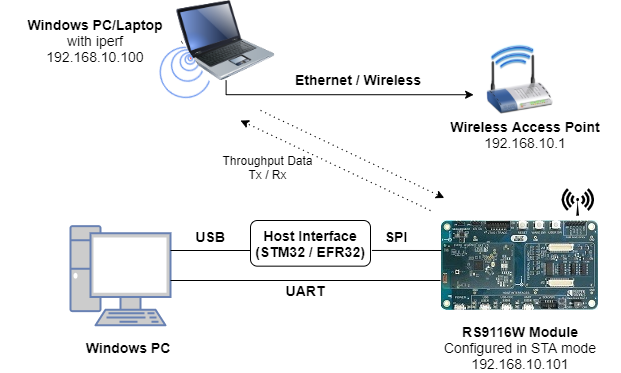
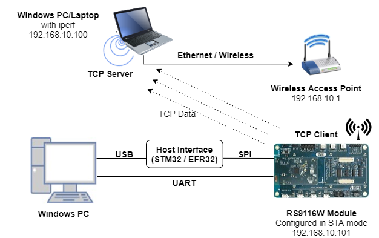
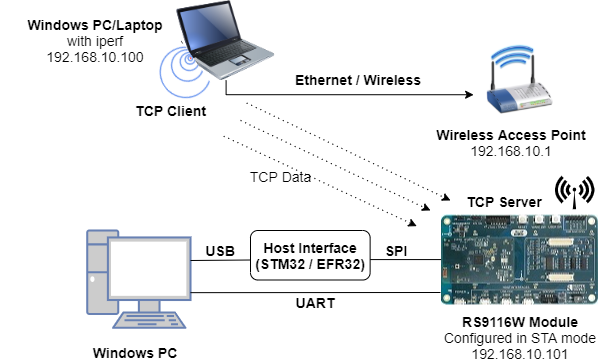
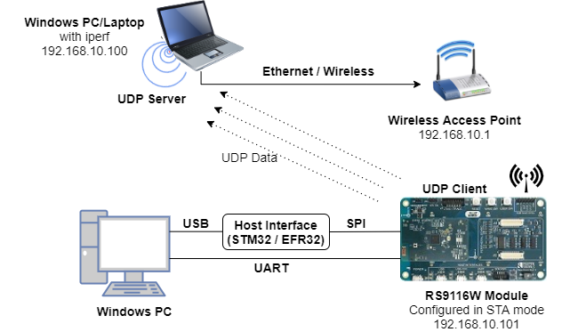
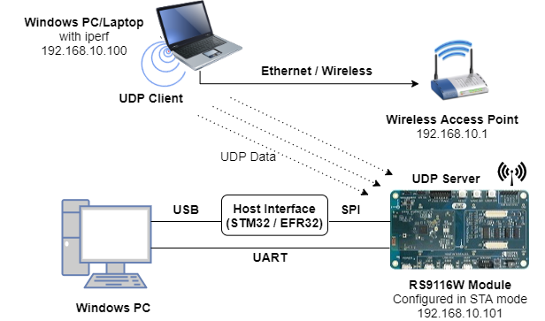
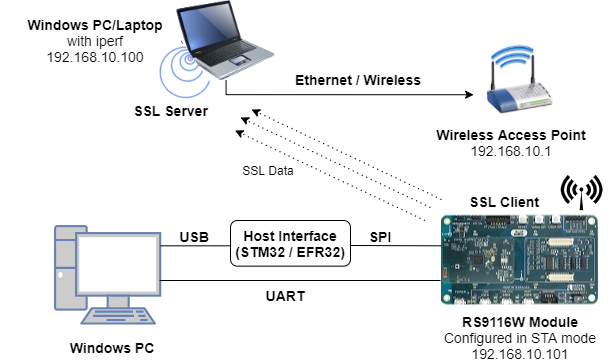
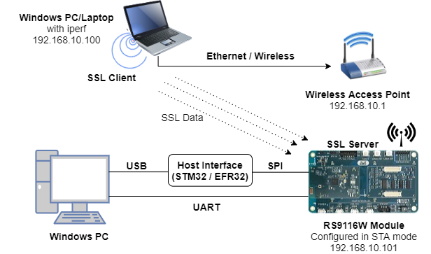
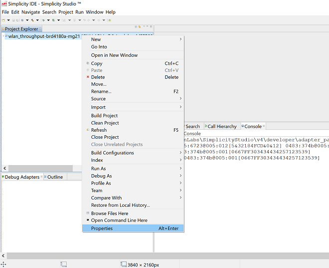

# WLAN Throughput Demo with ThreadX RTOS

## Introduction
This application demonstrates the procedure to measure WLAN UDP/TCP/SSL throughput by configuring the RS9116W in client/server role.
This application serves as an example for using ThreadX RTOS with RS9116W.

Azure RTOS ThreadX is a high-performance real-time kernel designed specifically for embedded
applications. Benefits of using ThreadX RTOS include improved responsiveness, ease of use, reduced
software maintenance. ThreadX also has a number of add-on modules (TCP/IP network stack, FAT
filesystem, GUI framework, USB stack) that can be used according to requirements.

## Setting Up 
To use this application, the following hardware, software and project setup is required.

### Hardware Requirements	
- PC or Mac (used to program the Host MCU)
- A computer running Iperf (may be the same PC or Mac used to program the Host MCU)
- Silicon Labs [RS9116 Wi-Fi Evaluation Kit](https://www.silabs.com/development-tools/wireless/wi-fi/rs9116x-sb-evk-development-kit)
- Host MCU Eval Kit. This example has been tested with:
  - Silicon Labs [WSTK + EFR32MG21](https://www.silabs.com/development-tools/wireless/efr32xg21-bluetooth-starter-kit)
- Wi-Fi Access Point



### Software Requirements
- [WiSeConnect SDK](https://github.com/SiliconLabs/wiseconnect-wifi-bt-sdk/)
- Embedded Development Environment
  - For Silicon Labs EFR32, use the latest version of [Simplicity Studio](https://www.silabs.com/developers/simplicity-studio).
- A working installation of [iPerf version 2.0.9](https://iperf.fr/iperf-download.php#windows).  
**Note:** iPerf version 2.0.9 is the only version that has been verified to work with this example.
 
## Project Setup

### Setting up the project in WiSeConnect SDK

  Follow the below steps to add ThreadX RTOS related files to the RS9116W SDK. Replace the HAL files as mentioned below, to support ThreadX RTOS.
- Download and extract wlan_throughput_threadx.zip file to the folder path < WiSeConnect Release SDK>/examples/featured/
- Replace < WiSeConnect Release SDK>/platforms/efx32/hal/rsi_hal_mcu_platform_init.c file with wlan_throughput_threadx/HAL/rsi_hal_mcu_platform_init.c
- Replace < WiSeConnect Release SDK>/platforms/efx32/hal/rsi_hal_mcu_timer.c file with wlan_throughput_threadx/HAL/rsi_hal_mcu_timer.c
- Replace < WiSeConnect Release SDK>/sapi/include/rsi_os.h file with wlan_throughput_threadx/HAL/rsi_os.h file
- Copy the wlan_throughput_threadx/threadx folder to < WiSeConnect Release SDK>/third_party/

### Setting up the project in Simplicity Studio
- **Silicon Labs EFR32 Host**. Follow the the [Getting Started with EFR32](https://docs.silabs.com/rs9116-wiseconnect/latest/wifibt-wc-getting-started-with-efx32/) to setup the example to work with EFR32 and Simplicity Studio.

## Configuring the Application
The application can be configured to suit your requirements and development environment.
Read through the following sections and make any changes needed. 

### Host Interface
- By default, the application is configured to use the SPI bus for interfacing between Host platforms and the RS9116W EVK.
- The SAPI driver provides APIs to enable other host interfaces if SPI is not suitable for your needs.

### Bare Metal/RTOS Support
To select a bare metal configuration, see [Selecting bare metal](#selecting-bare-metal).

### Wi-Fi Configuration
Configure the following parameters in [rsi_throughput_app.c](https://github.com/SiliconLabs/wiseconnect-wifi-bt-sdk/tree/master/examples/featured/wlan_throughput/rsi_throughput_app.c) to enable your Silicon Labs Wi-Fi device to connect to your Wi-Fi network.

```c
#define SSID           "SILABS_AP"      // Wi-Fi Network Name
#define PSK            "1234567890"     // Wi-Fi Password
#define SECURITY_TYPE  RSI_WPA2         // Wi-Fi Security Type: RSI_OPEN / RSI_WPA / RSI_WPA2
#define CHANNEL_NO     0                // Wi-Fi channel if the softAP is used (0 = auto select)
```

### Client/Server IP Settings
```c
#define PORT_NUM           <local_port>   // Local port to use
#define SERVER_PORT        <remote_port>  // Remote server port
#define SERVER_IP_ADDRESS  0x640AA8C0     // Remote server IP address in little endian byte order:
                                          //   192.168.0.100 -> 0x64=100, 0x00=0, 0xA8=168, 0xC0=192
```

## Throughput Measurement Types
The application may be configured to measure throughput using UDP, TCP or SSL/TLS packets. Choose the measurement type using the `THROUGHPUT_TYPE` macro.
```c
#define THROUGHPUT_TYPE  TCP_TX     // Selects the throughput option; see the following diagrams. 
#define TCP_TX           0			// RS9116W transmits packets to remote TCP client
#define TCP_RX           1			// RS9116W receives packets from remote TCP server
#define UDP_TX           2			// RS9116W transmits packets to remote UDP client
#define UDP_RX           3			// RS9116W receives packets from remote UDP server
#define SSL_TX           4			// RS9116W transmits packets to remote SSL client
#define SSL_RX           5			// RS9116W receives packets from remote SSL server
```

**RS9116 is a TCP Client (sends TCP packets to a remote server) ...**
  

**RS9116W is a TCP Server (receives TCP packets from a remote client) ...**


**RS9116 is a UDP Client (sends UDP packets to a remote server) ...**


**RS9116 is a UDP Server (receives UDP packets from a remote client) ...**


**RS9116 is a SSL Client (sends SSL packets to a remote server) ...**


**RS9116 is a SSL Server (receives SSL packets from a remote client) ...**


## Throughput Options
Various options are available to customize throughput measurements. Some options only apply for specific throughput types as secribed in the following sections.

### Discrete Interval Measurements (UDP Rx and SSL Tx)
```c
#define MAX_TX_PKTS 10000
```
The default value of `MAX_TX_PKTS` is 10000. To measure throughput for higher intervals, make the following changes:
- UDP Rx : Increase the value of `MAX_TX_PKTS` and provide a higher interval in the corresponding iperf command
- SSL Tx : Increase the value of `MAX_TX_PKTS` and update the equivalent value in `SSL_Server_throughput_d.py` located in the  release directory `resources/scripts/`.

### Discrete Interval Measurements (UDP Tx and TCP Tx)
```c
#define THROUGHPUT_AVG_TIME  30000   // Throughput average time in ms
```
Configure `THROUGHPUT_AVG_TIME` to suit the desired interval.

### Discrete Interval Measurements (TCP Rx and SSL Rx)
- TCP Rx : Configure the interval desired using the corresponding iperf command
- SSL Rx : Increase the packet count in `SSL_tx_throughput.py` located in the release directory `/resources/scripts/`.

### Continous Throughput Measurements
```c
#define CONTINUOUS_THROUGHPUT        0
```

**`CONTINUOUS_THROUGHPUT` = `0`** (default value)
- Throughput is calculated only once for interval of :
  - `THROUGHPUT_AVG_TIME` in case of UDP TX/TCP TX 
  - `MAX_TX_PKTS` in case of UDP RX/SSL TX  
- The time interval is provided by the server in case of TCP RX
- Default packet count is provided in server `SSL_tx_throughput.py` in case of `SSL RX`

**`CONTINUOUS_THROUGHPUT` = `1`**. 
- The application measures throughput continuously for every interval of `THROUGHPUT_AVG_TIME` regardless of `THROUGHPUT_TYPE`, when provided with the following configuration. 
  - UDP Rx/TCP Rx : Configure high interval greater than `THROUGHPUT_AVG_TIME`
  - SSL Rx/SSL Tx : Increase packet count to the maximum in the scripts `SSL_tx_throughput.py` and `SSL_Server_throughput_d.py`

***

**Note!**
If `CONTINUOUS_THROUGHPUT` = `1`, ensure that the RS9116W client/server runs with an interval greater than `THROUGHPUT_AVG_TIME`.

***


# Testing Throughput
There are two 'ends' involved when measuring throughput, data is sent between the client end and the server end. By default, the Iperf protocol sends data from the Client to the Server to measure throughput. Depending on the configuration selected, the RS9116W may be the client or the server. In general, it is advisable to start the server before the client since the client will immediately begin to try to connect to the server to send data. 

The following sections describe how to run the RS9116W throughput application together with examples for various Iperf configurations that run on the PC.   


## Running the RS9116 Application
After making any custom configuration changes required, build, download and run the application as described in the [EFR32 Getting Started](https://docs.silabs.com/rs9116-wiseconnect/latest/wifibt-wc-getting-started-with-efx32/)


## UDP Tx Throughput
To measure UDP Tx throughput, configure the RS9116W as a UDP client and start a UDP server on the remote PC.
The Iperf command to start the UDP server on the PC is: 

> `C:\> iperf.exe -s -u -p <SERVER_PORT> -i 1`
> 
> For example ...
>
> `C:\> iperf.exe -s -u -p 5001 -i 1`


## UDP Rx Throughput
To measure UDP Rx throughput, configure the RS9116W as a UDP server and start a UDP client on the remote PC.
The Iperf command to start the UDP client is: 
	
> `C:\> iperf.exe -c <Module_IP> -u -p <Module_Port> -i 1 -b <Bandwidth> -t <time interval in seconds>`
>
> For example ...
>
> `C:\> iperf.exe -c 192.168.0.100 -u -p 5001 -i 1 -b 50M -t 30`  

## TCP Tx Throuhgput
To measure TCP Tx throughput, configure the RS9116W as a TCP client and start a TCP server on the remote PC.
The Iperf command to start the TCP server is: 
		
> `C:\> iperf.exe -s -p <SERVER_PORT> -i 1`
>
> For example ...
>
> `C:\> iperf.exe -s -p 5001 -i 1`

## TCP Rx Throughput
To measure TCP Rx throughput, configure the RS9116W as TCP server and start a TCP client on the remote PC.
The Iperf command to start the TCP client is: 

> `C:\> iperf.exe -c <Module_IP> -p <module_PORT> -i 1 -t <time interval in sec>`
>
> For example ...
>
> `C:\> iperf.exe -c 192.168.0.100 -p 5001 -i 1 -t 30`  

## SSL Tx Throughput
To measure SSL Tx throughput, configure the RS9116W as a SSL client and start a SSL server on the remote PC as described in the following bullets:
- Copy the `SSL_Server_throughput_d.py` script from the release `/resources/scripts/` directory to the `/resources/certificates/` directory
- Open a command prompt and cd to the folder `/resources/certificates/`, then run the following command:
  - `C:\> python SSL_Server_throughput_d.py`

## SSL Rx Throughput
To measure SSL RX throughput, configure the RS9116W as a SSL server and open a SSL client on the remote PC as described in the following bullets:
- Copy the `SSL_tx_throughput.py` script from the release `/resources/scripts/` directory to the `/resources/certificates/`
- Open a command prompt and cd to the folder `/resources/certificates/`, then run the following command:
  - `C:\> python SSL_tx_throughput.py`

The RS9116W, which is configured as a UDP/TCP/SSL server/client, connects to the iperf server/client and sends/receives data for configured intervals. While module is transmitting/receiving the data, application prints the throughput numbers in serial console.


***

**Note!**
In this release, due to a low SPI frequency configured for the EFR32, WLAN throughput is lower than the maximum achievable throughput. This will be addressed in the next release.

***

# Selecting Bare Metal
The application has been designed to work with FreeRTOS and Bare Metal configurations. By default, the application project files (Keil and Simplicity studio) are configured with FreeRTOS enabled. The following steps demonstrate how to configure Simplicity Studio and Keil to test the application in a Bare Metal environment.

## Bare Metal with Simplicity Studio
> - Open the project in Simplicity Studio
> - Right click on the project and choose 'Properties'
> - Go to 'C/C++ Build' | 'Settings' | 'GNU ARM C Compiler' | 'Symbols' and remove macro 'RSI_WITH_OS=1'
> - Select 'Apply' and 'OK' to save the settings

 


## Note:
> - This application is tested with RS9116W SDK version 2.5.0.5 
> - This application is in alpha stage and is not fully verified