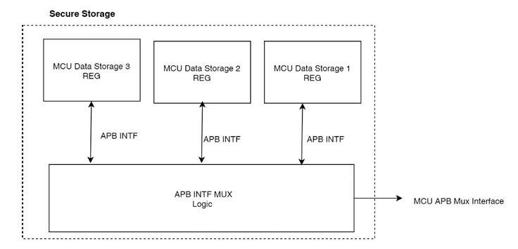
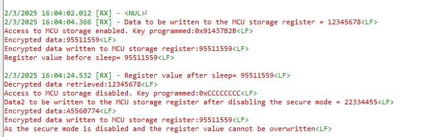

# Secure storage Application

## Table of Contents

- [Purpose/Scope](#purposescope)
- [Prerequisites/Setup Requirements](#prerequisitessetup-requirements)
  - [Hardware Requirements](#hardware-requirements)
  - [Software Requirements](#software-requirements)
  - [Setup Diagram](#setup-diagram)
- [Getting Started](#getting-started)
- [Application Build Environment](#application-build-environment)
- [Test the application](#test-the-application)

## Purpose/Scope

This application helps in storing configuration values with a data protection feature. This can be accomplished using two registers: MCU_STORAGE_REG0, which can store 32 bits of data, and MCU_STORAGE_WRITE_KEY, which is used to program a key that enables or disables access to the MCU storage register.

## Prerequisites/Setup Requirements

### Hardware Requirements

- A Windows PC.
- USB-C cable

- **SoC Mode**:
  - Standalone
    - BRD4002A Wireless pro kit mainboard - [SI-MB4002A](https://www.silabs.com/development-tools/wireless/wireless-pro-kit-mainboard?tab=overview)
    - Radio Boards
      - BRD4338A - [SiWx917-RB4338A](https://www.silabs.com/development-tools/wireless/wi-fi/siwx917-rb4338a-wifi-6-bluetooth-le-soc-radio-board?tab=overview)
  - Kits
    - SiWx917 Pro Kit - [Si917-PK6031A](https://www.silabs.com/development-tools/wireless/wi-fi/siwx917-pro-kit?tab=overview)

### Software Requirements

- Simplicity Studio
- Serial Terminal - [Docklight](https://docklight.de/)/[Tera Term](https://ttssh2.osdn.jp/index.html.en)

### Setup Diagram

  

## Getting Started

Refer to the instructions [here](https://docs.silabs.com/wiseconnect/latest/wiseconnect-getting-started/) to:

- [Install Simplicity Studio](https://docs.silabs.com/wiseconnect/latest/wiseconnect-developers-guide-developing-for-silabs-hosts/#install-simplicity-studio)
- [Install WiSeConnect 3 extension](https://docs.silabs.com/wiseconnect/latest/wiseconnect-developers-guide-developing-for-silabs-hosts/#install-the-wi-se-connect-3-extension)
- [Connect your device to the computer](https://docs.silabs.com/wiseconnect/latest/wiseconnect-developers-guide-developing-for-silabs-hosts/#connect-si-wx91x-to-computer)
- [Upgrade your connectivity firmware](https://docs.silabs.com/wiseconnect/latest/wiseconnect-developers-guide-developing-for-silabs-hosts/#update-si-wx91x-connectivity-firmware)

For details on the project folder structure, see the [WiSeConnect Examples](https://docs.silabs.com/wiseconnect/latest/wiseconnect-examples/#example-folder-structure) page.

## Application Build Environment

- The application can be configured to suit your requirements and development environment. Read through the following sections and make any changes as needed.

### Block diagram

> Note: For more information, refer section 16.26. **Secure Storage** in the [SiWx917 Reference Manual](https://www.silabs.com/documents/public/reference-manuals/siw917x-family-rm.pdf)

Base Address: 0x2404_8700

|Register name|offset |Description|
|--------------|-------|------------|
|MCU_STORAGE_WRITE_KEY|0x00| Programming the key will enable or disable access to program MCU storage register|

- Program the key `0x91437B2B` to enable access to the MCU storage register.
- Program the key `0xCCCCCCCC` to disable access to the MCU storage register.

Base Address: 0x2404_8500

|Register name|offset |Description|
|-------------|-------|------------|
|MCU_STORAGE_REG0|0x80|This register can be used to store 32 bits of Data. If Write_protect is set and a value is written to register, then data will not be overwritten.|

### Secure Mode

There are two options available:

1. Reset  Protection
2. Power Domain Protection from accidental turn-off of power domain controls of Storage domain.

The feature will enabled by Boot load code.

#### Reset Protection

When  Bit[2] is Set in register NWPAON_POR_CTRL_BITS. Storage domain's will be immune to Reset from Pin, WDT Reset and Host Reset Request.

> Note: Once the Bit is set it cannot be cleared.

#### Power Domain Protection

When Write_protect/Bit[4] is set in register NWPAON_POR_CTRL_BITS. Storage domain's are protected from accidental turn-off Power-Supply to these blocks and Once data is written to the protected registers is can not be over-written again

> Note: Once the Bit is set it cannot be cleared.

> Note: The above two bits are enabled by default in the SDK.

## Test the application

Refer to the instructions [here](https://docs.silabs.com/wiseconnect/latest/wiseconnect-developers-guide-developing-for-silabs-hosts/#build-an-application) to:

- Build the application.
- Flash, run and debug the application.

## Application Output

  
