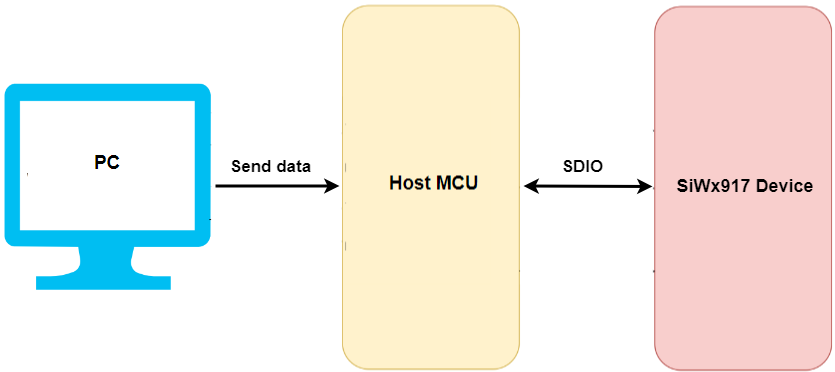
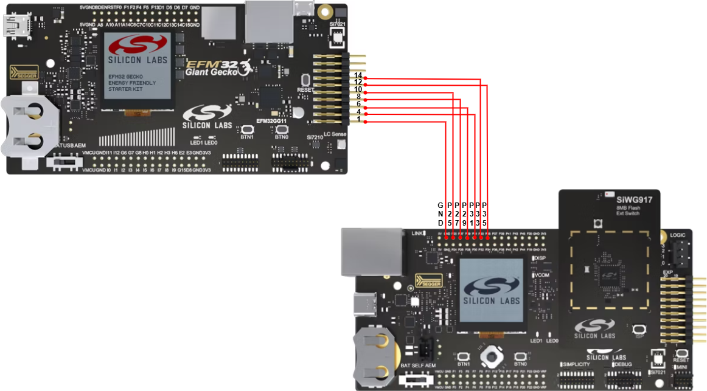
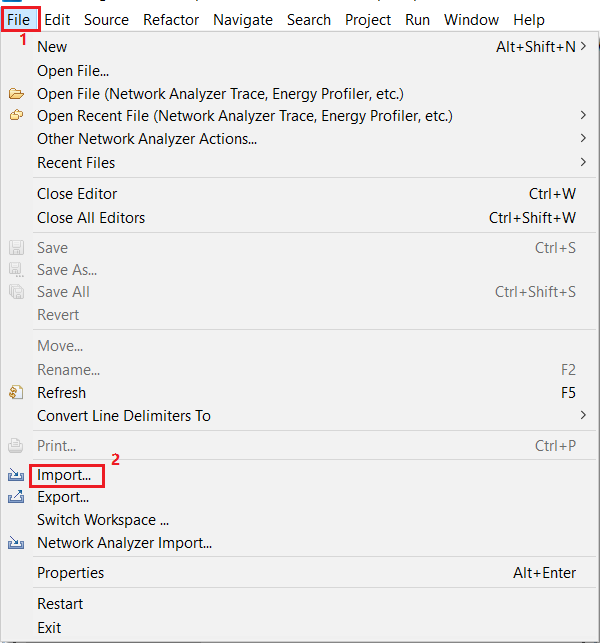
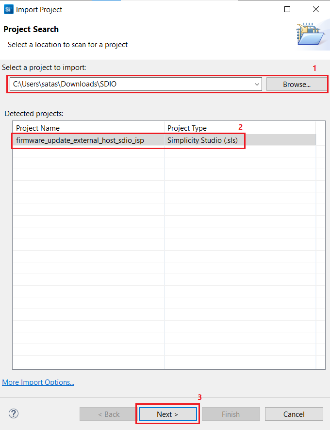
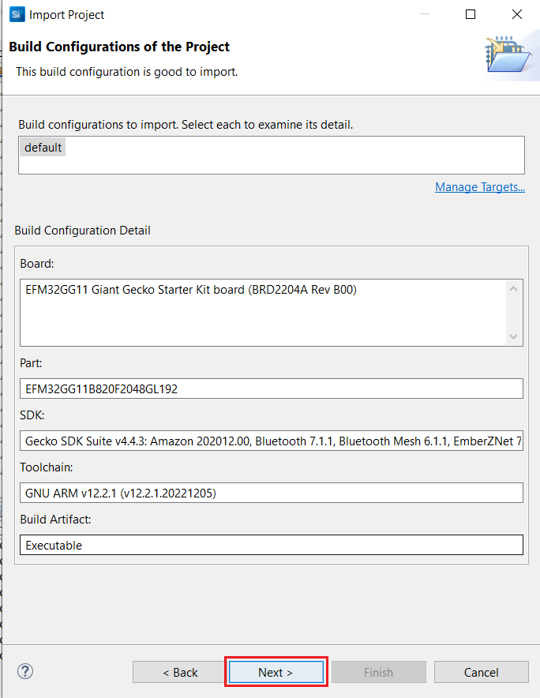
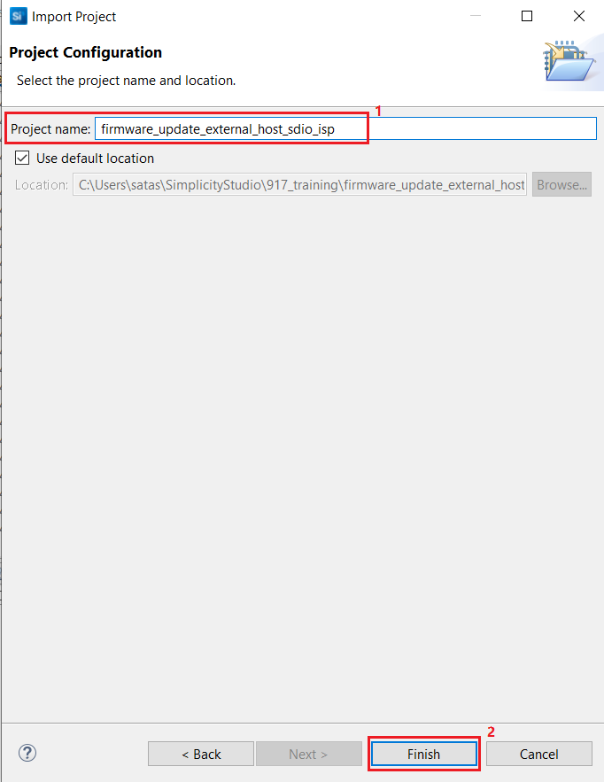
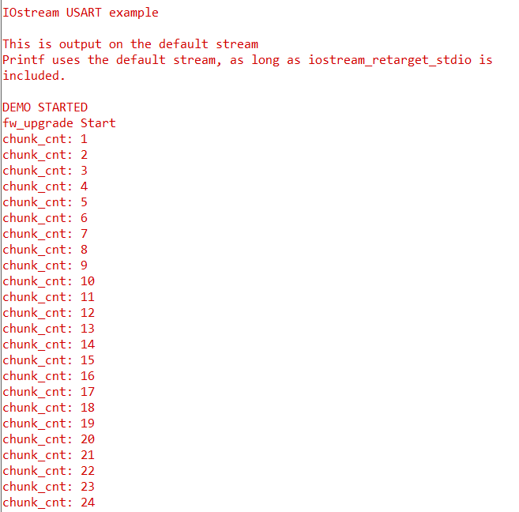
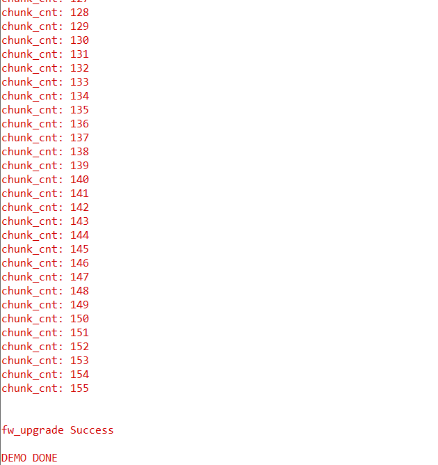

# Firmware Update from External Host through SDIO with ISP mode in SiWx917
## Table of Contents

- [Wi-Fi - Firmware Flashing from Host UART](#wi-fi---firmware-flashing-from-host-uart)
  - [Table of Contents](#table-of-contents)
  - [Purpose/Scope](#purposescope)
  - [Prerequisites/Setup Requirements](#prerequisitessetup-requirements)
    - [Hardware Requirements](#hardware-requirements)
    - [Software Requirements](#software-requirements)
    - [Setup Diagram](#setup-diagram)
  - [Getting Started](#getting-started)
  - [Application Build Environment](#application-build-environment)
    - [App Configuration](#app-configuration)
  - [Test the Application](#test-the-application)
    - [Console Prints](#console-prints)
  - [Timings Observed](#timings-observed)

## Purpose/Scope

This application demonstrates to flash the firmware on the SiWx917 Device from the Host MCU using SDIO protocol. The system consists of three main components:

  - Host MCU (EFM32GG11): The firmware to be updated is added as array in the application. The application binary is flashed to the Host MCU. Host MCU then send the firmware data in chunks to the SiWx917 device.
  - SiWx917 Device: The target device that needs a firmware update. It receives firmware data from the Host MCU (EFM32GG11) and updates its firmware.

## Prerequisites/Setup Requirements

### Hardware Requirements  

- Windows PC or Mac

*SoC Mode :* 

- BRD4002A Wireless pro kit mainboard [SI-MB4002A](https://www.silabs.com/development-tools/wireless/wireless-pro-kit-mainboard?tab=overview)
- EFM32GG11 Started Kit [SLSTK3701A](https://www.silabs.com/development-tools/mcu/32-bit/efm32gg11-starter-kit?tab=overview)
- SoC Radio board BRD4338A [SiWx917-RB4338A](https://www.silabs.com/development-tools/wireless/wi-fi/siwx917-rb4338a-wifi-6-bluetooth-le-soc-radio-board?tab=overview)

### Software Requirements

- [Simplicity Studio IDE](https://www.silabs.com/developers/simplicity-studio)
- Any serial terminal (or) Device Console in Simplicity Studio - to view console prints
- Gecko SDK [v4.4.3](https://github.com/SiliconLabs/gecko_sdk/tree/v4.4.3)

### Setup Diagram





### Pin Configuration

The following SDIO lines can be used to connect EFM32 MCU to (BRD4338A + BED4002A).

| PIN  | EFRM32GG11 (EXP Header)    | WPK BRD4338A   |
| ---  | -------------------------- | ---------------|
| CLK  |  EXP_HEADER-10             | P25 (GPIO_25)  |
| CMD  |  EXP_HEADER-8              | P27 (GPIO_26)  |
| D0   |  EXP_HEADER-6              | P29 (GPIO_27)  |
| D1   |  EXP_HEADER-4              | P31 (GPIO_28)  |
| D2   |  EXP_HEADER-14             | P33 (GPIO_29)  |
| D3   |  EXP_HEADER-12             | P35 (GPIO_30)  |
| GND  |  GND                       | GND            |

## Getting Started

Refer to the instructions [here](https://docs.silabs.com/wiseconnect/latest/wiseconnect-developers-guide-developing-for-silabs-hosts/) to:

- Install the Simplicity Studio. Users can leverage this project to develop application for different MCUs.
- Connect your device setup to the computer.
- Import the project following the below steps:
  - Download the project (.sls file) from `project` folder.
  - Go to Files -> Import

  

  - Browse the path of the project -> Click on .sls project -> Click Next

  

  - Click next in Build Configurations of the project.

  

  - Check the project name and click on finish.

  
- The user can download the binary file directly from `binary` folder and flash to the EFM MCU.

## Configure the application

- By default the application does Safe Firmware upgrade.

Open `firmware_update/common.h` file and uncomment the following,

- *For M4 non-secure firmware update :*

```c
#define TEST_M4_NONSECURE_FW
```

- *For TA non-secure firmware update :*
```c
#define TEST_TA_NONSECURE_FW
```

- For **Secure Firmware Update**, the Si917 device has to be secured.
  - Follow the section `5.3 Security Key Programming` in [UG574: SiWx917 SoC Manufacturing Utility User Guide](https://www.silabs.com/documents/public/user-guides/ug574-siwx917-soc-manufacturing-utility-user-guide.pdf) to secure the device.
  - User can use the `updatedmbrfields.json` file attached. Ensure that `"disable_m4_access_frm_tass_sec": 1` is enabled.
  - Once the device is secured, then the TA/M4 firmware file used for firmware update process should also be secured. Follow the section  `5.5 Enable Security Configurations in NWP and M4 Firmware Images` in the [UG574: SiWx917 SoC Manufacturing Utility User Guide](https://www.silabs.com/documents/public/user-guides/ug574-siwx917-soc-manufacturing-utility-user-guide.pdf) to secure the firmware file.
  - The user will not be able to use the non-secure firmware file for update process when the device is secured.
  -  The Si917 device can be reverted to normal mode by updating the MBR with `"disable_m4_access_frm_tass_sec": 0` bit disabled and non-secure firmware file can now be used for firmware update process.

- *For M4 secure firmware update :*
```c
#define SECURE_UPDATE 1
#define TEST_M4_SECURE_FW
```

- *For TA secure firmware update :*
```c
#define SECURE_UPDATE 1
#define TEST_TA_SECURE_FW
```
- **Convert the firmware file to a constant array**
  - Open the python script `array_conversion.py` attached.
  - Update the .rps format firmware file name.
  - In command line, enter the command `python array_conversion.py > <outputfile_name.h>`
  - The array converted firmware file will be created in the name outputfile_name.h

- Update the size of the converted firmware file in bytes rounded off to 16 bytes in the macro,
```c
#define SIZE_OF_FW 0x9B840
```
- The array converted firmware file should be updated in the respective .h files as said below,
  - *For TA non-secure firmware update :* `firmware_update/ta_fw_file.h`
  - *For M4 non-secure firmware update :* `firmware_update/m4_fw_file.h`
  - *For TA secure firmware update :* `firmware_update/ta_sfw_file.h`
  - *For M4 secure firmware update :* `firmware_update/m4_sfw_file.h`

## Test the Application

Refer to the instructions [here](https://docs.silabs.com/wiseconnect/latest/wiseconnect-developers-guide-developing-for-silabs-hosts/#build-an-application) to:

- Ensure all the required configuration is made to the application.
- Build the application.
- Put the Si917 SoC device in *ISP mode*.
  - Press the ISP-button, and while holding down the ISP-button, press and release the Reset-button (on the main board) and release
the ISP-button, this will enable *ISP mode*.

- Flash the application to EFM32 MCU.
- Open any serial terminal (or) [*Device Console in Simplicity Studio*](https://docs.silabs.com/wiseconnect/latest/wiseconnect-developers-guide-developing-for-silabs-hosts/#console-input-and-output) to view the console prints as below.

  

  


- The  `fw_upgrade Success` print indicates that the firmware is updated.
- User can check the updated firmware by,
  - *For M4 firmware update* - reset the Si917 SoC device and ceck the console prints of Si917.
  - *For TA firmware update* - Flash any M4 application which has TA firmware request API called.