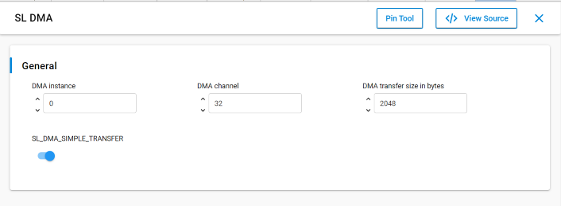
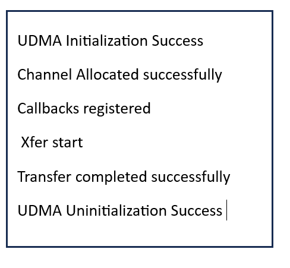
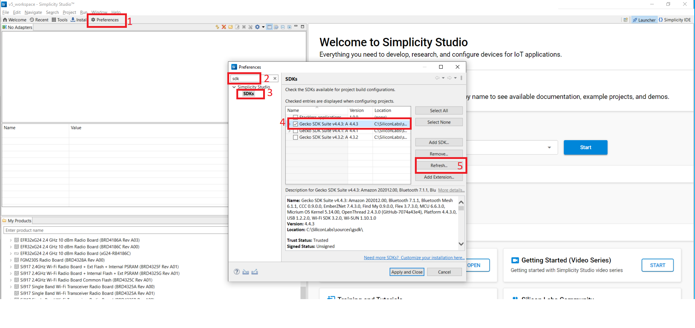

# SL ULP DMA

## Table of Contents

- [Purpose/Scope](#purposescope)
- [Overview](#overview)
- [About Example Code](#about-example-code)
- [Prerequisites/Setup Requirements](#prerequisitessetup-requirements)
  - [Hardware Requirements](#hardware-requirements)
  - [Software Requirements](#software-requirements)
  - [Setup Diagram](#setup-diagram)
- [Getting Started](#getting-started)
- [Application Build Environment](#application-build-environment)
- [Test the Application](#test-the-application)

## Purpose/Scope

- This DMA example performs memory to memory DMA transfer of different sizes. User can change the DMA transfer size by updating SL_DMA_TRANSFER_SIZE in UC.
- This example used both simple DMA transfer API and generic API for performing DMA transfer

## Overview

- DMA is used for performing transfers without processor intervention.
- Si91x DMA supports 3 types of DMA transfers. They are memory to memory, peripheral to memory, memory to peripheral
- This DMA supports 32 channels. Out of which last 24 are dedicated channels for particular peripherals. First 8 channels can support 32 different peripherals.
- The number of transfers in a single DMA cycle can be programmed from 1 to 1024
- The transfer address increment can be greater than the data width
- UDMA1 only supports 12 channels

## About Example Code

- \ref dma_example.c file demonstrates how to use DMA peripheral to perform memory to memory transfers
- In this example first dma initialization is done using \ref sl_si91x_dma_init
- Then \ref sl_si91x_dma_allocate_channel is used to allocate SL_DMA_CHANNEL for transfer. This SL_DMA_CHANNEL can be configured
  by UC
- After configuring channel, callbacks are registered using \ref sl_si91x_dma_register_callbacks
- In this example DMA transfer can be initiated by two methods,
  1.  Using \ref sl_si91x_dma_simple_transfer, user can quickly perform DMA transfer using bare minimum configurations.
  2.  Using \ref sl_si91x_dma_transfer, user can configure more DMA parameters for transfer
- User can either use any of above functions for performing DMA transfer. This can be selected by UC

## Prerequisites/Setup Requirements

Before running the application, the user will need the following things to setup.

### Hardware Requirements

- Windows PC
- Silicon Labs Si917 Evaluation Kit [WPK(BRD4002) + BRD4338A]

### Software Requirements

- Simplicity Studio
- Serial console Setup
  - The Serial Console setup instructions are provided below:
Refer [here](https://docs.silabs.com/wiseconnect/latest/wiseconnect-getting-started/getting-started-with-soc-mode#perform-console-output-and-input-for-brd4338-a).

### Setup Diagram


## Getting Started

Refer to the instructions [here](https://docs.silabs.com/wiseconnect/latest/wiseconnect-getting-started/) to:

- Install Studio and WiSeConnect 3 extension
- Connect your device to the computer
- Upgrade your connectivity firmware
- Create a Studio project

## Application Build Environment

### Application Configuration Parameters
- Configure UC from the slcp component.

  

- Open **sl_si91x_dma.slcp** project file select **software component**tab and search for **SL_DMA** in search bar.
- Select DMA instance 1
- Select the DMA channel used for transfer (1 - 12).
- Select DMA transfer size in bytes (0 - 10000).
- Select transfer API type (simple/generic transfer API).

## Test the Application

Refer to the instructions [here](https://docs.silabs.com/wiseconnect/latest/wiseconnect-getting-started/) to:

- Build the SL ULP DMA example in Studio.
- Flash, run and debug the application.
- After successful program execution the prints in serial console looks as shown below.

  >

> **Note:**
>- The debug feature of Simplicity Studio will not work after M4 flash is turned off.
>- To Erase the chip follow the below procedure
>- Press ISP and RESET button at same time and then release, now perform Chip erase through commander.


## Important Note for using this project with wiseconnect SDK

sl_si91x_ulp_dma application is being migrated to the Power Manager, this application will be available in the wiseconnect SDK from next release.
To use the application now, follow below steps:-
**Step 1:-**
Copy sl_si91x_ulp_dma folder into Gecko SDK Suite i.e. gecko-sdk/extension/wiseconnect3/examples/si91x_soc/peripheral/ folder.
**Step 2:-**
Add the example details in the gecko-sdk/extension/wiseconnect3/wifi_templates.xml like below
```
<descriptors name="sl_si91x_ulp_dma" label="Si91x - SL_ULP_DMA" description="Demonstrates how to to use ULP Dma.">
    <properties key="namespace" value="template.uc"/>
    <properties key="keywords" value="universal\ configurator"/>
    <properties key="projectFilePaths" value="examples/si91x_soc/peripheral/sl_si91x_ulp_dma/sl_si91x_ulp_dma.slcp"/>
    <properties key="boardCompatibility" value="com.silabs.board.none brd4325a brd4325b brd4325c brd4325e brd4325f brd4325g brd4338a brd4343a brd4343b brd4339b brd4340b"/>
    <properties key="partCompatibility" value="mcu.arm.efr32.mg21.* mcu.arm.efr32.mg21.*  mcu.arm.efr32.mg24.* .*si917.* .*si917.* .*siwg917m111mgtba.* .*siwg917m111mgtba.* .*siwg917m141xgtba.* .*siwg917m111mgtba.* .*siwg917m111mgtba.* .*siwg917m111mgtba.* .*siwg917y111mgab.* .*siwg917y111mgnb.*"/>
    <properties key="ideCompatibility" value="makefile-ide simplicity-ide visual-studio-code generic-template"/>
    <properties key="toolchainCompatibility" value="gcc"/>
    <properties key="quality" value="production"/>
    <properties key="category" value="Example|Wi-Fi"/>
    <properties key="stockConfigCompatibility" value="com.silabs.ss.framework.project.toolchain.core.default"/>
    <properties key="sdkAndProtocolTags" value=""/>
    <properties key="readmeFiles" value="examples/si91x_soc/peripheral/sl_si91x_ulp_dma/readme.md"/>
	<properties key="filters" value="Device\ Type|SoC"/>
  </descriptors>
```
**Step 3:-**
Update the Gecko-SDK version and wiseconnect SDK version in the sl_si91x_ulp_dma.slcp
In the Simplicity Studio click on prefernces -> search for sdk -> 
Update the GSDK and wiseconnect SDK in 
**Step 4:-**
Refresh the SDK in the Simplicity Studio by clicking on the preferences refer 
**Step 5:-**
Refer to the instructions [here](https://docs.silabs.com/wiseconnect/latest/wiseconnect-getting-started/) for getting started with example.
