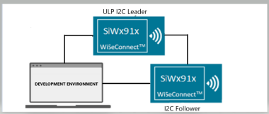
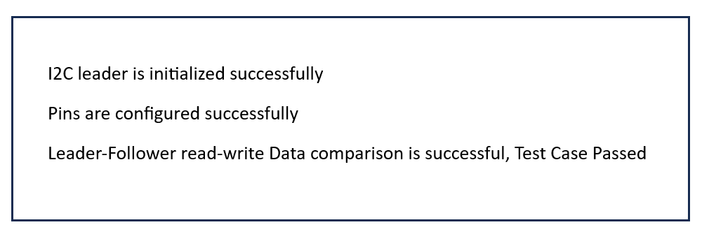
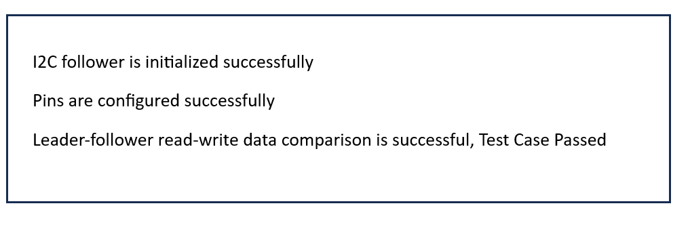
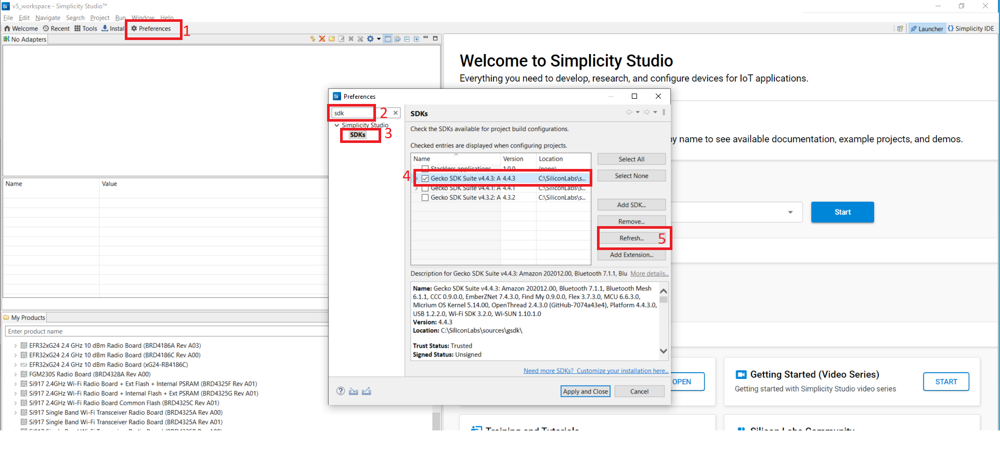

# SI91x - SL_ULP_I2C_Leader

## Table of Contents

- [Purpose/Scope](#purposescope)
- [Overview](#overview)
- [About Example Code](#about-example-code)
- [Prerequisites/Setup Requirements](#prerequisitessetup-requirements)
  - [Hardware Requirements](#hardware-requirements)
  - [Software Requirements](#software-requirements)
  - [Setup Diagram](#setup-diagram)
- [Getting Started](#getting-started)
- [Application Build Environment](#application-build-environment)
- [Pin Configuration](#pin-configuration)
  - [I2C2I](#i2c2)
- [Test the Application](#test-the-application)

## Purpose/Scope

- Note: The master-slave terminology is now replaced with leader-follower. Master is now recognized as Leader and slave is now recognized as Follower.
- This application demonstrates the I2C will be configured in leader mode. The SCL and SDA lines of leader controller are connected to Follower's SCL and SDA pins.
- Data is transferred from leader to follower and follower to leader. After transmission the data is compared and result is printed on the console.

## Overview

- There are three configurable I2C leader/follower controllers in M4 - two in the MCU HP peripherals (I2C1, I2C2) and one in the MCU ULP subsystem (ULP_I2C).
- The I2C interface allows the processor to serve as a leader or follower on the I2C bus.
- I2C can be configured with following features
  - I2C standard compliant bus interface with open-drain pins
  - Configurable as Leader or Follower
  - Four speed modes: Standard Mode (100 kbps), Fast Mode (400 kbps), Fast Mode Plus (1Mbps) and High-Speed Mode (3.4 Mbps)
  - 7 or 10-bit addressing and combined format transfers
  - Support for Clock synchronization and Bus Clear

## About Example Code

- This example code demonstrates I2C data transfer between leader and follower
- In example code, firstly clock is initialized using static function.
- \ref sl_si91x_i2c_init API is called to configure various parameters of \ref sl_i2c_init_params_t structure. This structure includes:
  - \ref sl_i2c_clock_hlr_t bus speed, Standard, Fast, Fast plus or High speed.
  - Frequency which needs to be configured.
  - \ref sl_i2c_mode_t mode, either leader or follower, here leader is selected.
- After initialization of the parameters, pin configuration is performed using static function.
- Now write_buffer is filled with some data which needs to be sent to the follower.
- Current_mode enum is set to SEND_DATA, so here send_data is called which is a static function, that internally calls the APIs which needs to be configured before sending data.
  - Disable the interrupt using \ref sl_si91x_i2c_disable_interrupts API, fill the write_data variable with the data.
  - Disable I2C, sets slave address and tx thresholds using \ref sl_si91x_i2c_set_tx_threshold API and enable the I2C.
  - Set the \ref SL_I2C_EVENT_TRANSMIT_EMPTY interrupt using \ref sl_si91x_i2c_set_interrupts API.
  - Enable the interrupt using \ref sl_si91x_i2c_enable_interrupts API.
- After calling send_data, it will wait till all the data is transferred to the follower device.
- Once the irq handler generates send_complete flag, it changes current_mode enum to RECEIVE_DATA.
- Here receive_data is called which is a static function, that internally calls the APIs which needs to be configured before sending data.
  - Disable the interrupt using \ref sl_si91x_i2c_disable_interrupts API.
  - Disable I2C, sets slave address and rx thresholds using \ref sl_si91x_i2c_set_rx_threshold API and enable the I2C.
  - Set the direction of transfer using \ref sl_si91x_i2c_control_direction.
  - Set the \ref SL_I2C_EVENT_RECEIVE_FULL interrupt using \ref sl_si91x_i2c_set_interrupts API.
  - Enable the interrupt using \ref sl_si91x_i2c_enable_interrupts API.
- After calling receive_data, it will wait till all the data is received from the follower device.
- Once the irq handler generates receive_complete flag, it changes current_mode enum to TRANSMISSION_COMPLETED.
- Now it compares the data which is received from the follower device to the data which it has sent.
- If the data is same, it will print Test Case Passed on the console.

## Prerequisites/Setup Requirements

### Hardware Requirements

- Windows PC
- Silicon Labs Si917 Evaluation Kit [WPK(BRD4002) + BRD4338A]

### Software Requirements

- Simplicity Studio
- Serial console Setup
  - The Serial Console setup instructions are provided below:
Refer [here](https://docs.silabs.com/wiseconnect/latest/wiseconnect-getting-started/getting-started-with-soc-mode#perform-console-output-and-input-for-brd4338-a).

### Setup Diagram

 >

## Getting Started

Refer to the instructions [here](https://docs.silabs.com/wiseconnect/latest/wiseconnect-getting-started/) to:

- Install Studio and WiSeConnect 3 extension
- Connect your device to the computer
- Upgrade your connectivity firmware
- Create a Studio project

## Application Build Environment

- Configure the following macros in i2c_follower_example.c file to update/modify i2c instance used for follower device

```C
 #define I2C_INSTANCE    0    // I2C Instance for Pin configuration
 #define I2C             I2C0 // I2C Instance 
 Available Configurations:
 #define I2C_INSTANCE    1    // I2C Instance for Pin configuration
 #define I2C             I2C1 // I2C Instance 
 #define I2C_INSTANCE    2    // I2C Instance for Pin configuration
 #define I2C             I2C2 // I2C Instance 
  ```

## Pin Configuration

#### I2C2

| PIN | ULP GPIO PIN               | Description                 |
| --- | -------------------------- | --------------------------- |
| SCL | ULP_GPIO_7 [EXP_HEADER-15] | Connect to Follower SCL pin |
| SDA | ULP_GPIO_6 [EXP_HEADER-16] | Connect to Follower SDA pin |


## Test the Application

Refer to the instructions [here](https://docs.silabs.com/wiseconnect/latest/wiseconnect-getting-started/) to:

1. Compile and run the application.
2. Connect P32 and P34 with the follower device in instance 1 this pin status may vary check the RTE_Device_917.h file before running the code.
3. When the application runs, it sends and receives data.
4. After the transfer is completed, it validates the data and prints on the console.
5. After successful program execution the prints in serial console looks as shown below.

  >

  >

> **Note:**
>
>- This application is executed from RAM.
>- In this application while changing the MCU mode from PS4 to PS2, M4 flash will be turned off.
>- The debug feature of Simplicity Studio will not work after M4 flash is turned off.
>- To Erase the chip follow the below procedure
>- Press ISP and RESET button at same time and then release, now perform Chip erase through commander.

## Important Note for using this project with wiseconnect SDK

sl_si91x_ulp_i2c_leader application is being migrated to the Power Manager, this application will be available in the wiseconnect SDK from next release.
To use the application now, follow below steps:-
**Step 1:-**
Copy sl_si91x_ulp_i2c_leader folder into Gecko SDK Suite i.e. gecko-sdk/extension/wiseconnect3/examples/si91x_soc/peripheral/ folder.
**Step 2:-**
Add the example details in the gecko-sdk/extension/wiseconnect3/wifi_templates.xml like below
```
<descriptors name="sl_si91x_ulp_i2c_leader" label="Si91x - SL_ULP_I2C_Leader" description="Demonstrates how to to use ULP I2C Leader.">
    <properties key="namespace" value="template.uc"/>
    <properties key="keywords" value="universal\ configurator"/>
    <properties key="projectFilePaths" value="examples/si91x_soc/peripheral/sl_si91x_ulp_i2c_leader/sl_si91x_ulp_i2c_leader.slcp"/>
    <properties key="boardCompatibility" value="com.silabs.board.none brd4325a brd4325b brd4325c brd4325e brd4325f brd4325g brd4338a brd4343a brd4343b brd4339b brd4340b"/>
    <properties key="partCompatibility" value="mcu.arm.efr32.mg21.* mcu.arm.efr32.mg21.*  mcu.arm.efr32.mg24.* .*si917.* .*si917.* .*siwg917m111mgtba.* .*siwg917m111mgtba.* .*siwg917m141xgtba.* .*siwg917m111mgtba.* .*siwg917m111mgtba.* .*siwg917m111mgtba.* .*siwg917y111mgab.* .*siwg917y111mgnb.*"/>
    <properties key="ideCompatibility" value="makefile-ide simplicity-ide visual-studio-code generic-template"/>
    <properties key="toolchainCompatibility" value="gcc"/>
    <properties key="quality" value="production"/>
    <properties key="category" value="Example|Wi-Fi"/>
    <properties key="stockConfigCompatibility" value="com.silabs.ss.framework.project.toolchain.core.default"/>
    <properties key="sdkAndProtocolTags" value=""/>
    <properties key="readmeFiles" value="examples/si91x_soc/peripheral/sl_si91x_ulp_i2c_leader/readme.md"/>
	<properties key="filters" value="Device\ Type|SoC"/>
  </descriptors>
```
**Step 3:-**
Update the Gecko-SDK version and wiseconnect SDK version in the sl_si91x_ulp_i2c_leader.slcp
In the Simplicity Studio click on prefernces -> search for sdk -> 
Update the GSDK and wiseconnect SDK in 
**Step 4:-**
Refresh the SDK in the Simplicity Studio by clicking on the preferences refer 
**Step 5:-**
Refer to the instructions [here](https://docs.silabs.com/wiseconnect/latest/wiseconnect-getting-started/) for getting started with example.