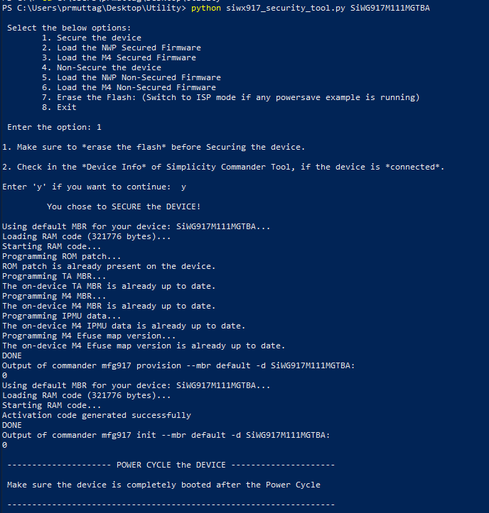
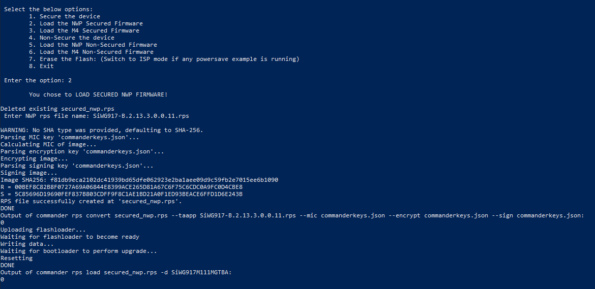
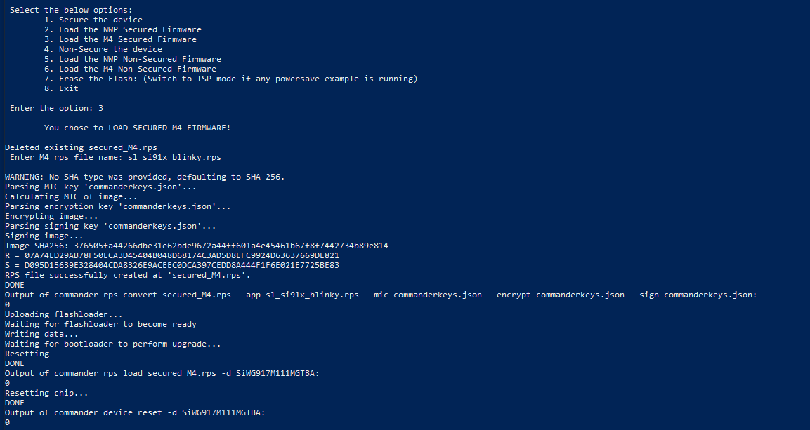
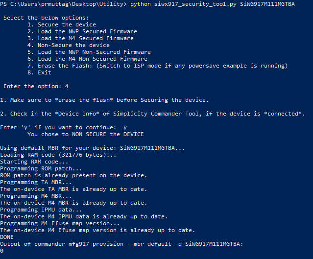
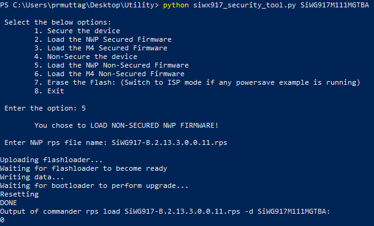
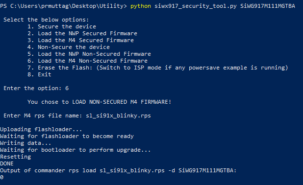
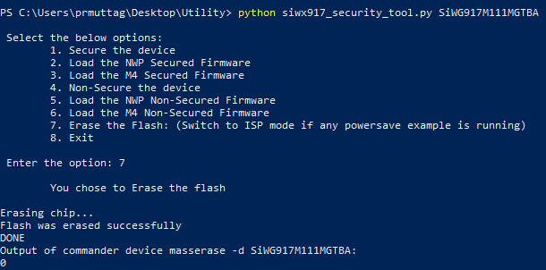
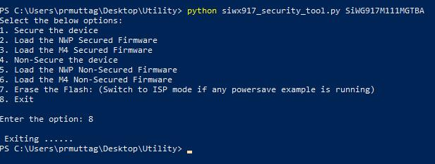

# SIWx917 Security Tool Guide

## Table of Contents

- [Purpose/Features](#purposefeatures)
- [Prerequisites/Setup Requirements](#prerequisitessetup-requirements)
  - [Hardware Requirements](#hardware-requirements)
  - [Software Requirements](#software-requirements)
- [What are the options available in this script:](#what-are-the-options-available-in-this-script)
- [Execute the script](#execute-the-script)

## Purpose/Features

- The script is mainly composed to easily convert the non secured device to secured device using Simplicity commander commands and vice versa. 
- It can convert the NWP and M4 firmwares to secured firmwares.
- It can load the secured NWP and M4 firmwares
- It can load the Non-secured NWP and M4 firmwares.

## Prerequisites/Setup Requirements

### Hardware Requirements

- Windows PC
- Silicon Labs Si917 Evaluation Kit [WPK(BRD4002) + BRD4338A ]

### Software Requirements

- Simplicity Studio 
- Simplicity Commander
  - Make sure to add this path to environment variables
- Install Python [here](https://www.python.org/downloads/) 
- Know the exact **OPN** 
- Download the **siwx917_security_tool.py** file in **../Utility/** folder.
- Download the default **updatedmbrfields.json** file in **../Utility/** folder, which contains the **Security Level 3** configurations.
  - For detailed information on different security levels, please refer to **5.4.2 Security Levels** in this [link](https://www.silabs.com/documents/public/user-guides/ug574-siwx917-soc-manufacturing-utility-user-guide.pdf).

## Getting Started

Refer to the instructions [here](https://docs.silabs.com/wiseconnect/latest/wiseconnect-getting-started/) to:

- [Install Simplicity Studio](https://docs.silabs.com/wiseconnect/latest/wiseconnect-developers-guide-developing-for-silabs-hosts/#install-simplicity-studio)
- [Install WiSeConnect 3 extension](https://docs.silabs.com/wiseconnect/latest/wiseconnect-developers-guide-developing-for-silabs-hosts/#install-the-wi-se-connect-3-extension)
- [Connect your device to the computer](https://docs.silabs.com/wiseconnect/latest/wiseconnect-developers-guide-developing-for-silabs-hosts/#connect-si-wx91x-to-computer)
- [Upgrade your connectivity firmware](https://docs.silabs.com/wiseconnect/latest/wiseconnect-developers-guide-developing-for-silabs-hosts/#update-si-wx91x-connectivity-firmware)

## What are the options available in this script:

### 1. Secure the device: 
- Ensures the device is protected by enabling security features. This step is crucial to prevent unauthorized access.
- Make sure to *erase the flash* before Securing the device.
- Check in the *Device Info* of Simplicity Commander Tool, if the device is *connected*. 
- Select this option if one wants to secure the device with security Level 3. 
- If one wants to secure the device with security level 1 or 2, then make sure to update the **updatedmbrfields.json**
- Make sure to follow the instructions carefully such as Power cycle the device. 
- Select option number 1 to Secure the Device. 
        
        

### 2. Load the NWP Secured Firmware
- Select the option number 2 to Convert and create the NWP firmware from non-secure firmware to *Secure NWP firmware*.
- It deletes the existing **secured_nwp.rps** file 
- Enter the NWP firmware file path you wish to convert to secured NWP file, when asked as an input. 
- Creates secured NWP firmware file with **../Utility/secured_nwp.rps** name. 
- Loads **secured_nwp.rps** to the device.
        

### 3. Load the M4 Secured Firmware
- Select the option number 3 to Convert and create the M4 firmware from non-secure firmware to *Secure M4 firmware*. 
- It deletes the existing **secured_m4.rps** file
- Enter the M4 firmware file path you wish to convert to secured M4 file, when asked as an input. 
- Creates secured M4 firmware file with **../Utility/secured_m4.rps** name. 
- Loads **../Utility/secured_m4.rps** to the device.
        

### 4. Non-Secure the device
- Disable the security features on the device to allow unrestricted access. 
- Select the option number 4 to non secure the device.
- Make sure to *erase the flash* before Securing the device.
- Check in the *Device Info* of Simplicity Commander Tool, if the device is *connected*. 
        

### 5. Load the NWP Non-Secured Firmware
- Select the option number 5 to load the non-secure NWP firmware into the device.
- Enter the NWP firmware file path you wish to load into device, when asked as an input. 
        

### 6. Load the M4 Non-Secured Firmware
- Select the option number 6 to load the non-secure M4 firmware into the device.
- Enter the M4 firmware file path you wish to load into device, when asked as an input.
        

### 7. Erase the Flash: (Switch to ISP mode if any powersave example is running)
- Make sure to switch to ISP mode before selecting this option. 
- Select the option number 7 to Erase the flash. 
- Enter the NWP firmware file path you wish to load into device, when asked as an input.
        

### 8. Exit
- Select the option number 8 to exit this loop
      

## Execute the script

- Download **Utility** zip folder and extract the folder. 
- Make sure **siwx917_security_tool.py** is present in the above folder path.
- Make sure **updatedmbrfields.json** file is also present in the above folder.
- Run the script using the below command:
  > python **siwx917_security_tool.py** <*OPN*>

  Ex: python **siwx917_security_tool.py** *SiWG917M111MGTBA*

      
