# Wi-Fi - LWiP  with Empty C

## Purpose/Scope

This example project demonstrates how a user can utilize an empty configuration file to integrate components and functionalities related to LWiP, and subsequently execute the sample application on the SiWx917 SoC.

Key Features

- LWiP support for the SiWx917 SoC.
- Installation of necessary components for a project.

## Table of contents

- [Introduction](#1-introduction)
- [Prerequisites](#2-prerequisites)
  - [Hardware Requirements](#21-hardware-requirements)
  - [Software Requirements](#22-software-requirements)
- [Setup Diagram](#3-setup-diagram)
- [Project Creation](#4-project-creation)
  - [Empty C Project creation](#41-empty-c-project-creation)
  - [Software Component Installation](#42-software-component-installation)
- [Application Implementation](#5-application-implementation)

  - [Add the dependent header files,macros,constants and variable](#51-add-the-dependent-header-filesmacrosconstants-and-variables)

  - [Add the dependent functions](#52-add-the-declaration-of-dependent-functions)
  - [Create a FreeRTOS Thread](#53-create-a-freertos-thread)
  - [Client Initialization](#54-client-initialization)
  - [Define the dependent functions](#55-define-the-other-dependent-functions)
  - [Configure the credentials](#56-configure-the-credentials)

- [Build the application](#6-build-the-application)
- [Run the Application](#7-run-the-application)

## 1. Introduction

Lightweight IP (LWiP) is an optimized variant of the Internet Protocol (IP) specifically developed for resource-constrained devices. These include embedded systems and various Internet of Things (IoT) devices that often operate in environments characterized by limited power and bandwidth. The design philosophy behind LWiP centers on minimizing overhead while maximizing efficiency, thereby making it an attractive choice for small-scale networking applications.

**Key Characteristics**:

1. **Reduced Complexity**:    LWiP significantly simplifies traditional IP protocols, such as IPv4 and IPv6, by stripping away non-essential features that are not crucial for basic connectivity. This simplification leads to a pronounced decrease in computational and memory requirements, catering specifically to devices that may lack the processing power or extensive memory typically found in standard network equipment. By focusing solely on essential communication functionalities, LWiP ensures that even the simplest of devices can engage in network interactions without overwhelming their limited resources.

2. **Optimization for Embedded Systems**:    One of the standout advantages of LWiP is its design tailored for environments featuring limited computing resources like those found in embedded systems. Devices such as environmental sensors, smart appliances, and small-scale controllers are prime examples of platforms that derive immense benefits from this lightweight protocol. The streamlined capabilities of LWiP allow these devices to communicate effectively in IoT networks without necessitating extensive computation, thus facilitating interactions across diverse applications.

3. **Low Overhead**:    The fundamental architecture of LWiP is characterized by its reduced protocol overhead. This strategic reduction is pivotal in conserving energy and bandwidth—resources that can be quite scarce in low-power wireless networks. LWiP is particularly suitable for technologies such as Zigbee, LoRa, and Bluetooth Low Energy, where conserving energy is essential for prolonging the lifespan of battery-operated devices. By minimizing data transmission requirements, LWiP ensures that devices can function more effectively within these constraints.

4. **Simplified Networking**:    LWiP offers a redesigned networking paradigm that implements a streamlined version of standard IP features, including simplified addressing schemes, routing protocols, and basic error-checking mechanisms. This approach eliminates the complexities associated with larger address tables and sophisticated routing algorithms prevalent in full-featured IP stacks. Consequently, devices using LWiP are capable of establishing connections and transmitting information with minimal delays and reduced demands on network resources.

5. **Improved Power Efficiency**:    Through the elimination of unnecessary processes and a focus on minimizing communication overhead, LWiP allows devices to achieve better energy efficiency. This enhancement is particularly crucial for devices powered by batteries or those operating in energy-constrained environments. By optimizing power usage, LWiP contributes to prolonging the operational lifespan of these devices, making it ideal for applications where maintaining energy efficiency is paramount.

6. **Application in IoT and Low-Power Networks**:    LWiP finds frequent application in the rapidly expanding realm of IoT networks, where a multitude of compact devices must efficiently communicate while utilizing minimal power. Its ability to cater to the needs of a diverse ecosystem of interconnected devices, from smart home appliances to industrial sensors, solidifies its status as an essential protocol in modern networking scenarios. As industries increasingly adopt IoT technologies, LWiP stands out as a critical enabler, facilitating seamless communication among resource-constrained devices. In summary, LWiP serves as a vital tool in the development of scalable, efficient networks where traditional IP may fall short. Its thoughtful design and focus on reducing complexity allow it to meet the specific needs of modern, resource-limited applications effectively.

## 2. Prerequisites

### 2.1 Hardware Requirements

- SiWx917 SoC

  - BRD4002A Wireless Pro Kit Mainboard [SI-MB4002A]
- Radio Boards
  - BRD4338A [SiWx917-RB4338A]
  - BRD4343A [SiWx917-RB4343A]

- Kits

  - SiWx917 Pro Kit [SiWx917-PK6031A](https://www.silabs.com/development-tools/wireless/wi-fi/siwx917-pk6031a-wifi-6-bluetooth-le-soc-pro-kit?tab=overview)

- Windows PC

- Wireless Access Point

### 2.2 Software Requirements

- [WiSeConnect 3 SDK](https://github.com/SiliconLabs/wiseconnect) (SiWx917 latest software release can be downloaded from this link)
- [Simplicity Studio IDE](https://www.silabs.com/developer-tools/simplicity-studio)
- [iPerf Application]((https://sourceforge.net/projects/iperf2/)). iPerf is a tool for active measurements of the maximum achievable bandwidth on IP networks. It supports tuning of various parameters related to timing, buffers, and protocols (TCP and UDP with IPv4 and IPv6).
- [Python Environment](https://www.python.org/)
- Serial Terminal - [Docklight](https://docklight.de/)

## 3. Setup Diagram


## 4. Project Creation

### 4.1 Empty C Project creation

- Once the prerequisites and the SDK are installed, we can use the "SL Si91x - Empty C Project SoC" example as
a base for our implementation.
With the DevKit connected to the PC and on the Launcher page, click the "Start" button next to the
"Connected Devices" drop-down list.
    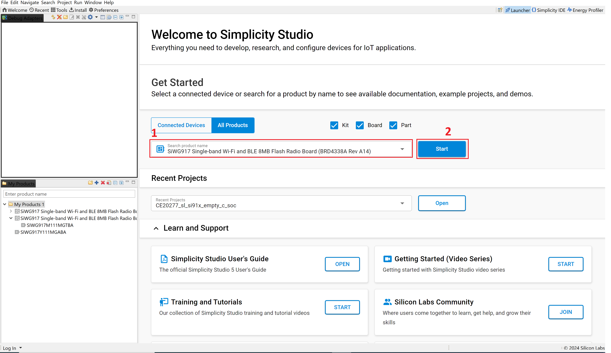

- On the new page, select the section "EXAMPLE PROJECT & DEMOS" filter by typing "empty" and
clicking the "CREATE" button to launch the project.
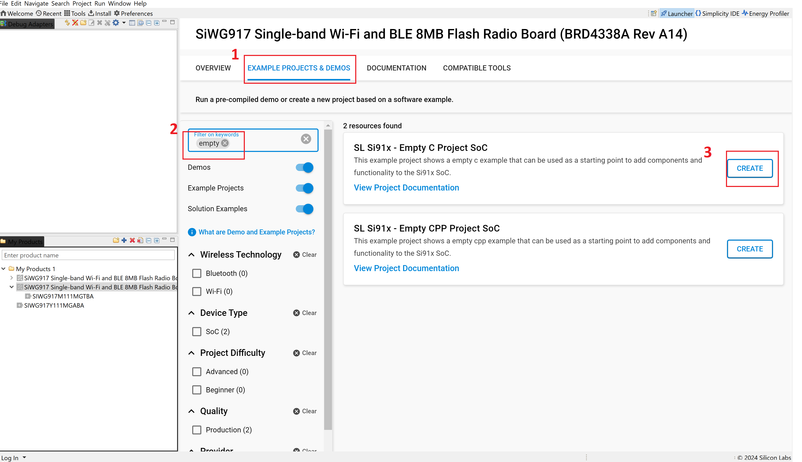

- Click the "FINISH" button on the "New Project Wizard" shown.
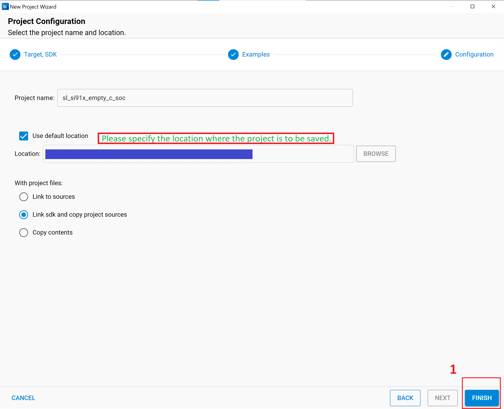

### 4.2 Software Component Installation

- The Software Components used in this project are WiSeConnect3 Resources, FreeRTOS, Network Manager etc. Below is a guided installation.
For more information about the software components, see the [v3.x component list](https://docs.silabs.com/wiseconnect/3.4.0/wiseconnect-developers-guide-about-sdk/application-components).
After creating the empty C project, double-click on "sl_si91x_empty_c_soc.slcp" and select the "Software
Component" section to start the dependencies installation.

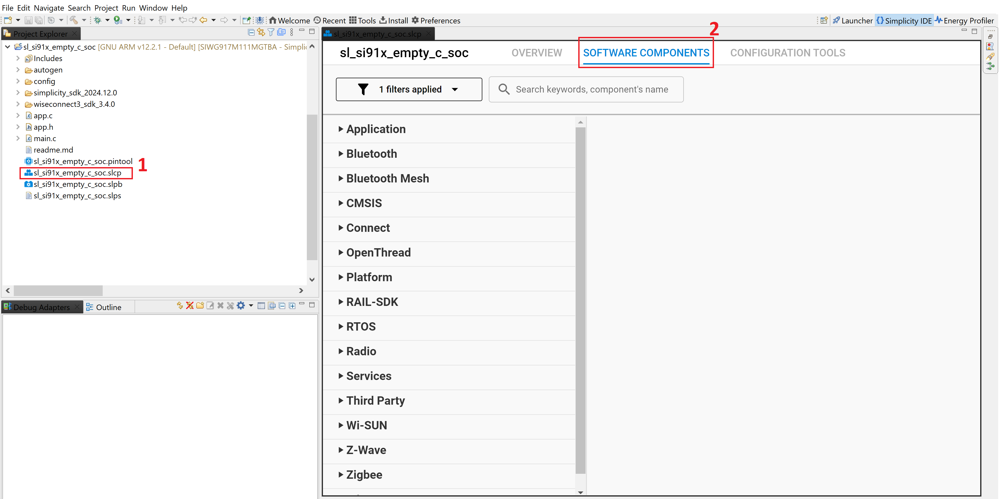

- Please enter "WiSeConnect3 Resources" in the text box located in the upper-right corner. Next, right-click in the designated grey area and select the option labeled "Expand All." After this, select "WiSeConnect3 Resources" and proceed by clicking the "Install" button. You should repeat this identical process for the FreeRTOS, Network Manager LWiP software components, and other software components..

  - Wiseconnect Resource

    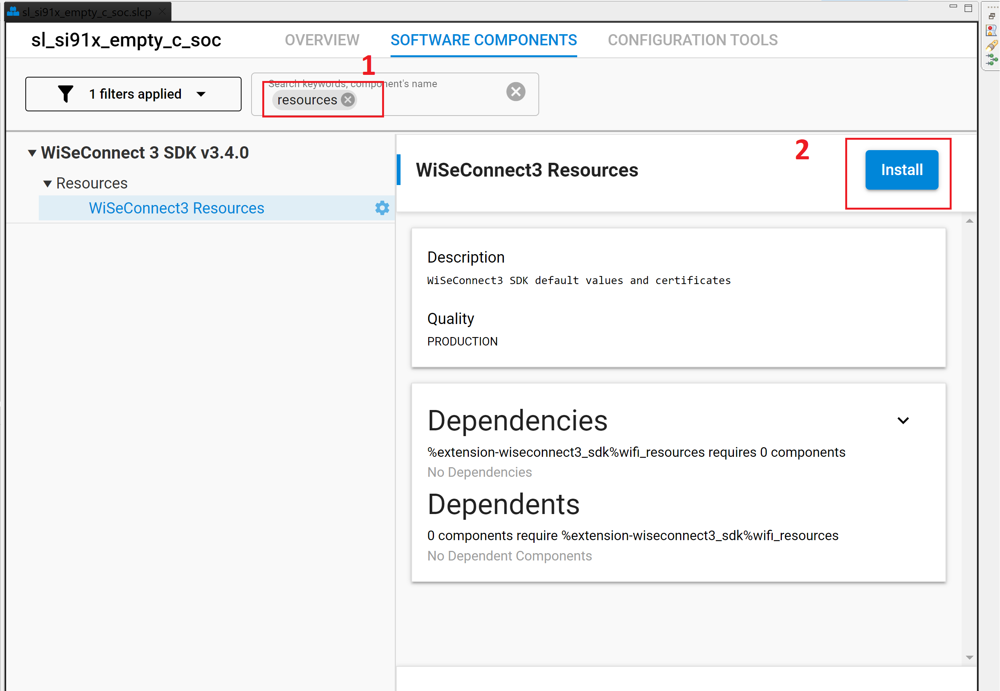

  - FreeRTOS

    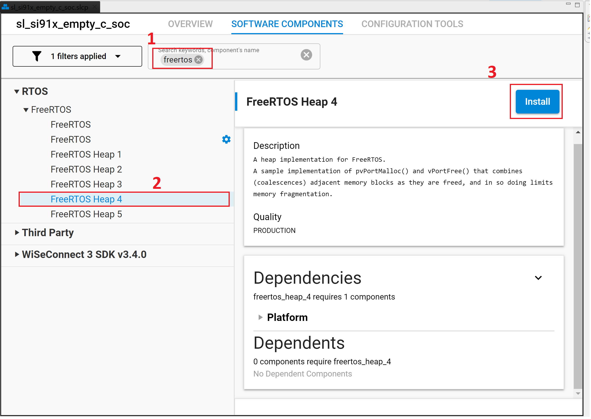

  - Network Manager

    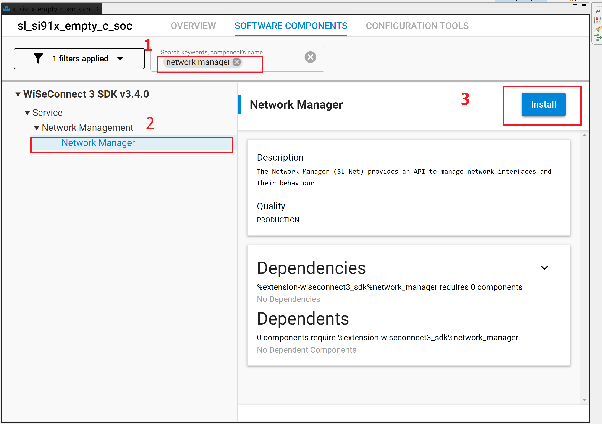

  - LWiP Stack

    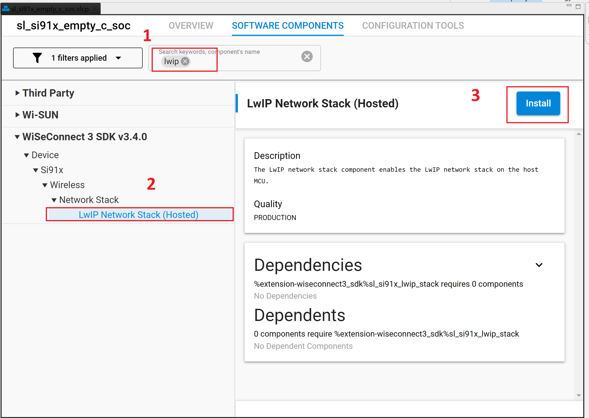

  - Memory Pool buffers with Quota

    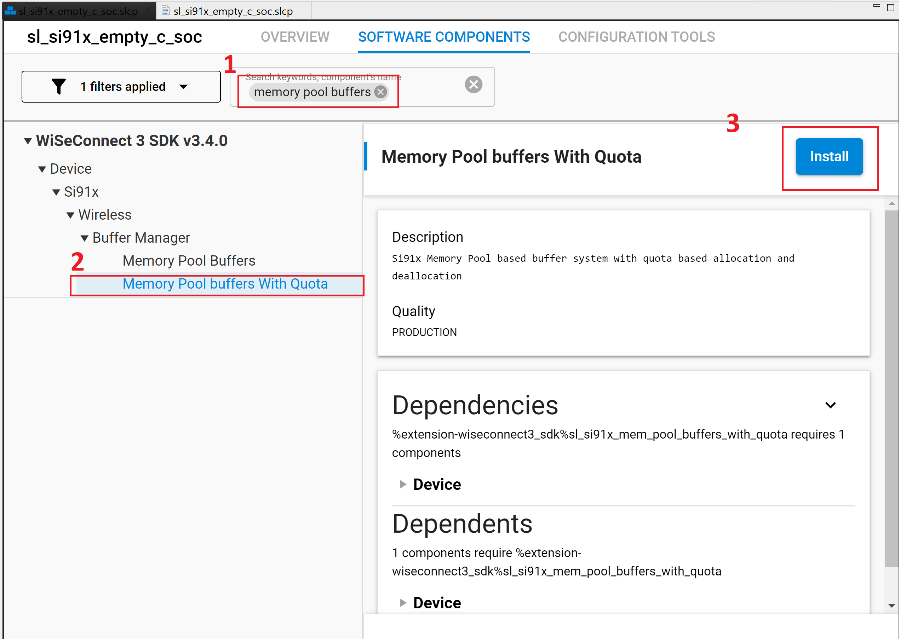

## 5. Application Implementation

### 5.1 Add the dependent header files,macros,constants and variables

```
/******************************************************
 *                      Adding Headers
 ******************************************************/
#include "lwip/errno.h"
#include "sl_wifi_callback_framework.h"
#include "sl_status.h"
#include "sl_board_configuration.h"
#include "cmsis_os2.h"
#include "sl_wifi.h"
#include "sl_utility.h"
#include "sl_net.h"
#include <string.h>
#include <stdint.h>
#include "lwip/sockets.h"
#include "sl_net_for_lwip.h"
#include "sl_si91x_driver.h"
#include "sl_net_wifi_types.h"

/******************************************************
 *                      Macros
 ******************************************************/
// Type of throughput
#define THROUGHPUT_TYPE TCP_RX // Selects the throughput option

#define TCP_TX 2 // SiWx917 transmits packets to remote TCP client
#define TCP_RX 3 // SiWx917 receives packets from remote TCP server


/******************************************************
 *                    Constants
 ******************************************************/
#define SERVER_IP "192.168.50.192" // Remote server IP address

#define LISTENING_PORT 5005 // Local port to use
#define SERVER_PORT    5001 // Remote server port

#define BACKLOG 1 // Number of pending connections that can be queued

#define BYTES_TO_SEND    (1 << 29) // To measure TX throughput with 512MB data transfer
#define BYTES_TO_RECEIVE (1 << 28) // To measure RX throughput with 256MB data transfer
#define TEST_TIMEOUT     (10000)   // Throughput test timeout in ms

#define BUFFER_SIZE 1024

/******************************************************
 *               Variable Definitions
 ******************************************************/
uint8_t data_buffer[BUFFER_SIZE];

const osThreadAttr_t thread_attributes = {
  .name       = "app",
  .attr_bits  = 0,
  .cb_mem     = 0,
  .cb_size    = 0,
  .stack_mem  = 0,
  .stack_size = 3072,
  .priority   = osPriorityLow,
  .tz_module  = 0,
  .reserved   = 0,
};


sl_ip_address_t ip_address           = { 0 };
sl_net_wifi_client_profile_t profile = { 0 };


static const sl_wifi_device_configuration_t client_configuration = {
  .boot_option = LOAD_NWP_FW,
  .mac_address = NULL,
  .band        = SL_SI91X_WIFI_BAND_2_4GHZ,
  .region_code = US,
  .boot_config = { .oper_mode = SL_SI91X_CLIENT_MODE,
                   .coex_mode = SL_SI91X_WLAN_ONLY_MODE,
                   .feature_bit_map =
                     (SL_SI91X_FEAT_SECURITY_OPEN | SL_SI91X_FEAT_AGGREGATION | SL_SI91X_FEAT_ULP_GPIO_BASED_HANDSHAKE
#ifdef SLI_SI91X_MCU_INTERFACE
                      | SL_SI91X_FEAT_WPS_DISABLE
#endif
                      ),
                   .tcp_ip_feature_bit_map     = (SL_SI91X_TCP_IP_FEAT_BYPASS | SL_SI91X_TCP_IP_FEAT_DHCPV4_CLIENT
                                              | SL_SI91X_TCP_IP_FEAT_DNS_CLIENT | SL_SI91X_TCP_IP_FEAT_EXTENSION_VALID),
                   .custom_feature_bit_map     = SL_SI91X_CUSTOM_FEAT_EXTENTION_VALID,
                   .ext_custom_feature_bit_map = (SL_SI91X_EXT_FEAT_LOW_POWER_MODE | SL_SI91X_EXT_FEAT_XTAL_CLK
                                                  | SL_SI91X_EXT_FEAT_UART_SEL_FOR_DEBUG_PRINTS | MEMORY_CONFIG
#ifdef SLI_
                                                  | SL_SI91X_EXT_FEAT_FRONT_END_SWITCH_PINS_ULP_GPIO_4_5_0
#endif
                                                  ),
                   .bt_feature_bit_map         = 0,
                   .ext_tcp_ip_feature_bit_map = (SL_SI91X_CONFIG_FEAT_EXTENTION_VALID),
                   .ble_feature_bit_map        = 0,
                   .ble_ext_feature_bit_map    = 0,
                   .config_feature_bit_map     = SL_SI91X_FEAT_SLEEP_GPIO_SEL_BITMAP }
};

static sl_net_wifi_lwip_context_t wifi_client_context;

```

>Note : Here to enable LWiP, in *tcp_ip_feature_bit_map* SL_SI91X_TCP_IP_FEAT_BYPASS flag has been enabled.

### 5.2 Add the declaration of dependent functions

```
/******************************************************
 *               Function Declarations
 ******************************************************/
static void application_start(void *argument);
static void measure_and_print_throughput(uint32_t total_num_of_bytes, uint32_t test_timeout);

void send_data_to_tcp_server();
void receive_data_from_tcp_client();
```

### 5.3 Create a FreeRTOS Thread

The Wi-Fi Software Development Kit (SDK) operates on FreeRTOS; therefore, the initial step involves the creation of a thread. To proceed, please open the file named app.c and substitute its existing contents with the code provided below.

```

/***************************************************************************/ /**
 * Initialize application.
 ******************************************************************************/
void app_init(void)
{
 osThreadNew((osThreadFunc_t)application_start, NULL, &thread_attributes);
}
 ```

### 5.4 Client Initialization

```
static void application_start(void *argument)
{
  UNUSED_PARAMETER(argument);

  sl_status_t status = SL_STATUS_FAIL;
  sl_mac_address_t mac_addr                   = { 0 };
  sl_wifi_firmware_version_t firmware_version = { 0 };

  status = sl_net_init(SL_NET_WIFI_CLIENT_INTERFACE, &client_configuration, &wifi_client_context, NULL);
  if (status != SL_STATUS_OK) {
    printf("Failed to start Wi-Fi Client interface: 0x%lx\r\n", status);
    return;
  }

  printf("Wi-Fi Client interface success\r\n");

  status = sl_wifi_get_mac_address(SL_WIFI_CLIENT_INTERFACE, &mac_addr);
    if (status != SL_STATUS_OK) {
      printf("\r\nFailed to get mac address: 0x%lx\r\n", status);
      return;
    }
    printf("\r\nDevice MAC address: %x:%x:%x:%x:%x:%x\r\n",
           mac_addr.octet[0],
           mac_addr.octet[1],
           mac_addr.octet[2],
           mac_addr.octet[3],
           mac_addr.octet[4],
           mac_addr.octet[5]);

    status = sl_wifi_get_firmware_version(&firmware_version);
    if (status != SL_STATUS_OK) {
      printf("\r\nFailed to fetch firmware version: 0x%lx\r\n", status);
      return;
    } else {
      print_firmware_version(&firmware_version);
    }

    status = sl_net_up(SL_NET_WIFI_CLIENT_INTERFACE, SL_NET_DEFAULT_WIFI_CLIENT_PROFILE_ID);
    if (status != SL_STATUS_OK) {
      printf("\r\nFailed to connect to AP: 0x%lx\r\n", status);
      return;
    }
    printf("\r\nWi-Fi client connected\r\n");

    status = sl_net_get_profile(SL_NET_WIFI_CLIENT_INTERFACE, SL_NET_DEFAULT_WIFI_CLIENT_PROFILE_ID, &profile);
    if (status != SL_STATUS_OK) {
      printf("Failed to get client profile: 0x%lx\r\n", status);
      return;
    }
    printf("\r\nSuccess to get client profile\r\n");

    ip_address.type = SL_IPV4;
    memcpy(&ip_address.ip.v4.bytes, &profile.ip.ip.v4.ip_address.bytes, sizeof(sl_ipv4_address_t));
    print_sl_ip_address(&ip_address);


  switch (THROUGHPUT_TYPE) {
    case TCP_RX:
      receive_data_from_tcp_client();
      break;
    case TCP_TX:
      send_data_to_tcp_server();
      break;
    default:
      printf("Invalid Throughput test");
  }

  while (1) {
    osThreadYield();
  }
}

```

### 5.5 Define the other dependent functions

```
/******************************************************
 *               Function Definitions
 ******************************************************/
static void measure_and_print_throughput(uint32_t total_num_of_bytes, uint32_t test_timeout)
{
  float duration = ((test_timeout) / 1000);             // ms to sec
  float result   = (total_num_of_bytes * 8) / duration; // bytes to bits
  result         = (result / 1000000);                  // bps to Mbps
  printf("\r\nThroughput achieved @ %0.02f Mbps in %0.03f sec successfully\r\n", result, duration);
}

void send_data_to_tcp_server(void)
{
  int client_socket = -1;

  uint32_t total_bytes_sent = 0;
  int socket_return_value   = 0;
  int sent_bytes            = 1;

  uint32_t fail = 0;
  uint32_t pass = 0;

  uint32_t start = 0;
  uint32_t now   = 0;

  struct sockaddr_in server_address = { 0 };
  socklen_t socket_length           = sizeof(struct sockaddr_in);

  server_address.sin_family = AF_INET;
  server_address.sin_port   = htons(SERVER_PORT);

  sl_net_inet_addr(SERVER_IP, &server_address.sin_addr.s_addr);

  client_socket = socket(AF_INET, SOCK_STREAM, IPPROTO_TCP);
  if (client_socket < 0) {
    printf("\r\nSocket Create failed with bsd error: %d\r\n", errno);
    return;
  }

  printf("\r\nSocket ID : %d\r\n", client_socket);

  socket_return_value = connect(client_socket, (struct sockaddr *)&server_address, socket_length);
  if (socket_return_value < 0) {
    printf("\r\nSocket Connect failed with bsd error: %d\r\n", errno);
    close(client_socket);
    return;
  }

  printf("\r\nSocket connected to TCP server\r\n");
  printf("\r\nTCP_TX Throughput test start\r\n");

  start = osKernelGetTickCount();

  do {
    sent_bytes = send(client_socket, data_buffer, BUFFER_SIZE, 0);
    now        = osKernelGetTickCount();

    if (sent_bytes < 0) {
      if (errno == ENOBUFS)
        continue;
      fail++;
    } else {
      pass++;
      total_bytes_sent = total_bytes_sent + sent_bytes;
    }
  } while ((total_bytes_sent < BYTES_TO_SEND) && ((now - start) < TEST_TIMEOUT));

  printf("\r\nTCP_TX Throughput test finished\r\n");
  printf("\r\nTotal bytes sent : %ld\r\n", total_bytes_sent);
  printf("\r\nSend fail count : %ld, Send pass count : %ld\r\n", fail, pass);

  measure_and_print_throughput(total_bytes_sent, (now - start));

  close(client_socket);
}

void receive_data_from_tcp_client()
{
  int server_socket = -1;
  int client_socket = -1;

  int read_bytes                = 0;
  int socket_return_value       = 0;
  uint32_t total_bytes_received = 0;

  uint32_t start = 0;
  uint32_t now   = 0;

  struct sockaddr_in server_address = { 0 };
  socklen_t socket_length           = sizeof(struct sockaddr_in);

  server_socket = socket(AF_INET, SOCK_STREAM, IPPROTO_TCP);
  if (server_socket < 0) {
    printf("\r\nSocket creation failed with bsd error: %d\r\n", errno);
    return;
  }

  printf("\r\nServer Socket ID : %d\r\n", server_socket);

  if (socket_return_value < 0) {
    printf("\r\nSet Socket option failed with bsd error: %d\r\n", errno);
    close(client_socket);
    return;
  }

  server_address.sin_family      = AF_INET;
  server_address.sin_addr.s_addr = INADDR_ANY;
  server_address.sin_port        = htons(LISTENING_PORT);

  socket_return_value = bind(server_socket, (struct sockaddr *)&server_address, socket_length);
  if (socket_return_value < 0) {
    printf("\r\nSocket bind failed with bsd error: %d\r\n", errno);
    close(server_socket);
    return;
  }

  socket_return_value = listen(server_socket, BACKLOG);
  if (socket_return_value < 0) {
    printf("\r\nSocket listen failed with bsd error: %d\r\n", errno);
    close(server_socket);
    return;
  }

  printf("\r\nListening on Local Port : %d\r\n", LISTENING_PORT);

  client_socket = accept(server_socket, NULL, NULL);
  if (client_socket < 0) {
    printf("\r\nSocket accept failed with bsd error: %d\r\n", errno);
    close(server_socket);
    return;
  }

  printf("\r\nClient Socket ID : %d\r\n", client_socket);

  printf("\r\nTCP_RX Throughput test start\r\n");
  start = osKernelGetTickCount();

  do {
    read_bytes = recv(client_socket, data_buffer, BUFFER_SIZE, 0);

    if (read_bytes < 0) {
      printf("\r\nReceive failed with bsd error:%d\r\n", errno);
      close(client_socket);
      close(server_socket);
      return;
    }

    total_bytes_received = total_bytes_received + read_bytes;
    now                  = osKernelGetTickCount();
  } while ((read_bytes > 0) && ((now - start) < TEST_TIMEOUT));

  printf("\r\nTCP_RX Throughput test finished\r\n");
  printf("\r\nTotal bytes received : %ld\r\n", total_bytes_received);

  measure_and_print_throughput(total_bytes_received, (now - start));

  close(server_socket);
  close(client_socket);
}
```

>Note: In the code above, functions for performing TCP transmission (TX) and reception (RX) operations have been implemented. The send_data_to_tcp_server function is used for TCP TX, while the receive_data_from_tcp_client function is used for TCP RX.

### 5.6 Configure the credentials

Configure the following parameters to enable your Silicon Labs Wi-Fi device to connect to your Wi-Fi network in the **"sl_net_default_values.h"** file which is present in the config folder of the project.

- DEFAULT_WIFI_CLIENT_PROFILE_SSID denotes the name of the Wi-Fi network that is being advertised, to which the Si91X module is currently connected.

   ```
   #ifndef DEFAULT_WIFI_CLIENT_PROFILE_SSID
   #define DEFAULT_WIFI_CLIENT_PROFILE_SSID "Hello"
   #endif
   ```

- DEFAULT_WIFI_CLIENT_CREDENTIAL refers to the secret key used when the access point is configured in WPA-PSK/WPA2-PSK security modes.

   ```
   #ifndef DEFAULT_WIFI_CLIENT_CREDENTIAL
   #define DEFAULT_WIFI_CLIENT_CREDENTIAL "12345678"
   #endif
   ```

- DEFAULT_WIFI_CLIENT_SECURITY_TYPE refers to the security type of the access point. The supported security modes are detailed in **sl_wifi_security_t** defined in the **sl_wifi_constants.h** file..

   ```
   #ifndef DEFAULT_WIFI_CLIENT_SECURITY_TYPE
   #define DEFAULT_WIFI_CLIENT_SECURITY_TYPE SL_WIFI_OPEN
   #endif
  ```

- Update the TCP server address and the port numbers for both client and server.

  ```
  #define SERVER_IP "192.168.50.205" // Remote server IP address
  #define LISTENING_PORT 5005 // Local port to use
  #define SERVER_PORT    5001 // Remote server port
  ```

>**Note: Users can update the throughput duration for the server or client by modifying the TEST_TIMEOUT macro.**

```
#define TEST_TIMEOUT     (30000) #30 secs
```

## 6. Build the application

 Now the user can build the application.

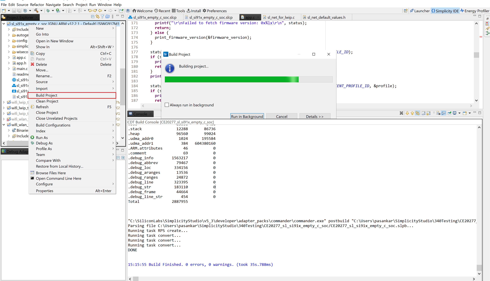

## 7. Run the Application

### 7.1 TCP TX Throughput

To measure TCP transmission throughput, follow these steps:

- Configure the SiWx917 as a TCP client.
- Start a TCP server on the remote PC.
To establish the TCP server on the remote PC, open the [iPerf application](#https://sourceforge.net/projects/iperf2/) and execute the following command from the installed folder's path in the command prompt:

  ```
  iperf.exe -s -p <SERVER_PORT> -i 1
  Example  : iperf.exe -s -p 5001 -i 1
  ```

  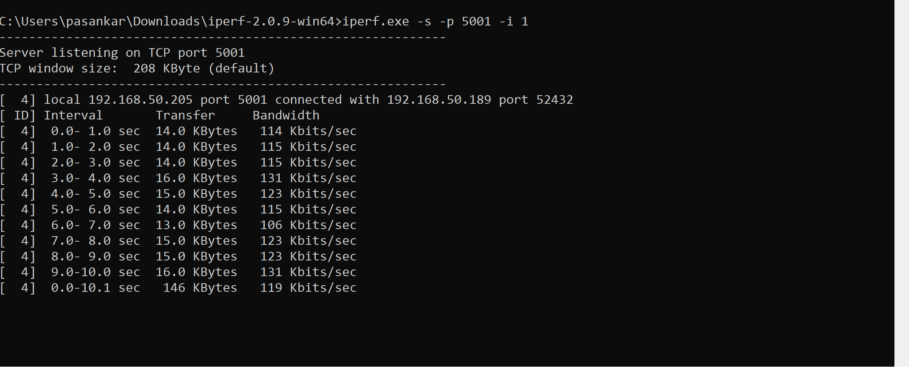

  Client Side:
  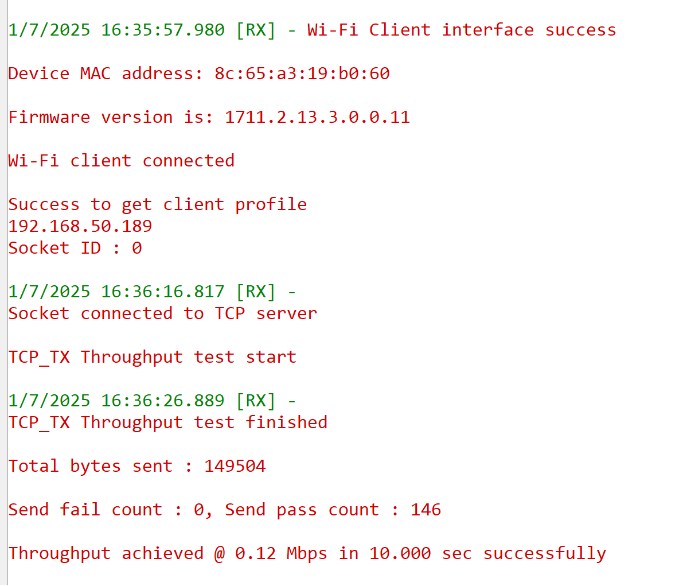

### 7.2 TCP_RX Throughput

To measure TCP reception throughput, follow these steps:

- Run the application on SiWx917 in RX Mode.
- Start a TCP client on the remote PC.
To establish the TCP client on the remote PC, open the [iPerf application](https://sourceforge.net/projects/iperf2/) and execute the following command from the installed folder's path in the command prompt:

  ```
  iperf.exe -c <Module_IP> -p <LISTENING_PORT> -i 1 -t <time interval in sec>
  Example : iperf.exe -c 192.168.50.189 -p 5005 -i 1 -t 10
  ```

  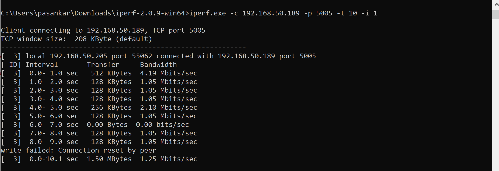

  Server Side:
  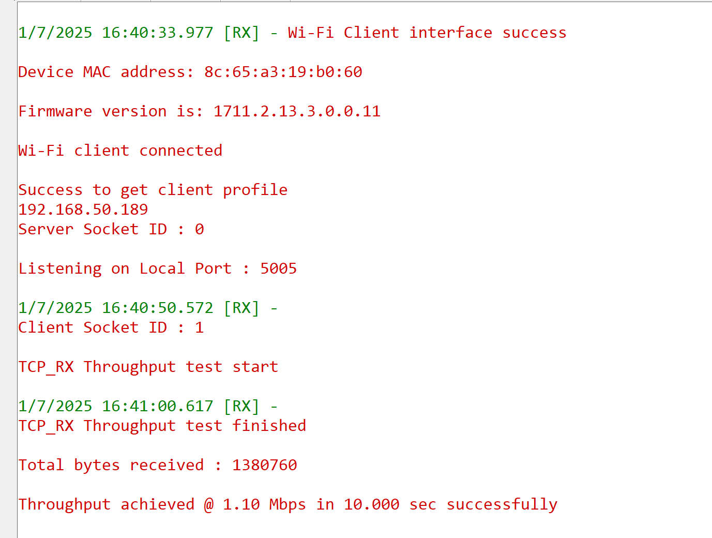
