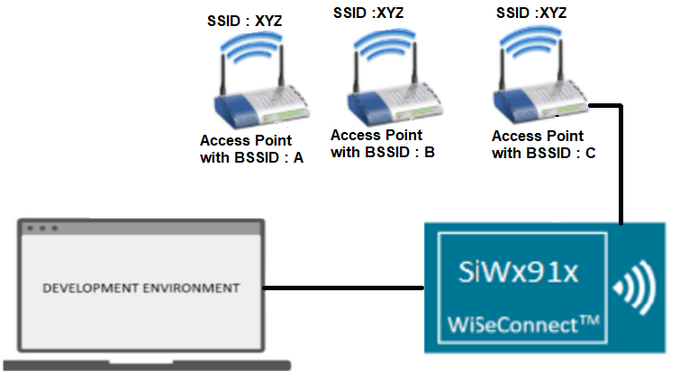
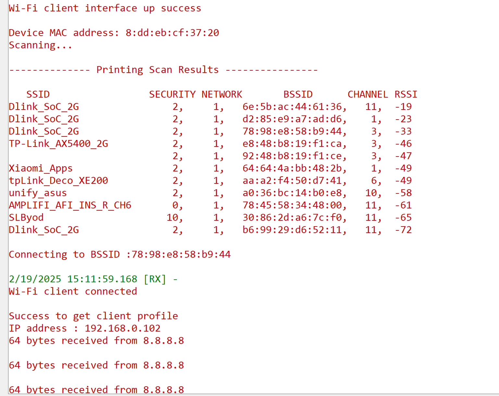

# Wi-Fi - Station Ping with BSSID Join

## Table of Contents

- [Purpose/Scope](#purposescope)
- [Prerequisites/Setup Requirements](#prerequisitessetup-requirements)
  - [Hardware Requirements](#hardware-requirements)
  - [Software Requirements](#software-requirements)
  - [Setup Diagram](#setup-diagram)
- [Getting Started](#getting-started)
- [Application Build Environment](#application-build-environment)
- [Test the application](#test-the-application)

## Purpose/Scope

This example application demonstrates how a user can connect SiWG917 through BSSID-based join.

The BSSID-based join method enables a Wi-Fi station (STA) to establish a connection with a specific Access Point (AP) by utilizing its Basic Service Set Identifier (BSSID) in conjunction with scanning for the provided Service Set Identifier (SSID). Note: The password type must be consistent across all access points.

Typically, when scanning for available networks, multiple APs with the same SSID may appear in the scan results. The default connection method prioritizes the AP with the best Received Signal Strength Indicator (RSSI), resulting in the device connecting to the SSID with the highest RSSI available in the scan results. However, there are scenarios where a user may prefer to connect to a specific AP, even if its RSSI is lower.

In such cases, the BSSID-based connection method proves to be advantageous, enabling the user to connect to the desired AP regardless of its RSSI.

After connection has been established with the access point, this application will demonstrates how SiWG917 can send a ping request to a target IP address.

## Prerequisites/Setup Requirements

### Hardware Requirements

- A Windows PC.
- USB-C cable
- A Wireless Access point (which has an active internet access)

- **SoC Mode**:
  - Standalone
    - BRD4002A Wireless pro kit mainboard [SI-MB4002A]
    - Radio Boards 
  	  - BRD4338A [SiWx917-RB4338A]
      - BRD4342A [SiWx917-RB4342A]
  	  - BRD4343A [SiWx917-RB4343A]
  - Kits
  	- SiWx917 Pro Kit [Si917-PK6031A](https://www.silabs.com/development-tools/wireless/wi-fi/siwx917-pro-kit?tab=overview)
  	- SiWx917 Pro Kit [Si917-PK6032A]
    - SiWx917 AC1 Module Explorer Kit (BRD2708A)

### Software Requirements

- Simplicity Studio
-  Serial Terminal - Studio Terminal/[Tera Term](https://ttssh2.osdn.jp/index.html.en)

### Setup Diagram

  

## Getting Started

Refer to the instructions [here](https://docs.silabs.com/wiseconnect/latest/wiseconnect-getting-started/) to:

- [Install Simplicity Studio](https://docs.silabs.com/wiseconnect/latest/wiseconnect-developers-guide-developing-for-silabs-hosts/#install-simplicity-studio)
- [Install WiSeConnect 3 extension](https://docs.silabs.com/wiseconnect/latest/wiseconnect-developers-guide-developing-for-silabs-hosts/#install-the-wi-se-connect-3-extension)
- [Connect your device to the computer](https://docs.silabs.com/wiseconnect/latest/wiseconnect-developers-guide-developing-for-silabs-hosts/#connect-si-wx91x-to-computer)
- [Upgrade your connectivity firmware](https://docs.silabs.com/wiseconnect/latest/wiseconnect-developers-guide-developing-for-silabs-hosts/#update-si-wx91x-connectivity-firmware)
- [Create a Studio project](https://docs.silabs.com/wiseconnect/latest/wiseconnect-developers-guide-developing-for-silabs-hosts/#create-a-project)

For details on the project folder structure, see the [WiSeConnect Examples](https://docs.silabs.com/wiseconnect/latest/wiseconnect-examples/#example-folder-structure) page.

## Application Build Environment

- The application can be configured to suit your requirements and development environment. Read through the following sections and make any changes as needed.
- In the Project Explorer pane, expand the **config/** folder and open the ``sl_net_default_values.h`` file. Configure the following parameters to enable your Silicon Labs Wi-Fi device to connect to your Wi-Fi network.

- STA instance related parameters

  - DEFAULT_WIFI_CLIENT_PROFILE_SSID refers to the name with which Wi-Fi network that shall be advertised and SiWx91x module is connected to it.
  
     ```c
     #define DEFAULT_WIFI_CLIENT_PROFILE_SSID               "YOUR_AP_SSID"      
     ```

  - DEFAULT_WIFI_CLIENT_CREDENTIAL refers to the secret key if the Access point is configured in WPA-PSK/WPA2-PSK security modes.

     ```c
     #define DEFAULT_WIFI_CLIENT_CREDENTIAL                 "YOUR_AP_PASSPHRASE" 
     ```

  - DEFAULT_WIFI_CLIENT_SECURITY_TYPE refers to the security type if the Access point is configured in WPA/WPA2 or mixed security modes.

    ```c
    #define DEFAULT_WIFI_CLIENT_SECURITY_TYPE                             SL_WIFI_WPA2 
    ```
  
  - Other STA instance configurations can be modified if required in `default_wifi_client_profile` configuration structure.

> Note: 
> Users can configure default region-specific regulatory information using `sl_wifi_region_db_config.h`

- Configure the following parameters in ``app.c`` to test Station Ping application.

  - **Remote peer configurations**

      ```c
      #define REMOTE_IP_ADDRESS   "8.8.8.8"    // Remote/Target IPv4 address to ping
      #define PING_PACKET_SIZE    64                 // Size of ping request packet
      ```

  - Configure the BSSID parameter in the macro **BSSID_MAC_ADDRESS**.

      ```c
      #define BSSID_MAC_ADDRESS "72:58:c8:5a:b3:44"   // set the BSSID address
      ```

  > Note : To connect using BSSID we need to set the join_feature_bitmap with flag **SL_SI91X_JOIN_FEAT_BSSID_BASED**. To enable this flag in join_feature_bitmap we are using sl_si91x_set_join_configuration() API .
>
## Test the application

Refer to the instructions [here](https://docs.silabs.com/wiseconnect/latest/wiseconnect-getting-started/) to:

- Build the application.
- Flash, run and debug the application.
- After successful connection with the Access Point with the given BSSID, the device starts sending ping requests to the given REMOTE_IP_ADDRESS with configured PING_PACKET_SIZE to check availability of target device.

- In sl_net_ping.c file, when ping response comes from the remote node, it is known from the status parameter of the callback function (network_event_handler) registered.

  

> In the above image users can see that we are joining using BSSID i.e., there are 4 access points with ssid **Dlink_SoC_2G** but we are joining to the BSSID  78:98:e8:58:b9:44.