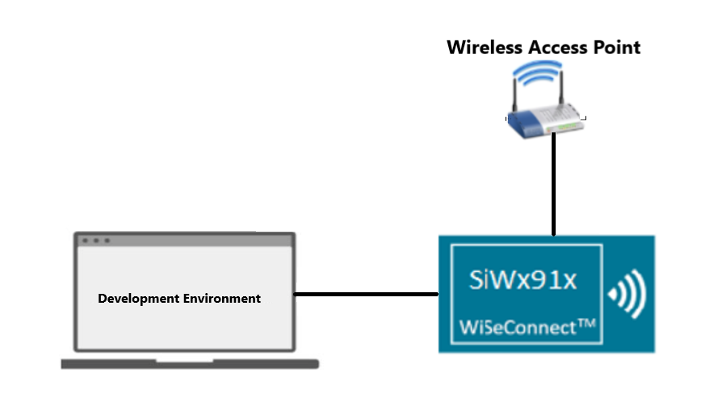
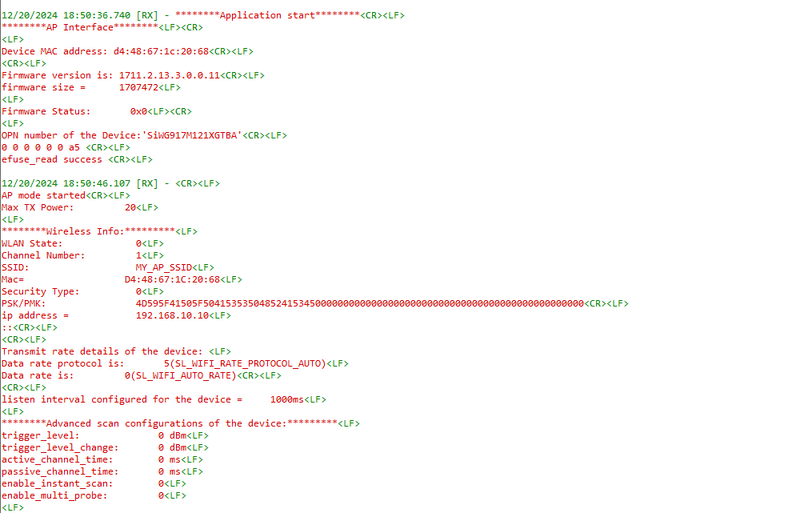
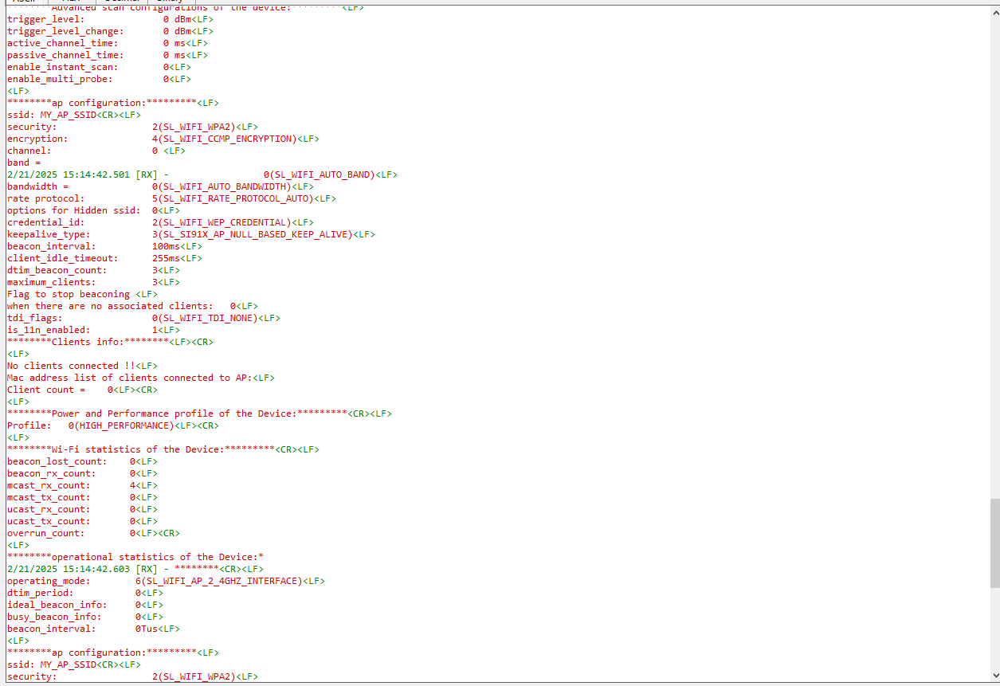
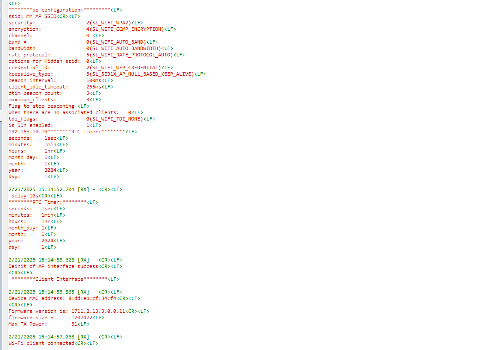

# SiWG917 Query commands Application

## Table of Contents

- [Purpose/Scope](#purposescope)
- [Prerequisites/Setup Requirements](#prerequisitessetup-requirements)
  - [Hardware Requirements](#hardware-requirements)
  - [Software Requirements](#software-requirements)
  - [Setup Diagram](#setup-diagram)
- [Getting Started](#getting-started)
- [Instructions for Simplicity Studio IDE and Silicon Labs devices (SoC Mode)](#instructions-for-simplicity-studio-ide-and-silicon-labs-devices-soc-mode)
- [Application Build Environment](#application-build-environment)
  - [Configure sl\_net\_default\_values.h](#configure-sl_net_default_valuesh)
- [Test the application](#test-the-application)  
- [Application Prints:](#application-prints)

## Purpose/Scope

This application demonstrates the implementation of APIs of different SiWG917 query commands for Wi-Fi in both STA and AP mode. Please refer to the [API reference guide](https://docs.silabs.com/wiseconnect/latest/wiseconnect-api-reference-guide-summary/) for more details.

## Prerequisites/Setup Requirements

### Hardware Requirements

- Windows PC
- Wireless Access Point with Internet.
- **SoC Mode**:
  - Standalone
      - BRD4002A Wireless pro kit mainboard [SI-MB4002A](https://www.silabs.com/development-tools/wireless/wireless-pro-kit-mainboard?tab=overview)
  - Radio Boards
      - BRD4338A [SiWx917-RB4338A](https://www.silabs.com/development-tools/wireless/wi-fi/siwx917-rb4338a-wifi-6-bluetooth-le-soc-radio-board.html)

  - Kits
      - SiWx917 Pro Kit [Si917-PK6031A](https://www.silabs.com/development-tools/wireless/wi-fi/siwx917-pro-kit?tab=overview)
      - SiWx917 Pro Kit [Si917-PK6032A]

### Software Requirements

- Simplicity Studio IDE Version- SiSDK-2024.12.0.
- WSDK version- 3.4.0.
- Serial Terminal - [Docklight](https://docklight.de/) (optional).

### Setup Diagram

  

Here, the development environment refers to Simplicity Studio IDE on Windows PC.

**APIs Implemented in the Application:**
- **sl_wifi_get_firmware_version**(sl_wifi_firmware_version_t *version)
Return the firmware version running on the Wi-Fi device.
- **sl_wifi_get_wireless_info**(sl_si91x_rsp_wireless_info_t *info)
Gets wlan info in AP mode / Client mode.
- **sl_wifi_get_firmware_size**(void *buffer, uint32_t *fw_image_size)
Return the firmware image size from firmware image.
- **sl_wifi_get_mac_address**(sl_wifi_interface_t interface, sl_mac_address_t *mac) Retrieves the MAC addresses of the specified Wi-Fi interface, in concurrent mode retrieves two MAC addresses.
- **sl_wifi_get_max_tx_power**(sl_wifi_interface_t interface, sl_wifi_max_tx_power_t *max_tx_power)
Get the maximum Wi-Fi transmit power.
- **sl_wifi_get_channel**(sl_wifi_interface_t interface, sl_wifi_channel_t *channel)
Get the current channel for the given Wi-Fi interface.
- **sl_wifi_get_transmit_rate**(sl_wifi_interface_t interface, sl_wifi_rate_protocol_t *rate_protocol, sl_wifi_rate_t *mask)
Get the Wi-Fi transmit rate for the given 802.11 protocol on the specified Wi-Fi interface.
- **sl_wifi_get_listen_interval**(sl_wifi_interface_t interface, sl_wifi_listen_interval_t *listen_interval)
Get the Wi-Fi client listen interval.
- **sl_wifi_get_advanced_scan_configuration**(sl_wifi_advanced_scan_configuration_t *configuration)
Retrieves the current advanced scan configuration parameters from the Wi-Fi interface.
- **sl_wifi_get_signal_strength**(sl_wifi_interface_t interface, int32_t *rssi)
Retrieve the RSSI value of the Access Point to which the Wi-Fi client is connected.
- **sl_wifi_get_sta_tsf**(sl_wifi_interface_t interface, sl_wifi_tsf64_t *tsf)
Get the station Timing Synchronization Function (TSF) time which is synchronised with connected AP beacon TSF.
- **sl_wifi_get_ap_configuration**(sl_wifi_interface_t interface, sl_wifi_ap_configuration_t *configuration)
Get the configuration of a Wi-Fi AP interface.
- **sl_wifi_get_advanced_ap_configuration**(sl_wifi_interface_t interface, const sl_wifi_advanced_ap_configuration_t *configuration)
Get the advanced configuration options of a running Wi-Fi access point interface.
- **sl_wifi_get_ap_client_info**(sl_wifi_interface_t interface, sl_wifi_client_info_response_t *client_info)
Return the Wi-Fi client information of all clients connected to the AP.
- **sl_wifi_get_ap_client_list**(sl_wifi_interface_t interface, uint16_t client_list_count, sl_mac_address_t *client_list)
Return a list of Wi-Fi clients connected to the Wi-Fi access point.
- **sl_wifi_get_ap_client_count**(sl_wifi_interface_t interface, uint32_t *client_count)
Provide the number of Wi-Fi clients connected to the Wi-Fi access point.
- **sl_wifi_get_performance_profile**(sl_wifi_performance_profile_t *profile)
Get Wi-Fi performance profile.
- **sl_wifi_get_statistics**(sl_wifi_interface_t interface, sl_wifi_statistics_t *statistics)
Return Wi-Fi operational statistics.
- **sl_wifi_get_operational_statistics**(sl_wifi_interface_t interface, sl_wifi_operational_statistics_t *operational_statistics)
Return Wi-Fi operational statistics.
- **sl_wifi_get_credential**(sl_wifi_credential_id_t id, sl_wifi_credential_type_t *type, void *credential, uint32_t *credential_length)
Retrieve a stored credential.
- **sl_net_get_profile**(sl_net_interface_t interface, sl_net_profile_id_t id, sl_net_profile_t *profile)
Retrieve a stored network profile for a given interface.
- **sl_net_get_ip_address**(sl_net_interface_t interface, sl_net_ip_address_t *ip_address, uint32_t timeout)
This function retrieves the IP address of the specified network interface.
- **sl_si91x_get_saved_firmware_status**(void)
Retrieves the saved thread-specific firmware status value.
- **sl_si91x_get_rtc_timer**(sl_si91x_module_rtc_time_t *response)
Retrieves the current time from the module's Real Time Clock (RTC).
- **sl_sntp_client_get_time**(uint8_t *data, uint16_t data_length, uint32_t timeout)
Get the current NTP epoch time in seconds.
- **sl_sntp_client_get_time_date**(uint8_t *data, uint16_t data_length, uint32_t timeout)
Get time and date information from NTP.
- **sl_sntp_client_get_server_info**(sl_sntp_server_info_t *data, uint32_t timeout)
Retrieve NTP server information.

After flashing the application onto the SiWG917 module, the device will initially start in Access Point (AP) mode. During this phase, APIs will run to gather data. Once this information is collected, the AP mode will be de-initialized, and the device will restart in Station (STA) mode, connecting to a Wireless Access Point (AP). During this process, APIs will execute to retrieve the data and print the output.

## Getting Started

### Instructions for Simplicity Studio IDE and Silicon Labs devices (SoC mode)

Refer to the instructions [here](https://docs.silabs.com/wiseconnect/latest/wiseconnect-developers-guide-developing-for-silabs-hosts/) to:

- [Install Simplicity Studio](https://docs.silabs.com/wiseconnect/latest/wiseconnect-developers-guide-developing-for-silabs-hosts/#install-simplicity-studio)
- [Install WiSeConnect 3 extension](https://docs.silabs.com/wiseconnect/latest/wiseconnect-developers-guide-developing-for-silabs-hosts/#install-the-wi-se-connect-3-extension)
- [Connect your device to the computer](https://docs.silabs.com/wiseconnect/latest/wiseconnect-developers-guide-developing-for-silabs-hosts/#connect-si-wx91x-to-computer)
- [Upgrade your connectivity firmware](https://docs.silabs.com/wiseconnect/latest/wiseconnect-developers-guide-developing-for-silabs-hosts/#update-si-wx91x-connectivity-firmware)

For details on the project folder structure, see the [WiSeConnect Examples](https://docs.silabs.com/wiseconnect/latest/wiseconnect-examples/#example-folder-structure) page.

## Application Build Environment

The application can be configured to suit user requirements and development environment. Read through the following sections and make any changes needed.

### Configure sl_net_default_values.h

**File path for Simplicity Studio IDE:**

- The application uses the default configurations as provided in the default_wifi_ap_profile in sl_net_default_values.h file. Users can choose to configure these parameters as needed.

- In the Project Explorer pane, expand the config folder and open the sl_net_default_values.h file. Configure the following parameters as you desired to enable the Silicon Labs Wi-Fi device as an access point.

- AP instance related parameters :

  - DEFAULT_WIFI_AP_PROFILE_SSID refers to the SSID of the WiSeConnect soft AP that will be created.

     ```c
      #define DEFAULT_WIFI_AP_PROFILE_SSID                   "MY_AP_SSID"    
     ```

  - DEFAULT_WIFI_AP_CREDENTIAL refers to the secret key of the WiSeConnect soft AP that will be created.

      ```c
      #define DEFAULT_WIFI_AP_CREDENTIAL                      "MY_AP_PASSPHRASE"
      ```

  - Other AP instance configurations can be modified if required in default_wifi_ap_profile configuration structure.

Configure the following parameters to enable your Silicon Labs Wi-Fi device to connect to your Wi-Fi network

- STA instance related parameters

  - DEFAULT_WIFI_CLIENT_PROFILE_SSID refers to the name with which Wi-Fi network that shall be advertised and Si91X module is connected to it.

    ```c
    #define DEFAULT_WIFI_CLIENT_PROFILE_SSID               "YOUR_AP_SSID"      
    ```

  - DEFAULT_WIFI_CLIENT_CREDENTIAL refers to the secret key if the Access point is configured in WPA-PSK/WPA2-PSK security modes.

      ```c
      #define DEFAULT_WIFI_CLIENT_CREDENTIAL                 "YOUR_AP_PASSPHRASE" 
      ```

  - DEFAULT_WIFI_CLIENT_SECURITY_TYPE refers to the security type of the Access point. The supported security modes are mentioned in `sl_wifi_security_t`.

      ```c
      #define DEFAULT_WIFI_CLIENT_SECURITY_TYPE               SL_WIFI_WPA2
      ```

- Other STA instance configurations can be modified if required in `default_wifi_client_profile` configuration structure.

## Test the application

Refer to the instructions [here](https://docs.silabs.com/wiseconnect/latest/wiseconnect-developers-guide-developing-for-silabs-hosts/) to:

- [Build the application](https://docs.silabs.com/wiseconnect/latest/wiseconnect-developers-guide-developing-for-silabs-hosts/#build-an-application).
- [Flash, run and debug the application](https://docs.silabs.com/wiseconnect/latest/wiseconnect-developers-guide-developing-for-silabs-hosts/#flash-an-application).
  
## Application Prints

To view the application prints on the console, refer [here](https://docs.silabs.com/wiseconnect/latest/wiseconnect-developers-guide-developing-for-silabs-hosts/#console-input-and-output).



