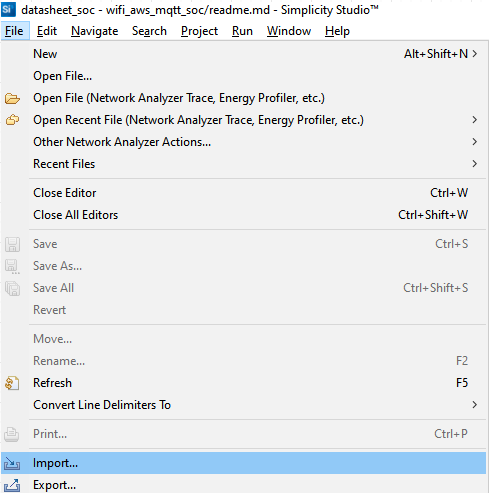
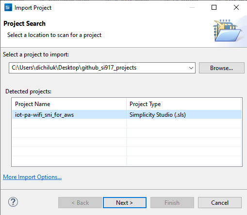
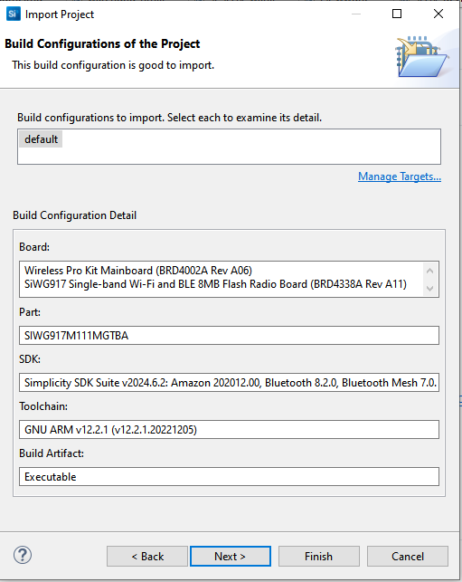
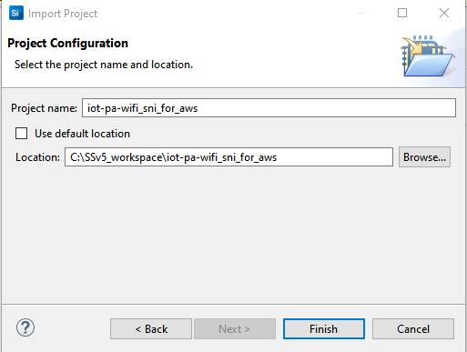

# Wi-Fi - SNI for AWS IoT MQTT Client

## Table of Contents

- [Purpose/Scope](#purposescope)
- [Getting Started](#getting-started)
- [Test the Application](#test-the-application)

## Purpose/Scope

This application serves as a reference for adding Server Name Indication (SNI) extension to the AWS MQTTS connections. 

This application is built on top of [AWS IoT MQTT Client](https://github.com/SiliconLabs/wiseconnect/tree/master/examples/snippets/wlan/cloud_apps/aws/mqtt) example, and can be used for any AWS reference example from [WiSeConnect](https://github.com/SiliconLabs/wiseconnect/tree/master) SDK. Please follow the readme present in the specific example on instructions to configure and exexute the application.
This project is verified to be working with [WiSeConnect SDKv3.3.4](https://github.com/SiliconLabs/wiseconnect/tree/v3.3.4).

## Getting Started

Refer to the instructions [here](https://docs.silabs.com/wiseconnect/latest/wiseconnect-getting-started/) to:

- Install Studio and WiSeConnect 3 extension
- Connect your device to the computer
- Upgrade your connectivity firmware
- You can check the functionality of SNI for AWS using either of the ways below:
  1. Copy SNI configurations to the AWS IoT MQTT Client example
      - Import the AWS IoT MQTT Client example from Simplicity Studio Launcher, as mentioned in the example readme.
      - Replace the < project > /<wiseconnect3_sdk_3.x.x>/third_party/aws_sdk/platform/silabs/src/network_sl_api_wrapper.c file with the iot-pa-wifi-sni_for_aws/network_sl_api_wrapper.c
      - Add the below define in the < project >/config/aws_io_config.h file.
          #define TLS_SNI_EXTENSION "example_url.com"
      - Execute the example as usual using the specific example's readme.
  2. Import the iot-pa-wifi-sni_for_aws project
      - Download the project (.sls file) from the link provided in the pre-work guide
      - Go to Files -> Import

        

    - Browse the path of the project -> Click on .sls project -> Click Next

        

  - Click next in Build Configurations of the project

    

  - Check the project name and click on finish

    

## Test the Application

Refer to the instructions [here](https://docs.silabs.com/wiseconnect/latest/wiseconnect-getting-started/) to:

- Build the application.
- Flash, run, and debug the application.

**Note:**
- To know more about aws mqtt apis error codes, refer to wiseconnect3\third_party\aws_sdk\include\aws_iot_error.h file.
- If the user is calling select and experiencing long wait times in which no data is received, it is the user's responsibility to manage sending the keepalive packets to maintain the connection.

