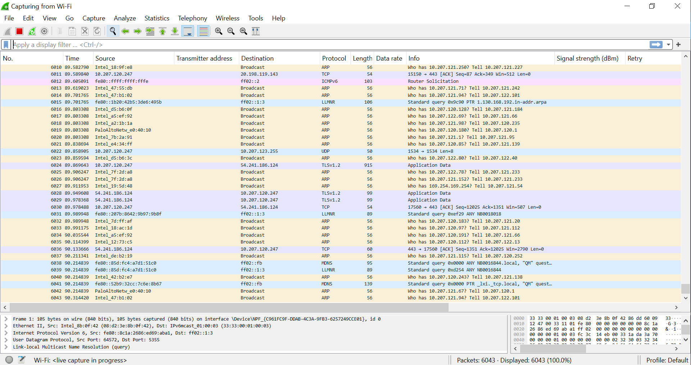

# Wi-Fi - mDNS 


## Purpose/Scope

This application demonstrates the procedure for bringing up the mDNS in SiWx91x.
In this application, the SiWx91x connects to a Wi-Fi access point, obtains an IP address,service gets added to the mDNS and connects to iPerf client, running on a remote PC and measures UDP Rx from remote PC.

## Prerequisites/Setup Requirements

### Hardware Requirements

- Windows PC
- Wireless Access Point
- Linux PC for viewing the mDNS service using avahi
- **SoC Mode**:
  - Standalone
    - BRD4002A Wireless pro kit mainboard [SI-MB4002A]
    - Radio Boards 
  	  - BRD4338A [SiWx917-RB4338A]
      - BRD4339B [SiWx917-RB4339B]
  	  - BRD4340A [SiWx917-RB4340A]
      - BRD4342A [SiWx917-RB4342A]
  - Kit
  	- SiWx917 Pro Kit [Si917-PK6031A](https://www.silabs.com/development-tools/wireless/wi-fi/siwx917-pro-kit?tab=overview)
  	
  	


### Software Requirements

- Simplicity Studio IDE (to be used with Silicon Labs MCU)
- [iPerf Application](https://iperf.fr/iperf-download.php)
- [Wireshark ](https://www.wireshark.org/download.html)
- Serial Terminal - [Docklight](https://docklight.de/)/[Tera Term](https://ttssh2.osdn.jp/index.html.en) (to be used with Keil IDE)

### Setup Diagram

  

## Getting Started


### Instructions for Simplicity Studio IDE and Silicon Labs device (SoC Mode)

Refer to the instructions [here](https://docs.silabs.com/wiseconnect/latest/wiseconnect-getting-started/) to:

- Install Studio and WiSeConnect 3 extension 
- Connect your device to the computer
- Upgrade your connectivity firmware
- Create a Studio project

For details on the project folder structure, see the [WiSeConnect Examples](https://docs.silabs.com/wiseconnect/latest/wiseconnect-examples/#example-folder-structure) page.

- Download the project iot-pa-wifi-mDNS from the GitHub link
- Keep the project in the Release folder at location: SDK/examples/snippets/wlan
- Open templates.xml file located at SDK/wifi_templates.xml and add the code snippet at the end, before </model:MDescriptors>:

 

 ```c
 <descriptors name="mDNS_soc" label="Wi-Fi mDNS (SoC)" description="This application demonstrates the procedure for bringing up the mDNS in SiWx91x">
    <properties key="namespace" value="template.uc"/>
    <properties key="keywords" value="universal\ configurator"/>
    <properties key="projectFilePaths" value="examples/snippets/wlan/mDNS/mDNS_soc.slcp"/>
    <properties key="boardCompatibility" value="com.silabs.board.none brd2605a brd4338a brd4342a brd4340a brd4343a brd4343b brd4339b brd4340b"/>
    <properties key="partCompatibility" value=" .*si917.* .*siwg917m111mgtba.* .*siwg917m141xgtba.* .*siwg917y111mgab.* .*siwg917y111mgnb.* .*siwg917m121xgtba.* .*siwg917m111xgtba.* .*siwg917m100mgtba.* .*siwg917m110lgtba.*"/>
    <properties key="ideCompatibility" value="makefile-ide simplicity-ide visual-studio-code generic-template"/>
    <properties key="toolchainCompatibility" value="gcc"/>
    <properties key="quality" value="production"/>
    <properties key="category" value="Example|Wi-Fi"/>
    <properties key="stockConfigCompatibility" value="com.silabs.ss.framework.project.toolchain.core.default"/>
    <properties key="sdkAndProtocolTags" value=""/>
    <properties key="readmeFiles" value="examples/snippets/wlan/mDNS/readme.md"/>
	<properties key="filters" value="Device\ Type|SoC Wireless\ Technology|Wi-Fi Project\ Difficulty|Beginner"/>
  </descriptors>
  ```

 - Refresh the Simplicity SDK or add the SDK again

 

 - Connect the SiWx917 SoC kit and create the project.

 


## Application Build Environment

The application can be configured to suit user requirements and development environment. Read through the following sections and make any changes needed.

### Configure sl_net_default_values.h

**File path for Simplicity Studio IDE:**
- In the Project Explorer pane, expand the **config** folder and open the **sl_net_default_values.h** file. 


Configure the following parameters to enable your Silicon Labs Wi-Fi device to connect to your Wi-Fi network

- STA instance related parameters

  - DEFAULT_WIFI_CLIENT_PROFILE_SSID refers to the name with which Wi-Fi network that shall be advertised and Si91X module is connected to it.

    ```c
    #define DEFAULT_WIFI_CLIENT_PROFILE_SSID         "YOUR_AP_SSID"      
    ```

  - DEFAULT_WIFI_CLIENT_CREDENTIAL refers to the secret key if the Access point is configured in WPA-PSK/WPA2-PSK security modes.

      ```c
      #define DEFAULT_WIFI_CLIENT_CREDENTIAL           "YOUR_AP_PASSPHRASE" 
      ```

  - DEFAULT_WIFI_CLIENT_SECURITY_TYPE refers to the security type of the Access point. The supported security modes are mentioned in `sl_wifi_security_t`.

    ```c   
      #define DEFAULT_WIFI_CLIENT_SECURITY_TYPE         "SL_WIFI_WPA2"
    ```

- Other STA instance configurations can be modified if required in `default_wifi_client_profile` configuration structure.

### Configure app.c file

- Configure the Device port

  ```c
    #define DEVICE_PORT        5005
  ```  

- Configure the following parameters in app.c to add the mDNS service as per the requirements. 

  

- #define MDNS_HOST_NAME for configuring the hostname. 

**Note:** The mdns hostname should end with dot. 

For example: If the hostname is test then it should be entered as test. in the app.c file.
- #define MDNS_SERVICE_MESSAGE for entering the text message. 

- #define MDNS_SERVICE_PORT for configuring the port. 

- #define MDNS_SERVICE_TTL for configuring the time to live (in seconds).


## Test the application

### Instructions for Simplicity Studio IDE and Silicon Labs devices (SoC Mode)

Refer to the instructions [here](https://docs.silabs.com/wiseconnect/latest/wiseconnect-getting-started/) to:

- Build the application.
- Flash, run and debug the application.

**Note:** The mDNS with IPV6 is not supported.


### To Run Server


#### UDP Rx Throughput

To measure UDP Rx throughput, configure the SiWx91x as a UDP server and start a UDP client on the remote PC.
The iPerf command to start the UDP client is:

  > `C:\> iperf.exe -c <Module_IP> -u -p <LISTENING_PORT> -i 1 -b <Bandwidth> -t <time interval in seconds>`
  >
  > For example ...
  >
  > `C:\> iperf.exe -c 192.168.0.100 -u -p 5001 -i 1 -b 50M -t 30` 

   

  


#### To view the mDNS service (Using Wireshark)

- Open the wireshark and run the application. 

- Enter the filter as mdns and search for the mDNS packets. Added service will be displayed in the captures.

**Note:** To run the wireshark, make sure the wireless sniffer is plugged into the Linux machine/PC. If there is unavailability of the sniffer, connect to the same network which has internet connectivity and open the wireshark in the windows PC.

- Please make sure the Wi-Fi is turned ON and double-click on the Wi-Fi as shown in the below snapshot.


- After the Wi-Fi is selected a new window opens up as shown in the below snapshot.



- Apply the mdns filter in the search bar of the Wireshark.


- All the mdns packets will be filtered on the screen/display.
- To filter out our device's mdns packet select the packet that has our Module's IP address. Here in this case module's IP address is 10.10.0.226.

   Click on the packet that has the module's IP address. 


- Expand the selected packet as shown in the below snapshot and the configured hostname and message can be seen in the packet.


 
 #### To view the mDNS service (Using Avahi on Linux PC/Machine)

 - Install the avahi on the Linux PC by passing the below command on the terminal

  ```c
   sudo apt-get install avahi-daemon
  ```


 - On the Linux machine run "avahi-browse _http._tcp -r"


or
 
avahi-browse -a -r

- To kill the service on the Linux PC, send the below command
  
  avahi-daemon --kill

**Note:** The Linux PC should be connected to the same network before passing the avahi command. 


 