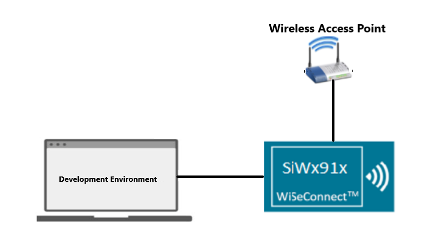
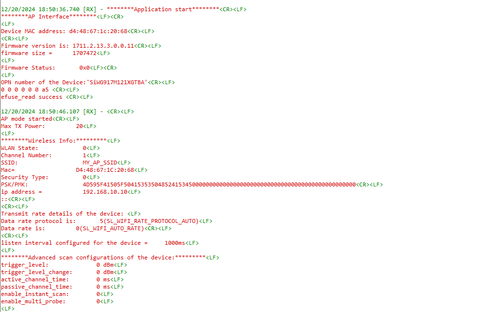

# SiWG917 Query commands Application

## Table of Contents

- [Purpose/Scope](#purposescope)
- [Prerequisites/Setup Requirements](#prerequisitessetup-requirements)
  - [Hardware Requirements](#hardware-requirements)
  - [Software Requirements](#software-requirements)
  - [Setup Diagram](#setup-diagram)
- [Getting Started](#getting-started)
- [Instructions for Simplicity Studio IDE and Silicon Labs devices (SoC Mode)](#instructions-for-simplicity-studio-ide-and-silicon-labs-devices-soc-mode)
- [Application Build Environment](#application-build-environment)
  - [Configure sl\_net\_default\_values.h](#configure-sl_net_default_valuesh)
- [Test the application](#test-the-application)  
- [Application Prints:](#application-prints)

## Purpose/Scope

This application demonstrates the implementation of the APIs of WLAN, Common, Network Manager, and si91x device management, which are used to retrieve data for both AP and STA modes.

## Prerequisites/Setup Requirements

### Hardware Requirements

- Windows PC
- Wireless Access Point with Internet.
- **SoC Mode**:
  - Standalone
      - BRD4002A Wireless pro kit mainboard [SI-MB4002A](https://www.silabs.com/development-tools/wireless/wireless-pro-kit-mainboard?tab=overview)
  - Radio Boards
      - BRD4338A [SiWx917-RB4338A](https://www.silabs.com/development-tools/wireless/wi-fi/siwx917-rb4338a-wifi-6-bluetooth-le-soc-radio-board.html)

  - Kits
      - SiWx917 Pro Kit [Si917-PK6031A](https://www.silabs.com/development-tools/wireless/wi-fi/siwx917-pro-kit?tab=overview)
      - SiWx917 Pro Kit [Si917-PK6032A]

### Software Requirements

- Simplicity Studio IDE Version- SiSDK-2024.12.0.
- WSDK version- 3.4.0.
- Serial Terminal - [Docklight](https://docklight.de/) (optional)

### Setup Diagram

  

 Diagram description:

1. The development environment refers to Simplicity Studio IDE on Windows PC.
2. After flashing the application onto the SiWG917 module, the device will initially start in Access Point (AP) mode. During this phase, several APIs will run to gather data, including the firmware version, size, and transmission power. Once this information is collected, the AP mode will be de-initialized, and the device will restart in Station (STA) mode, connecting to a Wireless Access Point (AP). During this process, additional APIs will execute to retrieve the same data, such as the firmware version, size, and transmission power, among others.

Note: Here the application will demonstrate about the different query commands for Wi-Fi in both STA and AP mode. Please refer to the [API reference guide](https://docs.silabs.com/wiseconnect/latest/wiseconnect-api-reference-guide-summary/).

## Getting Started

### Instructions for Simplicity Studio IDE and Silicon Labs devices (SoC mode)

Refer to the instructions [here](https://docs.silabs.com/wiseconnect/latest/wiseconnect-developers-guide-developing-for-silabs-hosts/) to:

- [Install Simplicity Studio](https://docs.silabs.com/wiseconnect/latest/wiseconnect-developers-guide-developing-for-silabs-hosts/#install-simplicity-studio)
- [Install WiSeConnect 3 extension](https://docs.silabs.com/wiseconnect/latest/wiseconnect-developers-guide-developing-for-silabs-hosts/#install-the-wi-se-connect-3-extension)
- [Connect your device to the computer](https://docs.silabs.com/wiseconnect/latest/wiseconnect-developers-guide-developing-for-silabs-hosts/#connect-si-wx91x-to-computer)
- [Upgrade your connectivity firmware](https://docs.silabs.com/wiseconnect/latest/wiseconnect-developers-guide-developing-for-silabs-hosts/#update-si-wx91x-connectivity-firmware)

For details on the project folder structure, see the [WiSeConnect Examples](https://docs.silabs.com/wiseconnect/latest/wiseconnect-examples/#example-folder-structure) page.

## Application Build Environment

The application can be configured to suit user requirements and development environment. Read through the following sections and make any changes needed.

### Configure sl_net_default_values.h

**File path for Simplicity Studio IDE:**

- The application uses the default configurations as provided in the default_wifi_ap_profile in sl_net_default_values.h file. Users can choose to configure these parameters as needed.

- In the Project Explorer pane, expand the config folder and open the sl_net_default_values.h file. Configure the following parameters as you desired to enable the Silicon Labs Wi-Fi device as an access point.

- AP instance related parameters :

  - DEFAULT_WIFI_AP_PROFILE_SSID refers to the SSID of the WiSeConnect soft AP that will be created.

     ```c
      #define DEFAULT_WIFI_AP_PROFILE_SSID                   "MY_AP_SSID"    
     ```

  - DEFAULT_WIFI_AP_CREDENTIAL refers to the secret key of the WiSeConnect soft AP that will be created.

      ```c
      #define DEFAULT_WIFI_AP_CREDENTIAL                      "MY_AP_PASSPHRASE"
      ```

  - Other AP instance configurations can be modified if required in default_wifi_ap_profile configuration structure.

Configure the following parameters to enable your Silicon Labs Wi-Fi device to connect to your Wi-Fi network

- STA instance related parameters

  - DEFAULT_WIFI_CLIENT_PROFILE_SSID refers to the name with which Wi-Fi network that shall be advertised and Si91X module is connected to it.

    ```c
    #define DEFAULT_WIFI_CLIENT_PROFILE_SSID               "YOUR_AP_SSID"      
    ```

  - DEFAULT_WIFI_CLIENT_CREDENTIAL refers to the secret key if the Access point is configured in WPA-PSK/WPA2-PSK security modes.

      ```c
      #define DEFAULT_WIFI_CLIENT_CREDENTIAL                 "YOUR_AP_PASSPHRASE" 
      ```

  - DEFAULT_WIFI_CLIENT_SECURITY_TYPE refers to the security type of the Access point. The supported security modes are mentioned in `sl_wifi_security_t`.

      ```c
      #define DEFAULT_WIFI_CLIENT_SECURITY_TYPE               SL_WIFI_WPA2
      ```

- Other STA instance configurations can be modified if required in `default_wifi_client_profile` configuration structure.

> Note:
> User can configure default region specific regulatory information using `sl_wifi_region_db_config.h`

## Test the application

Refer to the instructions [here](https://docs.silabs.com/wiseconnect/latest/wiseconnect-developers-guide-developing-for-silabs-hosts/) to:

- [Build the application](https://docs.silabs.com/wiseconnect/latest/wiseconnect-developers-guide-developing-for-silabs-hosts/#build-an-application).
- [Flash, run and debug the application](https://docs.silabs.com/wiseconnect/latest/wiseconnect-developers-guide-developing-for-silabs-hosts/#flash-an-application).
  
## Application Prints

To view the application prints on the console, refer [here](https://docs.silabs.com/wiseconnect/latest/wiseconnect-developers-guide-developing-for-silabs-hosts/#console-input-and-output).


