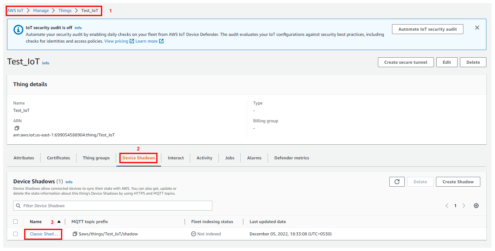
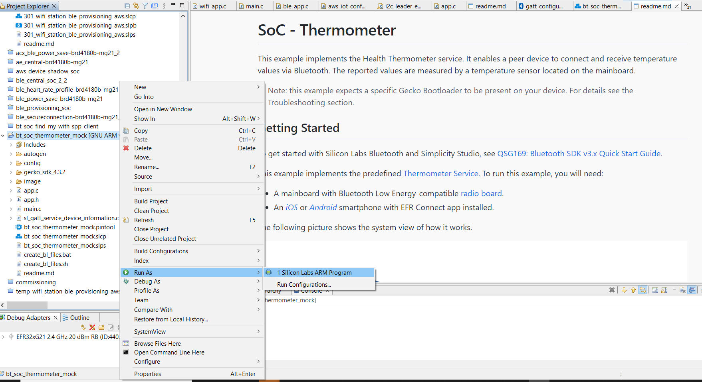

# **AWS Cloud Connectivity through Wi-Fi and BLE Gateway (SoC)**

## Table of Contents
<!-- TOC -->

- [Introduction](#1-introduction)
- [Prerequisites](#2-prerequisites)
  - [Hardware Requirements](#21-hardware-requirements)
  - [Software Requirements](#22-software-requirements)
- [Setup Diagram](#3-setup-diagram)
- [Project Creation](#4-project-creation)
  - [SiWx917 Project](#41-siwx917-project)
  - [EFR32xG21 Project](#42-efr32xg21-project)
- [Application Configuration](#5-application-configuration)
  - [Setting up the Security Certificates](#51-setting-up-the-security-certificates)
  - [Setting up AWS parameters](#52-setting-up-aws-parameters)
  - [Setting up Power Save Mode](#53-setting-up-power-save-mode)
- [Testing the Application](#6-testing-the-application)
  - [Build the Application](#61-build-the-application)
  - [Wi-Fi Provisioning over BLE](#62-wi-fi-provisioning-over-ble)
  - [SiWx91x Connection with EFR32xG21 over BLE](#63-siwx91x-connection-with-efr32xg21-over-ble)
  - [MQTT Connection](#64-mqtt-connection)
  - [Power Save Mode](#65-power-save-mode)
- [Troubleshooting](#7-troubleshooting)
- [Appendix](#8-appendix)
  - [Overview of AWS SDK](#overview-of-aws-sdk)
  - [Create an AWS Thing](#create-an-aws-thing)
  - [Steps to create a policy from AWS console](#steps-to-create-a-policy-from-aws-console)

<!-- /TOC -->

## **1. Introduction**

The application demonstrates SiWx917 functionality in a multiprotocol environment where it successfully maintains multiple BLE and Wi-Fi connections in addition to communicating with AWS Cloud. It also showcases SiWx917's Power Save capabilities in addition to its Co-existence effectiveness.

The application initiates with SiWx917 performing BLE advertisement (peripheral role) and retrieving Access Point details through Wi-Fi Provisioning over BLE. Subsequently, the SiWx917 module is configured in the station role and it joins the Access Point using the credentials obtained from Provisioning. It then performs BLE scanning (central role) to establish a connection with EFR32xG21 (sensor) and uses MQTT to transmit the data collected (temperature) to AWS Cloud. Additionally, the SiWx91x is configured into associated power save mode. The device will continue to publish data unless it disconnects from the access point.

## **2. Prerequisites**

The user must configure the following items before launching the application.

### 2.1 Hardware Requirements

- Silicon Labs SiWx917 PK6031A SoC Kit which includes:
  - BRD4002A Wireless Starter Kit Mainboard
  - BRD4338A Radio Board
- SLWSTK6006A EFR32xG21 Wireless Gecko Starter Kit which includes:
  - BRD4002A Wireless pro kit mainboard
  - BRD4180B/BRD4181B Radio Board
- Wi-Fi Access point with internet access
- A smart phone with Silicon labs **EFR Connect** app
- Windows/Mac PC

### 2.2 Software Requirements

- SiWx917_WiSeConnect_SDK [link](https://github.com/SiliconLabs/wiseconnect)
- Simplicity Studio IDE
  - To download and install the Simplicity Studio IDE, refer to the [Simplicity Studio IDE Set up](https://docs.silabs.com/) section in ***Getting started with SiWx91x*** guides.
- EFR Connect application for [Android](https://play.google.com/store/apps/details?id=com.siliconlabs.bledemo&hl=en&gl=US) or [iOS](https://apps.apple.com/us/app/efr-connect-ble-mobile-app/id1030932759)
- Docklight or Tera Term or a similar tool for reading serial prints
- AWS account (MQTT Client)

## **3. Setup Diagram**

### **3.1 Setup Diagram**


- Follow the "Hardware connections and Simplicity Studio IDE Set up" section in the respective [Getting Started with SiWx91x](https://docs.silabs.com/wiseconnect/3.0.9/wiseconnect-getting-started/getting-started-with-soc-mode) guides to make the hardware connections and add the Gecko and SiWx91x COMBO SDKs to the Simplicity Studio IDE.

- This example requires the SiWx91x device to be provisioned on AWS for which you will need the device certificate and the private key. For brief provisioning instructions, see [AWS IoT Setup](#create-an-aws-thing) section.

- Ensure the SiWx91x module is loaded with the latest firmware following the [SiWx91x Firmware Update](https://docs.silabs.com/wiseconnect/3.0.9/wiseconnect-getting-started/getting-started-with-soc-mode) section in the respective Getting started with SiWx91x*** guides.

## **4. Project Creation**

### 4.1 SiWx917 Project

- Refer to the instructions [here](https://docs.silabs.com/wiseconnect/latest/wiseconnect-getting-started/) to:

  - Install Studio and WiSeConnect 3 extension
  - Connect your device to the computer
  - Upgrade your connectivity firmware
  - Create a Studio project
- Download the project **iot-pa-coex-aws_cloud_connectivity_through_wifi_and_ble_gateway_soc** from this [link](https://github.com/SiliconLabs/wifi_combo_applications/tree/master/SiWx917/wlan_ble/iot-pa-coex-aws_cloud_connectivity_through_wifi_and_ble_gateway_soc)
- Keep the project in the Release folder at location: `SDK/examples/snippets/wlan_ble/`
- Open **templates.xml** file located at `SDK/templates.xml` and add the code snippet at the end, before `</model:MDescriptors>`:

   ```sh
  <descriptors name="iot-pa-coex-aws_cloud_connectivity_through_wifi_and_ble_gateway_soc" label="AWS Cloud Connectivity through Wi-Fi and BLE Gateway (SoC)" description="The application demonstrates SiWx917 functionality in a multiprotocol environment where it successfully maintains multiple BLE and Wi-Fi connections in addition to communicating with AWS Cloud. It also showcases SiWx917's Power Save capabilities in addition to its Co-existence effectiveness.">
    <properties key="namespace" value="template.uc"/>
    <properties key="keywords" value="universal\ configurator"/>
    <properties key="projectFilePaths" value="examples/snippets/wlan_ble/iot-pa-coex-aws_cloud_connectivity_through_wifi_and_ble_gateway_soc/aws_cloud_connectivity_through_wifi_and_ble_gateway_soc.slcp"/>
    <properties key="boardCompatibility" value="com.silabs.board.none brd4325a brd4325b brd4325c brd4325e brd4325f brd4325g brd4338a brd4339a brd4339b brd4340a brd4340b brd4341a brd4342a"/>
    <properties key="partCompatibility" value="mcu.arm.efr32.mg21.* mcu.arm.efr32.mg21.*  mcu.arm.efr32.mg24.* .*si917.* .*si917.* .*siwg917m111mgtba.* .*siwg917m111mgtba.* .*siwg917m141xgtba.* .*siwg917m111mgtba.* .*siwg917m111mgtba.* .*siwg917m111mgtba.* .*siwg917y111mgab.* .*siwg917y111mgnb.*"/>
    <properties key="ideCompatibility" value="makefile-ide simplicity-ide visual-studio-code generic-template"/>
    <properties key="toolchainCompatibility" value="gcc"/>
    <properties key="quality" value="production"/>
    <properties key="category" value="Example|Wi-Fi"/>
    <properties key="stockConfigCompatibility" value="com.silabs.ss.framework.project.toolchain.core.default"/>
    <properties key="sdkAndProtocolTags" value=""/>
    <properties key="readmeFiles" value="examples/snippets/wlan_ble/iot-pa-coex-aws_cloud_connectivity_through_wifi_and_ble_gateway_soc/readme.md"/>
	<properties key="filters" value="Device\ Type|SoC Wireless\ Technology|Wi-Fi Wireless\ Technology|Bluetooth Project\ Difficulty|Intermediate"/>
  </descriptors>
   ```

- Refresh the Gecko SDK.

   

- Connect the SiWx917 kit and create the project.

   

### 4.2 EFR32xG21 Project

- To create the sensor node with EFR32xG21, connect your EFR32xG21 development kit to the computer and run the default Demo "Bluetooth - SoC Thermometer" as shown below:

   

## **5. Application Configuration**

The following parameters are to be configured as per the requirements.

### **5.1 Setting up the Security Certificates**

- To authenticate and securely connect with AWS, Wi-Fi device requires a unique x.509 security certificate/device certificate and private key, as well as a CA certificate which is used to verify the AWS server. Security credentials need to be converted into a C-array rather than [PEM format](https://en.wikipedia.org/wiki/Privacy-Enhanced_Mail) provided by the AWS. The certificates should also be loaded on to the SiWx91x module.
- The SiWx91x SDK provides a conversion script (written in Python 3) to make the conversion straightforward. The script is provided in the SDK 'resources' directory and is called `certificate_to_array.py`.
- The certificates downloaded as mentioned in [AWS IoT Setup](#create-an-aws-thing) section must be converted to C arrays which can be done as followa:
  - Open a system command prompt and use the script as indicated in the following examples.

      ```sh
      $> python3 certificate_to_array.py <input filename> <output arrayname>

      For example:
      $> python3 certificate_to_array.py d8f3a44d3f.pem.crt  aws_client_certificate.pem
      $> python3 certificate_to_array.py d8f3a44d3f.pem.key  aws_client_private_key.pem
      ```

  - After running the script on the certificate and private key, two new files would be generated with the following names:

      ```sh
         aws_client_certificate.pem.crt.h
         aws_client_private_key.pem.key.h
       ```

  - Copy both of the new files to the SiWx91x SDK directory: **SiWx91x SDK → resources → certificates**  
  - Overwrite the existing files with the same name in that directory, the originals are not needed.

**NOTE**:
The Root CA certificate used by the SiWx91x module to verify the AWS server is already included in the SiWx91x SDK, no additional setup is required.
For reference, Amazon uses [Starfield Technologies](https://www.starfieldtech.com/) to secure the AWS website, the SiWx91x SDK includes the **Starfield CA Certificate**.

### **5.2 Setting up AWS parameters**

- Open the **aws_iot_config.h** file. Configure the following parameters.

   ```c
   //! Device Shadow URL
   #define AWS_IOT_MQTT_HOST             "xxxxxxxxxxxxx-ats.iot.us-east-2.amazonaws.com"
   ```

   AWS_IOT_MQTT_HOST parameter can be found as follows:

   

   

```c
//! The Client ID uniquely identifies the MQTT connection with the AWS IoT
#define AWS_IOT_MQTT_CLIENT_ID           "FAE"

//! The thing name which is used to register the SiWx91x module on AWS IoT         
#define AWS_IOT_MY_THING_NAME            "AWS_Si917_EFR"  
```

**NOTE:** AWS_IOT_MQTT_CLIENT_ID and AWS_IOT_MY_THING_NAME have to be updated as per the name of the **Thing** created.

- Open the **rsi_wlan_app.c** file. Configure the following parameters to the same Device shadow URL as used above. The Room temperature is published to MQTT Topic EFRtemp. This can be changed if required.

   ```c
   #define AWS_DOMAIN_NAME "a2m21kovu9tcsh-ats.iot.us-east-2.amazonaws.com"
   ```

- The Room temperature is published to MQTT Topic EFRtemp. The topic name for this can be changed in the same file if required.

   ```c
   #define MQTT_TOPIC2 "EFRtemp"
   ```

- If any AWS Topic is to be subscribed, update the following Topic:

   ```c
   #define MQTT_TOPIC1 "Temperature"
   ```

- Update the following with your AWS credentials.

   ```c
   // user name for login credentials
   #define MQTT_USERNAME             "username"

   // password for login credentials
   #define MQTT_PASSWORD             "password"
   ```

- Update **PUBLISH_PERIODICITY** to modify the AWS Publish time periodicity (1000 ms default).

   ```c
   #define PUBLISH_PERIODICITY       1000
   ```

### **5.3 Setting up Power Save Mode**

- To configure SiWx917 in ASSOCIATED_POWER_SAVE mode, set **ENABLE_POWER_SAVE** to 1.

   ```c
   #define ENABLE_POWER_SAVE         1
   ```

- The default sleep priodicity is 2000ms which can be modified using the **#define SLEEP_PERIODICITY** macro.

   ```c
   #define SLEEP_PERIODICITY         2000
   ```

## **6. Testing the Application**

This section outlines the application's step-by-step execution process.

### 6.1 Build the Application

- After creating the project, either right-click on it and choose "Build Project" or click the build icon (a hammer) to begin building the project.

   

### 6.2 Wi-Fi Provisioning over BLE

1. Configure the Access point in OPEN/WPA-PSK/WPA2-PSK mode to connect the SiWx91x in STA mode.

2. Connect any serial console for prints (e.g. **Docklight**).

3. Run the SiWx91x example. Initially the module enters into BLE advertising mode.

   

4. Launch the EFR Connect App. If BLE is not enabled, enable it.

   

5. Switch to Demo Section and  Select **Wi-Fi Commissioning** from the list of available options as shown below:

   

6. Select **BLE_CONFIGURATOR** from the list of available Bluetooth Device options:

   
  
7. Subsequently, the SiWx91x module will initiate in Station mode and search for nearby Access Points. The WLAN scan results will be fetched to the EFR Connect App.

   

8. Select the desired AP and enter the password (if any).

   

9. The password will be sent to the RS9116 NCP module. If correct credentials are provided, the module will be connected to the selected AP. The **EFR Connect** Application will be updated with a green symbol highlighted across the selected AP.

10. This concludes the Wi-Fi Provisioning over BLE using the EFR Connect app (Provisioning Tool). Once connected to AP, SiWx91x immediately disconnects the BLE connection with the EFR Conect app.

### 6.3 SiWx91x Connection with EFR32xG21 over BLE

1. Run the **Bluetooth - SoC Thermometer** example as explained [above](#42-efr32xg21-project). The project can also be imported from [Bluetooth - SoC Thermometer (Mock)](https://github.com/SiliconLabs/gecko_sdk/tree/1228a95262ee099a21c6be4d35224479c8e4dde2/app/bluetooth/example/bt_soc_thermometer) and run as shown below.

   

2. This enables EFR32xG21 to enter into BLE advertising state.

3. Once the Provisioning is over, the SiWx91x module enters into BLE Scanning state.

   

4. The SiWx91x module then connects to the EFR32xG21 module and collects the data (temperature) over BLE.

### 6.4 MQTT Connection

1. The SiWx91x module initiates an MQTT connection with AWS Cloud once it successfully connects to the EFR32xG21 module.

   

2. Following the establishment of the MQTT connection, the device subscribes to the specified Topic (MQTT_TOPIC1) and awaits the arrival of cloud data. If the module receives data from the subscribed topic, it prints the data in the console, else it publishes the temperature sensor reading to the MQTT client on the specified Topic (MQTT_TOPIC2). The AWS dashboard will be updated with the temperature data as shown below:

   

### 6.5 Power Save Mode

- If **ENABLE_POWER_SAVE** is defined, then SiWx917 will enter into the Power Save mode and the data will be published on the AWS dashboard based on SLEEP_PERIODICITY. The power save mode is enabled once the AWS Connection is established.

   

## **7. Troubleshooting**

- Avoid having multiple wiseconnects in the same workspace. This may cause issue even after clean builds.
- It is important to add the required policy while creating the thing. If your policy does not allow updating any data periodically, you may see AWS connection error in the logs.
- Ensure the SiWx917 module has 1.8 MB MBR flashed in it.

## **8. Appendix**

### **Overview of AWS SDK**

- AWS IoT Core is a cloud platform that connects devices across AWS cloud services. AWS IoT Core provides an interface that allows devices to communicate securely and reliably in bi-directional ways to AWS touch-points, even when devices are offline.

- The AWS SDK allow applications to securely connect to the AWS IoT platform.

### **Create an AWS Thing**

Create a thing in the AWS IoT registry to represent your IoT Device.

- In the [AWS IoT console](https://console.aws.amazon.com/iot/home), in the navigation pane, under Manage, choose All devices, and then choose Things.

   

- If a **You don't have any things yet** dialog box is displayed, choose **Register a thing**. Otherwise, choose **Create**.
- Click on **Create things**.

   

- On the **Create things** page, choose **Create a single thing** and click next.

   

- On the **Specify thing properties** page, enter a name for your IoT thing (for example, **Test_IoT**), and choose **Unnamed shadow (classic)** in the Device Shadow section, then choose **Next**. You can't change the name of a thing after you create it. To change a thing's name, you must create a new thing, give it the new name, and then delete the old thing.

   

- During **Configure device certificate** step, choose **Auto-generate a new certificate (recommended)** option and click next.

   

- In **Attach Policies to Certificate - optional** page, click on  **Create thing** button.

   

- Choose the **Download** links to download the device certificate, private key, and root CA certificate. Root CA certificate is already present in SDK (aws_starfield_ca.pem.h), and can be directly used.

- Recommended: To Download these files in *SDK*\resources\certificates path.

  > **Warning:** This is the only instance you can download your device certificate and private key. Make sure to save them safely.

   

- To attach an existing policy choose the policy and click on create thing, if policy is not yet created Choose Create policy and fill the fields as mentioned in the following images.

  - Choosing an existing policy

      

  - Creating a policy - step 1

      

  - Creating a policy - step 2 (filling the fields)
   Give the **Name** to your Policy, Fill **Action** and **Resource ARN** as shown in below image, Click on **Allow** under **Effect** and click **Create**

      

- Choose the created policy and click on **Create thing**

- The created thing should now be visible on the AWS console (Manage > All devices > Things)

### **Steps to create a policy from AWS console**

- Navigate to **AWS IoT console**

- Choose **Policies** under **Secure**

   

- Click on **Create**

   

- Give the **Name** to your Policy, Fill **Action** and **Resource ARN** as shown in below image, Click on **Allow** under **Effect** and click **Create**

   
  
### **About AWS Device Shadow**

- AWS refer to a 'Device Shadow' as a persistent, virtual representation of a device that can be accessed even if the physical device is offline.
The device state is captured in its 'shadow' and is represented as a JSON document.
- The physical device can send commands using the MQTT protocol to get, update, and delete the state of the shadow as well as receive notifications via MQTT about changes in the state of the shadow.

The AWS IoT Device Shadow application publishes the room temperature on the topic `$aws/things/thingname/shadow/update`.

Additionally, the application subscribes to the shadow update topics:

```sh
  $aws/things/thingName/shadow/name/shadowName/update/accepted
  $aws/things/thingName/shadow/name/shadowName/update/rejected
  $aws/things/thingName/shadow/name/shadowName/update/delta
```
