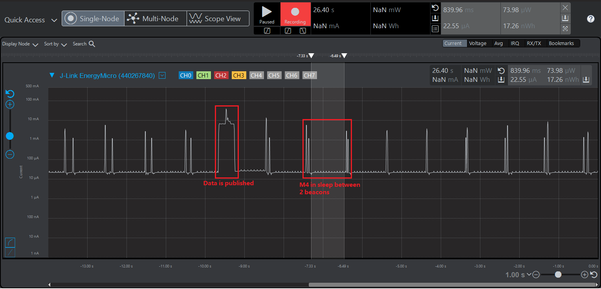

# Wi-Fi Coex - WiFi AWS IoT MQTT M4 Lowpower

## Table of Contents

- [Purpose / Scope](#purpose--scope)
- [Prerequisites / Setup Requirements](#prerequisites--setup-requirements)
  - [Hardware Requirements](#hardware-requirements)
  - [Software Requirements](#software-requirements)
  - [Setup Diagram](#setup-diagram)
- [Getting Started](#getting-started)
- [Application Configuration Parameters](#application-configuration-parameters)
- [Test the Application](#test-the-application)
  - [MQTT Connection](#mqtt-connection)
- [Observing the output prints on serial terminal](#observing-the-output-prints-on-serial-terminal)
- [Additional Information](#additional-information)
  - [Current Measurement using Simplicity Studio Energy Profiler](#current-measurement-using-simplicity-studio-energy-profiler)
  - [Create an AWS Thing](#create-an-aws-thing)
  - [Steps to create a policy from AWS console](#steps-to-create-a-policy-from-aws-console)
- [Troubleshooting Steps](#troubleshooting-steps)

## Purpose / Scope

This example demonstrates how to configure/connects SiWx91x to get the WiFi connection functionality using BLE provisioning. In this application, SiWx91x starts advertising in BLE mode and Access Point details are fetched using BLE Provisioning.

The SiWx91x module is configured  as a station, which associates to an access point and then communicates with an AWS server using MQTT. Si917 interacts with the on-board Si7021 sensor to fetch real-time temperature values via I2C interface, and publishes to the cloud until the device is disconnected from the access point. After publish, the NWP processor is set in to associated power save.  Next, the application works differently in NCP and SoC modes as defined below.  

**Soc Mode**:

The M4 processor is set in sleep mode. The M4 processor can be woken in several ways as mentioned below:

- ALARM timer-based - In this method, an ALARM timer is run that wakes the M4 processor up periodically every **ALARM_PERIODIC_TIME** time period.
  - We can enable the ALARM timer-wakeup by adding the preprocessor macro "SL_SI91X_MCU_ALARM_BASED_WAKEUP" for the example.
  - In the Project explorer pane, expand as follows wiseconnect3_sdk_xxx > components > device > silabs > si91x > mcu > drivers > peripheral_drivers > src folder and open sl_si91x_m4_ps.c file. Configure **ALARM_PERIODIC_TIME**, in seconds, in sl_si91x_m4_ps.c
- Button press-based (GPIO) - In this method, the M4 processor wakes up upon pressing a button (BTN0).
  - We can enable the Button press-based wakeup by adding the preprocessor macro "SL_SI91X_MCU_BUTTON_BASED_WAKEUP" for the example.
- Wireless-message-based - When an RX packet is to be received by the TA from remote, the M4 processor is woken up.
  - We can enable the Wireless-message-based wakeup by adding the preprocessor macro "SL_SI91X_MCU_WIRELESS_BASED_WAKEUP" for the example.

After M4 processor wakes up via any of the above processes, the application publishes temperature data fetched from Si7021 on **PUBLISH_ON_TOPIC** topic.

*NOTE*: The bold texts are the macros defined in the application. You can find more details about them in the upcoming section.

**Overview of AWS SDK**

AWS IoT Core is a cloud platform which connects devices across AWS cloud services. AWS IoT provides a interface which allows the devices to communicate securely and reliably in bi-directional ways to the AWS touch-points, even when the devices are offline.

The AWS IoT Device SDK allow applications to securely connect to the AWS IoT platform.

## Prerequisites / Setup Requirements

### Hardware Requirements

- Windows PC.
- SiWx91x Wi-Fi Evaluation Kit.
- **SoC Mode**:
  - Standalone
    - BRD4002A Wireless pro kit mainboard [SI-MB4002A]
    - Radio Boards 
     - BRD4338A [SiWx917-RB4338A]
     - BRD4340A [SiWx917-RB4340A]
  - Kits
   - SiWx917 Pro Kit [Si917-PK6031A](https://www.silabs.com/development-tools/wireless/wi-fi/siwx917-pro-kit?tab=overview)
   - SiWx917 Pro Kit [Si917-PK6032A]

- Wireless Access point
- Android Phone or iPhone with **EFR Connect** App, which is available in Play Store and App Store (or) Windows PC with windows Silicon labs connect application.
- Windows/Linux/Mac PC with AWS Smart Lock GUI

### Software Requirements

- Simplicity Studio
- AWS Console GUI provided by Silicon Labs (in pre-work guide)

### Setup Diagram

  

## Getting Started

Refer to the instructions [here](https://docs.silabs.com/wiseconnect/latest/wiseconnect-getting-started/) to:

- Install Studio and WiSeConnect 3 extension
- Connect your device to the computer
- Upgrade your connectivity firmware
- Import the project following the below steps:
  - Download the project (.sls file) from the link provided in the pre-work guide
  - Go to Files -> Import

  

  - Browse the path of the project -> Click on .sls project -> Click Next

  

  - Click next in Build Configurations of the project

  

  - Check the project name and click on finish

  

## Application Configuration Parameters

The application can be configured to suit your requirements and development environment. Read through the following sections and make any changes needed.

  Open `wifi_app.c` file and update/modify following macros

- `SUBSCRIBE_TO_TOPIC` refers to the topic to which the device subscribes.
- `PUBLISH_ON_TOPIC` refers to the topic to which the device publishes.

```c
#define SUBSCRIBE_TO_TOPIC         "wireless_message"
#define PUBLISH_ON_TOPIC           "temperature_status"
```

  The below parameters are only applicable for SoC with power save enabled.

```c
#define ENABLE_POWER_SAVE         1                 //! Enable this macro to run application with power save enabled. By default it is enabled.
#define SL_SI91X_MCU_ALARM_BASED_WAKEUP  1                 //! Enable this macro for M4 processor to wake up based on alarm time period
#define SL_SI91X_MCU_BUTTON_BASED_WAKEUP       1                 //! Enable this macro for M4 processor to wake up when button (BTN0) is pressed
#define ALARM_PERIODIC_TIME       30                //! periodic alarm configuration in seconds
```

  The below parameters are only applicable for SoC with power save disabled.

```c
#define PUBLISH_PERIODICITY       (30000)          // Configure this macro to publish data every 30 seconds.
```

  Open `aws_iot_config.h` file under config folder in project explorer pane and configure the below mentioned macros if needed. Further information on these are given in the Additional information section.

 ```c
   //AWS Host name 
   #define AWS_IOT_MQTT_HOST          "a25jwtlmds8eip-ats.iot.us-east-2.amazonaws.com"  

   //default port for MQTT
   #define AWS_IOT_MQTT_PORT          "8883"
   
   #define AWS_IOT_MQTT_CLIENT_ID     "silicon_labs_thing"
   
   // Thing Name of the Shadow this device is associated with 
   #define AWS_IOT_MY_THING_NAME      "silicon_labs_thing"    
```

To Load Certificate

Place the certificate files in `<SDK>/resources/certificates/` path and include the certificate files in wifi_app.c

   ```c
   Replace the default Device certificate and Private key certificate include in the application with the converted pem file name.

   // Certificate includes
   #include "aws_client_certificate.pem.crt.h"
   #include "aws_client_private_key.pem.key.h"

   Replace the default Device certificate and Private key certificate given in `sl_net_set_credential()` API in the application with the converted pem array.

   // Load Security Certificates
   status = sl_net_set_credential(SL_NET_TLS_SERVER_CREDENTIAL_ID(0), SL_NET_CERTIFICATE, aws_client_certificate, (sizeof(aws_client_certificate) - 1));
  
   status = sl_net_set_credential(SL_NET_TLS_SERVER_CREDENTIAL_ID(0), SL_NET_PRIVATE_KEY, aws_client_private_key, (sizeof(aws_client_private_key) - 1));
   ```

## Test the Application

Refer to the instructions [here](https://docs.silabs.com/wiseconnect/latest/wiseconnect-getting-started/) to:

- Build the application.
- Flash, run and debug the application

Follow the steps below for successful execution of the application:

1. Configure the Access point in WPA-PSK/WPA2-PSK mode to connect the SiWx91x in STA mode.

2. Connect any serial console for prints.

3. When SiWx91x EVK enters BLE advertising mode, launch the **EFR Connect** App.

4. Click on Demo and select Wifi-Commissioning tile.

   

5. It will scan for the module, and it appears in the list. For example, **BLE_CONFIGURATOR** on the UI, select this.

   
  
6. Now, SiWx91x module will start as a station and scan for the access points (AP) nearby.

7. Once the list of AP scan results is displayed on the screen, you can select the SSID of the AP to which you want to connect.

   

8. Click on the SSID of the AP, enter password if the AP is in security mode. Click on Connect to associate with the access point.

   

9. Once Silicon labs module is connected to the access point, you can notice on the GUI as below.

   

10. This completes the BLE provisioning using Android application, next step is the MQTT communication.

11. To disconnect from Access Point, click on connected AP and click on YES.

   

### AWS Console GUI

**Note:** Ensure the PC is not connected to office network.

1. Click on the downloaded executable file to run the GUI.
2. Click on connect to establish AWS conectivity.
3. Enter the topic name you want to publish to and enter the message to publish in the Publish Window -> click on Publish.
4. Enter the topic name you want to subscribe to in the Subscribe Window to receive the messages published on that topic from any client -> click on Subscribe.

Here is the snapshot of the console,


### MQTT Connection

1. Once MQTT connection completed , device subscribed to specific Topic and waits for data from the AWS Cloud.
   If any data received through AWS cloud from subscribed clients, then module publishes temperature sensor reading to MQTT client.

2. You can use any MQTT client and connect to the AWS cloud, for subscribe and publishing messages.

## Observing the output prints on serial terminal  

- In this instance, the SiWx91x has established a secure connection with the AWS Cloud, subscribed to *wireless_message* topic, and published a message "Hi from SiWx91x" on *temperature_status* topic.
- The NWP processor is then set into associated power save mode.
- Subsequently, the M4 processor is set in to power save.
- Later, the application performs publish through any of the three procedures described below:

  *case 1*: When an incoming publish is received
  - Suppose, the message has been published by a remote test MQTT Client from GUI on *wireless_message* topic. Upon reception of incoming publish, the NWP processor triggers M4 processor to wake up. The application then reads the received data, triggers a publish on *temperature_status* topic, and sets M4 processor back to sleep.

  *case 2*: When **BTN0** is pressed on WPK
  - The button press triggers M4 processor to wake from sleep. The application then performs a publish on *temperature_status* topic, and sets M4 processor back to sleep.

  *case 3*: When ALARM-timer elapses
  - By default, the ALARM-timer periodicity is 30 seconds (**ALARM_PERIODIC_TIME**). During every iteration, the ALARM triggers M4 processor to wake from sleep. The application then performs a publish on *temperature_status* topic, and sets M4 processor back to sleep.


**Application notes**:

Currently, only QoS0 based publishes are supported.

### Additional Information

### Current Measurement using Simplicity Studio Energy Profiler
  
- After flashing the application code to the module. Energy profiler can be used for current consumption measurements.

- From tools, choose Energy Profiler and click "OK"

  

- From Quick Access, choose Start Energy Capture option

  

- In the dialogue box popped up, select the module & click ok.
  

- Here is a snapshot of power measure when M4 is in sleep

  

### Create an AWS Thing

 **Thing Note**: By default we are giving ThingName: silicon_labs_thing, these related configuration we set default If you want your own thing name you can follow the below procedure.

Create a thing in the AWS IoT registry to represent your IoT device.

- In the [AWS IoT console](https://console.aws.amazon.com/iot/home), in the navigation pane, under Manage, choose All devices, and then choose Things.

  

- If a **You don't have any things yet** dialog box is displayed, choose **Register a thing**. Otherwise, choose **Create**.
- Click on **Create things**.

  

- On the **Create things** page, choose **Create a single thing** and click next.

  

- On the **Specify thing properties** page, enter a name for your IoT thing (for example, **Test_IoT**), and choose **Unnamed shadow (classic)** in the Device Shadow section, then choose **Next**. You can't change the name of a thing after you create it. To change a thing's name, you must create a new thing, give it the new name, and then delete the old thing.

  

- During **Configure device certificate** step, choose **Auto-generate a new certificate (recommended)** option and click next.

  

- Choose the **Download** links to download the device certificate, private key, and root CA certificate. Root CA certificate is already present in SDK (aws_starfield_ca.pem.h), and can be directly used.
  > **Warning:** This is the only instance you can download your device certificate and private key. Make sure to save them safely.

  

- To attach an existing policy choose the policy and click on create thing, if policy is not yet created Choose Create policy and fill the fields as mentioned in the following images.

- Choosing an existing policy

  

- Creating a policy - step 1

  

- Creating a policy - step 2 (filling the fields)
  Give the **Name** to your Policy, Fill **Action** and **Resource ARN** as shown in below image, Click on **Allow** under **Effect** and click **Create**.
  

- Choose the created policy and click on **Create thing**.

- The created thing should now be visible on the AWS console (Manage > All devices > Things).

### Steps to create a policy from AWS console

- Navigate to **AWS IoT console**.
- Choose **Policies** under **Secure**.

  

- Click on **Create**.

  

- Give the **Name** to your Policy, Fill **Action** and **Resource ARN** as shown in below image, Click on **Allow** under **Effect** and click **Create**.

  

- **AWS_IOT_MQTT_HOST** parameter can be found as follows:

  

  

**Steps to use MQTT Test Client to publish and subscribe for messages**

- Navigate to **AWS IoT console**
- Under Test section -> click on MQTT test client

  

- To publish a message: Go to 'Publish to a topic' tab -> enter the topic name to publish to -> enter the message -> click on publish

  

- To subscribe: Go to 'Subscribe to a topic' tab -> enter the topic name to suscribe to -> click on subscribe

  

### Troubleshooting Steps

- Steps to follow after flashing a M4 power save application.
  - Press the reset button along with ISP switch for a second and release the reset button followed by ISP switch button.
  - Do chip erase from the Simplicity Commander.