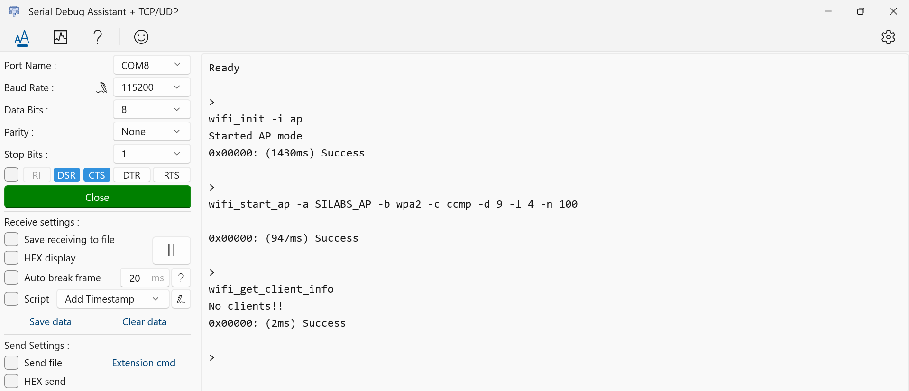
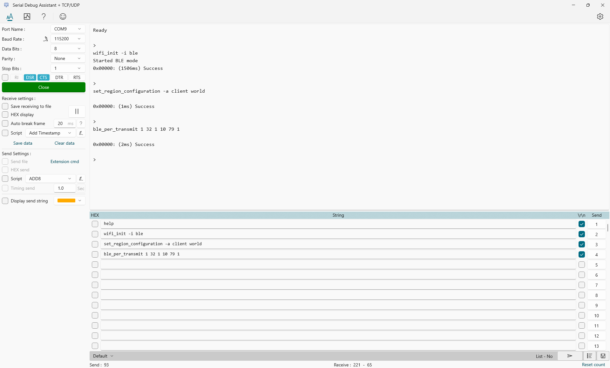
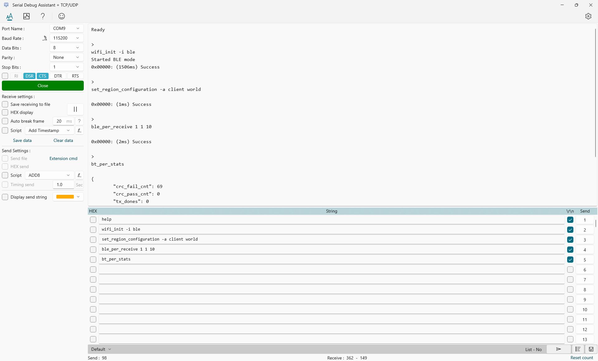
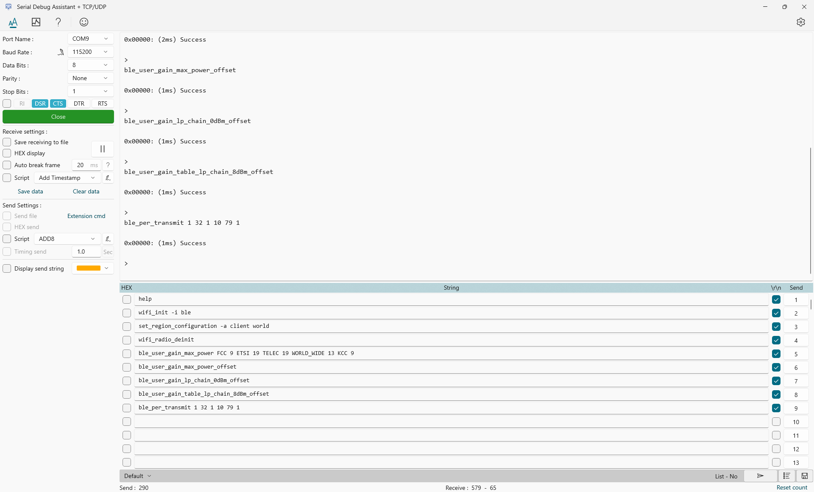
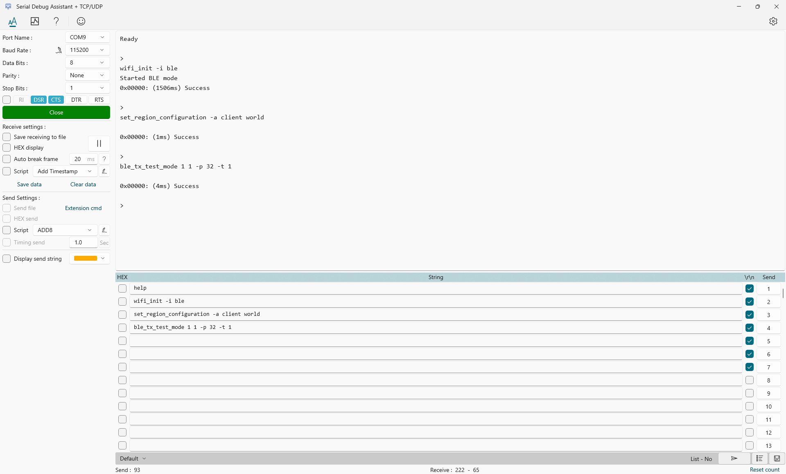
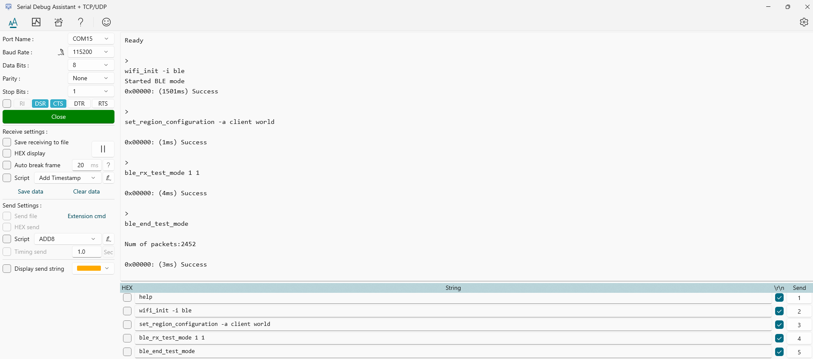
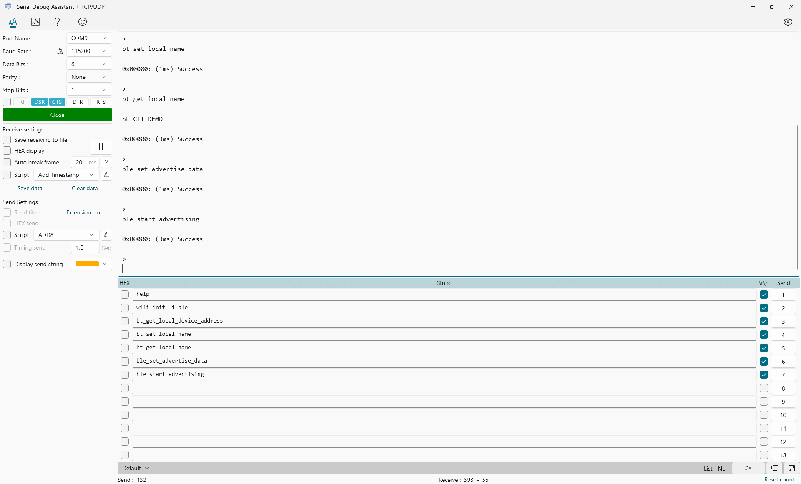
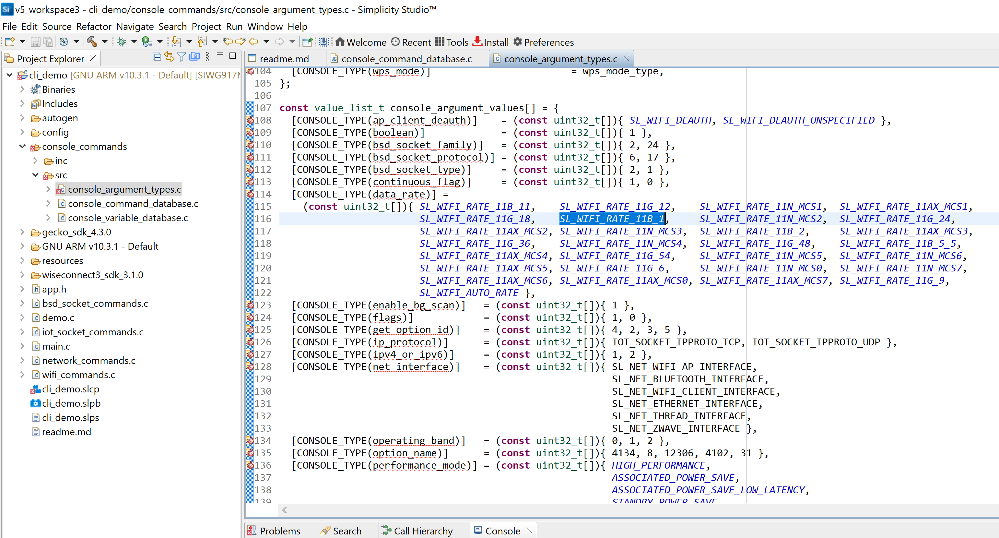
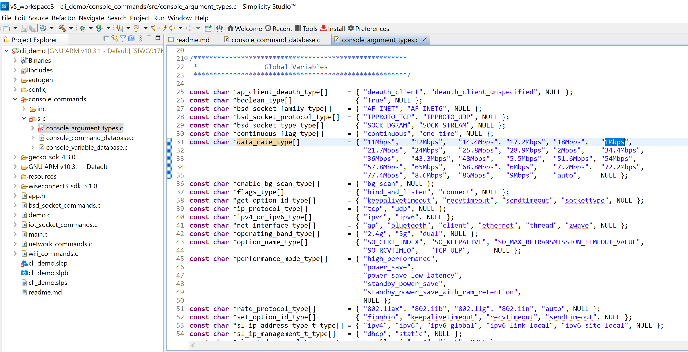

# Cli Demo

## Table of Contents

- [Purpose/Scope](#purposescope) 
- [Prerequisites/Setup Requirements](#prerequisitessetup-requirements)
  - [Hardware Requirements](#hardware-requirements)
  - [Software Requirements](#software-requirements)
  - [Setup Diagram](#setup-diagram)
- [Getting Started](#getting-started)
- [Application Build Environment](#application-build-environment)
- [Test the Application](#test-the-application)

## Purpose/Scope

The CLI Demo application is a command-line interface (CLI) application designed to showcase various functionalities and capabilities of SiWx91x in different scenarios and configuration modes. It serves as a quick reference guide and a hands-on demonstration of SiWx91x core features for developers and users.

## Prerequisites/Setup Requirements

### Hardware Requirements

- A Windows PC.
- Spectrum Analyzer for WLAN RF measurement (PER_Tx). 
- Signal Generator for WLAN RF measurement (PER_Rx).
- 802.11 ax/b/g/n Access point.
- A Micro-coaxial connector plug to SMA-female cable (RF connector) for connecting the U.Fl port of the Si917 radio board to the Spectrum Analyzer or Signal Generator.
- **SoC Mode**:
  - Standalone
    - BRD4002A Wireless pro kit mainboard [SI-MB4002A]
    - Radio Boards 
  	  - BRD4338A [SiWx917-RB4338A]
  	  - BRD4340A [SiWx917-RB4340A]
  - Kits
  	- SiWx917 Pro Kit [Si917-PK6031A](https://www.silabs.com/development-tools/wireless/wi-fi/siwx917-pro-kit?tab=overview)
  	- SiWx917 Pro Kit [Si917-PK6032A]
  	
- **NCP Mode**:
  - Standalone
    - BRD4002A Wireless pro kit mainboard [SI-MB4002A]
    - EFR32xG24 Wireless 2.4 GHz +10 dBm Radio Board [xG24-RB4186C](https://www.silabs.com/development-tools/wireless/xg24-rb4186c-efr32xg24-wireless-gecko-radio-board?tab=overview)
    - NCP EFR Expansion Kit with NCP Radio board (BRD4346A + BRD8045A) [SiWx917-EB4346A]
  - Kits
  	- EFR32xG24 Pro Kit +10 dBm [xG24-PK6009A](https://www.silabs.com/development-tools/wireless/efr32xg24-pro-kit-10-dbm?tab=overview)  

### Software Requirements

- Simplicity Studio
- A Serial terminal software such as [Serial Debug Assistant](https://apps.microsoft.com/detail/9NBLGGH43HDM?rtc=1&hl=en-in&gl=in)

Note : The user can use the Simplicity studio’s console window for sending and receiving the CLI command.

### Setup Diagram

- The figure below shows the setup and the connections for the WLAN RF testing.


- The figure below shows the setup and the connections for SiWG917 in Station mode.


## Getting Started

Refer to the instructions [here](https://docs.silabs.com/wiseconnect/latest/wiseconnect-getting-started/) to:

- Install Studio and WiSeConnect 3 extension
- Connect your device to the computer
- Upgrade your connectivity firmware
- Create a Studio project

## Application Build Environment

The application can be configured to suit your requirements and development environment.

- The application uses the default configurations as provided in the **wifi_commands.c** and user can choose to configure these parameters as needed.
  
  User can enable or disable powersave related optimizations by setting the ENABLE_POWERSAVE_CLI macro in the **wifi_commands.c** file to 1 or 0 respectively

## Test the application

Refer to the instructions [here](https://docs.silabs.com/wiseconnect/latest/wiseconnect-getting-started/) to:

- Build the application in Studio.
- Flash, run and debug the application


Follow the steps below for successful execution of the application:

- The terminal screen displays a lot of commands which can be added manually in Extension command in Serial debug assistant.

## **Common commands**
1. set_region_configuration
2. wifi_radio_deinit
3. reset

**Syntax:**
```perl
set_region_configuration [-a operating_mode] <region>
```

|Parameter       |Description                                                                                |
|----------------|-------------------------------------------------------------------------------------------|
|*Operating_mode*        |Optional, (ap, apsta, ble_coex, client, client_ipv6, eap, transmit_test, ble) |
|*region*        |us → United states, eu → Europen Union, jp → Japan, world →  World wide domain, kr → Korean, sg → Singapore(not currently supported) |

### **wifi_radio_deinit:**
Deinitlize the Wi-Fi radio

**Syntax:**
```perl
wifi_radio_deinit
```

### **reset:**
Reset the device


## **set_region_configuration:**
Set a particular region

 **Here are List of those commands:**

1. help
2. wifi_init
3. wifi_init -i client
4. wifi_init -i ap
5. wifi_init -i apsta
6. wifi_scan
7. wifi_scan -s **ssid** -i client_5g
8. wifi_scan -s **ssid** -i ap
9. wifi_scan -s **ssid** -i client
10. wifi_scan -s **ssid** -i ap_5g
11. wifi_connect  **ssid** -p **password** -s **security mode**
12. wifi_deinit
13. wifi_disconnect -i client
14. wifi_get_client_info
15. wifi_get_fw_version
16. wifi_get_mac_address -i 1
17. wifi_set_performance_profile high_performance
18. wifi_set_performance_profile power_save
19. wifi_set_performance_profile power_save_low_latency
20. wifi_set_performance_profile ultra_power_save
21. wifi_get_statistics
22. wifi_get_performance_profile
23. sl_net_host_get_by_name **url** -t **time_in_milliseconds** -i **ipv4/ipv6**
24. wifi_iot_socket_create -i 1 -j 2 -k 2
25. wifi_iot_socket_connect -i 0 -j **server_ip** -k 4 -l **server_port**
26. wifi_iot_socket_bind -i 0 -j **local_ip** -k 4 -l **local_port**
27. wifi_iot_socket_receive_from -i 0
28. wifi_iot_socket_create -i 1 -j -k 1
29. wifi_iot_socket_listen -i 0 -j 1
30. wifi_iot_socket_accept -i 0
31. wifi_iot_socket_send -i 0 -d **data_to be sent**
32. start_dhcp
33. set_region_configuration -a **client** **jp**

    And so on...

### Below are the examples of the commands on how to enter those commands in the Serial Debug Assistant

- **help COMMAND:-** 
 ****

- After issuing the **help** command in serial Debug assistant it will display all the commands of the CLI demo on the Serial Debug screen as shown in the below image.
****


### **Below are the Commands to run the RF test example.**

- **Transmit Test Commands for Wi-Fi**


1. wifi_init -i **mode** for initializing the WiFi interface and for selecting the mode.

    e.g., wifi_init -i transmit_test

2. wifi_set_antenna -i client -a **antenna type** is used for selecting the antenna.

    e.g., wifi_set_antenna -i client -a 0
By default antenna type should be set to 0.

3. wifi_transmit_test_start **power** **data rate** **length** **mode** **channel**

    e.g., wifi_transmit_test_start 127 0 100 1 1.

- For Wi-Fi 6 or 802.11ax mode RF test, issue the below command. 
4. wifi_ax_transmit_test_start **power** **data rate** **length** **mode** **channel** **aggr.enable** **enable_11ax** **coding_type** **nominal_pe** **ul_dl** **he_ppdu_type** **beam_change** **bw** **stbc** **tx_bf** **gi_ltf** **dcm** **nsts_midamble** **spatial_reuse** **bss_color** **he_siga2_reserved** **ru_allocation** **n_heltf_tot** **sigb_dcm** **sigb_mcs** **user_sta_id** **user_idx** **sigb_compression_field**

    e.g., wifi_ax_transmit_test_start 127 263 1500 0 1 1 1 0 2 1 0 0 0 0 0 0 0 0 0 0 0 192 1 0 0 0 0 0

  **power**: Set transmit power in dbm. Valid values are from 2dBm to 21dBm.

  **data rate**: Set transmit data rate

The values for the data rates can be obtained from the **sl_wifi_constants.h** file available in the SDK. 

**length**: Configure length of the transmit packet. Valid values are in the range:

[24 ... 1500] bytes in burst mode

[24 ... 260] bytes in continuous mode

**mode**: Transmit mode
****

**Note**:

**Burst Mode**
DUT transmits a burst of packets with the given power, rate, length in the channel configured. The burst size will be 
determined by the **length** parameter, if it the **length** parameter is zero, then DUT keeps transmitting till 
stop API is called.

**Continuous Mode**:
The DUT transmits an unmodulated waveform continuously. 

**Continuous Wave Mode (Non-Modulation) in DC Mode**:
The DUT transmits a spectrum only at the center frequency of the channel. A basic signal with no modulation is that of a sine 
wave and is usually referred to as a continuous wave (CW) signal. A basic signal source produces sine waves. Ideally, the 
sine wave is perfect. In the frequency domain, it is viewed as a single line at some specified frequency.

**Continuous Wave Mode (Non-Modulation) in Single Tone Mode (Center frequency -2.5 MHz)**:
The DUT transmits a spectrum that is generated at -2.5 MHz from the center frequency of the channel selected. Some amount 
of carrier leakage will be seen at Center Frequency.
For example, for 2412 MHz the output will be seen at 2409.5 MHz.

**Continuous Wave Mode (Non-Modulation) in Single Tone Mode (Center frequency +5 MHz)**:
The DUT transmits a spectrum that is generated at 5MHz from the center frequency of the channel selected. Some amount of 
carrier leakage will be seen at Center Frequency.
For example, for 2412 MHz the output will be seen at 2417 MHz. 

>**Note**
>
>1. Before starting CW mode, it is required to start Continuous mode with >power and channel values which is intended to be used 
>in CW mode as follows:
>
>    a. Start Continuous mode with intended power value and channel value; >pass any valid values for rate and length.
>
>    b. Stop Continuous mode.
>
>    c. Start CW mode.
>
>2. To switch CW mode, stop PER mode and then give CW mode.
>
>3. Generally, it is recommended to measure the TX power with “Burst mode” >or “Continuous mode” only. "Continuous wave 
>mode" for TX power measurement is not recommended. "Continuous wave mode" >can be used for certification purposes and 
>to measure the frequency error. 
>
>    **channel**: Set the Channel number.

- The wifi 6 parameter descriptions are mentioned in the sl_si91x_protocol_types.h file of the SDK.
>
>5. **wifi_transmit_test_stop** is used for stopping the Transmit test.

**Note**: The current CLI supports input parameters upto 30 parameters, if the user wants to increase the inputs parameters then it can configured in the settings of the CLI application --> preprocessor --> SL_SI91X_CLI_CONSOLE_MAX_ARG_COUNT=30
****


**Receive test Commands**

**NOTE**:
    Receive stats testing should be done in a controlled environment (RF shield box or chamber).
****
****

**Receive Test Commands for the CLI**:

1. wifi_init -i **mode** for initializing the WiFi interface and for selecting the mode.

    e.g., wifi_init -i transmit_test

2. wifi_set_antenna -i client -a **antenna type** is used for selecting the antenna.

    e.g., wifi_set_antenna -i client -a 0
By default antenna type should be set to 0.

3. wifi_start_statistic_report -i client -c **channel** -n **stats_count** is used to receive the packet statistics once per second in that selected channel.

    e.g., wifi_start_statistic_report -i client -c 1 -n 30
  
   To observe the receive stats for 'n' iterations (e.g. 20), the command can be given as follows:   
    e.g., wifi_start_statistic_report -i client -c 1 -n 20


**Below are the CLI commands for the SiWG917 for station mode in Power save:-**

- Below are the commands for station mode:-
****

- Below are the commands for the SiWG917 in power save mode:-
****
**Note:** In the CLI power save mode, only TA will be in power save mode. 

1. wifi_init -i **mode** for initializing the WiFi interface and for selecting the mode.

   e.g., wifi_init -i client

2. wifi_scan -s **SSID** or wifi_scan for scanning an Access point with the SSID mentioned in the command.
Or
scan all the Access points available in the vicinity respectively.  

   e.g., wifi_scan -s **SILABS** or wifi_scan


   
3. wifi_connect **SSID** -p **PASSWORD** for connecting/joining to the configured Access Point.

   e.g., wifi_connect SILABS -p 12345678

4. start_dhcp [-i {ipv4|ipv6|ipv6_global|ipv6_link_local
|ipv6_site_local}] [-m  {dhcp|static}] for DHCP - getting the IP address of the SiWG917

   e.g., start_dhcp -i ipv4 -m dhcp

5. wifi_set_performance_profile { high_performance | power_save | power_save_low_latency| standby_power_save |standby_power_save_with_ram_retention }

   e.g., wifi_set_performance_profile power_save

**high_performance** - Power save is disabled, 
and throughput is maximum.

**power_save** - Power save mode when SiWG917 is associated 
with an access point. It is associated power save.

**standby_power_save** - The SiWG917 is not associated with an access point, RAM is not retained in this mode.

**standby_power_save_with_ram_retention** - The SiWG917 is not associated with an access point, ram is retained in this mode.

**power_save_low_latency** - Power save mode when the SiWG917 is associated with an access point, with higher 
throughput than ASSOCIATED_POWER_SAVE. This is not supported 
for BT/BLE.


**Below are the CLI commands for the SiWG917 in Access point mode:**

- Below are the commands for the SiWG917 in Access point mode:-
****

1. wifi_init -i **mode** for initializing the WiFi interface and for selecting the mode.

   e.g., wifi_init -i ap

2. wifi_start_ap -a **SSID** -b **Security type** -c **encryption type** -d **channel number** -l **maximum clients** -n **beacon interval**
  
    e.g., wifi_start_ap -a SILABS_AP -b wpa2 -c ccmp -d 9 -l 4 -n 100

3. wifi_get_client_info for getting the Mac address and IP address of the clients that is connected to the Access point(SiG917).
  
    e.g., wifi_get_client_info

**Note:- The password can be configured in the wifi_command.c file**

**"#define SOFT_AP_PSK          "123456789"**

**The wifi_start_ap command parameters are described in wifi_command.c file and console_command_database.c file.**


**Below are the CLI commands for the SiWG917 in Concurrent mode:**

- Below are the commands for the SiWG917 in Concurrent mode:-

1. wifi_init -i **mode** for initializing the WiFi interface and for selecting the mode.

   e.g., wifi_init -i apsta

2. wifi_start_ap -a **SSID** -b **Security type** -c **encryption type** -d **channel number** -l **maximum clients** -n **beacon interval**
  
    e.g., wifi_start_ap -a SILABS_AP -b wpa2 -c ccmp -d 9 -l 4 -n 100

3. wifi_scan -s **SSID** or wifi_scan for scanning an Access point with the SSID mentioned in the command.
Or
scan all the Access points available in the vicinity respectively.  

   e.g., wifi_scan -s **SILABS** or wifi_scan

4. wifi_connect **SSID** -p **PASSWORD** for connecting/joining to the configured Access Point.

   e.g., wifi_connect SILABS -p 12345678

5. start_dhcp [-i {ipv4|ipv6|ipv6_global|ipv6_link_local
|ipv6_site_local}] [-m  {dhcp|static}] for DHCP - getting the IP address of the SiWG917

   e.g., start_dhcp -i ipv4 -m dhcp  

**Note: Please make sure that the channel number of the Acess point and the station mode are the same.** 


**Below are the CLI commands for connecting to the Access point / Router and pinging the gateway.**

1. net_init client
2. wifi_scan
3. wifi_connect SILABS_AP -p 12345678  
4. start_dhcp
5. sl_net_ping 8.8.8.8 ipv4 64   or sl_net_ping 192.168.1.1 ipv4 64


## Steps to create a CLI commands based on the application available in the release. 

**For example: If the user wants to create a CLI command for Station ping example.**

  Refer to the flow of the station ping example available in the release/SDK. 

  a. Initilization
  b. scan for the configured access point
  c. connect to the configured access point
  d. ping to the gateway address. 

**Below are the CLI commands for Calibration.**

**Calibration write**
 
 si91x_calibration_write **flags** **gain_offset_low** **gain_offset_mid** **gain_offset_high** -c **xo_ctune** -t **target**

### Steps & Commands to run the calibration example
1. Initialize --->  wifi_init -i transmit_test
2. Antenna command ---> wifi_set_antenna -i client -a 0
3. Transmit test command ---> wifi_transmit_test_start 18 0 100 0 1
4. Si91x_calibration_write command ---> si91x_calibration_write 16 10 0 0 -c 0 -t 1
5. reset the board
6. Issue the initialization command again ---> wifi_init -i transmit_test
7. Antenna command ---> wifi_set_antenna -i client -a 0
8. Transmit test command ---> wifi_transmit_test_start 18 0 100 0 1


 ## **Frequency offset**

### **Commands to run the Frequency offset correction**

 si91x_frequency_offset **frequency_offset_in_khz**


1. wifi_init -i transmit_test
2. wifi_set_antenna -i client -a 0
3. wifi_transmit_test_start 20 0 100 0 6
4. si91x_frequency_offset 70
5. si91x_calibration_write 2 0 0 0 -t 1

**Note**: -t parameter is the target for efuse or flash, 0 represents burn into efuse and 1 represents burn into flash. 

 **Steps/commands to run the calibration example**

 1. Initialize
 2. Antenna command
 3. Transmit test command
 4. Si91x_calibration_write command
 5. reset the board
 6. Issue the initialisation command again
 7. Antenna command
 8. Transmit test command. 

The change in the Transmit power will be observed on the display of the spectrum analyzer. 

Below is the link for the [calibration application note](https://www.silabs.com/documents/public/application-notes/an1436-siwx917-qms-crystal-calibration-application-note.pdf)


**Here are the few examples for the si91x_calibration_write in channel 1, 6 and 11.** 

**For channel 1**

si91x_calibration_write 16 -4 0 0 -c 0 -t 1

The above command will increase the Transmit power to 2 dBm in channel 1. The second parameter (gain offset low) is configured to increase or decrease the Transmit power in the particular channel. The minus sign in the second parameter will increase the Transmit power configured in the command.

**For channel 6**

si91x_calibration_write 32 4 0 0 -c 0 -t 1

The above command will decrease the Transmit power to 2 dBm in channel 6. . 

**For channel 11**

si91x_calibration_write 64 0 0 -2 -c 0 -t 1

The above command will increase the Transmit power to 1 dBm in channel 11.

**Note:** For updating the gain table, The user can configure the gain_table_payload[] of sl_wifi_update_gain_table_command_handler in wifi_command.c file.

**Note:** For changing the UART instance of the CLI_demo example refer to the VCOM section of the software reference manual. 
The changes needs to be done in rsi_debug.c file and RTE_Device_917.h file 


# **CLI Commands for BLE**

**Syntax:**
```perl
reset
```

## **BLE commands**
1. TEST Modes
2. USER Gain Table
3. Advertising Commands

# **TEST MODES:**
1. ble_per_transmit
2. ble_per_receive
3. bt_per_stats
4. ble_tx_test_mode
5. ble_rx_test_mode
6. ble_end_test_mode


### **ble_per_transmit**
Enable/disable BLE PER (transmit test) mode transmission

**Syntax:**
```perl
ble_per_transmit <enable> <pkt_len> <phy_rate> <channel> <tx_power> <transmit_mode> [-a <ant_sel>] [-d <inter_pkt_gap>] [-c <rf_chain>] [-n <num_pkts>] [-p <payload_type>]
```

|Parameter       |Description                                                                                |
|----------------|-------------------------------------------------------------------------------------------|
|*enable*        |Enable/disable BLE per TX, 1 → PER Transmit Enable, 0 → PER Transmit Disable.              |
|*pkt_len*       |Length of the packet to be transmitted.                                                    |
|*phy_rate*      |1 → 1Mbps, 2 → 2 Mbps, 4 → 125 Kbps Coded, 8 → 500 Kbps Coded.                             |
|*channel*       |BLE channel                                                                                |
|*tx_power*      |Power index                                                                                |
|*transmit_mode* |0 → Burst, 1 → Continuous stream, 2 → Continuous Wave (CW)                                 |
|*ant_sel*       |Optional, 2 → ONBOARD_ANT_SEL, 3 → EXT_ANT_SEL (Default)                                   |
|*inter_pkt_gap* |Optional, Number of 1250 us slots to be skipped between two packets (Default 0)            |                               |
|*rf_chain*      |Optional, RF Chain (HP/LP) to be used: 2 → BT_HP_CHAIN (Default), 3 → BT_LP_CHAIN.         |
|*num_pkts*      |Optional, Number of packets to be transmitted, Use 0 (Default) for continuous transmission |
|payload_type    | Optional, Type of payload data sequence, Refer to the "https://docs.silabs.com/wiseconnect/latest/wiseconnect-api-reference-guide-ble/rsi-ble-per-transmit-s#payload-type" |

**Example:**
>```perl
>ble_per_transmit 1 32 1 10 79 1
>```

### **ble_per_receive**

Enable/disable BLE  PER mode reception

**Syntax:**
```perl
ble_per_receive <enable> <phy_rate> <channel> [-a <ant_sel>] [-c <rf_chain>]
```

|Parameter       |Description                                                                                |
|----------------|-------------------------------------------------------------------------------------------|
|*enable*        |Enable/disable BLE per RX, 1 → PER Receive Enable, 0 → PER Receive Disable.              |
|*phy_rate*      |1 → 1Mbps, 2 → 2 Mbps, 4 → 125 Kbps Coded, 8 → 500 Kbps Coded.                             |
|*channel*       |BLE channel                                                                                |
|*ant_sel*       |Optional, 2 → ONBOARD_ANT_SEL, 3 → EXT_ANT_SEL (Default)                                   |
|*rf_chain*      |Optional, RF Chain (HP/LP) to be used: 2 → BT_HP_CHAIN (Default), 3 → BT_LP_CHAIN.         |
>```perl
>ble_per_receive 1 1 10
>```

### **bt_per_stats**
Read BLE transmit & receive statistics

**Syntax:**
```perl
bt_per_stats
```
**Example:**
```perl
bt_per_stats
```

### **ble_tx_test_mode**

Start the TX test mode in controller

**Syntax:**
```perl
ble_tx_test_mode <TX_channel> <TX_PHY> [-p <payload_length>] [-t <payload_type>]
```

|Parameter       |Description                                                                                |
|----------------|-------------------------------------------------------------------------------------------|
|*TX_channel*        |BLE channel  |
|*TX_PHY*      |1 → 1Mbps, 2 → 2 Mbps, 4 → 125 Kbps Coded, 8 → 500 Kbps Coded                       |
|*payload_length*        |Length in bytes of payload data for each packet ( 1 - 251 bytes)  |
|*payload_type*      | Applicable payload types are specified below |

**Note:** Applicable payload types
- 0x00 →  PRBS9 sequence '11111111100000111101...' 
- 0x01 →  Repeated '11110000' 
- 0x02 →  Repeated '10101010' 
- 0x03 →  PRBS15 
- 0x04 →  Repeated '11111111' 
- 0x05 →  Repeated '00000000' 
- 0x06 →  Repeated '00001111' 
- 0x07 →  Repeated '01010101' 

**Example:**
>```perl
>ble_tx_test_mode 1 1 -p 100 -t 0
>```

### **ble_rx_test_mode**

Start the RX test mode in controller

**Syntax:**
```perl
ble_tx_test_mode <RX_channel> <RX_PHY> 
```

|Parameter       |Description                                                                                |
|----------------|-------------------------------------------------------------------------------------------|
|*RX_channel*        |BLE channel  |
|*RX_PHY*      |1 → 1Mbps, 2 → 2 Mbps, 4 → 125 Kbps Coded, 8 → 500 Kbps Coded                       |

**Example:**
>```perl
>ble_rx_test_mode 1 1
>```

### **ble_end_test_mode**

End the RX test mode in controller

**Syntax:**
```perl
ble_end_test_mode
```

**Example:**
>```perl
>ble_end_test_mode
>```

## **USER Gain Table:**
1. ble_user_gain_max_power
2. ble_user_gain_max_power_offset
3. ble_user_gain_lp_chain_0dBm_offset
4. ble_user_gain_table_lp_chain_8dBm_offset

### **ble_user_gain_max_power**

Set the Max power of the user gain table

**Syntax:**
```perl
ble_user_gain_max_power <certification_region> <max_power>
```

|Parameter       |Description                                                                                |
|----------------|-------------------------------------------------------------------------------------------|
|*certification_region*        |FCC → United states, ETSI → Europen Union, TELEC → Japan, WORLD_WIDE →  World wide domain, KCC → Korean|
|*max_power*      |Maximum  power configuration for the specified region                       |

**Example:**
>```perl
>ble_user_gain_max_power FCC 10 ETSI 5 TELEC 14 WORLD_WIDE 20 KCC 12
>```

### **ble_user_gain_max_power_offset**

Set the Max power offsets of the user gain table

**Syntax:**
```perl
ble_user_gain_max_power_offset
```
**Example:**
>```perl
>ble_user_gain_max_power_offset
>```


### **ble_user_gain_lp_chain_0dBm_offset**

Set the Max power offsets of the user gain table for 0dBm in LP chain

**Syntax:**
```perl
ble_user_gain_lp_chain_0dBm_offset
```
**Example:**
>```perl
>ble_user_gain_lp_chain_0dBm_offset
>```

### **ble_user_gain_table_lp_chain_8dBm_offset**

Set the Max power offsets of the user gain table for 8dBm in LP chain

**Syntax:**
```perl
ble_user_gain_table_lp_chain_8dBm_offset
```
**Example:**
>```perl
>ble_user_gain_table_lp_chain_8dBm_offset
>```


## **Commands**
1. bt_set_local_name
2. bt_get_local_device_address
3. bt_get_local_name
4. ble_set_advertise_data
5. ble_start_advertising
6. ble_stop_advertising

### **bt_set_local_name**

Set local name "SL_CLI_DEMO" to the device.

**Syntax:**
```perl
bt_set_local_name
```
**Example:**
>```perl
>bt_set_local_name
>```

### **bt_get_local_device_address**

Get the local device address.

**Syntax:**
```perl
bt_get_local_device_address
```
**Example:**
>```perl
>bt_get_local_device_address
>```

### **bt_get_local_name**

Set the Advertise data.

**Syntax:**
```perl
bt_get_local_name
```
**Example:**
>```perl
>bt_get_local_name
>```

### **ble_set_advertise_data**

Get the local device name.

**Syntax:**
```perl
ble_set_advertise_data
```
**Example:**
>```perl
>ble_set_advertise_data
>```

### **ble_start_advertising**

Start the device advertising

**Syntax:**
```perl
ble_start_advertising
```
**Example:**
>```perl
>ble_start_advertising
>```

### **ble_stop_advertising**

Stop the device advertising

**Syntax:**
```perl
ble_stop_advertising
```
**Example:**
>```perl
>ble_stop_advertising
>```


# Examples

## BLE PER TX

1. Init BLE mode:
>```perl
>wifi_init -i ble
>```

2. Set the region
>```perl
>set_region_configuration -a client world
>```

3. Enable PER mode continuous stream TX with 1 Mbps PHY at channel 10 and max power setting specified by the Gain Table:
>```perl
>ble_per_transmit 1 32 1 10 79 1
>```
>
****

## BLE PER RX

1. Init BLE mode:
>```perl
>wifi_init -i ble
>```

2. Set the region
>```perl
>set_region_configuration -a client world
>```

3. Enable PER RX mode with 1 Mbps PHY at channel 10:
>```perl
>ble_per_receive 1 1 10
>```

4. Read PER statistics:
>```perl
>bt_per_stats
>```
****

## BLE User Gain Table

1. Init BLE mode:
>```perl
>wifi_init -i ble
>```

2. Set the region
>```perl
>set_region_configuration -a client world
>```

3. Disable the Wi-Fi radio
>```perl
>wifi_radio_deinit
>```

4. Max power setting specified by the Gain Table:
>```perl
>ble_user_gain_max_power FCC 9 ETSI 19 TELEC 19 WORLD_WIDE 13 KCC 9
>ble_user_gain_max_power_offset
>ble_user_gain_lp_chain_0dBm_offset
>ble_user_gain_table_lp_chain_8dBm_offset
>```

5. Enable PER mode continuous stream TX with 1 Mbps PHY at channel 10
>```perl
>ble_per_transmit 1 32 1 10 79 1
>```
****

## BLE DTM TX

1. Init BLE mode:
>```perl
>wifi_init -i ble
>```

2. Set the region
>```perl
>set_region_configuration -a client world
>```

3. Enable the DTM TX
>```perl
>ble_tx_test_mode 1 1 -p 32 -t 1 
>```
****

## BLE DTM RX

1. Init BLE mode:
>```perl
>wifi_init -i ble
>```

2. Set the region
>```perl
>set_region_configuration -a client world
>```

3. Enable the DTM RX
>```perl
>ble_rx_test_mode 1 1 
>```

4. End the DTM RX Test
>```perl
>ble_end_test_mode 
>```

****

## BLE device advertising
1. Init BLE mode:
>```perl
>wifi_init -i ble
>```

2. Get device BD address
>```perl
>bt_get_local_device_address 
>```

3. Set the local name of the device
>```perl
>bt_set_local_name
>```

4. Get the local name of the device
>```perl
>bt_get_local_name
>```

5. Set the Advertise data
>```perl
>ble_set_advertise_data
>```

6. Start advertising
>```perl
>ble_start_advertising
>```
****


## Steps to add new commands for cli_demo application

1. First add the ‘key-value’ pair in the *console_command_database* structure in **console_commands/src/console_command_database.c** file as shown below:

   - The ‘key’ is the name of new command to be created, and the value is the structure variable for the command.
****
	
Here the new command is: *cli_demo_new_cmd*
The structure variable for the newly created command is *_cli_demo_new_cmd_command*.

2. The *_cli_demo_new_cmd_command* structure variable should be declared in the **console_commands/src/console_command_database.c** file with the following fields

    ****

**The description of the new command:-**

- The description of the new command is a string which explains briefly about the command.

**The command handler for the new command:-**

- In the above figure, *cli_demo_new_cmd_command_handler* is the command handler which needs to be defined.
- For any new command, we have to declare a function in **console_commands/src/console_command_database.c** file with a specific proptotype as shown below.
*extern sl_status_t cli_demo_new_cmd_command_handler( console_args_t* arguments );*

- The function name can be anything, but the return type and argument must be as shown above.

**The string array for argument description of the command  handler:-**

- In the above figure, *_cli_demo_new_cmd_arg_help* is the string array which needs to be defined.
- We need to define a string array in **console_commands/src/console_command_database.c** file which briefly explains about the arguments in the command handler. The declaration is as shown below.

  ****

We have given the description for all three strings as 0.

**The list of data types of arguments of command handler:-**

- Refering to the *_cli_demo_new_cmd_command* structure variable image, { CONSOLE_OPTIONAL_ARG('s', CONSOLE_ARG_STRING ), CONSOLE_ARG_UINT, CONSOLE_ARG_INT, CONSOLE_ARG_END } }  are the list of datatypes corresponding to the list of arguments.
- The data types CONSOLE_ARG_UINT corresponds to ‘uint’ , CONSOLE_ARG_INT corresponds to ‘int’ and CONSOLE_ARG_STRING corresponds to ‘string’. The list of arguments must end with CONSOLE_ARG_END.
- The arguments can be mandatory or optional. The mandatory arguments are given directly, but optional arguments are given using an expression, CONSOLE_OPTIONAL_ARG(‘character’, datatype) The ‘character’ is an alphabet which is user choice which can be used to give an optional argument in a cli command. The datatype can be anything mentioned above.
- In addition to standard data type arguments like uint, int, string, there can be enums which can also be passed as arguments to a command. The arguments we need to pass in a command depends on what APIs we call in a command handler. 
- For some of the wifi APIs we call inside a command handler, we may need to use the argument values as specified in the *console_argument_values* variable defined in **console_commands/src/console_argument_types.c** file. For passing those values in a cli command, we need to look for the corresponding argument types defined in the same file.
For example:
We may want to pass a data rate as *SL_WIFI_RATE_11B_1* enum value in a cli command, the corresponding uint32 array is mapped to *[CONSOLE_TYPE(data_rate)]*. We need to search for *data_rate_type* string array in the same file as shown below
The sring corresponding to *SL_WIFI_RATE_11B_1* is "1Mbps". So *1Mbps* should be passed as an argument in the cli command.
In the command handler, the arguments passed in the cli command are internally mapped to corresponding enum values and hence can be accessed directly using GET_COMMAND_ARG() or GET_OPTIONAL_COMMAND_ARG().
****
****
****

- So, the overall changes we need to make in  **console_commands/src/console_command_database.c** file is as shown below:
****
- So, the cli command that can be used with the above changes is *cli_demo_new_cmd -s Optional_String 1 2*

3. The command handler should be defined in a relevant file as shown below. The arguments can be accessed directly or by using GET_COMMAND_ARG() or GET_OPTIONAL_COMMAND_ARG() as shown below. 
****
