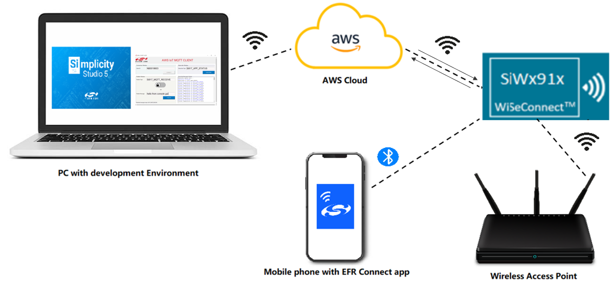
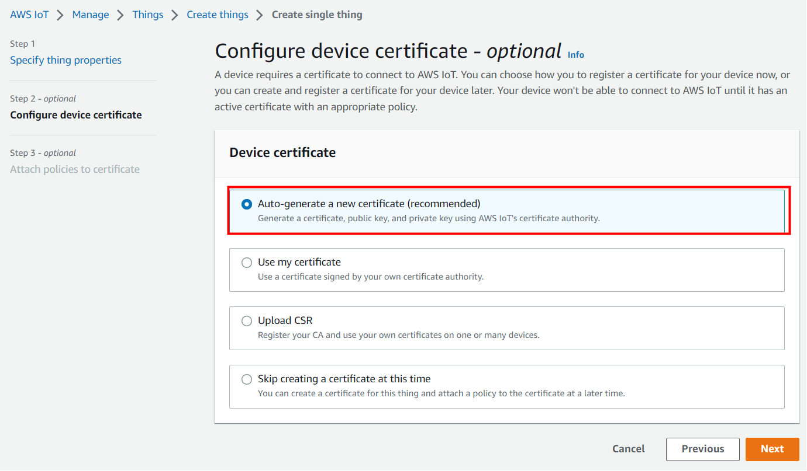
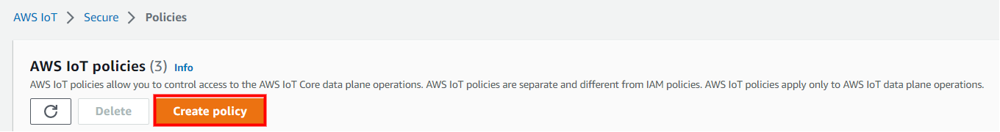
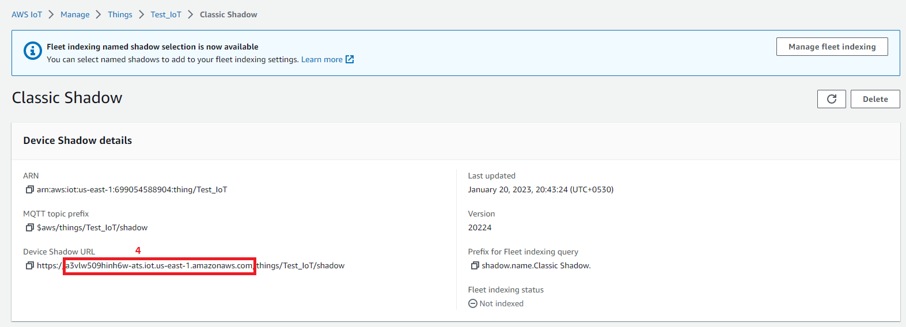

# Out of Box Demo AWS - SiWG917

This application demonstrates the WLAN, BLE, MCU peripheral features and NWP (network processor) powersave capabilities of SiWG917 with a ready to go, minimal software installation experience.

## Table of Contents

- [Purpose/Scope](#purposescope)
- [Prerequisites/Setup Requirements](#prerequisitessetup-requirements)
  - [Hardware Requirements](#hardware-requirements)
  - [Software Requirements](#software-requirements)
  - [Setup Diagram](#setup-diagram)
- [Application Build Environment](#application-build-environment)
- [Getting Started](#getting-started)
  - [Application Configuration Parameters](#application-configuration-paraters)
  - [Run the Application](#run-the-application)
  - [Measuring the current consumption using Simplicity Studio Energy Profiler](#measuring-the-current-consumption-using-simplicity-studio-energy-profiler)
  - [Create an AWS Thing](#create-an-aws-thing)

## Purpose/Scope

SiWG917 establishes WLAN connectivity via BLE provisioning. SiWG917 then proceeds to ping [www.silabs.com](https://www.silabs.com) for 5 times, after which MQTT connectivity with AWS broker is established.
Then Network Processor of SiWG917 enters connected sleep state.
Si917 interacts with the on-board Si7021 sensor to fetch real-time temperature values via I2C interface, and publishes to the cloud on the topic Si917_APP_STATUS until the device is disconnected from the access point. If a message is published onto the topic from a AWS MQTT client (here AWS Console GUI) to which the module is subscribed (Si917_MQTT_RECEIVE), the NWP wakes up and displays the received data and goes back to connected sleep state. The status of application is updated on the TFT-LCD display on the WPK baseboard, the same can be observed on the serial terminal prints as well.

**Overview of AWS SDK**

AWS IoT Core is a cloud platform which connects devices across AWS cloud services. AWS IoT provides a interface which allows the devices to communicate securely and reliably in bi-directional ways to the AWS touch-points, even when the devices are offline.

The AWS IoT Device SDK allow applications to securely connect to the AWS IoT platform.

## Prerequisites/Setup Requirements

- Before running the application, the user will need the following things to setup.

### Hardware Requirements

- Windows PC
- A Wireless Access point with internet connectivity
- **SoC Mode**:
  - Standalone
    - BRD4002A Wireless pro kit mainboard [SI-MB4002A]
    - Radio Boards
      - BRD4338A [SiWx917-RB4338A]
      - BRD4339B [SiWx917-RB4339B]
  - Kits
    - SiWx917 Pro Kit [Si917-PK6031A](https://www.silabs.com/development-tools/wireless/wi-fi/siwx917-pro-kit?tab=overview)
- Android Phone or iPhone with EFR Connect App, which is available in Play Store and App Store (or) Windows PC with windows Silicon labs connect application.

### Software Requirements

- [Simplicity Studio](https://www.silabs.com/developers/simplicity-studio)
- Silicon Labs [EFR Connect App](https://www.silabs.com/developers/efr-connect-mobile-app?tab=downloads), the app can be downloaded from Google Play store/Apple App store.
- AWS Console GUI provided by Silicon Labs (Path: $GSDK\extension\WSDK\examples\snippets\wlan_ble\out_of_box_aws\resources)

### Setup Diagram



## Application build environment

It is highly recommended to set the CLIENT_ID parameter in the wifi_app.c file to a unique string. As the test MQTT server limits multiple devices with same CLIENT ID from connecting at the same time.
In this version of the out of box demo example, the CLIENT_ID parameter is automatically set to a unique value.

## Getting Started

Refer to the instructions [here](https://docs.silabs.com/wiseconnect/latest/wiseconnect-getting-started/) to:

- Install Studio and WiSeConnect 3 extension
- Connect your device to the computer
- Upgrade your connectivity firmware
- Import the project following the below steps:
  - Download the project (.sls file) from GitHub
  - Go to Files -> Import

  

  - Browse the path of the project -> Click on .sls project -> Click Next

  

  - Click next in Build Configurations of the project

  

  - Check the project name and click on finish

  

### Application Configuration Parameters

The application can be configured to suit your requirements and development environment. Read through the following sections and make any changes needed.

  Open `wifi_app.c` file and update/modify following macros

- `SUBSCRIBE_TO_TOPIC` refers to the topic to which the device subscribes.
- `PUBLISH_ON_TOPIC` refers to the topic to which the device publishes.

```c
#define SUBSCRIBE_TO_TOPIC         "Si917_MQTT_RECEIVE"
#define PUBLISH_ON_TOPIC           "Si917_APP_STATUS"
```

  Open `aws_iot_config.h` file under config folder in project explorer pane and configure the below mentioned macros if needed. Further information on these are given in the Additional information section.

 ```c
   //AWS Host name 
   #define AWS_IOT_MQTT_HOST          "a25jwtlmds8eip-ats.iot.us-east-2.amazonaws.com"  

   //default port for MQTT
   #define AWS_IOT_MQTT_PORT          "8883"
   
   #define AWS_IOT_MQTT_CLIENT_ID     "silicon_labs_thing"
   
   // Thing Name of the Shadow this device is associated with 
   #define AWS_IOT_MY_THING_NAME      "silicon_labs_thing"    
```
Project explorer in application build environment,


> - To authenticate and securely connect with AWS, the SiWx917 device requires a unique x.509 security certificate and private key, as well as a CA certificate. At this point, you must be having device certificate, private key and CA certificate which are downloaded during the creation/registration of AWS Thing.

> - By default the certificate and private key that are downloaded from the AWS are in [.pem format](https://en.wikipedia.org/wiki/Privacy-Enhanced_Mail). To load the certificate and private key to the SiWx917, the certificate and private key should be converted into a C-array. For converting the certificates and private key into C-array refer to [Setting up Security Certificates](#setting-up-security-certificates).

> - By default the WiSeConnect 3 SDK contains the Starfield Root CA Certificate in C-array format. 

### Setting up Security Certificates

- The WiSeConnect 3 SDK provides a conversion script (written in Python 3) to make the conversion straightforward. The script is provided in the SDK `<SDK>/resources/scripts` directory and is called [certificate_to_array.py](https://github.com/SiliconLabs/wiseconnect-wifi-bt-sdk/tree/master/resources/certificates/).

- Copy the downloaded device certificate, private key from AWS and also the certificate_to_array.py to the `<SDK>/resources/certificates`.

- To convert the device certificate and private key to C arrays, open a system command prompt in the same path and give the following commands.

  ```sh
  $> python3 certificate_to_array.py <input filename> <output arrayname>

  For example:
  $> python3 certificate_to_array.py d8f3a44d3f.pem.crt aws_device_certificate
  $> python3 certificate_to_array.py d8f3a44d3f.pem.key aws_private_key
  ```

- After running the above commands, two new files shall be created as below:

  ```sh
  aws_device_certificate.crt.h
  aws_private_key.key.h
  ```
- The Starfield Root CA certificate used by your Wi-Fi device to verify the AWS server is already included in the WiSeConnect 3 SDK at `<SDK>/resources/certificates`; no additional setup is required.

**To Load Certificate**

Place the certificate files in `<SDK>/resources/certificates/` path and include the certificate files in wifi_app.c

   ```c
   Replace the default Device certificate and Private key certificate include in the application with the converted pem file name.

   // Certificate includes
   #include "aws_client_certificate.pem.crt.h"
   #include "aws_client_private_key.pem.key.h"

   Replace the default Device certificate and Private key certificate given in `sl_net_set_credential()` API in the application with the converted pem array.

   // Load Security Certificates
   status = sl_net_set_credential(SL_NET_TLS_SERVER_CREDENTIAL_ID(0), SL_NET_CERTIFICATE, aws_client_certificate, (sizeof(aws_client_certificate) - 1));
  
   status = sl_net_set_credential(SL_NET_TLS_SERVER_CREDENTIAL_ID(0), SL_NET_PRIVATE_KEY, aws_client_private_key, (sizeof(aws_client_private_key) - 1));
   ```

### Run the application

- Once the application is flashed, the Wireless interface is initialized.
- After the Wireless initialization, the module starts BLE advertising and advertises itself as "BLE_CONFIGURATOR"
- The status of the application can be observed on the TFT-LCD display on the WPK baseboard.
- Following is the image of LCD display indicating the application status.


- Open the EFR connect app on your mobile phone.


- Go to 'Demo' tab.


- Choose the Wi-Fi commissioning option.


- Click on the device name "BLE_CONFIGURATOR".


**NOTE:** For the Wi-Fi commissioning demo, EFR connect mobile app displays the devices which advertise as "BLE_CONFIGURATOR" only. This is to filter out the other Bluetooth devices in the vicinity and if the device name is modified, it won't be detected in the EFR connect mobile app for Wi-Fi commissioning demo.

- A list of the available Access points is displayed in the mobile app.


- Choose the desired access point and enter the password.


- The module is now commissioned into the Wi-Fi network.


- The module starts to ping www.silabs.com.
- After pinging, the module now establishes connectivity with AWS MQTT broker.
- Here is the image of LCD with the status prints.


- NWP (network processor of SiWG917) enters connected sleep.

- Now subscribe to the topic 'Si917_APP_STATUS' in the AWS Console GUI to receive the messages published on that topic. The messages can be viewed under Subscribed Messages Window.

- Additionally, messages published from AWS Console GUI will be received by SiWG917 & viewed on the prints console & on LCD.


**AWS Console GUI**

**Note:** Ensure the PC is not connected to office network.

1. Click on the downloaded executable file to run the GUI.
2. Click on connect to establish AWS conectivity.
3. Enter the topic name you want to publish to and enter the message to publish in the Publish Window -> click on Publish.
4. Enter the topic name you want to subscribe to in the Subscribe Window to receive the messages published on that topic from any client -> click on Subscribe.

Here is the snapshot of the console,


- Enter the data to be sent to the SiWG917 (can be any random text) in the publish section and click on the publish button, the online client then publishes data on the "Si917_MQTT_RECEIVE" topic which can be observed in the application prints.

- The current consumption of SiWG917 can observed using the energy profiler tool integrated within the Simplicity Studio. Refer the [Measuring the current consumption using Simplicity Studio Energy Profiler](#measuring-the-current-consumption-using-simplicity-studio-energy-profiler) section for using the energy profiler ti measure the current consumption of the module.

The energy consumption plot would be as follows:


Please note that

- Current consumption would be in the range of 8mA-9mA since M4 is in active state.
- The above energy consumption plots are for reference and the power consumption number would vary based on the on air traffic, environment and the access point used.

Refer the following ouput image:

- To view the prints on the console, follow the instructions [here](https://docs.silabs.com/wiseconnect/latest/wiseconnect-developers-guide-developing-for-silabs-hosts/#console-input-and-output).

The application prints would be as follows:


### Measuring the current consumption using Simplicity Studio Energy Profiler

To open the energy profiler:

- Open the "Tools" section from the toolbar.

  

- Choose the "Energy Profiler" from the tools dialog box.

  

- Click on the "Quick Access" option and choose "Start Energy Capture" option.

  

- Click on the device name and click on OK.

  

- The energy profiler session begins and the current consumption plot can be observed.

### Create an AWS Thing

 **Thing Note**: By default we are giving ThingName: silicon_labs_thing, these related configuration we set default If you want your own thing name you can follow the below procedure.

Create a thing in the AWS IoT registry to represent your IoT device.

- In the [AWS IoT console](https://console.aws.amazon.com/iot/home), in the navigation pane, under Manage, choose All devices, and then choose Things.

  

- If a **You don't have any things yet** dialog box is displayed, choose **Register a thing**. Otherwise, choose **Create**.
- Click on **Create things**.

  

- On the **Create things** page, choose **Create a single thing** and click next.

  

- On the **Specify thing properties** page, enter a name for your IoT thing (for example, **Test_IoT**), and choose **Unnamed shadow (classic)** in the Device Shadow section, then choose **Next**. You can't change the name of a thing after you create it. To change a thing's name, you must create a new thing, give it the new name, and then delete the old thing.

  

- During **Configure device certificate** step, choose **Auto-generate a new certificate (recommended)** option and click next.

  

- Choose the **Download** links to download the device certificate, private key, and root CA certificate. Root CA certificate is already present in SDK (aws_starfield_ca.pem.h), and can be directly used.
  > **Warning:** This is the only instance you can download your device certificate and private key. Make sure to save them safely.

  

- To attach an existing policy choose the policy and click on create thing, if policy is not yet created Choose Create policy and fill the fields as mentioned in the following images.

- Choosing an existing policy

  

- Creating a policy - step 1

  

- Creating a policy - step 2 (filling the fields)
  Give the **Name** to your Policy, Fill **Action** and **Resource ARN** as shown in below image, Click on **Allow** under **Effect** and click **Create**.
  

- Choose the created policy and click on **Create thing**.

- The created thing should now be visible on the AWS console (Manage > All devices > Things).

### Steps to create a policy from AWS console

- Navigate to **AWS IoT console**.
- Choose **Policies** under **Secure**.

  

- Click on **Create**.

  

- Give the **Name** to your Policy, Fill **Action** and **Resource ARN** as shown in below image, Click on **Allow** under **Effect** and click **Create**.

  

- **AWS_IOT_MQTT_HOST** parameter can be found as follows:

  

  

**Steps to use MQTT Test Client to publish and subscribe for messages**

- Navigate to **AWS IoT console**
- Under Test section -> click on MQTT test client

  

- To publish a message: Go to 'Publish to a topic' tab -> enter the topic name to publish to -> enter the message -> click on publish

  

- To subscribe: Go to 'Subscribe to a topic' tab -> enter the topic name to suscribe to -> click on subscribe

  