# **LPWF-301 Wi-Fi Power Measurement**

Power saving is a key to the success of an ever-growing number of IoT applications. The Silicon Labs Energy Profiler enables you to visualize the power consumption, to analyze and improve the power performance in a cost-effective way. 

This application demonstrates the power measurement capability of the Wireless Pro Kit, where both the EFR32 as Host MCU and the RS9116 NCP module are in low power mode. The module will connect to a Wi-Fi network and will be in standby associated mode, while the MCU will be in deep
sleep. This document also explains the steps to monitor the energy of connected RS9116 NCP and the host MCU EFR32MG21 using the Advanced Energy Monitoring tool i.e., Energy Profiler of Simplicity Studio.

## **Prerequisites**

For this session you will need the following:

**Hardware**

- EFR32MG21 Wireless Pro Kit (SLWSTK6023A) (BRD4002A WPK board, Radio Board version – 4181b) along with a USB type C – type A cable

- RS9116 Evaluation Board (RS9116X-SB-EVK1)

- Interconnect board and SPI ribbon cable (for SPI communication)

- Female to Female (F2F) Connectors – 5

- Test hook – 1

- PC with USB ports

- 802.11bgn 2.4GHz Access Point (AP)

**Software**

- Simplicity Studio v5 (Version 5.5 or higher)

   1. Download the simplicity studio from [Simplicity studio](https://www.silabs.com/developers/simplicity-studio) .

   2. Follow the [Simplicity Studio user guide](https://www.silabs.com/documents/public/application-notes/an1211-simplicity-studio-v4-installation-methods.pdf)  to install Simplicity Studio.

   **Note:** It is recommended to connect the setup to the PC and choose Install Software by Connecting Devices, to install the toolchains required to run the project.

- Ensure the Gecko SDK is updated to the latest version (v4.1.0 or higher)

- RS9116 NCP module comes pre-loaded with the firmware.

- **Configure Simplicity Studio External Repos**

   The RS9116 NCP SDK with the demo project needed for this demo, is present at wifi_combo_applications repository. Follow the below steps to clone the SDK into the Simplicity Studio.

   1. Connect the setup to the PC, and open Simplicity Studio.
   2. In the ***Launcher*** tab, select ***Preferences*** → ***Simplicity Studio*** → ***External Repos***. A list of external repositories linked to the Simplicity Studio can be seen.

      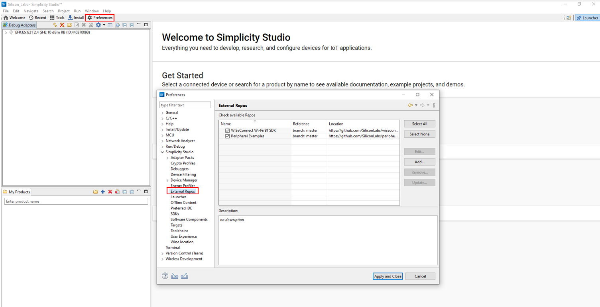

   3. Select ***Add*** and enter the url: [https://github.com/SiliconLabs/wifi_combo_applications.git](https://github.com/SiliconLabs/wifi_combo_applications.git) , select ***Next***.

      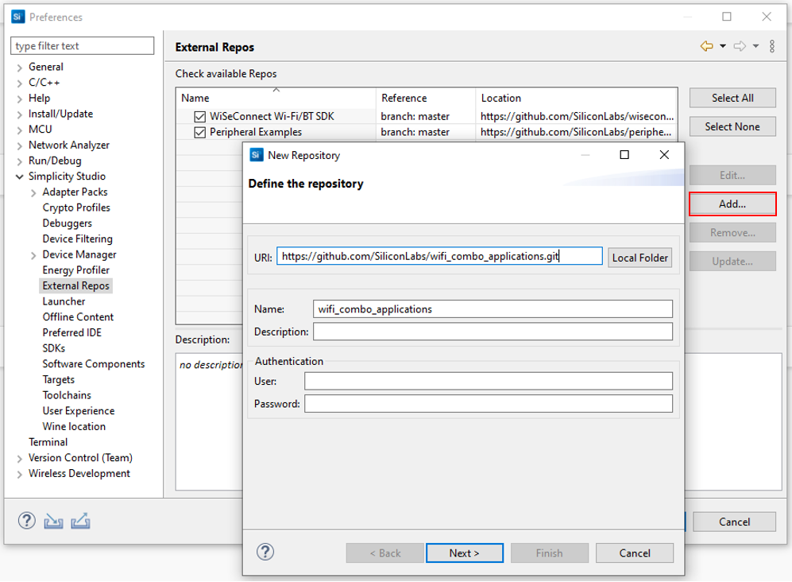

   4. Select ***OK*** in the following prompt.

      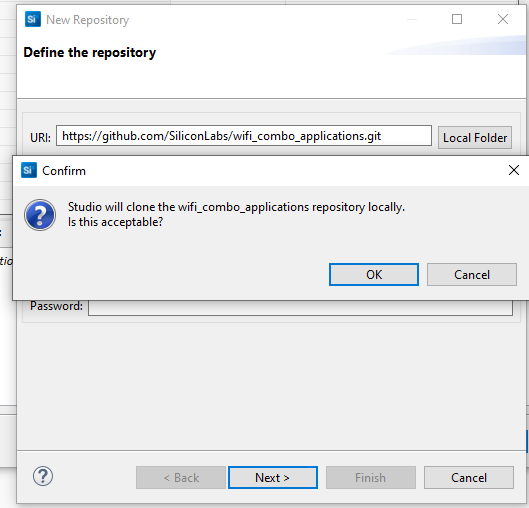

   5. Make sure the Branch is set to master, and select ***Finish***.

      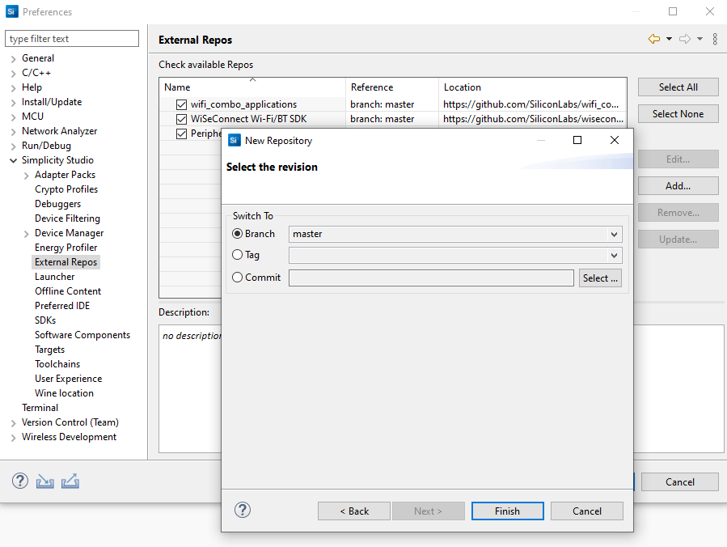

   6. The updated list can be seen in the ***External Repos***. Click ***Apply and Close*** to save the changes.

      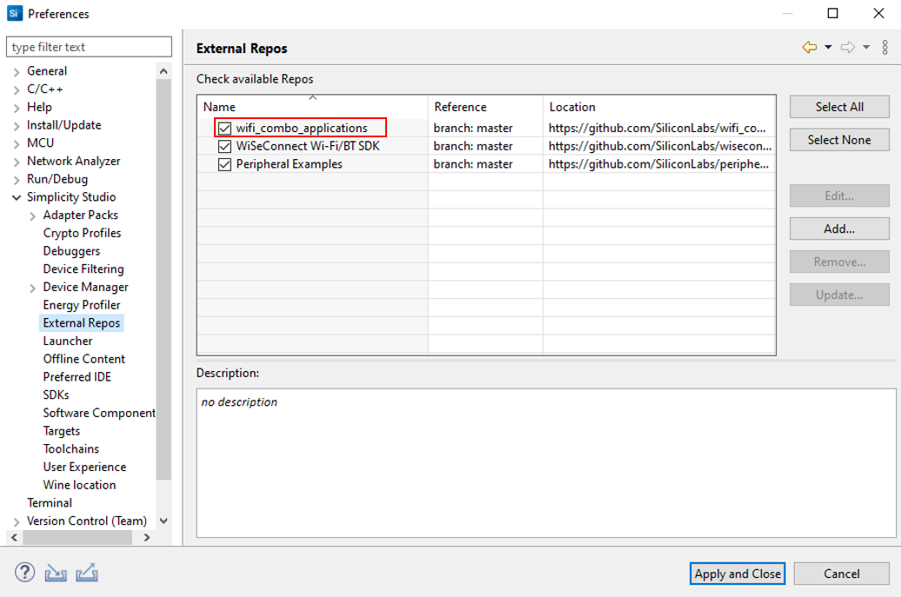

   7.	In preferences, navigate to Simplicity Studio → SDKs, select the Gecko SDK, and click Refresh.

   **Note:** <br /> After refreshing the SDK, if you’re unable to see the added wifi_combo_applications repo, please repeat the process from Step 3.

   8. Click Apply and Close to save the changes.
   
   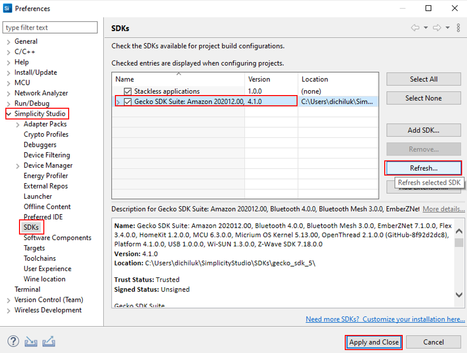

- EFR32MG21 with the latest Secure (SE) firmware and Adapter firmware.

   Follow the below steps to update the SE and Adapter firmwares of the EFR32MG21.
   1. Connect the EFR32MG21 to the PC using the USB type C- type A cable.
   2. In Simplicity Studio ***Launcher*** Perspective, select the device in the ***Debug Adapetrs***. In the ***Overview*** tab, nsure the following.

      a. Secure Firmware is updated to 1.2.13 or higher.

      b. Adapter Firmware is updated to 0v8p7b171 or higher.

      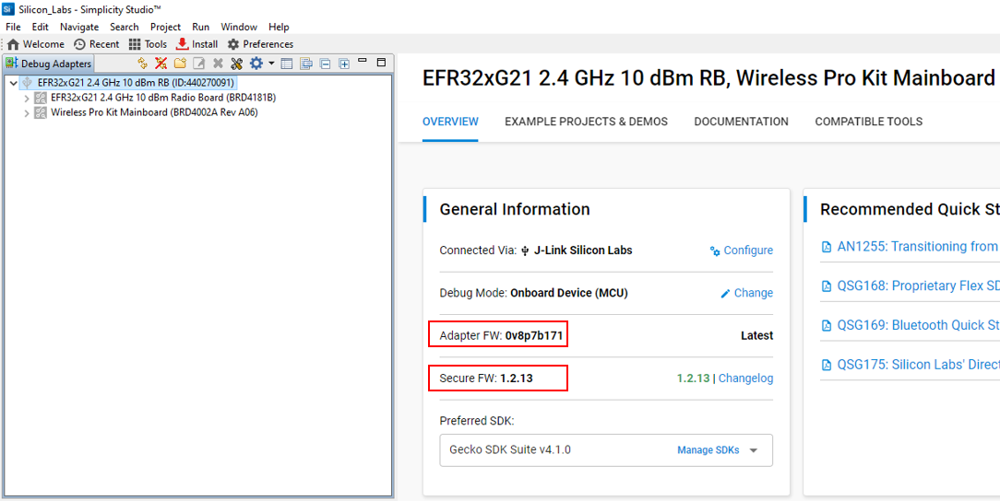

   3. To update a firmware, click on the latest version that appears beside the current version.

      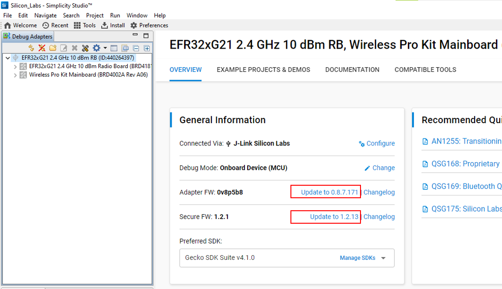
   

## **Setup**

This section provides details on the setup and the connections.

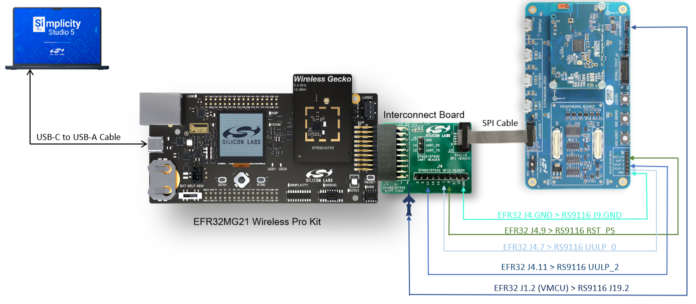

1. Connect the Interconnect board provided with the RS9116 NCP Development Kit to the EXP header of EFR32. Also, make sure the radio board is connected to the Wireless Pro kit.

2. Connect the J2 header of Interconnect board to the SDIO/SPI header of the RS9116 NCP using the 10-pin ribbon cable (SPI cable) provided with the RS9116 NCP.

3. Make sure the ISP switch is set to OFF position on the RS9116 NCP.

4. Connect the RST_PS pin on the J9 header of RS9116 NCP to the pin labeled 9 on the J4 header of the Interconnect board using a female-to-female connector. 

5. Connect the GND pin on J9 header of the RS9116 NCP to the pin labeled GND on the J4 header of the interconnect adapter board using a female-to-female connector. 

6. Connect pin number 2 on the EFR32 expansion header to pin number 2 on the J19 header of RS9116 NCP. This provides a measured supply to the RS9116 NCP from EFR32.

7. Connect the power save GPIOs as mentioned below:

| RS9116 GPIO J9 Peripheral Header | Interconnect board J4 Header<br>(EFR32Xg21 BRD4181B Pins) | Connection | Function | Usage |
|----------------------------------|-----------------------------------------------------------|------------|----------|-------|
| UULP_2 | Pin labeled 11 | PD02 | GPIO | Sleep/Wake up Request from Host MCU |
| UULP_0  | Pin labeled 7 | PB00 | GPIO | Wake Up Indication from RS9116 NCP |

8. Connect the EFR32 Wireless Pro Kit to the PC using a USB-A to USB-C cable.

**Note:** Ensure that the switch on the EFR32 Wireless Pro Kit is set to AEM mode

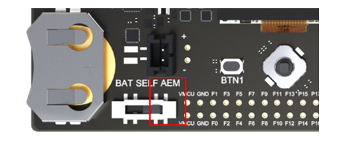

## **Setting up the Development Environment**

The following section describes how to set up Simplicity Studio IDE on a PC.

1. Ensure the EFR32MG21 and RS9116 NCP is connected to the PC using the USB cable.

2. Launch Simplicity Studio on your PC.

3. Select a workspace path of your choice. In this example, **“C:\\Silicon\_Labs”** is used as the workspace. Then click ***Launch***.

   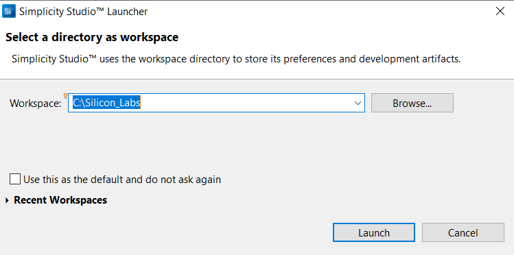

4. In the ***Launcher*** perspective, when the device is connected to the PC, the device name appears in the ***Debug Adapters*** tab.

5. Select the device. In the ***Overview*** tab, ensure the ***Secure Firmware*** and ***Adapter Firmware*** are updated to the latest version.

   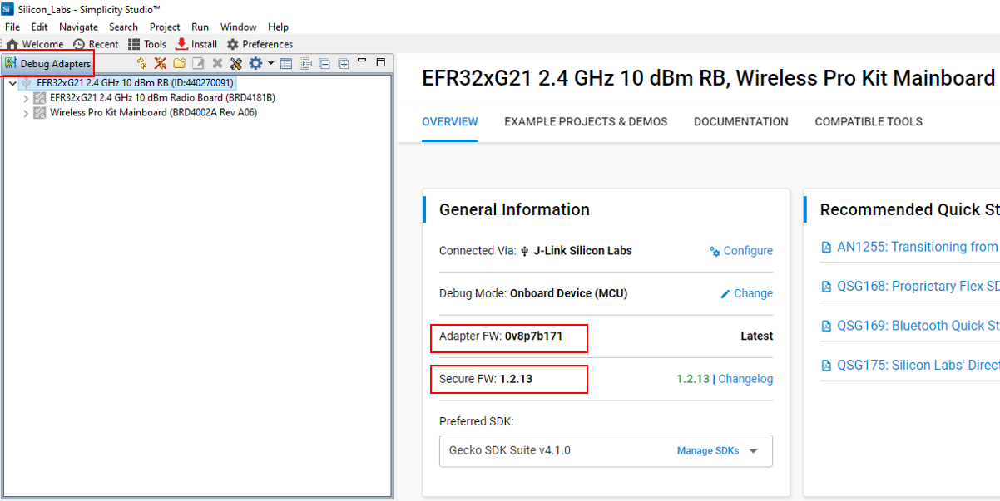


## **Create the Project**

   **Note:** <br />
   As mentioned in [prerequisites](#prerequisites), hope you have added RS9116 NCP SDK repository to the ***External Repos*** in the Simplicity Studio.

1. Ensure the EFR32MG21 is connected to the PC. 

2. In Simplicity Studio ***Launcher*** perspective, select the device detected in the ***Debug Adapters*** tab.

    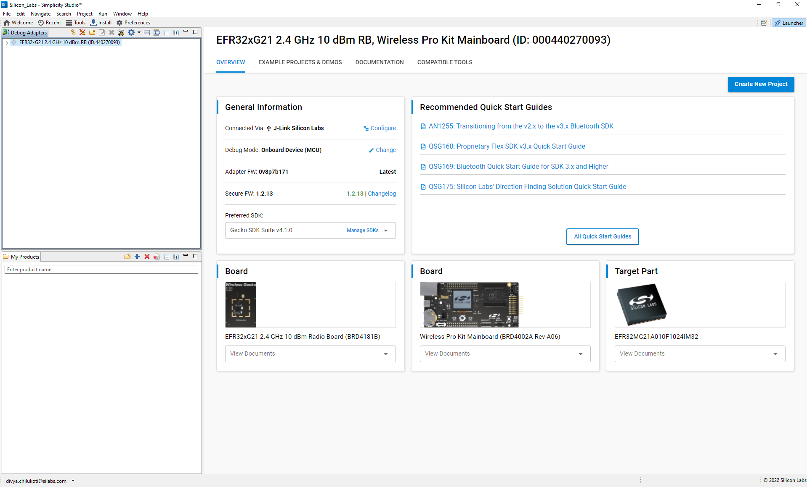

3. Switch to the ***EXAMPLE PROJECTS & DEMOS*** tab, select ***wifi\_combo\_applications*** as Provider.

4. Click ***CREATE*** against the project named ***Wi-Fi- Low Power Measurement***.

   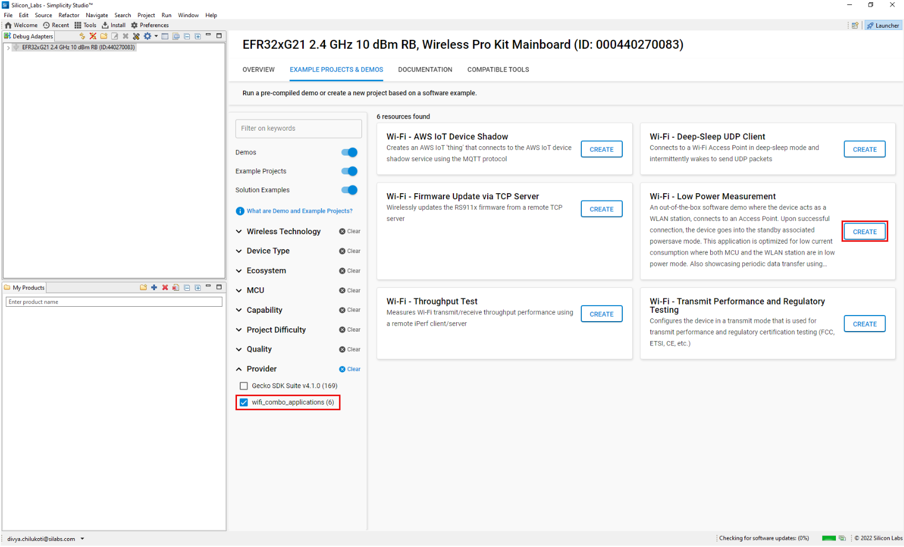

5. Click on Finish to complete the creation of project.

    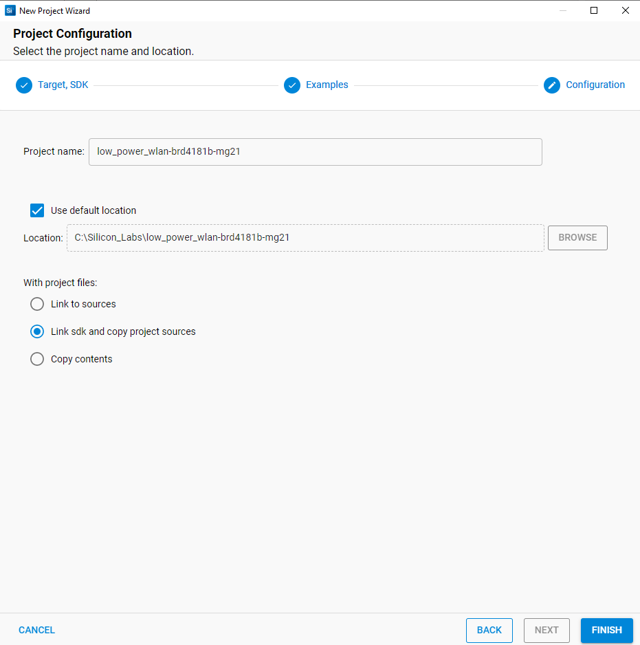

## **Update preferences for the Simplicity Studio Energy Profiler**

   The default view of Energy Profiler in Simplicity Studio is made to display average currents. To have a better view of the measurement range, it is recommended to use the Min/Max mode of the Energy Profiler.

   To change the display mode of Energy Profiler, follow the below steps

1. Open Simplicity Studio Preferences by selecting ***Windows → Preferences*** from the toolbar.

   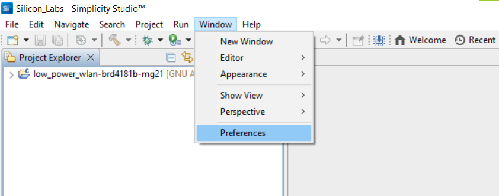

2. In Preferences, navigate to ***Network Analyzer → Energy Profiler Integration.***

3. Select ***Min/Max Sampler (BETA)*** from the dropdown as below.

   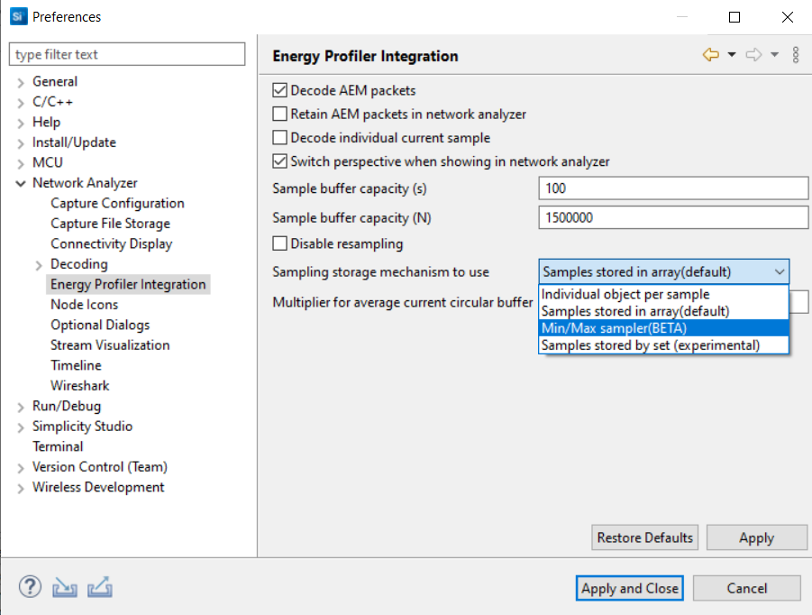

4. Click on ***Apply and Close*** to save the changes.

## **Application configuration**

1. Once the project is successfully created, the project name appears in the ***Project Explorer*** tab.

   **Note:** If you’re unable to see the ***Project Explorer*** tab, select ***Window → Show View → Project Explorer*** to get it visible.

   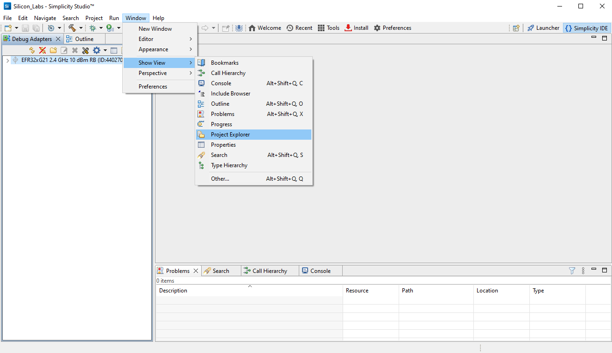

2. Expand the project and navigate to the **rsi\_low\_power\_wlan.c** file present in ***low\_power\_wlan-brd4181b-mg21 → low\_power\_wlan*** folder.

   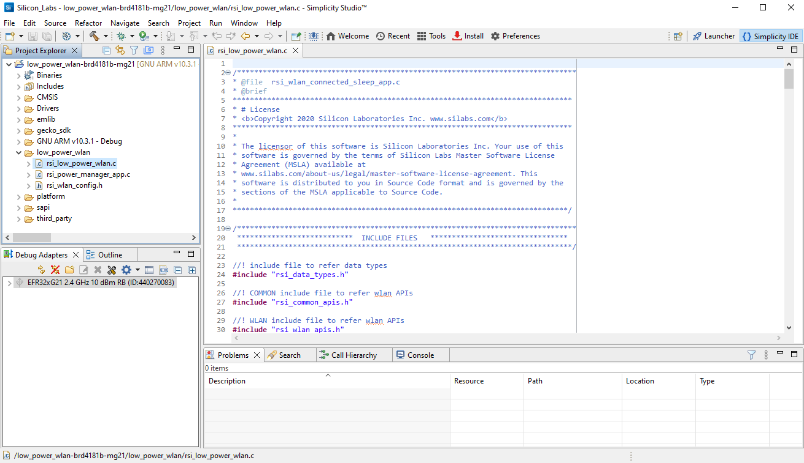


3. In **rsi\_low\_power\_wlan.c** file, configure **SSID, SECURITY\_TYPE, PSK** parameters.

    ```c
    //! Access point SSID to connect
   #define SSID "SILABS_AP"
   //! Password
   #define PSK "1234567890"
   //! Security type
   #define SECURITY_TYPE RSI_WPA2
   //! PWSAVE_PING functionality can be enabled to observe the timer-based PING
   functionality
   //! defines related to Host MCU power save
   #define PWSAVE_STANDBY RSI_ENABLE
   //#define PWSAVE_PING RSI_ENABLE
   //! Power Save Profile mode
   #define PSP_MODE RSI_SLEEP_MODE_2
   //! Power Save Profile type
   #define PSP_TYPE RSI_FAST_PSP
   //!Uncomment this macro to enable Code Correlation feature
   //#define CODE_CORRELATION_ENABLE RSI_ENABLE
    ```
    
4. Open **rsi\_wlan\_config.h** file and update/modify the following configurations.

   **Note**: Below settings are already configured by default. It is optional to update the configurations.

   Opermode command parameters

   ```c
   Opermode command parameters
   /*=======================================================================*/
   // To set wlan feature select bit map
   #define RSI_FEATURE_BIT_MAP (FEAT_SECURITY_OPEN | FEAT_AGGREGATION |
   FEAT_ULP_GPIO_BASED_HANDSHAKE)
   // To set Extended custom feature select bit map
   #define RSI_EXT_CUSTOM_FEATURE_BIT_MAP (EXT_FEAT_LOW_POWER_MODE |
   EXT_FEAT_XTAL_CLK_ENABLE)
   // config feature bit map
   #define RSI_CONFIG_FEATURE_BITMAP (RSI_FEAT_SLEEP_GPIO_SEL_BITMAP |
   ENABLE_ENHANCED_MAX_PSP)
   // TCP/IP feature select bitmap for selecting TCP/IP features
   #define RSI_TCP_IP_FEATURE_BIT_MAP (TCP_IP_FEAT_EXTENSION_VALID |
   TCP_IP_FEAT_DHCPV4_CLIENT)
   // To set custom feature select bit map
   #define RSI_CUSTOM_FEATURE_BIT_MAP FEAT_CUSTOM_FEAT_EXTENTION_VALID
   // To set Extended custom feature select bit map
   #define RSI_EXT_CUSTOM_FEATURE_BIT_MAP (EXT_FEAT_LOW_POWER_MODE |
   EXT_FEAT_XTAL_CLK_ENABLE)
   // To set TPC IP feature select bit map
   #define RSI_EXT_TCPIP_FEATURE_BITMAP CONFIG_FEAT_EXTENTION_VALID
   // config feature bit map
   #define RSI_CONFIG_FEATURE_BITMAP (RSI_FEAT_SLEEP_GPIO_SEL_BITMAP |
   ENABLE_ENHANCED_MAX_PSP)
    ```

   RS9116 NCP powersave Command Parameters

   ```c
   // Power save command parameters
    /*=======================================================================*/
    // set handshake type of power mode
    #define RSI_HAND_SHAKE_TYPE GPIO_BASED

    // 0 - LP, 1- ULP mode with RAM retention and 2 - ULP with Non RAM retention
    #define RSI_SELECT_LP_OR_ULP_MODE RSI_ULP_WITH_RAM_RET
    ```

    WLAN Connection command parameters

   ```c
   // Join command parameters
    /*=======================================================================*/

    // Tx power level
    #define RSI_POWER_LEVEL RSI_POWER_LEVEL_HIGH

    // RSI_JOIN_FEAT_STA_BG_ONLY_MODE_ENABLE or RSI_JOIN_FEAT_LISTEN_INTERVAL_VALID
    #define RSI_JOIN_FEAT_BIT_MAP RSI_JOIN_FEAT_LISTEN_INTERVAL_VALID

    // listen interval
    #define RSI_LISTEN_INTERVAL 1000	 //Changing this macro effects sleep duration of RS9116 NCP
    ```

5. Clean the project. Build the project by right-clicking on **low\_power\_wlan-brd4181b-mg21** and selecting **Build Project**. It takes a few seconds to build.

    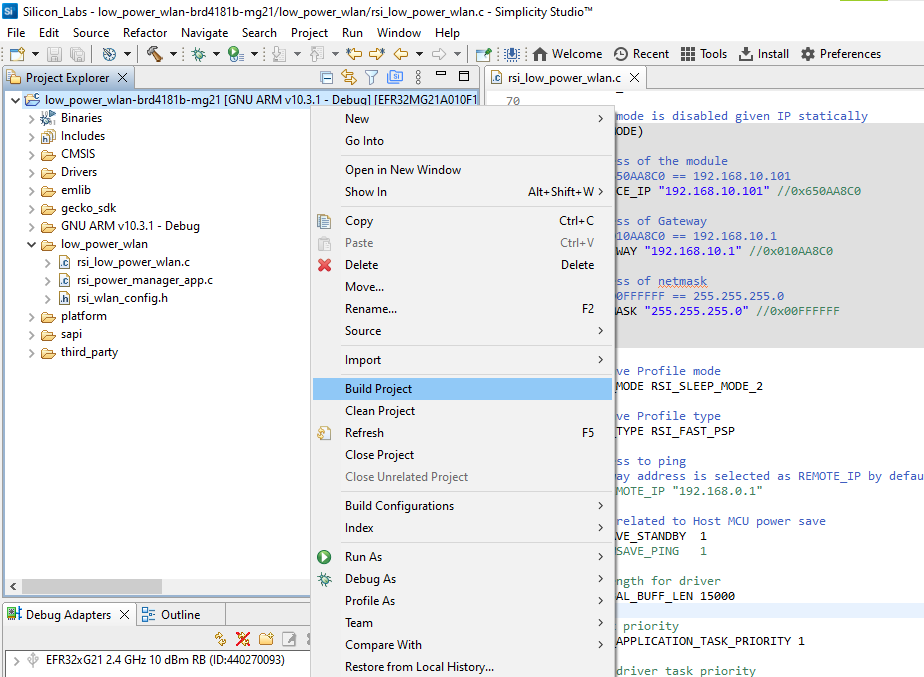

   If there are **no errors**, you can go ahead with **flashing** the code onto EFR32xG21.

    **NOTE:** Make sure the setup (EFR32, RS9116 NCP EVK) is connected to the PC, before flashing.

## **Set up the Virtual COM port on Simplicity Studio IDE**

   The Virtual COM (VCOM) port interface in Simplicity Studio is used to see the application debug prints.

   **Note:** This section can be skipped if you’re using any other serial terminal to observe debug prints from the application.

1. In the **Debug Adapters** tab, right-click on the detected device and choose **Launch Console.**

   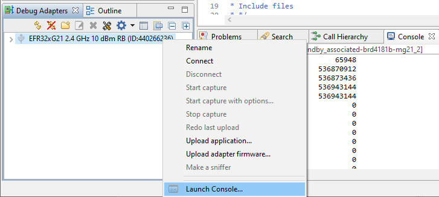

2. **J-Link Silicon Labs** console pane opens as shown below. Switch to the ***Serial 1*** tab to view the debug prints.

3. Hit **Enter** in the space as shown below, to establish a serial connection between the PC and the setup.

   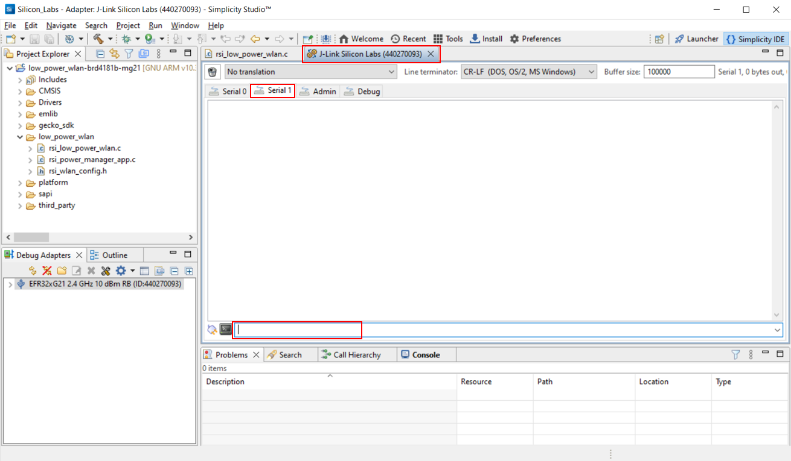

## **Low Power WLAN Execution**

### **Application Flow**

   The flowchart below describes the application flow.

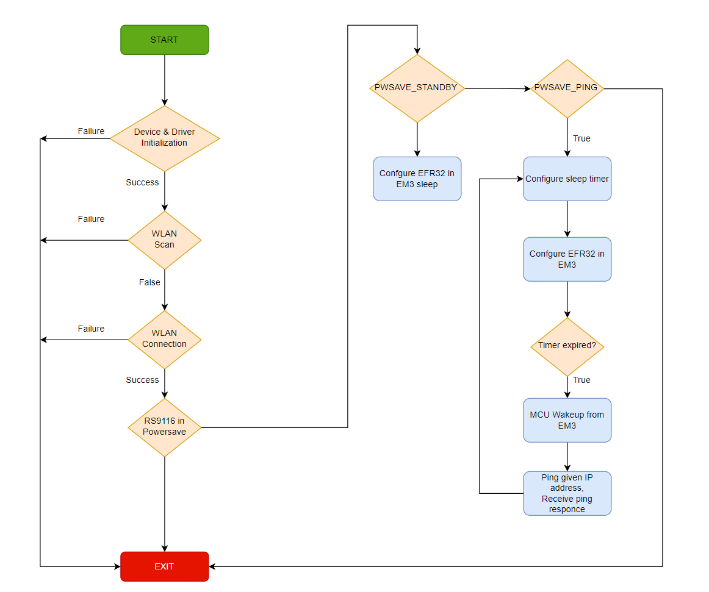

### **Executing the project**

1. Right-click on the project name and select ***Run As → Silicon Labs ARM Program***

   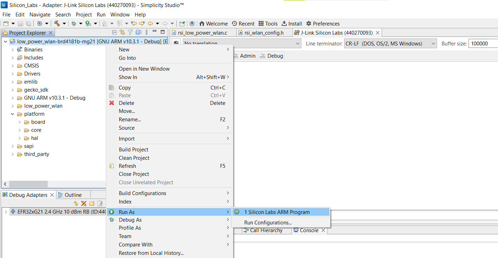

   **Note:** Ensure that the switch on the EFR32 Wireless Pro Kit is set to AEM mode.


   Once the code is flashed, application debug prints can be seen in the serial terminal.

   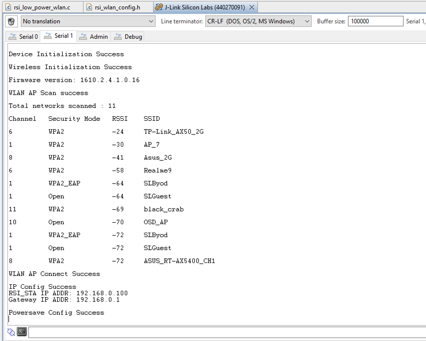

### **Measuring current consumption using Energy Profiler**

1. From the toolbar, navigate to ***Window → Perspective*** and select ***Energy Profiler***.

   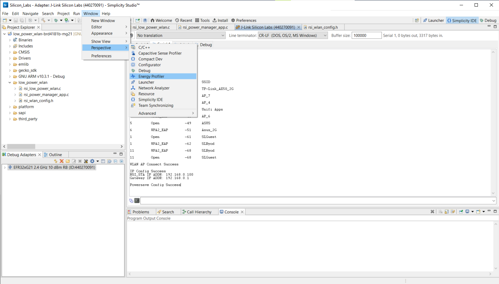

   **Note:** A quick guide on user interface of Energy Profiler is at the [link](https://docs.silabs.com/simplicity-studio-5-users-guide/1.1.0/ss-5-users-guide-tools-energy-profiler/energy-profiler-user-interface).


2. Select ***Quick Access → Start Energy Capture***, or ***Profiler →Start Energy Capture*** to start energy monitoring.

   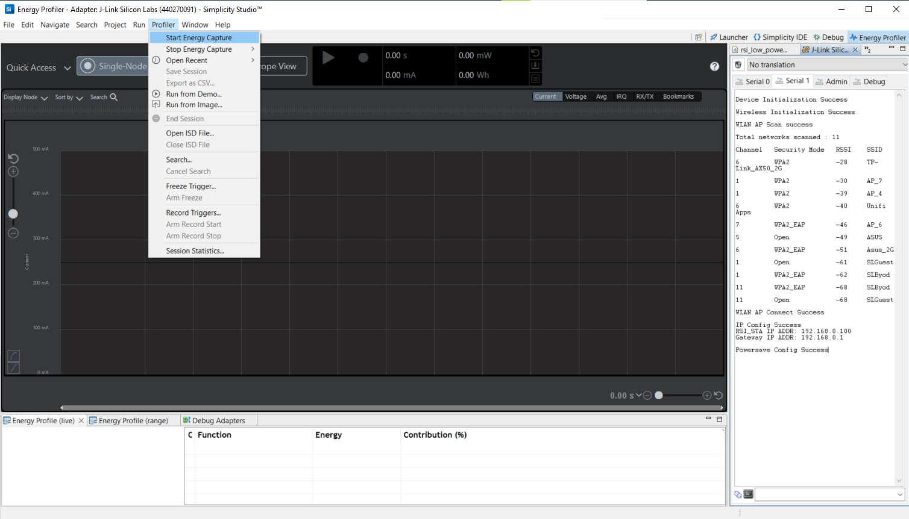

3. The current consumption can be seen as below
4. To analyze the live capture, click on Running icon to stop the Energy Profiler display.

   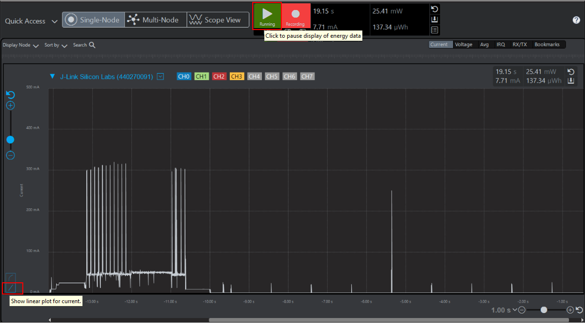

   **Note:** Ensure the plot for current is in linear mode, as shown above.
5. The current consumption average for the whole duration can be seen in the statistics.
6. The average statistics for a selected region can also be obtained as below.
Statistics

   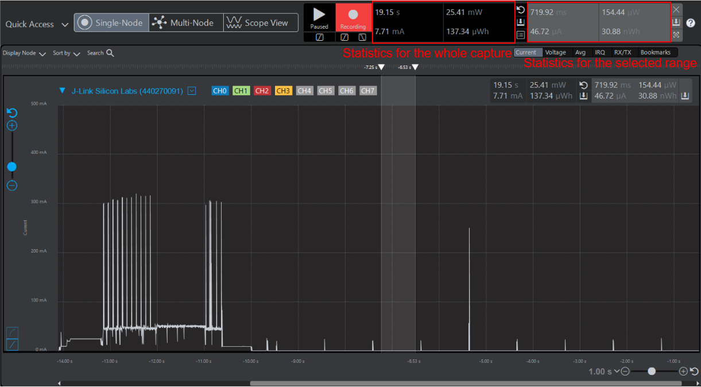

7. To stop monitoring, click on ***Quick Access***, and select ***Stop Energy Capture***, or ***Profiler → Stop Energy Capture***

   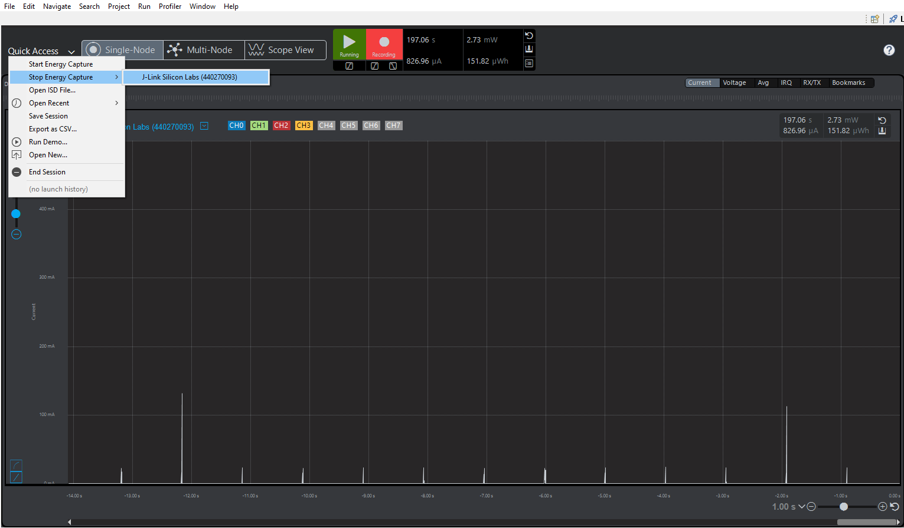

   To save the energy capture, select ***Yes***, and save the session, which will be saved as a .ISD file.

   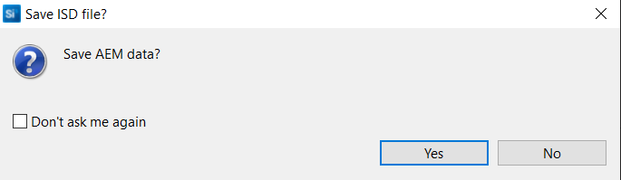

8. You can open and view the saved session by choosing ***Profiler*** → ***Open ISD File***, or ***Quick Access → Open ISD File***.

   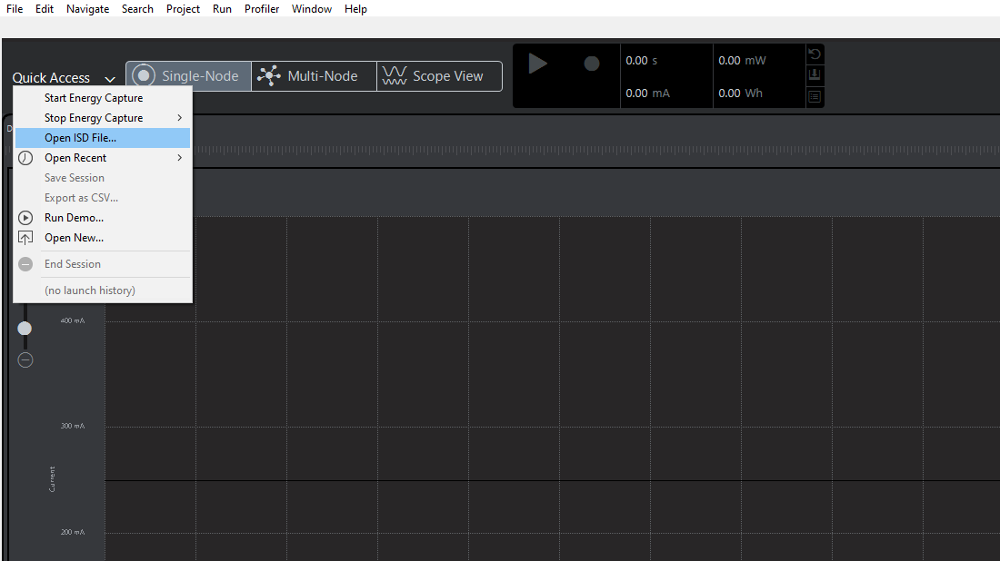

## **Optional features**

1. Using Energy profiler with code correlation, refer [https://docs.silabs.com/simplicity-studio-5-users-guide/1.1.0/ss-5-users-guide-tools-energy-profiler/](https://docs.silabs.com/simplicity-studio-5-users-guide/1.1.0/ss-5-users-guide-tools-energy-profiler/)

## **References**

1. RS9116 Documents: [https://docs.silabs.com/rs9116-wiseconnect/latest/wifibt-wc-overview/](https://docs.silabs.com/rs9116-wiseconnect/latest/wifibt-wc-overview/)
2. RS9116 NCP Latest SDKs: [https://github.com/SiliconLabs/wiseconnect-wifi-bt-sdk](https://github.com/SiliconLabs/wiseconnect-wifi-bt-sdk)
3. Error Codes: [https://docs.silabs.com/rs9116-wiseconnect/latest/wifibt-wc-sapi-reference/error-codes](https://docs.silabs.com/rs9116-wiseconnect/latest/wifibt-wc-sapi-reference/error-codes)
4. RS9116 NCP Firmware Update: [https://docs.silabs.com/rs9116-wiseconnect/latest/wifibt-wc-sapi-reference/error-codes](https://docs.silabs.com/rs9116-wiseconnect/latest/wifibt-wc-sapi-reference/error-codes)