# BLE ANCS Client Application
<!-- TOC -->

- [Introduction](#introduction)
- [Prerequisites](#prerequisites)
    - [Hardware Requirements](#hardware-requirements)
    - [Software Requirements](#software-requirements)
- [Block Diagram](#block-diagram)
- [Setup](#setup)
   - [EFR32](#efr32)
   - [EFM32](#efm32)
   - [STM32](#stm32)
- [Application flow](#application-flow)
- [Project Configurations](#project-configurations)
- [Import the project in Keil](#import-the-project-in-keil)
- [Setting up the development environment in Simplicity Studio](#setting-up-the-development-environment-in-simplicity-studio) 
   - [Import the Project into Simplicity Studio](#import-the-project-in-simplicity-studio)
- [Application Configurations](#application-configurations)
- [Project Execution](#project-execution)
- [Serial console setup](#serial-console-setup)
- [Testing the Application](#testing-the-application)
    - [Loading the RS9116 NCP Firmware](#loading-the-rs9116-ncp-firmware)
    - [ Building the Application on the Host Platform](#building-the-application-on-the-host-platform)
    - [Project Configuration](#project-configuration)
- [Troubleshoot](#troubleshoot)
- [Limitations](#limitations)
- [References](#references)

<!-- /TOC -->

## **Introduction**

This application demonstrates how to receive [Apple Notification Center Service (ANCS) ](https://developer.apple.com/library/archive/documentation/CoreBluetooth/Reference/AppleNotificationCenterServiceSpecification/Introduction/Introduction.html#//apple_ref/doc/uid/TP40013460-CH2-SW1) notifications by configuring the RS9116 NCP device as a GATT client.

ANCS notifications include phone calls, emails, calendar entries, and so on. If the RS9116 NCP device receives a notification related to an incoming call, then it automatically queries the iPhone for the caller and Apple ID information. And it also has the provision to print all received ANCS notifications in the serial terminal.

The purpose of the Apple Notification Center Service (ANCS) is to give Bluetooth accessories (that connect to iOS devices through a Bluetooth low-energy link) a simple and convenient way to access many kinds of notifications that are generated on iOS devices.


## **Prerequisites** 

For this lab, you will need the following:

### **Hardware Requirements**

- The Application project can be executed with any one of the following Host MCUs.

  - EFR32xG21 Starter Kit with Wireless Gecko (SLSWSTK6006A Baseboard: BRD4001A, Radio board: BRD4180a or BRD4180b)

  - EFM32GG11

  - STM32 - STM32F411RE 

- RS9116 Evaluation Board (RS9116W-SB-EVK1) / (RS9116W-DB-EVK1)

- Mini-USB to USB Type-A cable 

- Micro-USB to USB Type-A cable (included with RS9116X-SB-EVK1)

- interconnect board and SPI ribbon cable (for SPI communication)

 - SDIO/SPI Cable

- One female-to-female connector (for the "RST-PS" pin connection)

- Windows PC with 2 USB ports

- BLE-supported iPhone

### **Software Requirements**

- RS9116 NCP's latest software release is available in the below link.

  - Link: https://github.com/SiliconLabs/wiseconnect-wifi-bt-sdk

- Development Environment
  - For EFR32 & EFM32, use Simplicity Studio
  - For STM32, use licensed Keil IDE 

- Simplicity Studio v5 (v5.1.2.0 or higher)

   - Download the Simplicity Studio from [Simplicity Studio](https://www.silabs.com/developers/simplicity-studio).

   - Follow the [Simplicity Studio guide](https://docs.silabs.com/simplicity-studio-5-yous-guide/1.1.0/ss-5-yous-guide-getting-started/install-ss-5-and-software#install-ssv5) to install Simplicity Studio. 

- Keil 

   - Refer to the [Keil guide](https://www.keil.com/) for downloading and installation procedure.

- [TeraTerm](https://ttssh2.osdn.jp/) serial terminal software.


**NOTE:** 
- Refer to [Update EVK Firmware ](https://docs.silabs.com/rs9116-wiseconnect/latest/wifibt-wc-getting-started-with-pc/update-evk-firmware) to load the firmware into the RS9116 NCP device. The firmware binary is located in \<Release\_Package\>/firmware/

- The application can be evaluated from the 2.7.1.0.6 SAPIS & Firmware. But it is recommended to use the latest SAPIS & Firmware available on the website.

- This example application supports Bare metal as well as FreeRTOS.

## **Block Diagram**

This section describes the block diagram of the BLE ANCS client application.
<br>
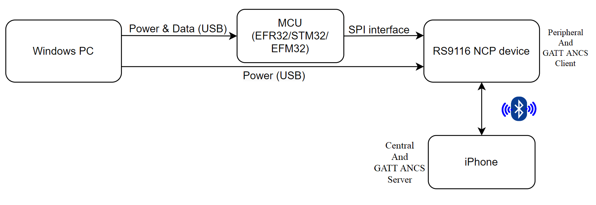<br>


The RS9116 NCP device and the host MCU are connected over the SPI/SDIO interface and both are connected to the Windows PC with USB cables.

## **Setup**

This section describes the hardware setup and the connections for EFR32, EFM32, and STM32 Host MCUs. You can choose any of the 3MCUs(EFR32/EFM32/STM32).

### **EFR32**
This section describes the hardware setup and the connections for EFR32.
<br>
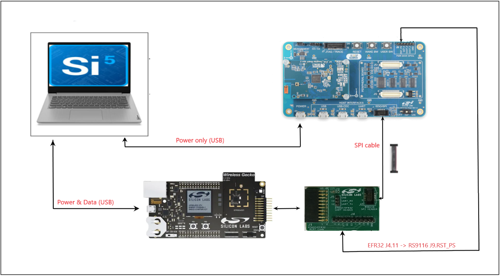<br>

   1. Connect the interconnect adapter board provided with the RS9116 NCP Development Kit to the expansion header of EFR32.

   2. Connect the SPI header of the interconnect adapter board to the SPI connector of the RS9116 NCP device using the 10-pin ribbon cable (SPI cable) provided with the RS9116 NCP Development kit.

   3. Connect the "RST_PS" pin on the J9 header of the RS9116 NCP device to the pin labelled 11 on the J4 header of the interconnect adapter board using a female-to-female connector.
   
   4. Ensure the ISP switch on the RS9116 NCP device is set to the OFF position. 
   
   5. Connect the EFR32 Starter Kit to a Windows PC using a Mini USB cable.

   6. Connect the RS9116 NCP device to a Windows PC using the USB cable labelled POWER. Note that this connection only provides power to the RS9116 NCP device, there is no USB communication over this connection.

      
If the interconnect board is not available, make the connections between the RS9116 NCP device and EFR32 Host MCU with the SPI cable as described below.

<br>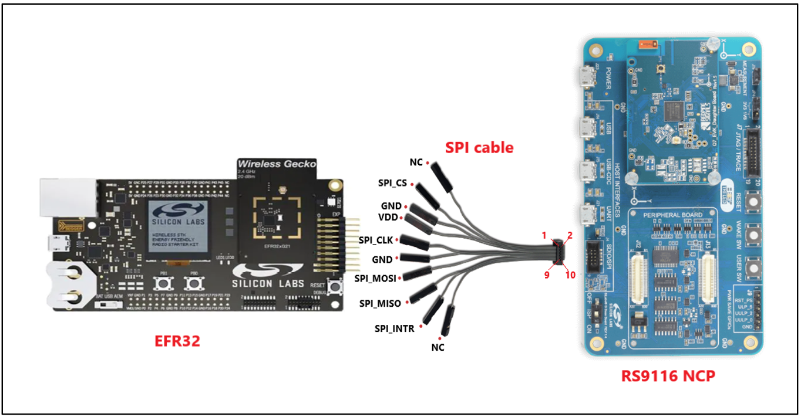<br>
<br>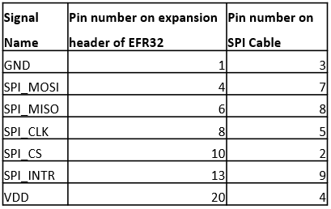<br>

### **EFM32**

This section describes the hardware setup and the connections for EFM32.
<br>
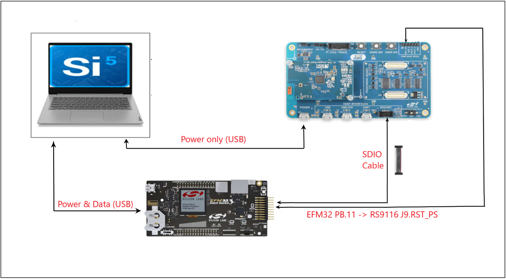<br>
   
   1. Connect the RS9116 NCP device reset pin "RST_PS" to the EFM32GG11 development explnsion board pin 11, to enable the EFM32 to reset the RS9116 NCP device.

   2. As shown in the below image, connect the EFM32GG11 board to the SDIO connector of the RS9116 NCP device using the 10-pin ribbon cable provided with the RS9116 NCP device.
   <br>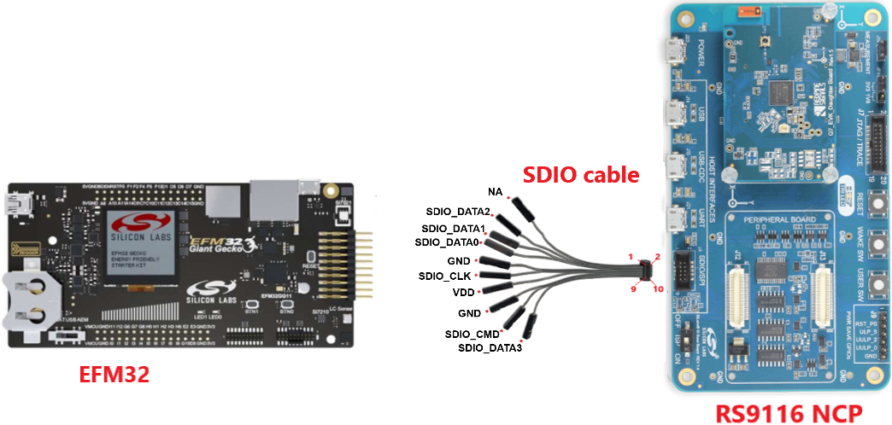<br>
   <br>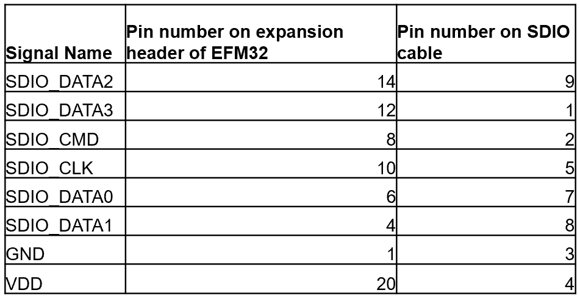<br>
  
  3. Ensure the ISP switch on the RS9116 NCP device is set to the OFF position. 

  4. Connect the EFM32 MCU to a Windows PC using a Mini USB cable.

  5. Connect the RS9116 NCP device to a Windows PC using the micro USB interface labelled POWER. Note that this connection only provides power. There is no USB communication over this connection.

### **STM32**

This section describes the hardware setup and the connections for STM32.
<br>
<br>
   
   1. Connect the RS9116 NCP device reset pin "RST_PS" to the STM32F11RE development board CN10 pin 6, to enable the STM32 to reset the RS9116 NCP device.

   2. As shown in the below image, connect the STM32F411RE board to the SPI connector of the RS9116 NCP device using the 10-pin ribbon cable provided with the RS9116 NCP device.
   <br>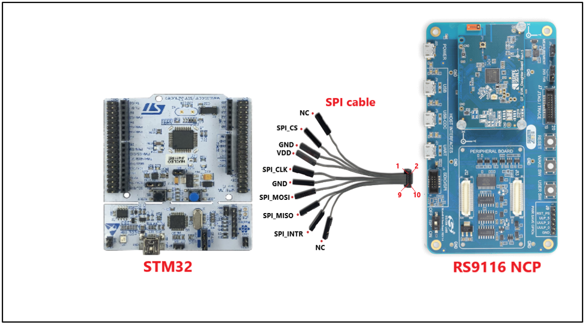<br>
   <br><br>
  
  3. Ensure the ISP switch on the RS9116 NCP device is set to the OFF position. 

  4. Connect the STM32 MCU to a Windows PC using a Mini USB cable.

  5. Connect the RS9116 NCP device to a Windows PC using the micro USB interface labelled POWER. Note that this connection only provides power. There is no USB communication over this connection.


## **Application flow**

This flow chart describes the application flow.
<br>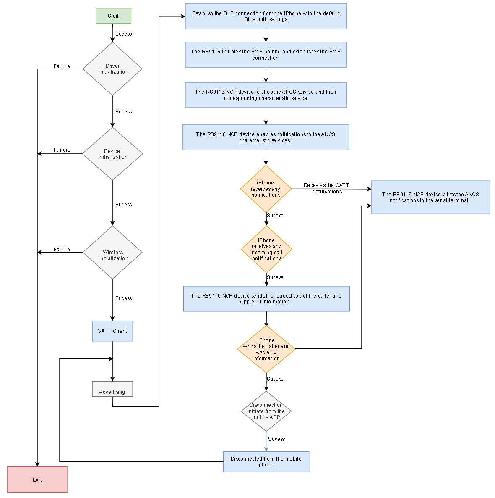<br>


## **Project Configurations**

1. Clone or download the desired SDK to your drive at any location (ensure this does not have a long folder path) and that location will be your SDK path <SDK_path>.

     ```
   git clone https://github.com/SiliconLabs/wiseconnect-wifi-bt-sdk.git --branch=<tag name> 
   ```
   In this case, the tag used is **2.7.1**. Hence the command given is as follows:

   ```
   git clone https://github.com/SiliconLabs/wiseconnect-wifi-bt-sdk.git --branch=2.7.1 
   ```
   <br>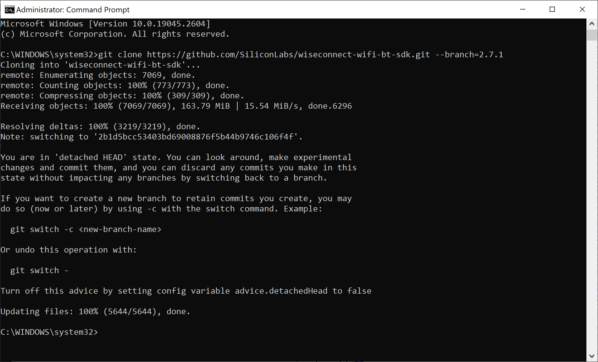<br>

      
2.  Download the BLE ANCS application. Place the **ble_ancs_client** project folder in the  SDK at path: **wiseconnect-wifi-bt-sdk\examples\snippets\ble**.
   <br>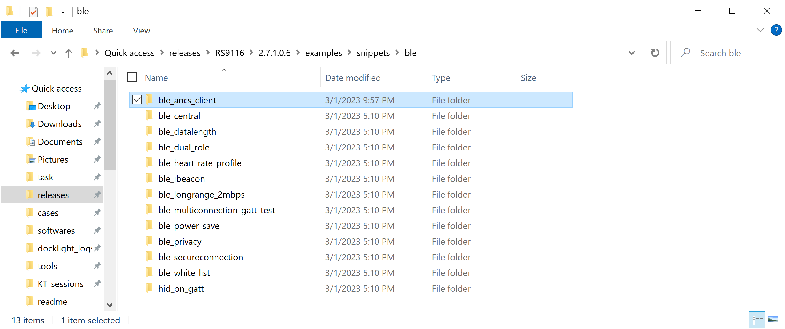<br>
   	

3. Ensure the RS9116 NCP device is pre-loaded with the latest firmware, Refer to [Update EVK Firmware ](https://docs.silabs.com/rs9116-wiseconnect/latest/wifibt-wc-getting-started-with-pc/update-evk-firmware) to load the firmware.

## **Import the project in Keil**

The following section describes how to set up Keil IDE in Windows Operating System.

1. Navigate to the path, **\<SDK_path\> → examples → snippets → ble → ble\_ancs\_client → projects** in the downloaded release SDK.

2. Click on the "ble_ancs_client-nucleo-f411re" project. 
   <br>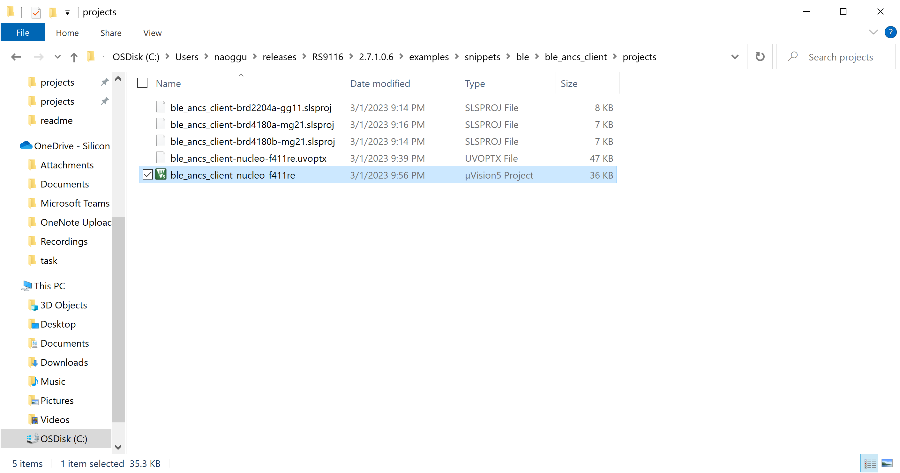<br>

3. The project will be open in the Keil IDE. Open the "rsi_ble_ancs_client.c" application file.
   <br>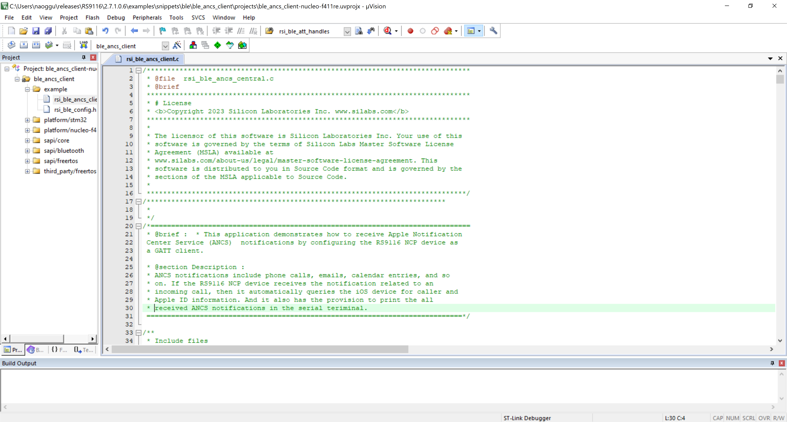<br>

## **Setting up the development environment in Simplicity Studio**

The following section describes how to set up Simplicity IDE in Windows Operating System.

1. Launch the Simplicity Studio IDE on your Windows PC.

2. Select the desired path as the workspace directory. The following directory has been chosen for the workspace as shown in the image below.

3. Click on **Launch**.
   <br>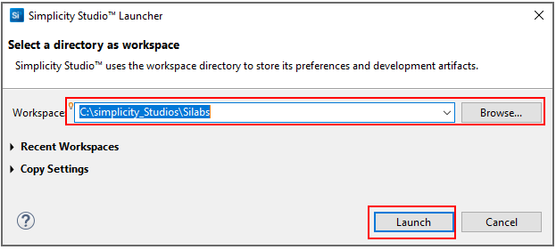<br>

4. Check the default repo to which the Simplicity Studio IDE is linked to.

   a. In the Simplicity Studio IDE, go to 
    **Preferences > Simplicity Studio > External Repos**. 
   <br><br>

   b. By default, the latest **WiseConnect Wi-Fi/BT SDK** repo is linked to external repos. Click on **update** as shown below so that the latest SDK at https://github.com/SiliconLabs/wiseconnect-wifi-bt-sdk gets cloned at path: 
   **<Simplicity_Studio_Installed_Path>SimplicityStudio\v5\developer\repos\wiseconnect-wifi-bt-sdk**.
   <br>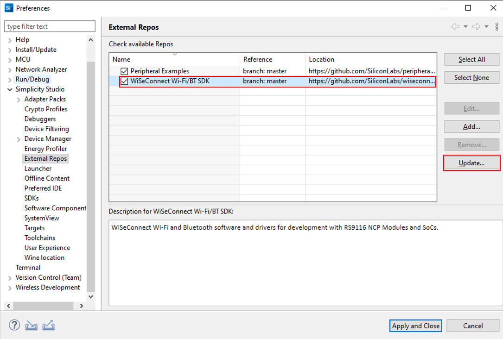<br>

   c. After updating the repo, the SDK gets updated locally as shown below.
   <br>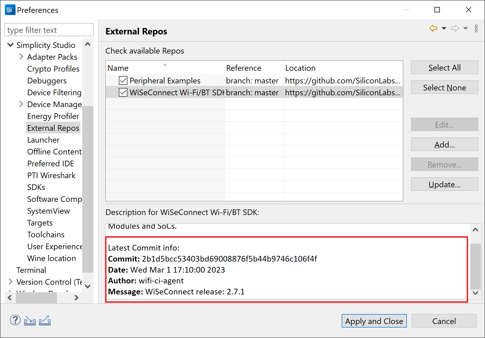<br>

   d. Locally updated SDK.
   <br>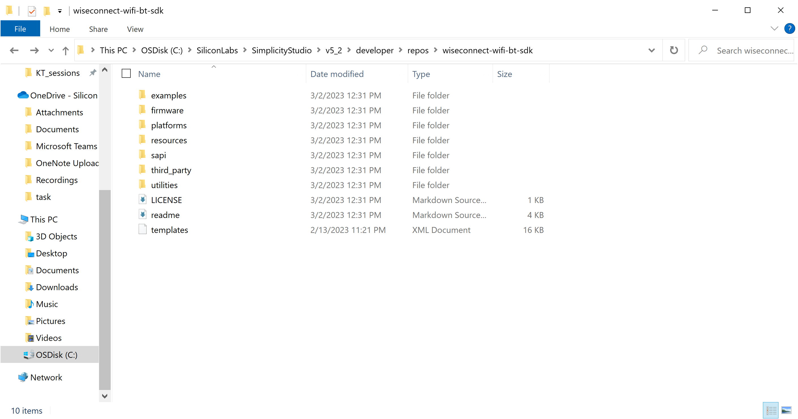<br>

5. Ensure the EFR32 device and RS9116 NCP device are connected to your Windows PC.

6. When EFR32 is connected to the Windows PC, Simplicity Studio will detect it as shown below. 
   <br><br>

**Note:** While importing the project, select the project based on the radio board version:

- For **BRD4180A**, select the ble_ancs_client-brd4180a-mg21 project.
- For **BRD4180B**, select the ble_ancs_client-brd4180b-mg21 project.


### **Import the Project into Simplicity Studio**

This section provides the steps for importing the project into Simplicity Studio IDE.

1. In the Simplicity Studio IDE, go to **File** and select **Import**.
   <br><br>

2. A pop-up window appears. Click on **Browse**.

3. Navigate to the path downloaded release SDK's path, **\<SDK_path\> → examples → snippets → ble → ble\_ancs\_client → projects**.

4. Select the appropriate project as per the detected radio board variant i.e., **ble\_ancs\_client\-brd4180a-mg21** → **BRD4180A**.
**ble\_ancs\_client\-brd4180b-mg21** → **BRD4180B**.

5. Click on **Next** → **Next**.
   <br>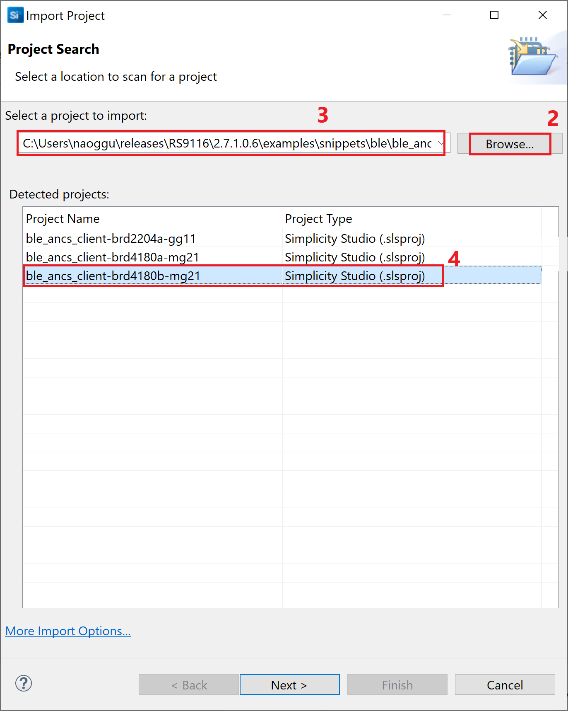<br>

6. Now click on **Finish**.


## **Application Configurations**

1. Once the project is successfully imported, the project name appears in the Project Explorer tab.

2. Expand the project folder by clicking on the drop-down.

3. Open the **rsi\_ble\_ancs\_client.c** file present in **ble\_ancs\_client-brd4180b-mg21 → ble\_ancs\_client** folder.
   <br>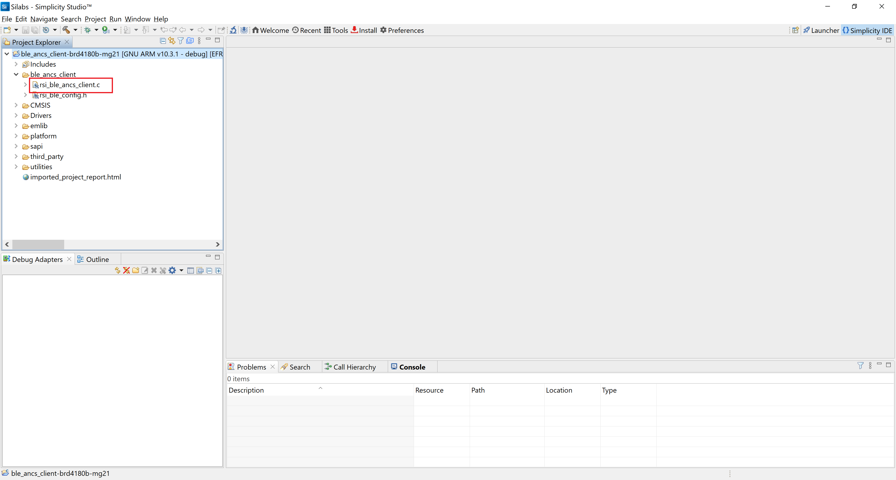<br>

**Note**:
The required features are already set with the default values. You can also modify the parameters as per their needs and requirements.

- "RSI_BLE_LOCAL_NAME" refers to the name of the RS9116 NCP device has to connect.
   ```c

   #define RSI_BLE_LOCAL_NAME                        "ANCS"
   ```
- "RSI_BLE_SMP_IO_CAPABILITY" refers to IO capability.

   ```c
   #define RSI_BLE_SMP_IO_CAPABILITY   0x03
   ```

4. Open the rsi_ble_config.h file, which is present under the“ble_ancs_client” folder and update/modify the following macros,
- "CLIENT_CHAR_CONFIGURATION" refers to the attribute descriptor that defines the information about whether notification or indication is enabled or disabled.
   ```c
   #define CLIENT_CHAR_CONFIGURATION                        0x2902
   ```

- "CHAR_EXTENDED_PROPERTIES" refers to the attribute a descriptor that defines additional Characteristic Properties like, read only, No Authentication,
No Authorization.
   ```c
   #define CHAR_EXTENDED_PROPERTIES                      0x2900
   ```
- “BT_GLOBAL_BUFF_LEN” refers Number of bytes required by the application and the driver.

   ```c
    #define BT_GLOBAL_BUFF_LEN                           15000
    ```
Note: The relevant configurations are already configured in the rsi ble config.h file in the appropriate example folder. 

## **Serial console setup**
This section describes the serial COM port configuration for EFR32 and STM32.
### **Set up the Serial COM port on Simplicity Studio IDE**

The Serial COM port interface is used for printing out debug prints from the application.
1.  When the EFR32/EFM32/STM32 is connected to the Windows PC, the EFR32/EFM32/STM32 serial port is automatically detected as shown below.
      - EFR32 port detection
      <br>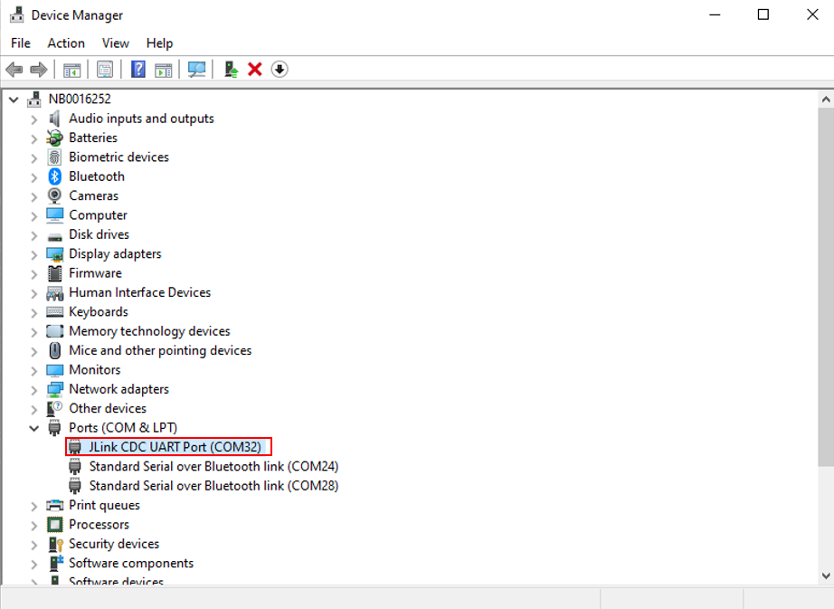<br>
      - EFM32 port detection
      <br><br>
      - STM32 port detection
      <br><br>

2. When the EFR32/EFM32/STM32 is connected, Open the Teraterm tool and choose the detected EFR32/EFM32/STM32 serial port and click on "OK" as shown below.
   - EFR32 port
   <br>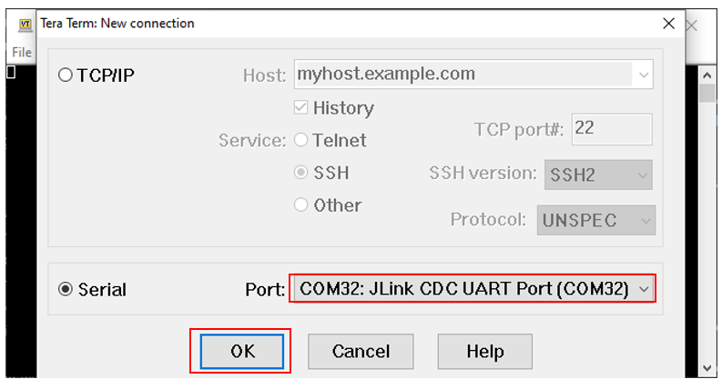<br>
   - EFM32 port
   <br>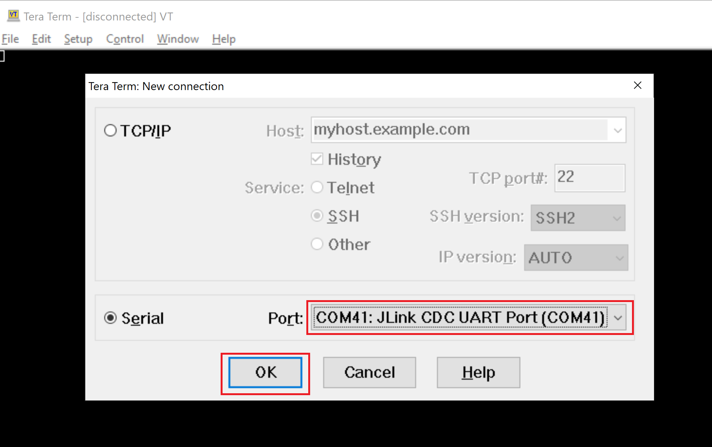<br>
   - STM32 port
   <br><br>

3. Once the EFR32/EFM32/STM32 is detected, Navigate to the **setup** → **Terminal** and update the below-specified setup information as shown in the below image, and click on "OK".
   <br><br>
   <br><br>

4. Navigate to the **setup** → **Serial port** and update the baud rate to "115200" and click on "OK".
   <br><br>
   <br><br>

5. The EFR32/EFM32/STM32 serial port is connected and the teraterm terminal displays the debug prints in the application.

### **Build the project**

- For STM32: Click on the **build project** option as shown in the figure to build the project.
   <br>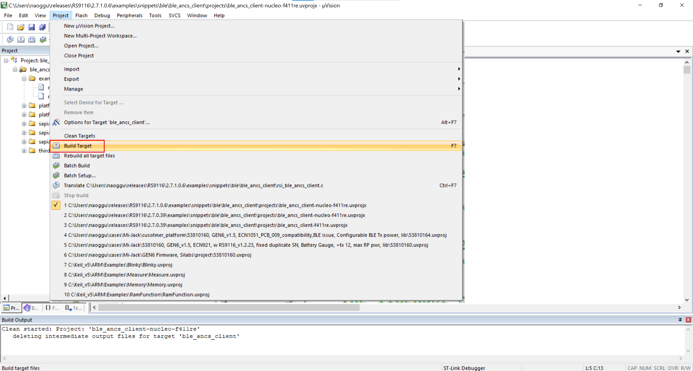<br>

- For EFR32/EFM32: Click on the **build project** option as shown in the figure to build the project.
   <br>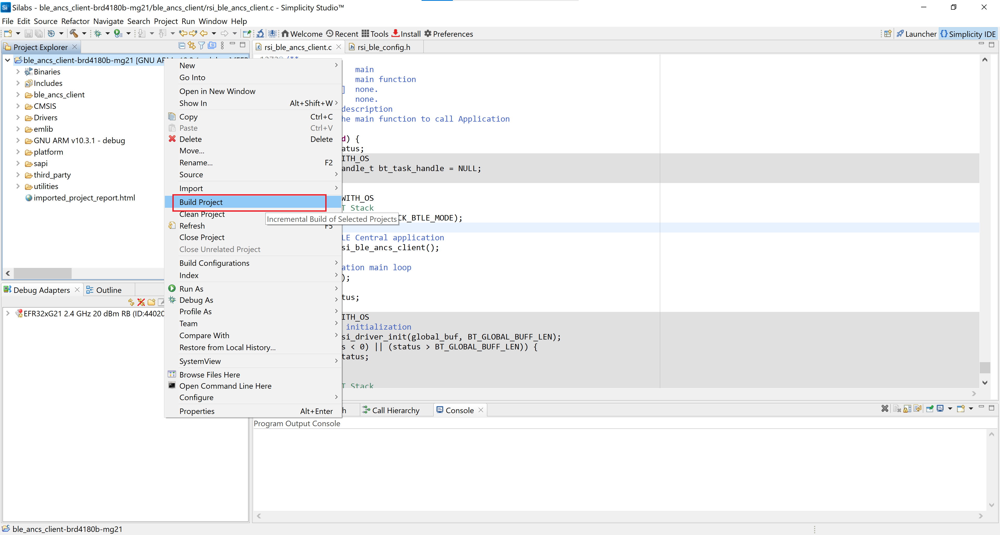<br>

- When the build process is completed, the project-corresponding binary files are generated.

### **Debug the project**

- **EFR32:**
   - To flash the code, right-click on the project name and select **Debug As** → **Silicon Labs ARM Program**.
      <br>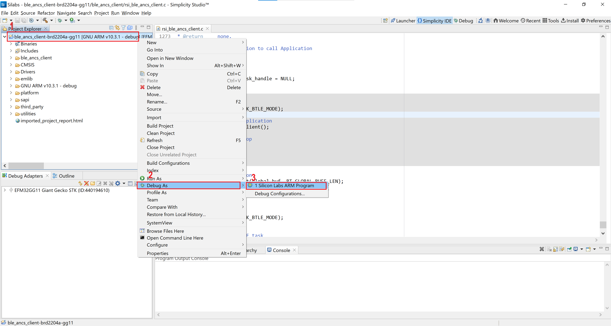<br>
      - If the EFR32xG21 has an older SE firmware, the following warning may pop up. Click ‘Yes’ to continue
      <br><br>

      - If the connected EFR32 board has any other radio board other than 20dbm, Simplicity Studio will not be able to detect the device and gives the below the pop-up window for Device Selection. Select the device displayed and click OK.
      <br>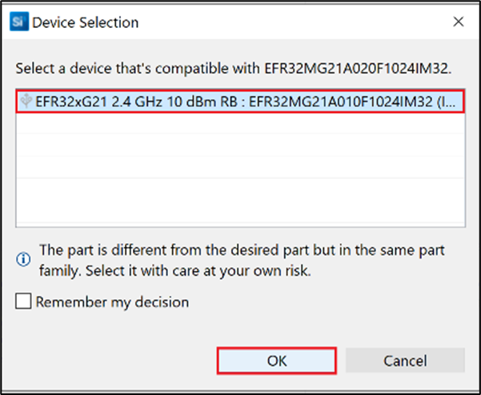<br>   

      - The following warning may the pop-up as shown below, click Yes and continue. 
      <br><br>

- **EFM32:**
   - To flash the code, right-click on the project name and select **Debug As** → **Silicon Labs ARM Program**.
   <br><br>
   - As soon as the debug process is completed, the application control branches to the main() function.

- **STM32:**
   - To debug the code, click on the debug option as shown in the below image.
   <br>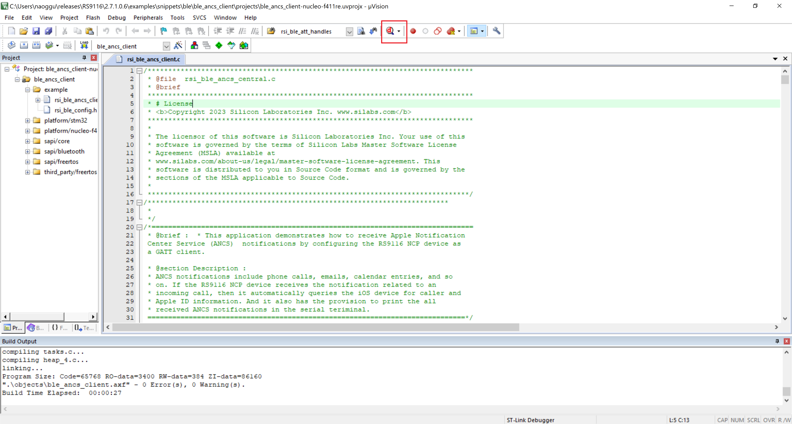<br>
   - As soon as the debug process is completed, the application control branches to the main() function.

### **Project Execution**

This section demonstrates the execution flow of the application based on the configuration you set.

- Once the program gets executed, as per the above configuration, the RS9116 NCP device acts as a "GATT CLIENT" and also as a BLE peripheral device.

- Initiates the scan from the iPhone's default Bluetooth settings.

- The RS9116 NCP device will appear with the name configured in the macro RSI_BLE_DEVICE_NAME (Ex: "ANCS") or sometimes be observed as the RS9116 NCP device as internal name "REDPINE_GATT_V02 ".
<br>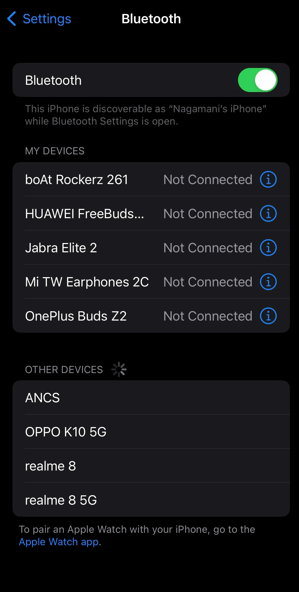<br>

- Initiate the connection from the iPhone.

- The RS9116 NCP device initiates the SMP pairing. In the SMP process, the pop-up below will appear. Click on the "pair" button. 
<br>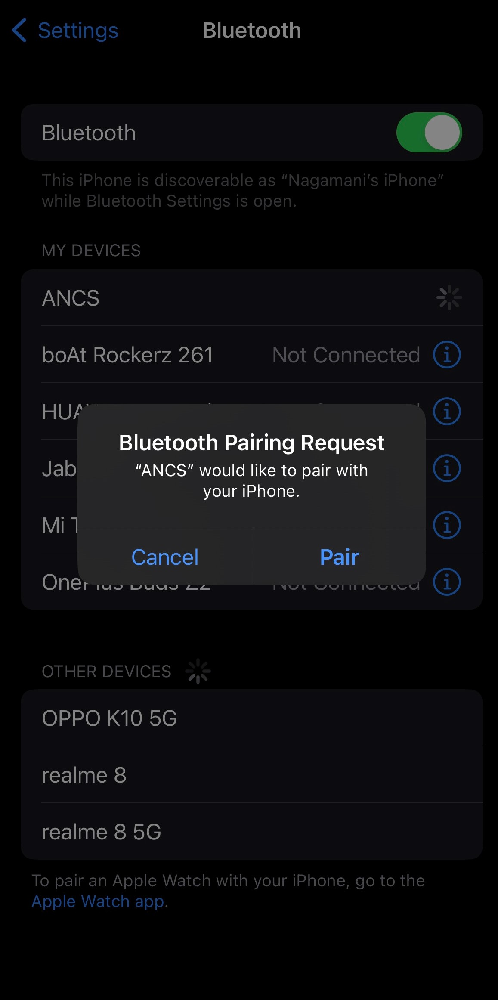<br>

- Click on the "allow" button.
<br>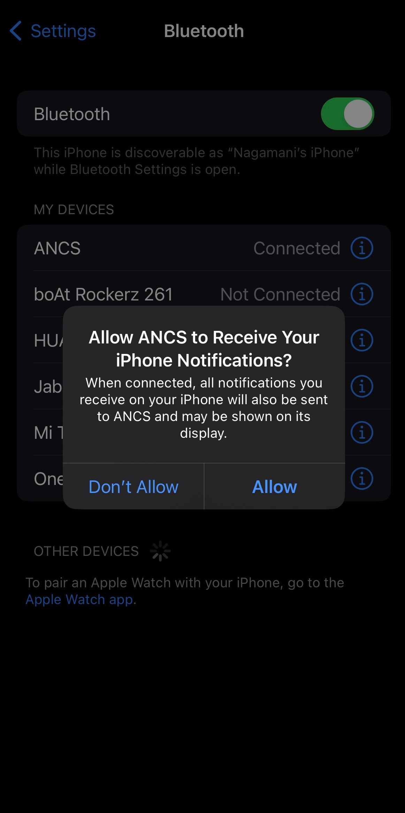<br>

- The RS9116 NCP device successfully establishes the connection with the iPhone.
<br>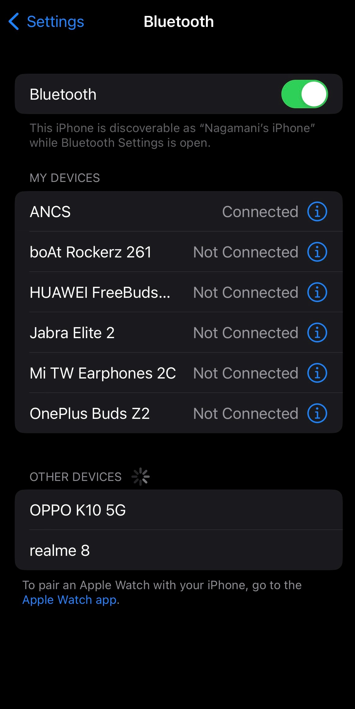<br>

- When the iPhone receives any information, it redirects those notifications (count and type as defined in the ANCS specification) to the RS9116 NCP device.
<br>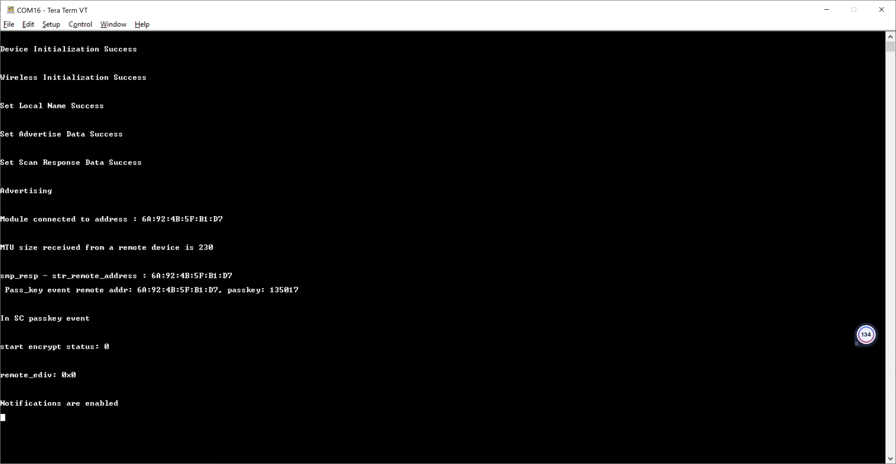<br>

- If the RS9116 NCP device receives the incoming call, then it requests the iPhone for the caller's and Apple ID information. 
<br>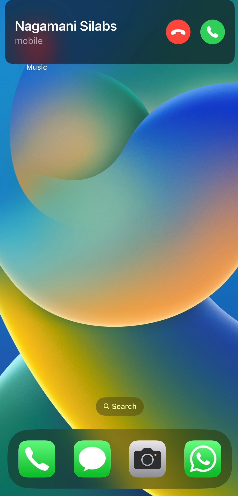<br>

- Once the RS9116 NCP device receives that information then it prints the data on the serial terminal as shown below.
<br>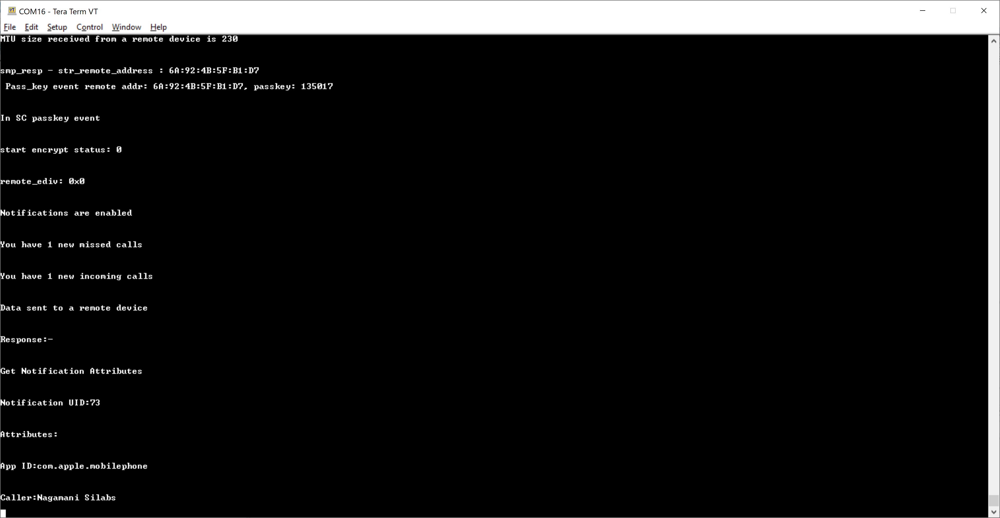<br>


## Optional features

1. By default, the application runs on FreeRTOS. Remove the `RSI_WITH_OS` preprocessor symbol to run the application on Bare metal.

## Baremetal Configurations

### **Simplicity Studio**
1. Once the project is imported, Right-click on the **ble\_ancs\_client-brd4180b-mg21** / **ble\_ancs\_client-brd4180a-mg21** project and navigate to the properties and click on it.
<br>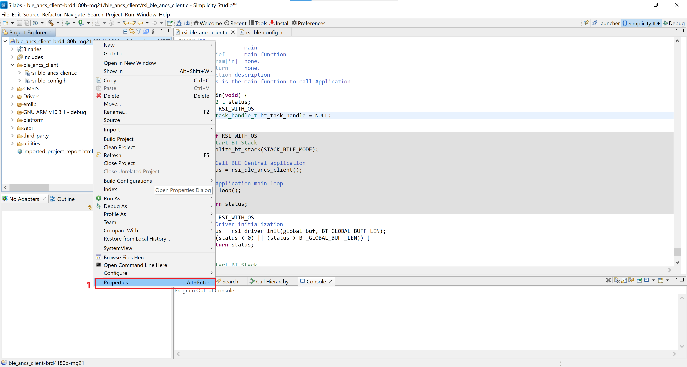<br>

2. The Properties window appears, navigate **c/c++ General → paths and symbols**.
   

3. Navigate to the **Symbols**, Click on the **GNU C** where the project default preprocessor macros appear.

4. To remove the **`RSI_WITH_OS`** macro choose the **`RSI_WITH_OS`** and click on the **delete** option.

5. Click on **Apply and close**.
   <br>
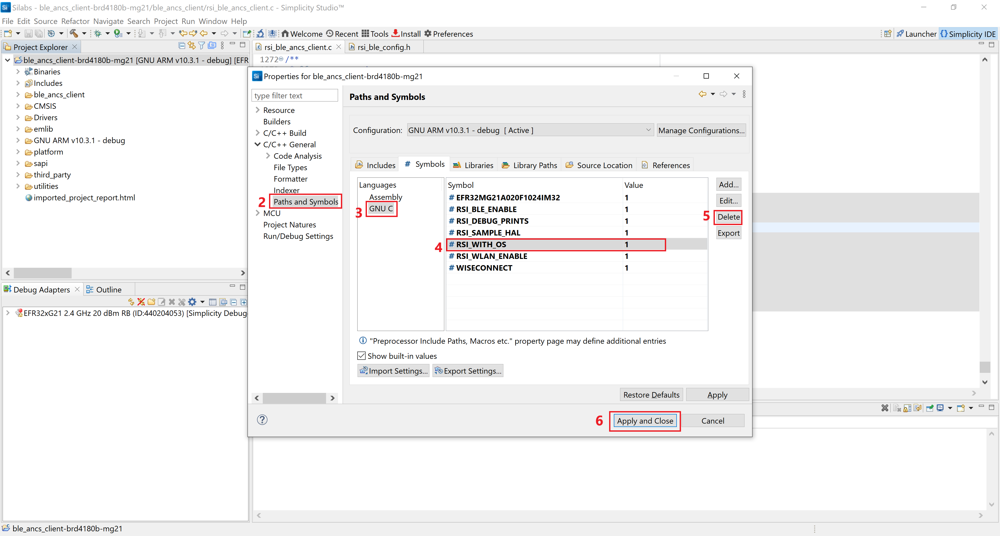<br>

6. Clean and build the project.

7. Right click on the **ble\_ancs\_client-brd4180b-mg21** / **ble\_ancs\_client-brd4180b-mg21** project and click on **Clean Project** option.
   <br>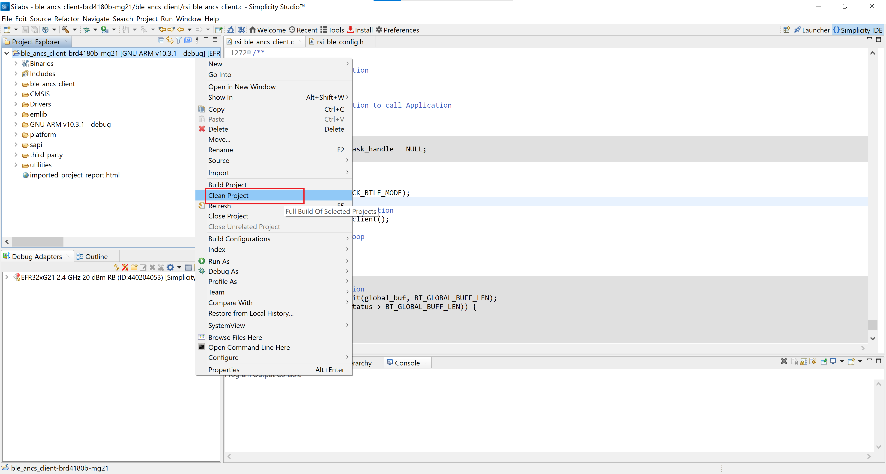<br>

8. Right click on the **ble\_ancs\_client-brd4180b-mg21** / **ble\_ancs\_client-brd4180a-mg21** project and click on **Build Project** option.
   <br><br>

9. Once the project is built, the application binary files are generated. 


### **Keil**

1.  Once the project is successfully imported, click on the **Options for Target**.

2. Navigate to the **C/C++** tab and remove the **`RSI_WITH_OS`** macro from the define and click on **OK** as shown below.
   <br><br>

3. To clean the project, Navigate to the **Project** tab and click on the **Clean Targets**.
   <br>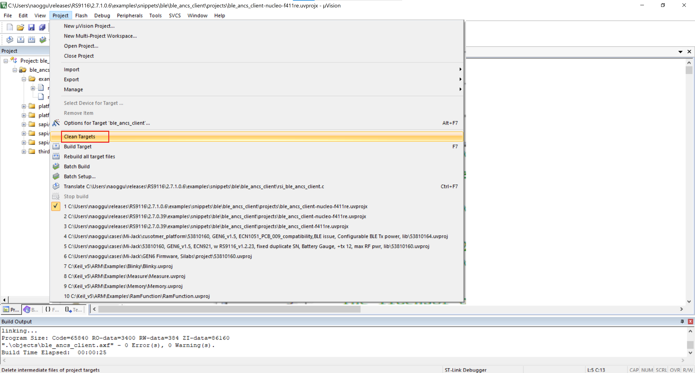<br>

4. To build the project, Navigate to the **Project** tab and click on the **Build Targets**.
<br><br>

5. Once the project is built, the application binary files are generated. 

## **Troubleshooting**
- If you face an issue with the Bluetooth default settings, try with the EFR Connect mobile app which is available in the Apple store.