# BLE Loop Back Test 

## About

The BLE loopback test is used to test the application-level data integrity of the RS9116W NCP Module. The performance should not degrade in presence of an interference signal as per the limits set by the test specifications. 
 

This example demonstrates the configuration of two RS9116W NCP Modules in a BLE Peripheral and BLE Central mode and establishes a connection between them. The Central device will send some data to the peripheral device onto the BLE Attribute Layer, and the Peripheral device will loop the data back to the Central device. 

Ensure that both the RS9116 NCP modules are plugged into your computer/laptop and tera-term is installed and connected as described in [Getting Started with PC using AT Commands](http://docs.silabs.com/rs9116-wiseconnect/2.4/wifibt-wc-getting-started-with-pc/).

## Prerequisites

## Hardware

**1.** Two RS9116 Evaluation Boards (RS9116W-SB-EVK1) / (RS9116W-DB-EVK1).

**2.** Two USB micro cables.

**3.** Windows PC/Laptop.

## Software 

**1.** tera-term Software. [tera-term](https://osdn.net/projects/ttssh2/releases/) 

## Steps to run the BLE Loopback test

**STEP 1.** Reset both the RS9116W NCP Module's.  

**STEP 2.** Open up the tera-term application and from the menu, select `Control->Macro`.
 
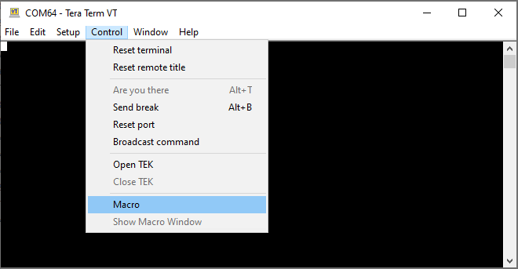

**STEP 3.** Download the script from the GitHub link provided above and navigate to the folder `/source` and select the file `ble_peripheral_loopback.ttl`.

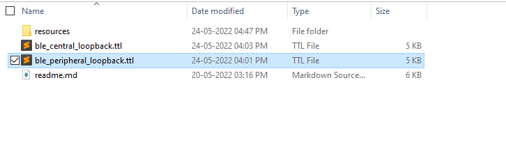

**STEP 4.**  After the ble_peripheral_loopback.ttl script is selected, a dialogue box window will appear as shown below and as a response, the user needs to click on "OK".

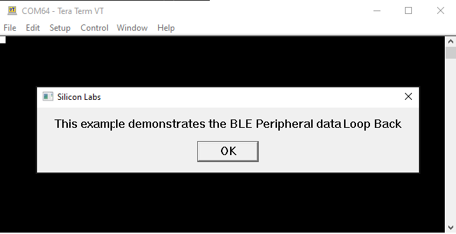

**STEP 5.** The RS9116W NCP Module bootloader options are executed by the script, the firmware is loaded into the module, and the corresponding dialogue window will be shown below.

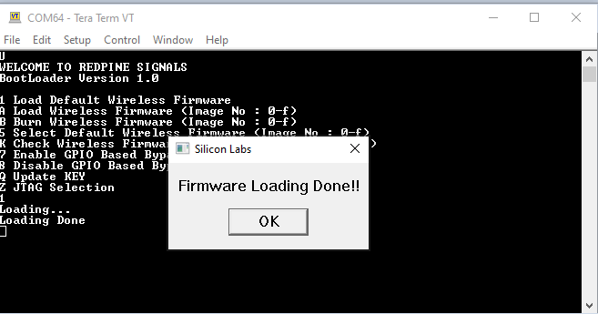

### Note:
		The sequence of AT Commands for the BLE Peripheral is given below.
		1. Get the RS9116W's Firmware version. 
		2. Set the Operating mode.
		3. Setting the local name of the RS9116W NCP Module. 
		4. Getting the Local Bluetooth address. 
		5. Set the data to be advertised. 
		6. Adding a service and its attributes.
		7. Advertise the RS9116W NCP Module. 
		8. Write to peer RS9116W NCP Module after connection.

**STEP 6.** After the commands are executed by the script, the RS9116W NCP Module is configured as a BLE peripheral device and can be scanned by other BLE devices. Click on "OK". 

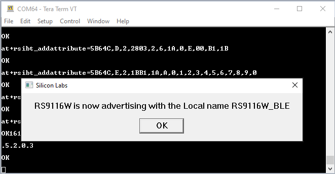

### Note:
	Connect another RS9116W NCP Module to the same computer/laptop and open up another tera-term application and open the port of the corresponding RS9116W NCP Module.

**STEP 7.**  In the tera-term menu, select `Control->Macro`.

**STEP 8.** From the downloaded example navigate to the folder `/source` and select the file `ble_central_loopback.ttl`.

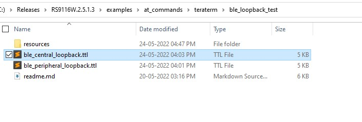

**STEP 9.** After the ble_central_loopback.ttl script is selected, a dialogue box window will appear as shown below and as a response, the user needs to click on "OK".

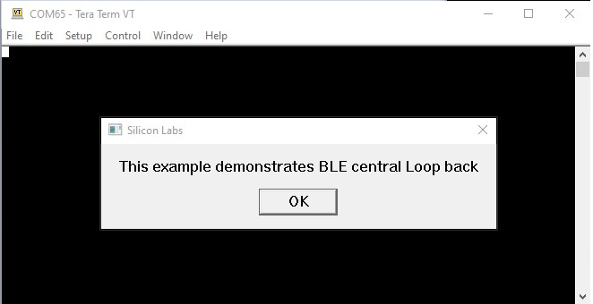

**STEP 10.** The RS9116W NCP Module bootloader options are executed by the script and the firmware is loaded into the module and BLE scanning command is sent to which the RS9116W NCP Module starts to scan. The corresponding dialogue window is shown below.  

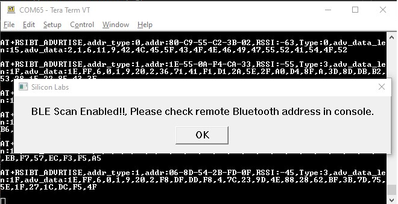

### Note:
		The sequence of AT Commands for BLE Peripheral is given below.
		1. Get the RS9116W's Firmware version. 
		2. Set the Operating mode.
		3. Setting the local name of the RS9116W NCP Module. 
		4. Getting the Local Bluetooth address.
		5. Adding a service and its attributes. 
		6. Scanning for other BLE devices. 
		7. Connect to the remote device. 
		8. Sending the peer devices 10 bytes of data. 
		9. Waiting for the data to be sent back. 
		10. Sending back the received data to the peer.

**STEP 11.** To disable the BLE scan the user needs to enter 0 into the input box, as shown below.

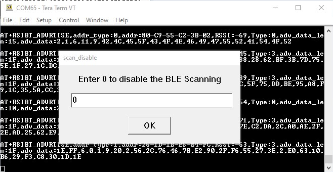

**STEP 12.** Click on "OK" to confirm the RS9116W NCP Module's scan is disabled.

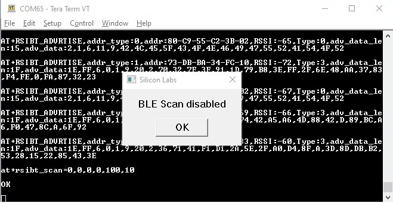

**STEP 13.** Enter the peer RS9116W NCP Module's Bluetooth address type. Which is 0 as RS9116W NCP Module advertises public address type. 

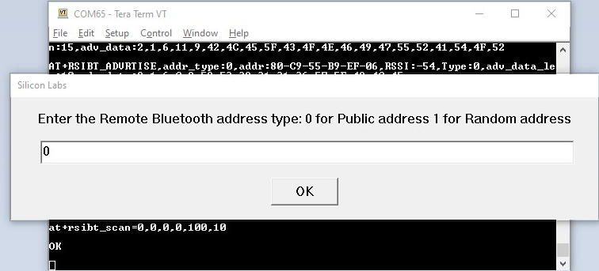

**STEP 14.** Enter the remote RS9116W NCP Module's Bluetooth address. 

### NOTE:
	To see the Bluetooth address of the remote RS9116W NCP Module, look for RS9116W_BLE on your mobile phone or in the RS9116W NCP Module peripheral console like in the below image.

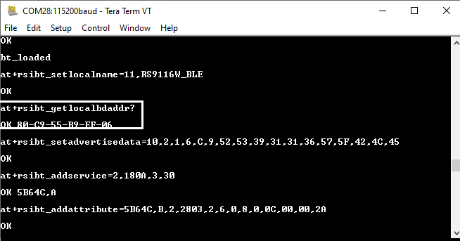

 

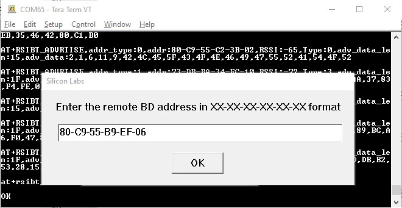

**STEP 15.** After connection to the peer. Below dialogue boxes are shown on both the central and peripheral sides. Click on "OK" on both dialogue boxes. 

Central side:
 

 
Peripheral side:

**STEP 16.** Next, the user needs to enter the number of times the data needs to be written to the peripheral device.

### NOTE: 
The value of data writes should be greater than 1 and enter 1 to transmit infinitely to the RS9116W peripheral device.	
 
Central side:

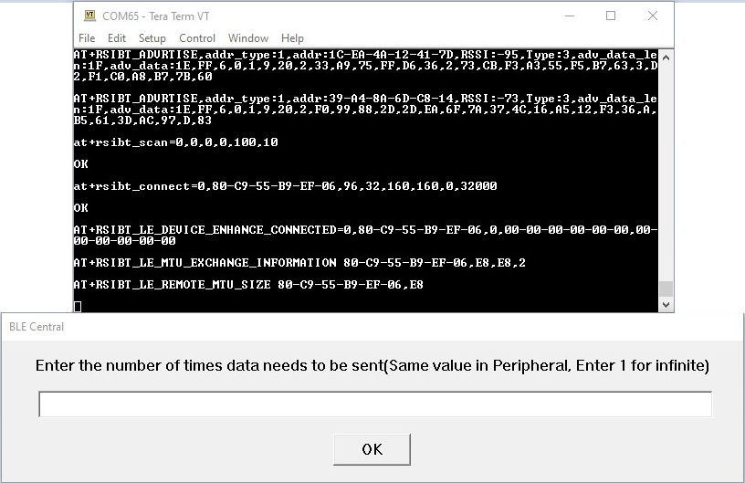.

**STEP 17.** The central device will send the write value command, to which the central RS9116W NCP Module will set the attribute value of the connected peer. The peripheral script waits for the data to arrive at it and reads the received data and pushes the data back to the central device using the write value command. 

Central side: 
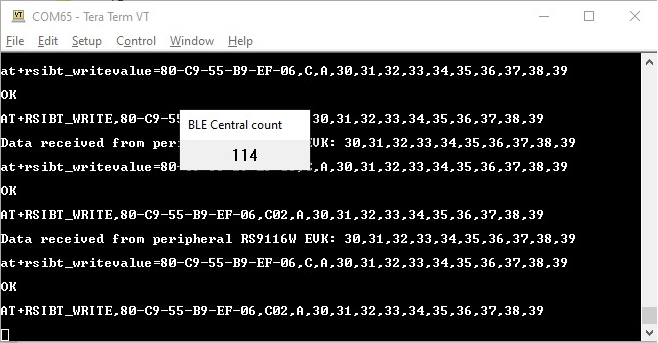.
  
Peripheral side:

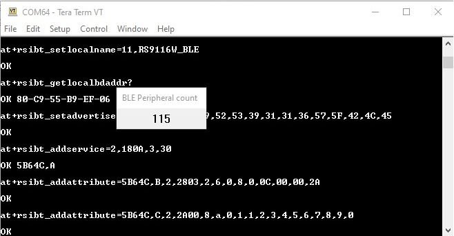.

**STEP 18.** After the configured number of writes has been completed, the user can again run the writes by entering 1 in the following dialogue box or can end the script by entering 0.   If the user enters 1, the script goes back to STEP 16. 

Central side: 
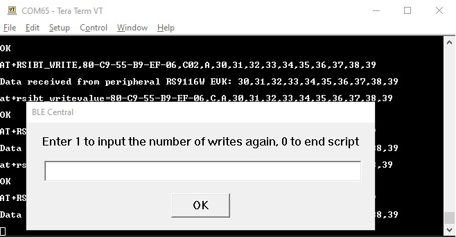.
 
If the user enters 0, the script ends.

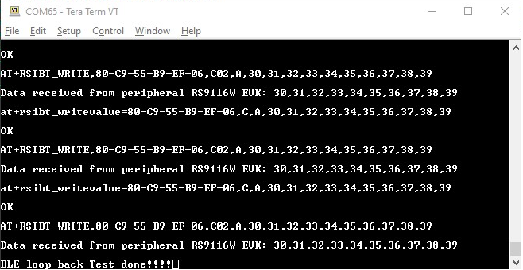

# Summary

This document helps the user to test BLE loopback tests with the RS9116 NCP module. This is performed with an RS9116 evaluation board in the office environment.

# References

1. [RS9116 NCP BLE AT Command Programming Reference Manual](https://docs.silabs.com/rs9116/wiseconnect/rs9116w-ble-at-command-prm/2.6/index)
2. [RS9116 NCP BT Classic AT Command Programming Reference Manual](https://docs.silabs.com/rs9116/wiseconnect/rs9116w-bt-classic-at-command-prm/2.6/)

# Troubleshooting

1. If the UART port is undetected by the PC, reset the module and try again. There's a reset button available on the module. If the port is still undetected, disconnect the module and re-connect the module to the PC.

2. Use a thick USB cable for avoiding losses and getting accurate results.

3. After every iteration of measurement with Spectrum Analyzer, ensure the module has been properly reset. 

4. If the Teraterm application stops midway, end the application, close the Teraterm window and re-run the application.

# Revision History

| **Revision No.**  | **Version No**  | **Date**  | **Changes**  |
|-------------------|-----------------|-----------|--------------|
| 1  | 1.1  | May, 2020  | Initial version

