# BLE Throughput Application


## Description

This Application demonstrates the procedure to measure the BLE throughputs either with the Notifications or with the Indications where the RS9116 NCP EVK is configured in a peripheral role. It also has the provision to measure the BLE throughputs by varying the PHY data rates and connection parameters. This application can be validated with different host MCU platforms like EFR32 and STM32.


## Introduction

The RS9116 NCP EVK is configured as a GATT server and the peripheral device. Based on the type of MCU, a push button is configured as an interrupt to control the data transfer, i.e., to start or stop the data transfer. on the EFR32, the push button "PB0" is configured as the interrupt and on the STM32, the Push button "B1” is configured as the interrupt for controlling the data transfer.

If the button is pressed, the RS9116 NCP EVK continuously sends the data, until it is pressed again. The application also has the provision to choose the PHY rate and connection parameters. Based on the number of packets sent and the time between the button ON/OFF action, the throughput is calculated and sent to the “Throughput Result” characteristic service and prints the same on the host MCU serial terminal.

## Prerequisites 

For this lab, the user will need the following:

### Hardware Requirements

- The Application project can been evaluated with any one of the following Host MCUs.

  - EFR32xG21 Starter Kit with Wireless Gecko (SLSWSTK6006A Baseboard: BRD4001A, Radio board: BRD4180a or BRD4180b)

  - STM32 - STM32F411RE 

- RS9116 Evaluation Board (RS9116W-SB-EVK1) / (RS9116W-DB-EVK1)

- Mini-USB to USB Type-A cable 

- Micro-USB to USB Type-A cable (included with RS9116X-SB-EVK1)

- Interconnect board and SPI ribbon cable (for SPI communication)

- One Female to Female connector(for the "RST-PS" pin connection)

- Windows PC with 2 USB ports

- BLE supported smartphone

### Software Requirements

- RS9116 NCP latest Software release is available in the below link.

  - Link: https://github.com/SiliconLabs/wiseconnect-wifi-bt-sdk

- Development Environment
  - For EFR32, use Simplicity studio
  - For STM32, use licensed Keil IDE 

- Simplicity Studio v5 (v5.1.2.0 or higher)

   a. Download the simplicity studio from [Simplicity Studio](https://www.silabs.com/developers/simplicity-studio).

   b. Follow the [Simplicity Studio user guide](https://docs.silabs.com/simplicity-studio-5-users-guide/1.1.0/ss-5-users-guide-getting-started/install-ss-5-and-software#install-ssv5) to install Simplicity Studio. 

- Keil 

   a. Refer to the [Keil](https://www.keil.com/) for downloading and installation procedure.

- [EFR Connect App](https://www.silabs.com/developers/efr-connect-mobile-app): Download and install this mobile application either on an Android or an IoS smartphone for evaluating this BLE application.

- [TeraTerm](https://ttssh2.osdn.jp/) software.

- **ble_throughput** project folder

**NOTE:** 
- Refer to [Update EVK Firmware ](https://docs.silabs.com/rs9116-wiseconnect/latest/wifibt-wc-getting-started-with-pc/update-evk-firmware) to load the firmware into the RS9116 NCP EVK. The firmware binary is located in \<Release\_Package\>/firmware/

- The application can be evaluated from the 2.5.0.24 SAPIS & Firmware. But recommended to use the latest SAPIS & Firmware.

- This example application supports Bare metal as well as FreeRTOS.

## Block Diagram

This section describes the block diagram of the BLE Throughput application.

****

The RS9116 NCP EVK and the host MCU are connected over the SPI interface and both are connected to the Windows PC with USB cables.

## Setup

This section describes the hardware setup and the connections for EFR32 and STM32 Host MCUs.

### **EFR32**
This section describes the hardware setup and the connections for EFR32.

   **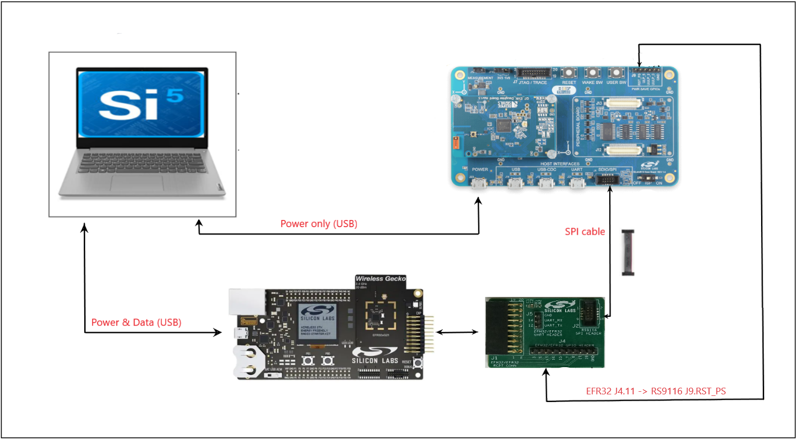**

   1. Connect the Interconnect adapter board provided with the RS9116 NCP Development Kit to the expansion header of EFR32.

   2. Connect the SPI header of Interconnect adapter board to the SPI connector of the RS9116 NCP EVK using the 10-pin ribbon cable (SPI cable) provided with RS9116 NCP Development kit.

   3. Connect the "RST_PS" pin on J9 header of RS9116 NCP EVK to the pin labeled 11 on the J4 header of the Interconnect adapter board using a female-to-female  connector.
   
   4. Ensure the ISP switch on the RS9116 NCP EVK is set to the OFF position. 
   
   5. Connect the EFR32 Starter Kit to a PC using a Mini USB cable.

   6. Connect the RS9116 NCP EVK to a PC using the USB cable labeled POWER. Note that this connection only provides power to the RS9116 NCP EVK, there is no USB communication over this connection.

      
If the interconnect board is not available, make the connections between RS9116 NCP EVK and EFR32 Host MCU with the SPI cable as described below.

**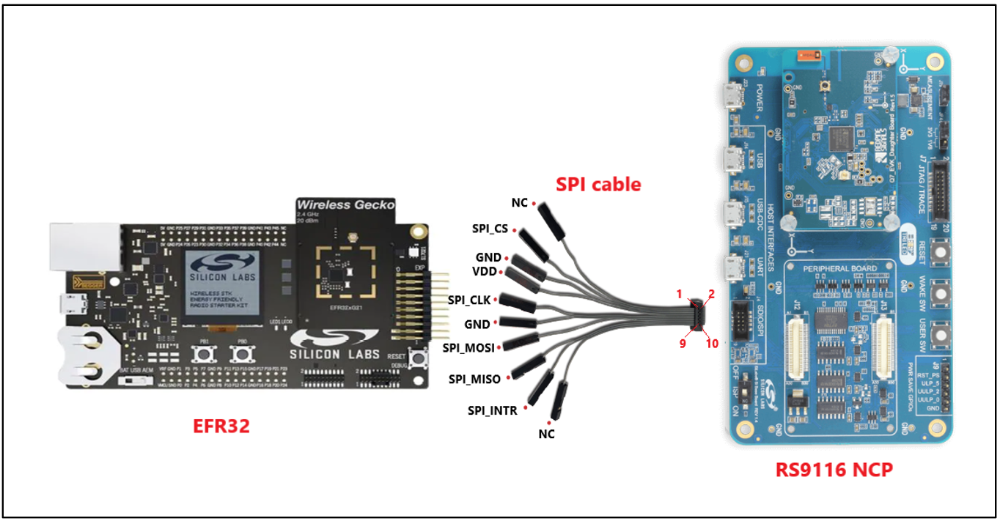**

**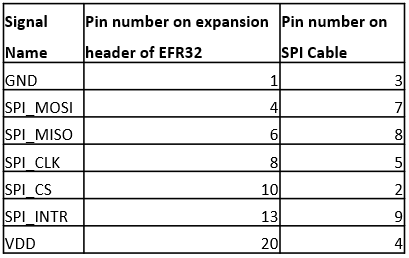**

### **STM32**

This section describes the hardware setup and the connections for STM32.

   ****
   
   1. Connect the RS9116 NCP EVK reset pin "RST_PS" to the STM32F11RE development board CN10 pin 6, to enable the STM32 to reset the RS9116 NCP EVK.

   2. As shown in the below image, connect the STM32F411RE board to the SPI connector of the RS9116 NCP EVK using the 10-pin ribbon cable provided with the RS9116 NCP EVK.

   ****

   **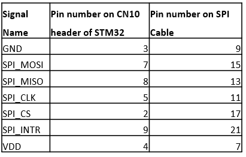**
  
  3. Ensure the ISP switch on the RS9116 NCP EVK is set to the OFF position. 

  4. Connect the STM32 MCU to a PC using a Mini USB cable.

  5. Connect the RS9116 NCP EVK to a PC using the USB interface labeled POWER. Note that this connection only provides power. There is no USB communication over this connection.


## Application flow 

This flow chart describes the application flow.

**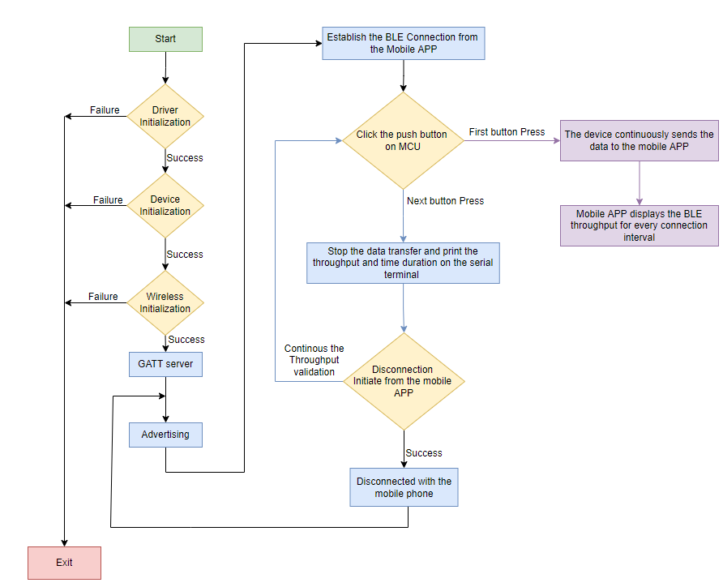** 

## Project Configurations

1. Download the BLE throughput application. When the desired SDK is available, place the **ble_throughput** project folder in the SDK path **<Simplicity_Studio_Installed_Path>\SimplicityStudio\v5\developer\repos\wiseconnect-wifi-bt-sdk\examples\snippets\ble**, else clone or download the desired SDK to your drive at any location (ensure this does not a long path) and that location will be your SDK path <SDK_path>.

     ```
   git clone https://github.com/SiliconLabs/wiseconnect-wifi-bt-sdk.git --branch=<tag name> 
   ```
   In this case, the tag used is **2.6.0**. Hence the command given is as follows:

   ```
   git clone https://github.com/SiliconLabs/wiseconnect-wifi-bt-sdk.git --branch=2.6.0 
   ```
   **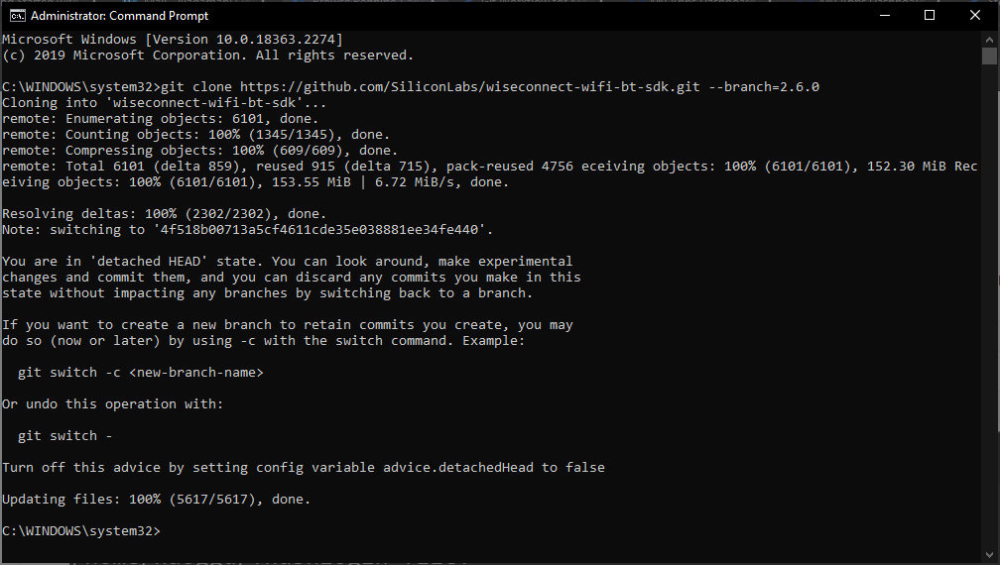**    

2.  Now, place the **ble_throughput** project folder in the above cloned SDK at path: **\<SDK_path\> → examples → snippets → ble**
   **** 	

3. Ensure the RS9116 NCP EVK is pre-loaded with the latest firmware, Refer to [Update EVK Firmware ](https://docs.silabs.com/rs9116-wiseconnect/latest/wifibt-wc-getting-started-with-pc/update-evk-firmware) to load the firmware.

## Import the project in Keil

The following section describes how to set up keil IDE in Windows Operating System.

1. Navigate to the path, **\<SDK_path\> → examples → snippets → ble → ble\_throughput → projects** in the downloaded release SDK.

2. Click on the "ble_throughput-nucleo-f411re" project. 

    **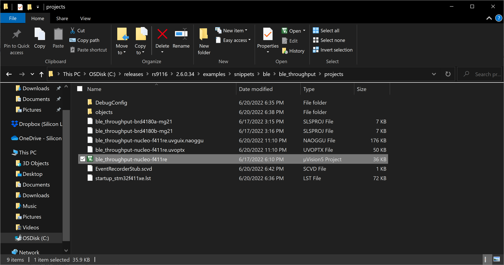** 

3. The project will be open in the keil IDE. Open the "rsi_ble_throughput.c"as application file.

   **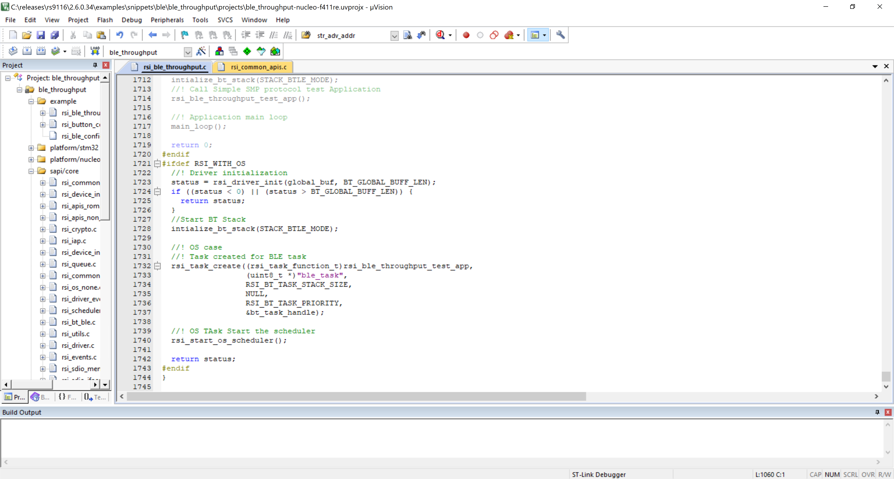** 

## Setting up the development environment in simplicity studio

The following section describes how to set up Simplicity IDE in Windows Operating System.

1. Launch the Simplicity Studio IDE on your PC.

2. Select the desired path as the workspace directory. The following directory has been chosen for the workspace as shown in the image below.

3. Click on **Launch**.

   ****

4. Check the default repo to which the Simplicity Studio IDE is linked to.

   a. In the Simplicity Studio IDE, go to 
    **Preferences > Simplicity Studio > External Repos**. 

   **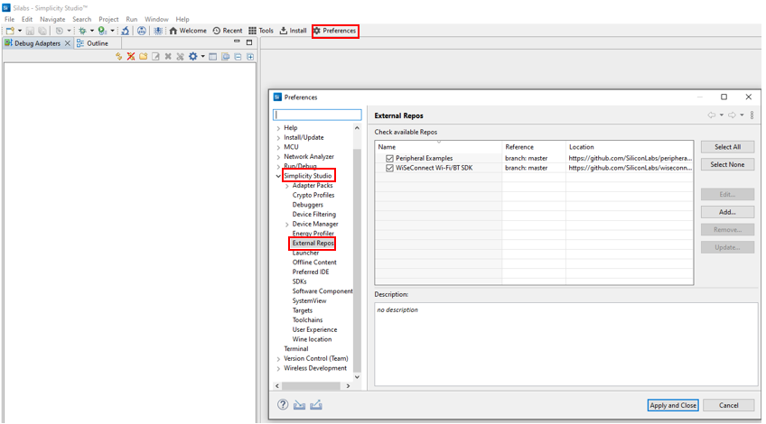**

   b. By default, the latest **WiseConnect Wi-Fi/BT SDK** repo is linked to external repos. Click on **update** as shown below so that the latest SDK at https://github.com/SiliconLabs/wiseconnect-wifi-bt-sdk gets cloned at path: 
   **<Simplicity_Studio_Installed_Path>SimplicityStudio\v5\developer\repos\wiseconnect-wifi-bt-sdk**.

   ****

   c. After updating the repo, the SDK gets updated locally as shown below.

   **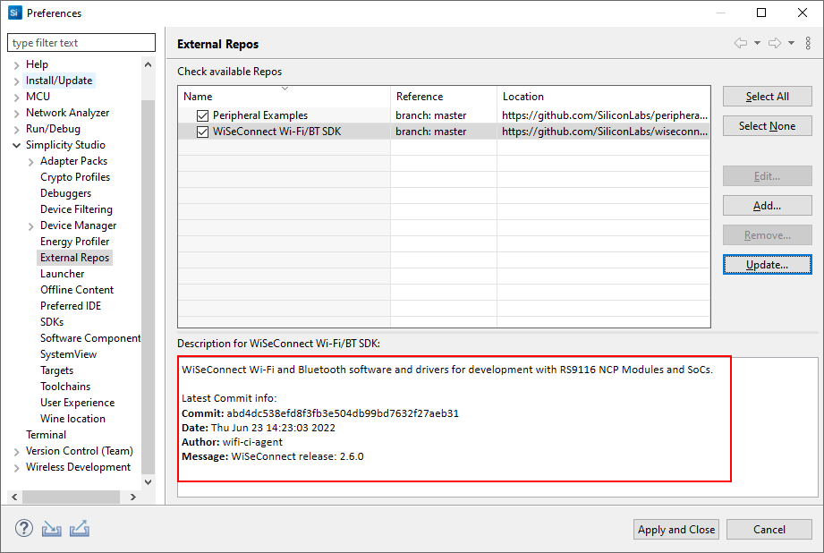**

   **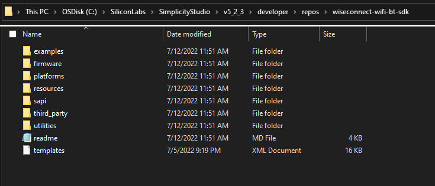**

5. Ensure the EFR32 and RS9116 NCP setups are connected to your PC.

6. When EFR32 is connected to the PC, radio board detection is indicated as below.

   **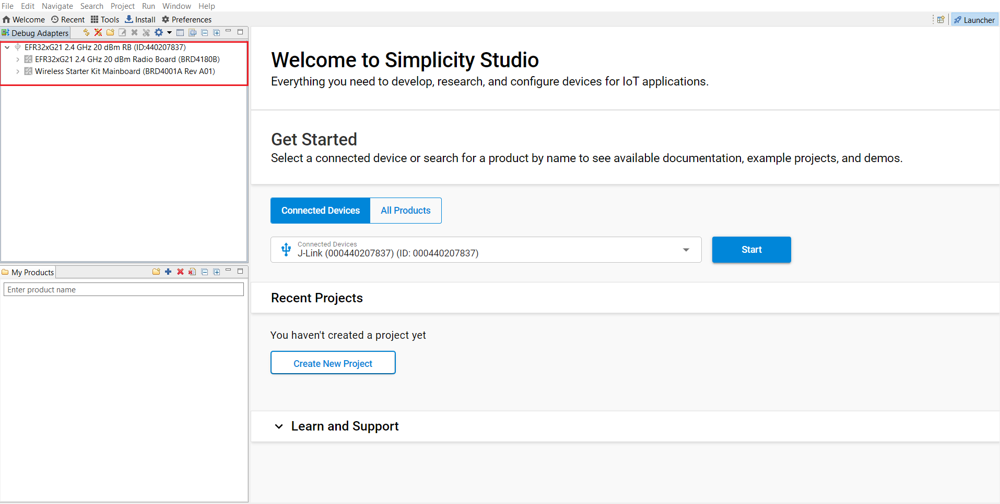**

**Note:** While importing, select the project based on the radio board version:

- For **BRD4180A**, select the project related to brd4180a.
- For **BRD4180B**, select the project related to brd4180b.


### Import the Project in simplicity studio

This section provides the steps for importing the project into Simplicity Studio IDE.

1. In the Simplicity Studio IDE, go to **File** and select **Import**.

   ****

2. A pop up window appears.Click on **Browse**.

3. Navigate to the path, **\<SDK_path\> → examples → snippets → ble → ble\_throughput → projects** in the downloaded release SDK.

4. Select the appropriate project as per the detected radio board variant i.e., **ble\_throughput\-brd4180a-mg21** → **BRD4180A**.
**ble\_throughput\-brd4180b-mg21** → **BRD4180B**.

5. Click on **Next** → **Next**.

   **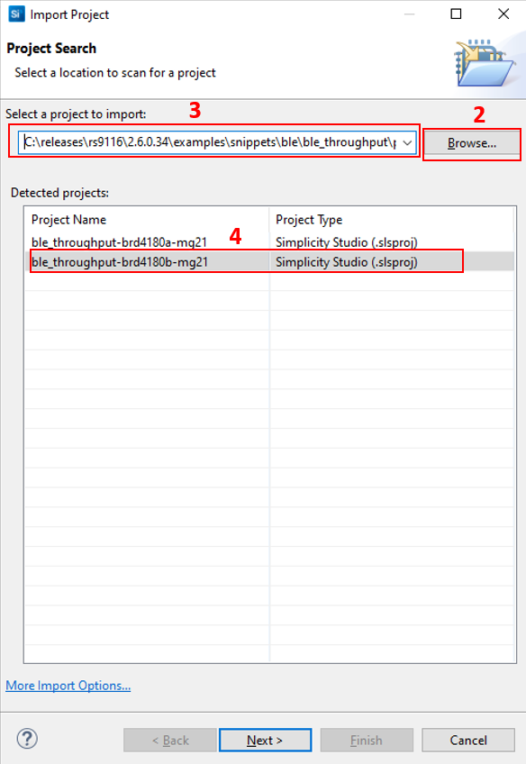** 

6. Now click on **Finish**.


### Application Configurations

1. Once the project is successfully imported, the project name appears in the Project Explorer tab.

2. Expand the project folder by clicking on drop down.

3. Open the **rsi\_ble\_throughput.c** file present in **ble\_throughput-brd4180b-mg21 → ble\_throughput** folder.

   **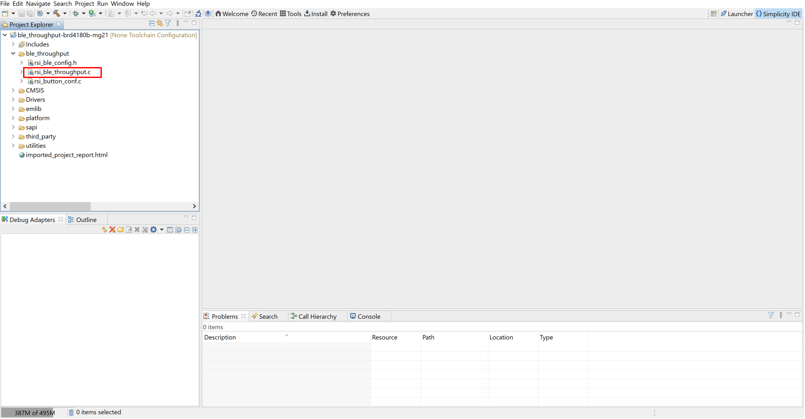** 

**Note**:
The required features are already set with the default values. Following are the non-configurable macros in the application:

- “RSI_REMOTE_DEVICE_NAME” refers to the name of the remote device to which the RS9116 NCP EVK has to connect.
   ```c

   #define RSI_BLE_DEVICE_NAME                        "Throughput Test"
   ```

4. Open rsi_ble_config.h file which is present under “ble_throughput” folder and update/modify following macros,

  - The application has the provision to measure the throughput for both notifications and indications. **“THROUGHPUT\_TYPE”** MACRO refers to the type of throughput either “Notifications” or “Indications”.

   When the “THROUGHPUT_TYPE”  is configured as “WRITE_WITHOUT_RESPONSE”, The RS9116 NCP EVK is configured for “Notifications”.
   ```c
   #define  THROUGHPUT_TYPE                      NOTIFICATIONS
   ```  

   When the “THROUGHPUT_TYPE”  is configured as “WRITE_WITH_RESPONSE”, The RS9116 NCP EVK is configured for “Indications”.

   ```c
   #define  THROUGHPUT_TYPE                       INDICATIONS
   ```    
  - Depending on the TX_PHY_RATE and RX_PHY_RATE MACROs the below configurations are valid.
      - For 2Mbps the TX_PHY_RATE & RX_PHY_RATE values is 0x02

      - For 1Mbps the TX_PHY_RATE & RX_PHY_RATE values is 0x01

      - For Coded-500K the TX_PHY_RATE & RX_PHY_RATE values is 0x04

   //! Phy parameters
   ```c
   #define TX_PHY_RATE         0x02
   #define RX_PHY_RATE         0x02
   ```
 - The "Coded-PHY"  rates to be choose as below
      - For Coded-500K the CODED_PHY_RATE value is 0x01
      - For Coded-125K the CODED_PHY_RATE value is 0x02
      - For Uncoded -PHY (1Mbps & 2 Mbps) the CODED_PHY_RATE value should be 0x00

```c
#define CODED_PHY_RATE          0x00
```
//! Connection update params

```c

#define CONN_INTERVAL_MIN        0x08

#define CONN_INTERVAL_MAX        0x08

#define CONN_LATENCY             0

#define SUPERVISION_TIMEOUT      800

```
- “RSI_BLE_CHAR_SERV_UUID” refers to the attribute type of the characteristics to be added to a service.
   ```c
   #define RSI_BLE_CHAR_SERV_UUID                        0x2803
   ```

- “RSI_BLE_CLIENT_CHAR_UUID” refers to the attribute type of the client characteristics descriptor to be added to a service.
   ```c
   #define RSI_BLE_CLIENT_CHAR_UUID                      0x2902
   ```

- “RSI_BLE_CLIENT_CHAR_DESP” refers to the attribute type of the client characteristics a user descriptor to be added to a service.

    ```c
    #define RSI_BLE_CLIENT_CHAR_DESP                      0x2901
    ```

- “RSI_BLE_ATT_PROPERTY_READ” is used to set the ”READ” property to an attribute value.
   ```c
    #define RSI_BLE_ATT_PROPERTY_READ                    0x02
    ```

- “RSI_BLE_ATT_PROPERTY_WRITE” is used to set the “WRITE” property to an attribute value.
   ```c
    #define RSI_BLE_ATT_PROPERTY_WRITE                   0x08
    ```

- “RSI_BLE_ATT_PROPERTY_NOTIFY” is used to set the “NOTIFY” property to an attribute value.

    ```c
    #define RSI_BLE_ATT_PROPERTY_NOTIFY                   0x10
    ```

- “RSI_BLE_ATT_PROPERTY_INDICATE” is used to set the “INDICATE” property to an attribute value.

    ```c
    #define RSI_BLE_ATT_PROPERTY_INDICATE                 0x20
    ```

- “RSI_BLE_ATT_PROPERTY_WRITE_NO_RESPONSE” is used to set the “WRITE WITH NO RESPONSE” property to an attribute value.

    ```c
    #define RSI_BLE_ATT_PROPERTY_INDICATE                 0x04
    ```

- “BT_GLOBAL_BUFF_LEN” refers Number of bytes required by the application and the driver.

   ```c
    #define BT_GLOBAL_BUFF_LEN                           15000
    ```
Note: rsi_ble_config.h file is already set with the desired configurations in the respective example folder. Users may not be required to change them for this example except "THROUGHPUT_TYPE". By default the "THROUGHPUT_TYPE" is configured to the "NOTIFICATIONS". If you want to validate the "INDICATIONS" the "THROUGHPUT_TYPE" parameter need to be updated.

## Execution of Project

### Set up the Serial COM port on Simplicity Studio IDE

The Serial COM port interface is used for printing out debug prints from the application.
1.  When the EFR32 / STM32 is connected to the PC, the EFR32/STM32 serial port is automatically detected as shown below.
   ****
   ****

2. When the EFR32/STM32 is connected, Open the Teraterm tool and choose the detected EFR32/STM32 serial port and click on "OK" as shown below.

   ****

   **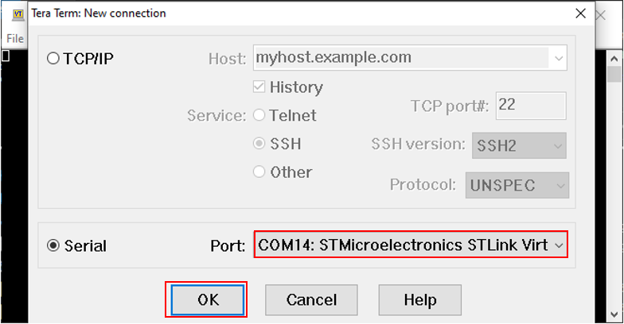**

3. Once the EFR32/STM32 is detected, Navigate to the **setup** → **Terminal** and update the below specified setup information as shown in the below image, and click on "OK".
   ****

   ****

4. Navigate to the **setup** → **Serial port** and update the baud rate to "115200" and click on "OK".
   **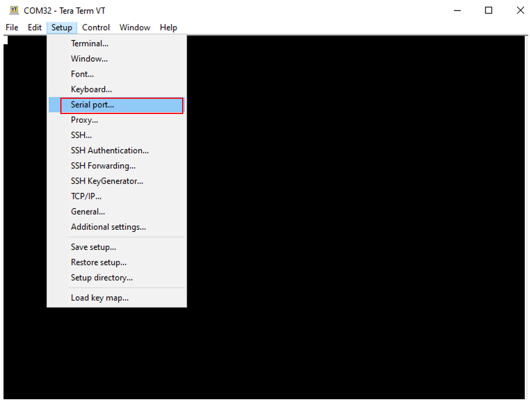**

   ****
5. The EFR32/STM32 serial port is connected and the teraterm terminal displays the debug prints in the application.

### **Build the project**

- For STM32: Click on the build project option as shown in the figure to build the project.
   
   **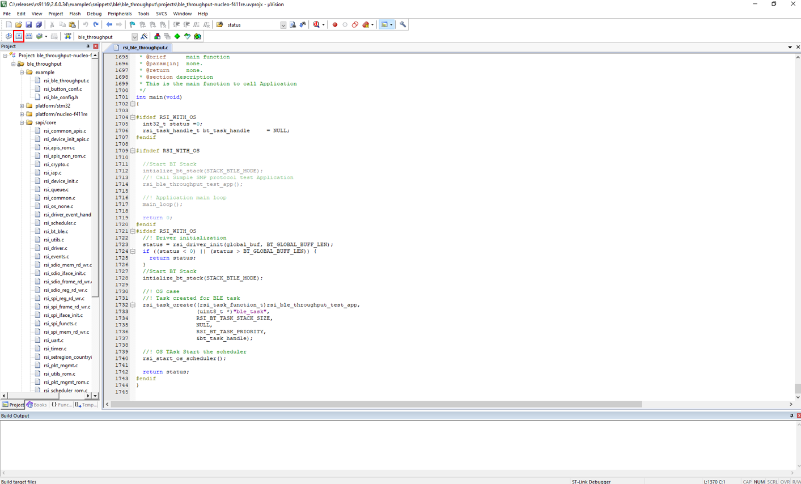**

- For EFR32: Click on the build project option as shown in the figure to build the project.
   
   **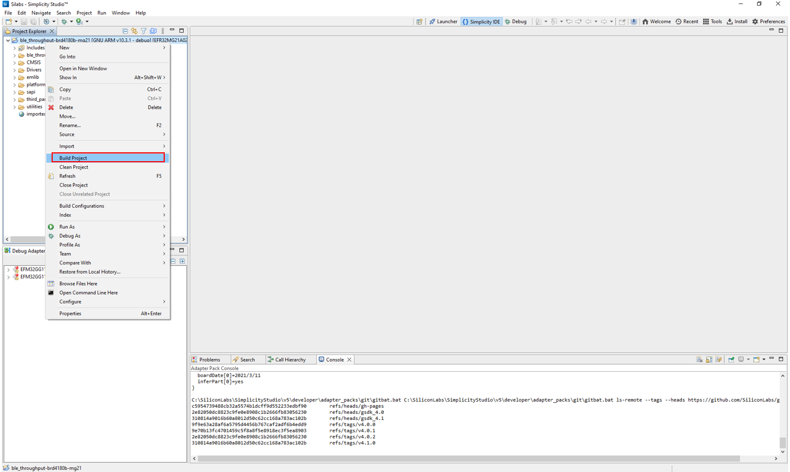**

- When the build process is completed, the project corresponding binary files are generated.

### **Debug the project**

- **EFR32:**
   - To flash the code, right-click on the project name and select **Debug As** → **Silicon Labs ARM Program**.
      - If the EFR32xG21 has an older SE firmware, the following warning may pop up. Click ‘Yes’ to continue
      ****

      - If the connected EFR32 board has any other radio board other than 20dbm, Simplicity Studio will not be able to detect the device and gives the below pop-up window for Device Selection. Select the device displayed and click OK.
      
         ****

      - The following warning may pop-up as shown below, click Yes and continue. 

         **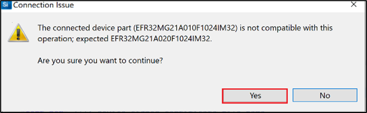**

- **STM32:**
   - To flash the code, click on the debug option as shown in the below image.
      ****
- As soon as the debug process is completed, the application control branches to the main() function.

### **Execute the Project**

This section demonstrates the execution flow of the application based on the configuration set by the user.

- Once the program gets executed, as per the above configuration the RS9116 NCP EVK acts as a **"GATT** **SERVER”** and a peripheral device where the RS9116 NCP EVK advertises as “Throughput Test”.

- In the EFR connect mobile application, navigate to the Demos section then select the “Throughput” demo. Under the “Throughput” demo project you can observe the RS9116 NCP EVK advertising as a “Throughput Test” as demonstrated in the below image.
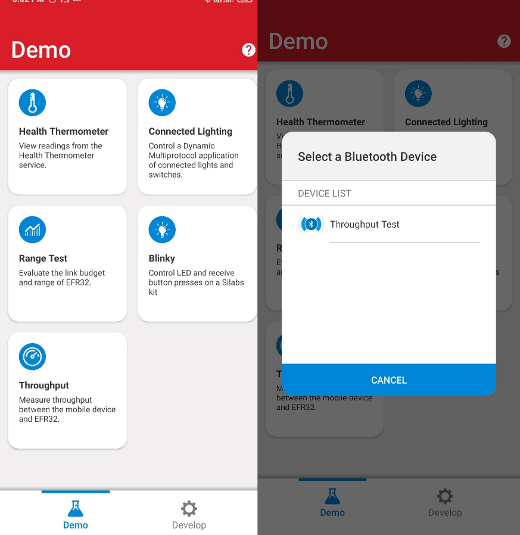

- Initiate the connection from the mobile application. Once the connection is successfully established, the RS9116 NCP EVK automatically tries to establish a secure connection.

- During the secure pairing, the mobile phone gets a pop-up message to connect. Click on the “pair & connect” option as demonstrated in the below image.
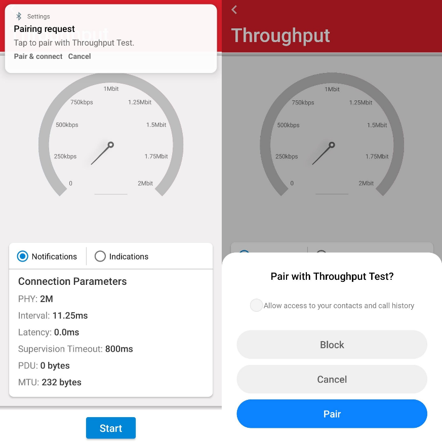

- Once the secure connection is successfully established, the PHY, connection interval, slave latency, supervision timeout, PDU & MTU sizes are updated as demonstrated in the above image.

- The application has the provision to verify the throughput for the below properties.

  - Notifications

  - Indications

### **Notifications**

- If the RS9116 NCP EVK is configured for the “Notifications”, RS9116 NCP EVK sends the data in the form of notifications to the remote device when the button is pressed.

- Once the secure connection is successfully established, the PHY, connection interval, slave latency, supervision timeout, PDU & MTU sizes are updated as demonstrated in the below image.

   

- For the EFR32 host MCU platform, a user needs to click on the “Push button PB0”. Once the button is pressed, the interrupt is triggered and the RS9116 NCP EVK sends the data to the remote device.

   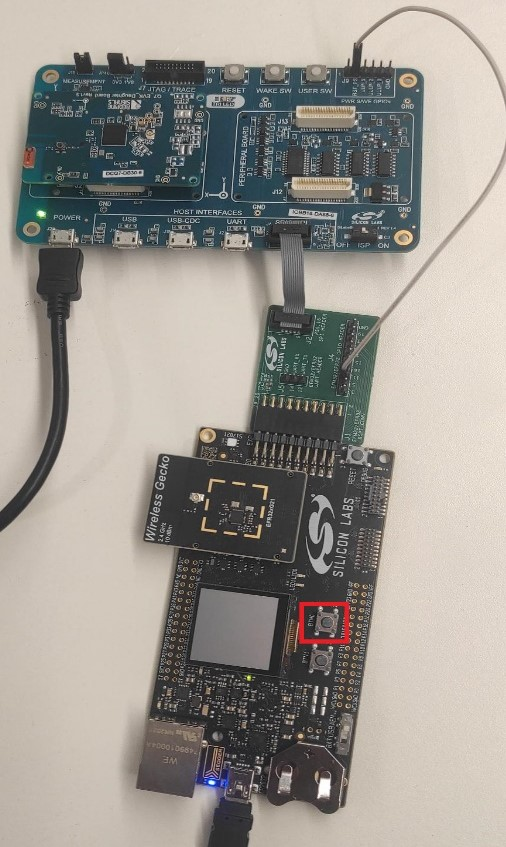

- For the STM32 host MCU platform, a user needs to click on the Push button "B1” (which indicates in blue color). Once the button is pressed, the interrupt gets triggered in the application and the RS9116 NCP EVK sends the data to the remote device.

   

- The EFR connect application continuously receives the data and displays the RSSI value of the corresponding packet. As the RSSI value changes, the meter deflection is also updated accordingly as demonstrated in the image.

   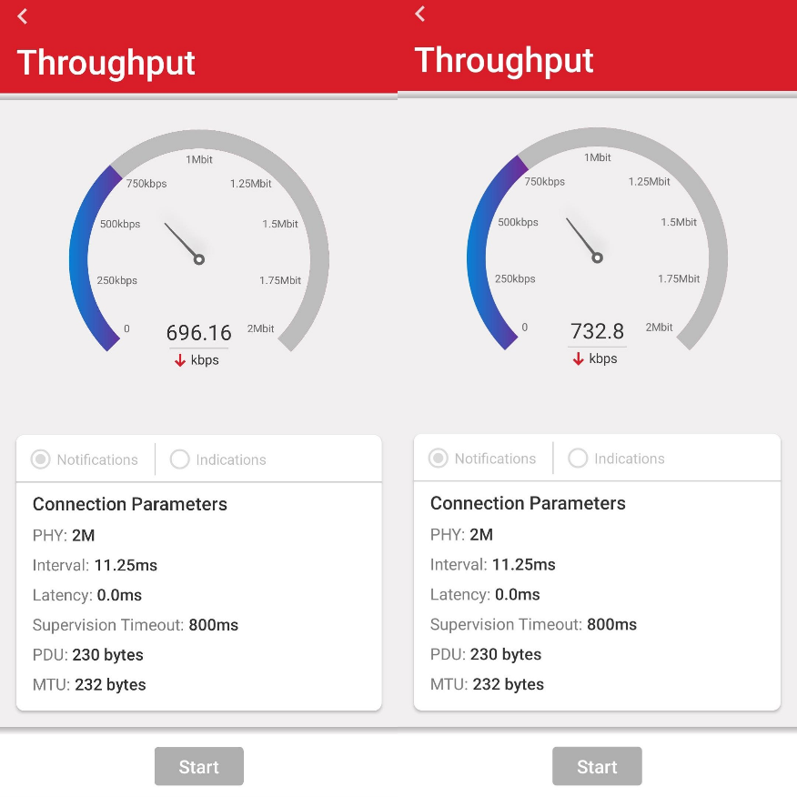

- To stop the data transfer the a user needs to click on the Push button "PB0" again on the EFR32 platform and similarly the Push button "B1” for the STM32 platform. Automatically the interrupt gets triggered and the notifications are disabled. The final throughput is displayed on the host MCU (either EFR32 or STM32) serial terminal as shown in the below image.

   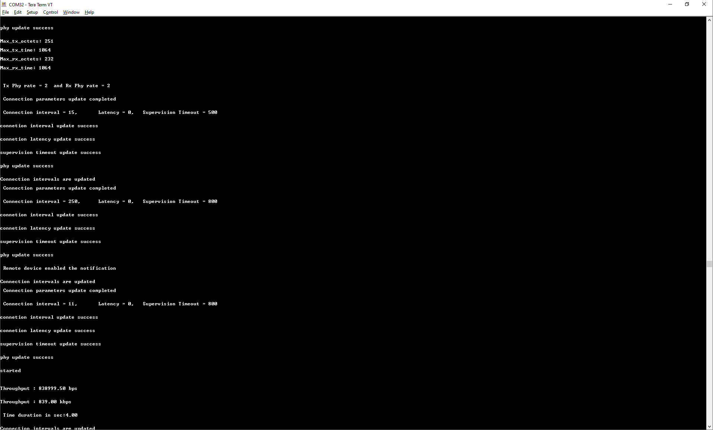

### **Indications**

- If the RS9116 NCP EVK is configured for the “Indications”, RS9116 NCP EVK sends the data in the form of indications to the remote device after the button is pressed.

- Once the secure connection is successfully established, the PHY, connection interval, slave latency, supervision timeout, PDU & MTU sizes are updated as demonstrated in the below image.

   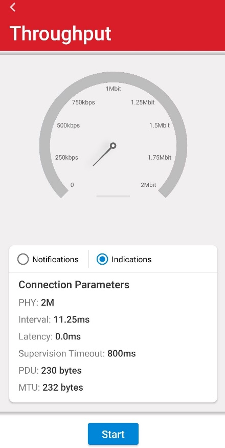

- For the EFR32 host MCU platform, a user needs to click on the “Push button PB0”. Once the button is pressed, the interrupt gets triggered and the RS9116 NCP EVK sends the data to the remote device.

   

- For the STM32 host MCU platform, a user needs to click on the “Push button B1” (which indicates in blue color). Once the button is pressed, the interrupt gets triggered and the RS9116 NCP EVK sends the data to the remote device.

   

- The EFR connect application continuously receives the data and displays the RSSI value of the corresponding packet. As the RSSI value changes then the meter deflection is also updated accordingly as demonstrated in the image.

   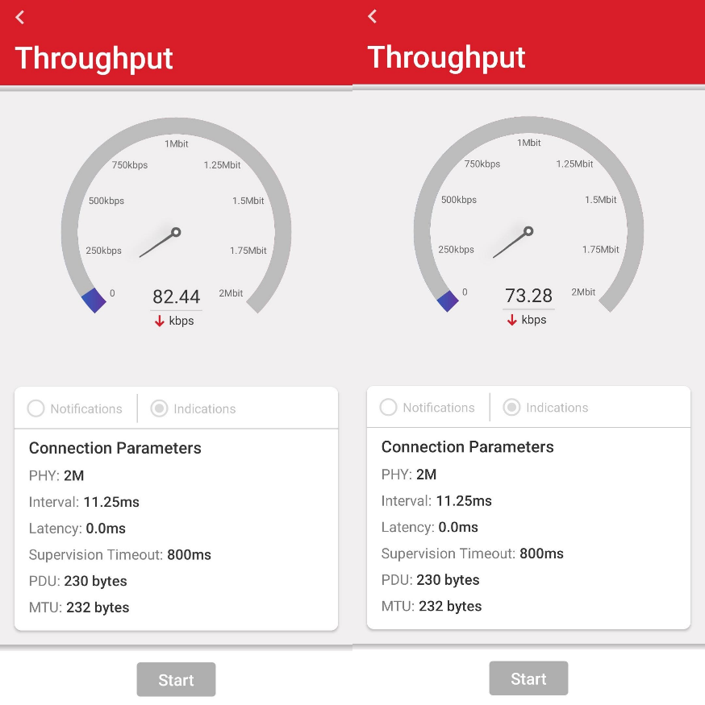

- To stop the data transfer the user needs to click on the "Push button PB0" again on the EFR32 platform and similarly the “Push button B1” for the STM32 platform.  Automatically the interrupt gets triggered and the indications are disabled. The final throughput is displayed on the host MCU (either EFR32 or STM32) serial terminal as shown in the below image.

   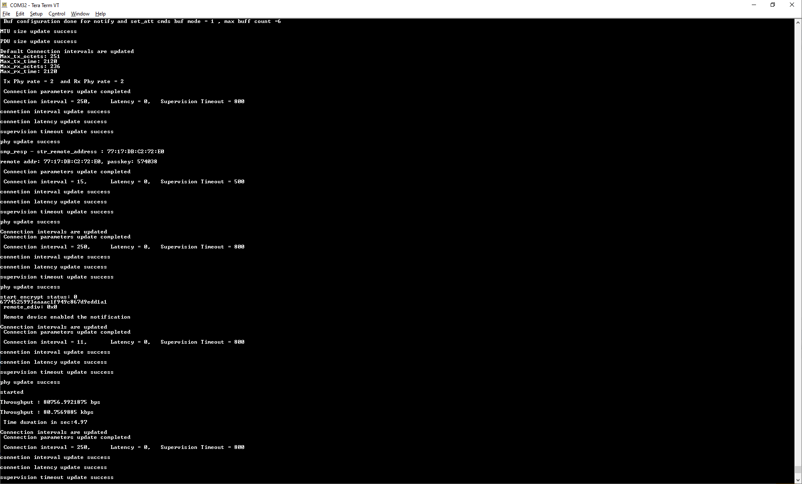

## Observations

Below are the observations taken in the ideal environment (RF chamber) at different data rates for EFR32 and STM32 host MCU platforms with 2.5.0.24 SAPIS & firmware.

| S.No | Data rate | time | EFR32 MCU Notifications | EFR32 MCU Indications |STM32 MCU Notifications | STM32 MCU Indications|           
|------|-------|------|-----------|-----------|     -------------|-------------|
| 1 | 2Mbps | 10sec | 882.9kbps | 83.1kbps | 868.1kbps | 86.2kbps |
| 2 | 2Mbps | 30sec | 828.4kbps | 81.3kbps | 809.5kbps | 80.3kbps |
| 3 | 1Mbps | 10sec | 181.6kbps | 52.9kbps | 204.9kbps | 51kbps |
| 4 | 1Mbps | 30sec | 179.6kbps | 48.5kbps | 193.8kbps | 50.6kbps |
| 5 | 500kbps | 10sec | 44.1kbps | 27.6kbps | 43.1kbps | 27.3kbps |
| 6 | 500kbps | 30sec | 41.4kbps | 27.6kbps | 41.3kbps | 27kbps |

## Optional features

1. By default, the application runs on FreeRTOS. Remove the `RSI_WITH_OS` preprocessor symbol to run the application on Bare metal.

## Baremetal Configurations

### **Simplicity studio**
1. Once the project is imported, Right-click on the **ble\_throughput-brd4180b-mg21** / **ble\_throughput-brd4180a-mg21** project and navigate to the properties and click on it.

   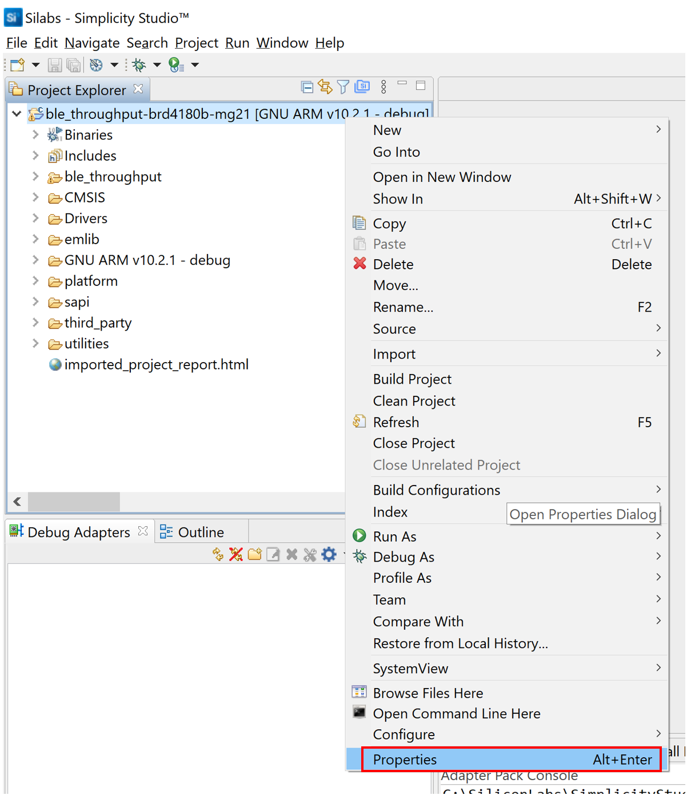

2. The Properties window appears, navigate **c/c++ General → paths and symbols**.
   

3. Navigate to the **Symbols**, Click on the **GNU C** where the project default preprocessor macros appear.

4. To remove the **`RSI_WITH_OS`** macro choose the **`RSI_WITH_OS`** and click on the **delete** option.

5. Click on **Apply and close**.
   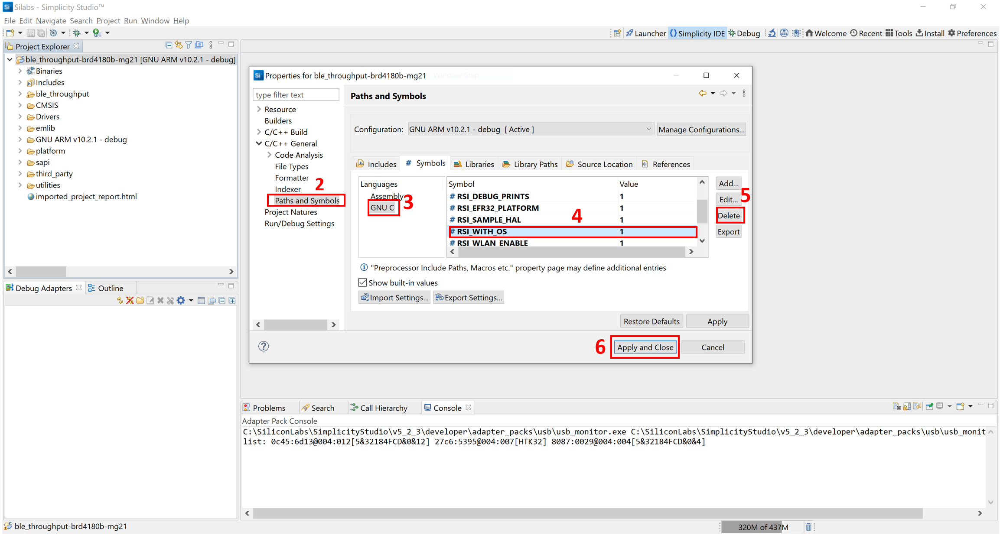

6. Clean and build the project.

7. Right click on the **ble\_throughput-brd4180b-mg21** / **ble\_throughput-brd4180b-mg21** project and click on **Clean Project** option.
   

8. Right click on the **ble\_throughput-brd4180b-mg21** / **ble\_throughput-brd4180a-mg21** project and click on **Build Project** option.
   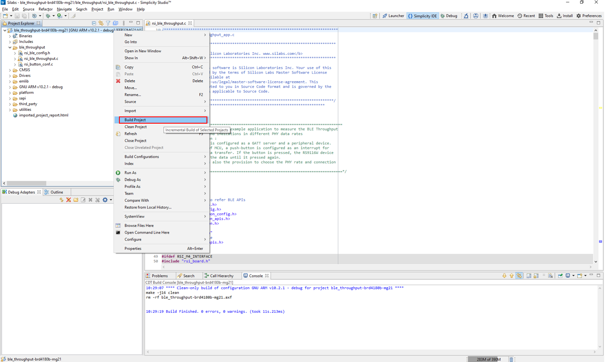

9. Once the project is built, the application binary files are generated. 


### **Keil**

1.  Once the project is successfully imported, click on the **Options for Target**.

2. Navigate to the **C/C++** tab and remove the **`RSI_WITH_OS`** macro from the define and click on **OK** as shown below.
   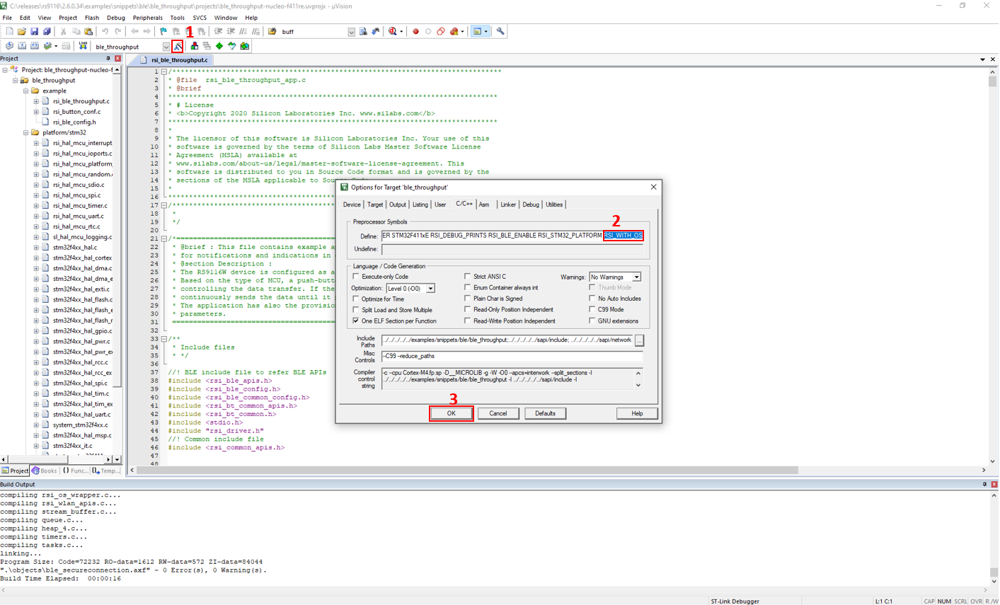

3. To clean the project, Navigate to the **Project** tab and click on the **Clean Targets**.
   

4. To build the project, Navigate to the **Project** tab and click on the **Build Targets**.
   

5. Once the project is built, the application binary files are generated. 

