# BLuetooth PER mode TTL Scripts
<!-- TOC -->

- [Introduction](#introduction)
- [Terminology](#terminology)
- [Prerequisites](#prerequisites)
    - [Hardware](#hardware)
    - [Software](#software)
    - [Setup Diagram](#setup-diagram)
- [Bluetooth PER Mode Execution](#bluetooth-per-mode-execution)
    - [BLE](#ble)
    - [BT Classic](#bt-classic)
- [Summary](#summary)
- [Troubleshoot](#troubleshoot)
- [References](#references)

<!-- /TOC -->

# Introduction

This document details the requirements, steps and commands needed for the execution of BT Classic/BLE PER mode via RS9116 NCP module using AT commands. Customers going for regulatory tests (FCC, CE/RED, TELEC, etc) can utilize this script to setup the module in PHY test mode.

# Terminology

1. EVK - Evaluation Kit
2. DUT - Device Under Test
3. BT Classic - Bluetooth Classic
4. BLE - Bluetooth Low Energy
5. PER - Packet Error Rate
6. CW - Continuous Wave

# Prerequisites

## Hardware

1. Windows PC
2. Two RS9116 NCP EVK along with USB-Micro cable

## Software
1. Tera-term application. Download [link](https://ttssh2.osdn.jp/index.html.en)

### PER Commands

1. For BT Classic PER commands, refer [RS9116 NCP BT PER AT COMMANDS](https://docs.silabs.com/rs9116/wiseconnect/rs9116w-bt-classic-at-command-prm/2.6/08-bt-classic-commands#rsibt-perstats----per-stats) 
2. For BLE PER commands, refer [RS9116 NCP PER AT COMMANDS](https://docs.silabs.com/rs9116/wiseconnect/rs9116w-ble-at-command-prm/2.6/08-ble-commands#rsibt-bletransmit----ble-per-transmit)  

## Setup Diagram
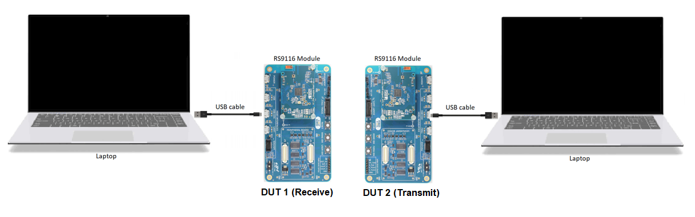 

> **Note:** The test can also be performed on a single PC/Laptop with multiple instances of Teraterm running simultaneously.

# Bluetooth PER Mode Execution

Refer [Getting Started with PC using AT Commands](http://docs.silabs.com/rs9116-wiseconnect/2.4/wifibt-wc-getting-started-with-pc/) for getting hands on experience with TeraTerm. In this example, two RS9116 NCP modules are used to perform Receive and Transmit simultaneously. However, its possible to perform only Tx and only Rx activity.

### 
***Teraterm Settings***

1. Configure the serial port settings to 115200 baud / 8-bit data / No parity / 1 stop bit. 
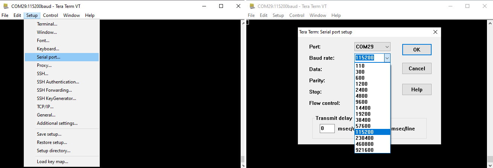 
2. Enable **local echo**. Set receive and transmit new-line characters to **CR+LF**. 
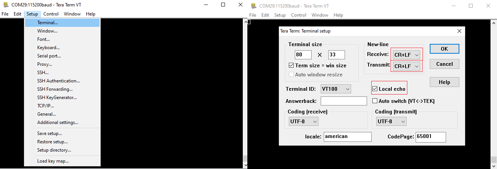 

> **Note:** If any issue addressed while running TeraTerm/the ttl scripts, refer the <a href = "#troubleshooting">Troubleshoot</a> section. 

## BLE

### 
***Execution Procedure***

This section list the steps to be followed for getting BLE Tx and Rx PER statistics: 
1. 
Connect RS9116 NCP (DUT 1) to the PC and reset it.
  
2. Open Teraterm, configure it as mentioned <a href = "#teraterm1">here</a>.
3. Click on Control -> Macro. Run the TTL script, `ble_per_mode.ttl`. 
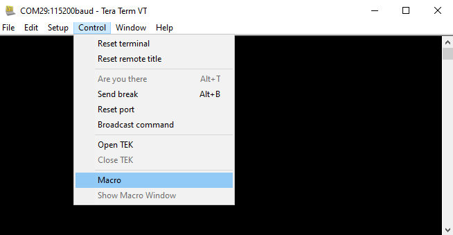 
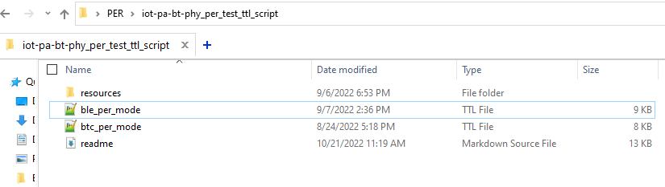 
4. Click on **OK** for the succcessful event pop-ups. 
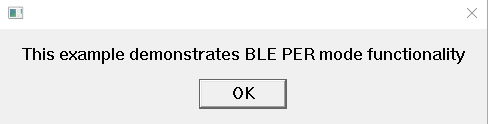 
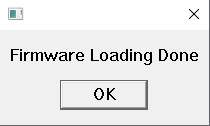 
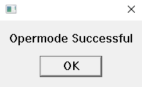 

5. Enable Receive mode in <a href = "#dut1">DUT 1</a>. 
 

    >  **Note:** Make sure to always run Receive mode in <a href = "#dut1">DUT 1</a> followed by Transmit mode in <a href = "#dut2">DUT 2</a>.
 

6. Enable PER mode in <a href = "#dut1">DUT 1</a>. 
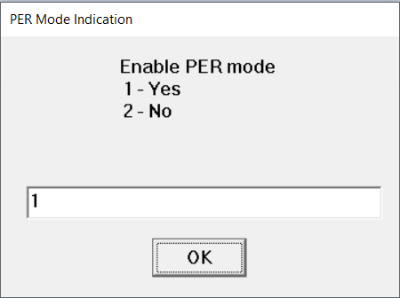 

7. Enter any 4 bytes Device Access Address with which packets are transmitted. 
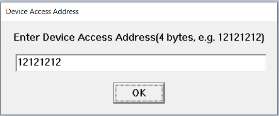 

8. Select BLE PHY rate at which packets are transmitted. 
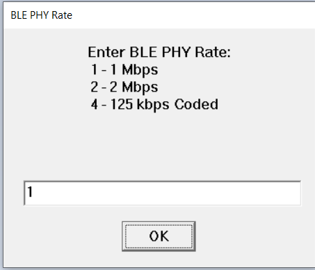 

9. Select BLE Channel type. 
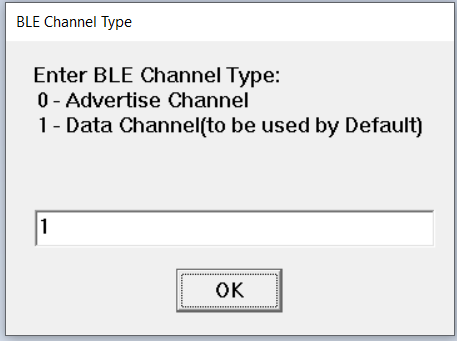 

10. Select the Frequency Hopping type to be used. 
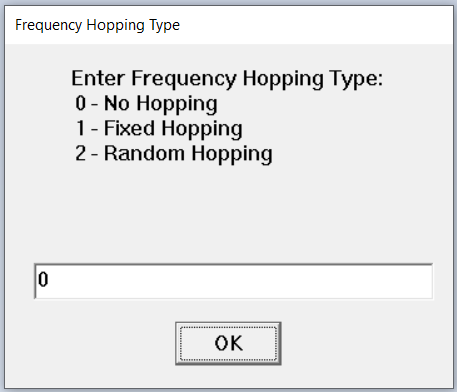 

11.  Enter Receive mode RX channel number. (Valid if selected *No Hopping* or *Fixed Hopping*) 
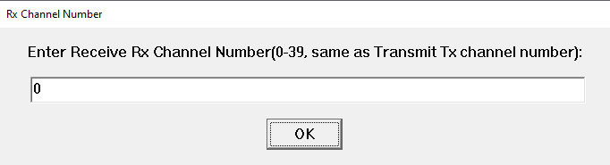 

12. Enter Receive mode TX channel number. (Valid if selected *Fixed Hopping*) 
 

13. Select antenna to be used. If the test is performed using a Spectrum Analyzer or Signal Generator, select *EXT_ANT_SEL* but if the test is performed between two RS9116 NCP modules select *ONBOARD_ANT_SEL*. 
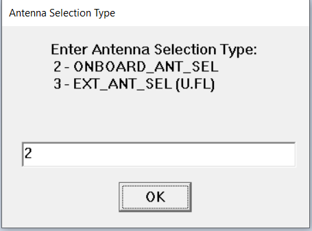 

14. Select BLE RF Chain (High Power/Low Power). 
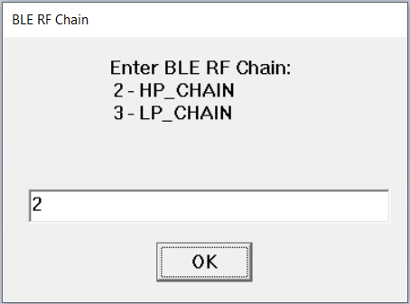 

15. Enable/Disable the extended data length feature. 
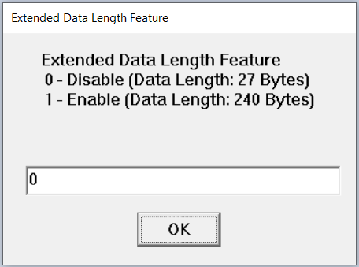 

16. Enable/Disable the loopback feature. 
 

17. Click on **OK**. 
 

18. 
 To run BLE PER Transmit mode, connect second RS9116 NCP module (DUT 2) to the PC.

    > **Note:**  Parameters: *Device Access Address, BLE PHY rate, BLE Channel Type* and *Frequency Hopping* should have same values in both Transmit and Receive mode.

19. To run the BLE PER Transmit mode in <a href = "#dut2">DUT 2</a>, follow the steps as mentioned below:  
    i. Open a new Teraterm Terminal, configure the Teraterm settings and follow steps 1 to 4 as mentioned <a href = "#exe1">here</a>.  

    > **Note:** Make sure to select correct COM port while setting up <a href = "#dut2">DUT 2</a>.
    
    ii. In step 5, enable Transmit mode. 
    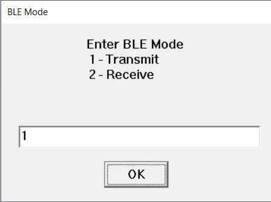 

    iii. Follow steps 6 to 10. In step 11, enter the Transmit Tx Channel number, same as Receive Rx Channel number. (Valid if selected *No Hopping* or *Fixed Hopping*) 
    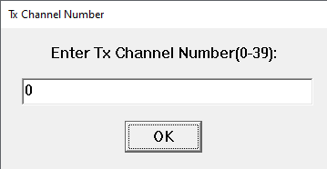 

    iv. In step 12, enter the Transmit Rx Channel number, same as Receive Tx Channel number. (Valid if selected *Fixed Hopping*) 
     

    v. Select antenna to be used. 
     

    vi. Select BLE RF Chain (High Power/Low Power). 
     

20. Enter length of the packet to be transmitted.  
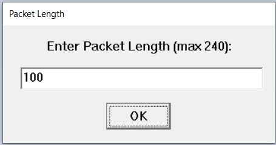 

21. Enter type of payload data sequence. 
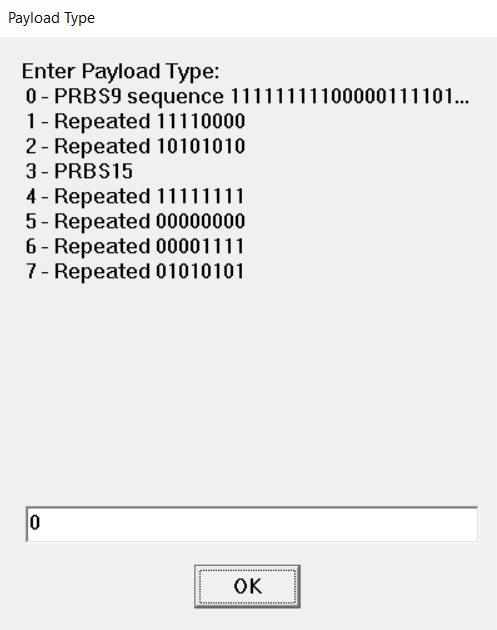 

22. Enter Transmit power index based on selected BLE RF Chain. 
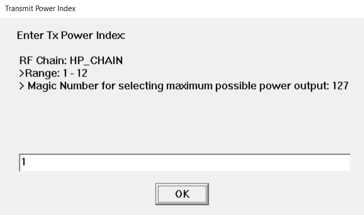 

23. Select the PER mode to be executed. 
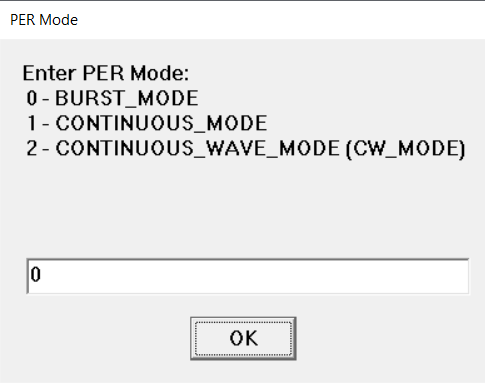 

24. Click on **OK**. 
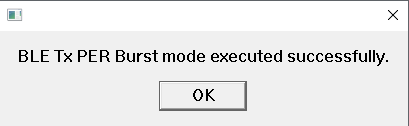 

25. The Teraterm screen should be populated with PER stats: 
    i. Transmit mode stats: 
    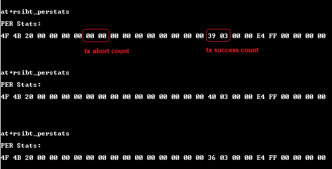 

    ii. Receive mode stats: 
    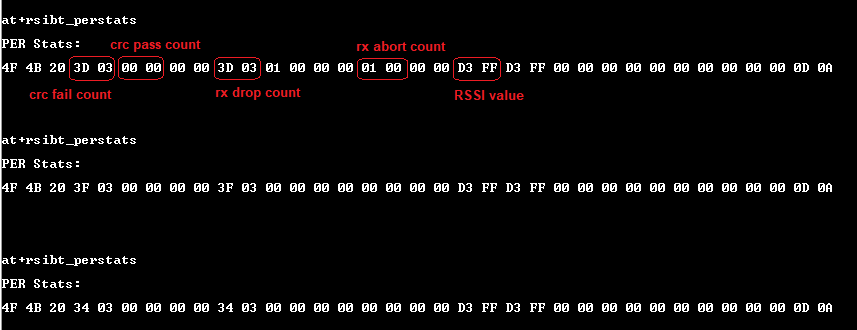 

26. To stop the execution, click on End. 
    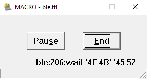 

> **Note:**  To run Continuous PER Mode and Continuous Wave PER mode, follow the same procedure with change of PER mode value (<a href = "#per1">here</a>). 

## BT Classic

### 
***Execution Procedure***

This section list the steps to be followed for getting BT Classic Tx and Rx PER statistics: 
1. 
Connect RS9116 NCP (DUT 1) to the PC and reset it.
  
2. Open Teraterm, configure it as mentioned <a href = "#teraterm1">here</a>.
3. Click on Control -> Macro. Run the TTL script, `btc_per_mode.ttl` 
 
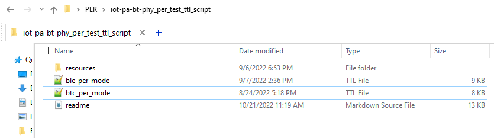 

4. Click on **OK** for the succcessful event pop-ups. 
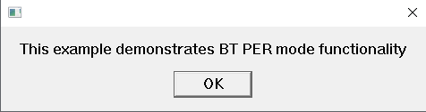 
 
 

5. Enable Receive mode in <a href = "#dut11>DUT 1</a>. 
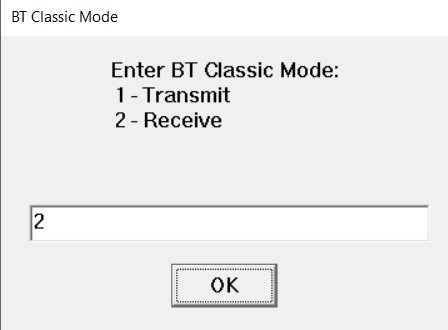 
   > **Note:** Make sure to always run Receive mode in <a href = "#dut11">DUT 1</a> followed by Transmit mode in <a href = "#dut22">DUT 2</a>.  

6. Enable PER mode in <a href = "#dut22">DUT 2</a>.  
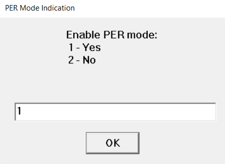 

7. Enter any 48-bit device address in hexadecimal format. 
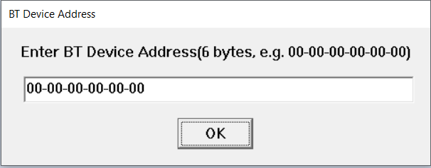 

8. Enter <a href ="https://docs.silabs.com/rs9116/wiseconnect/rs9116w-bt-classic-at-command-prm/latest/08-bt-classic-commands#bt-packet-summary">packet type</a> to be received, as per the Bluetooth standard. 
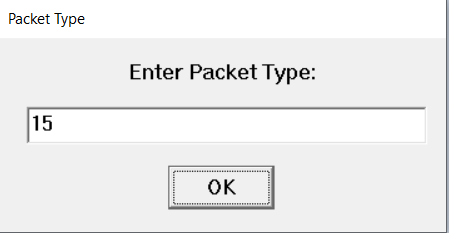 

9. Select the desired data rate. 
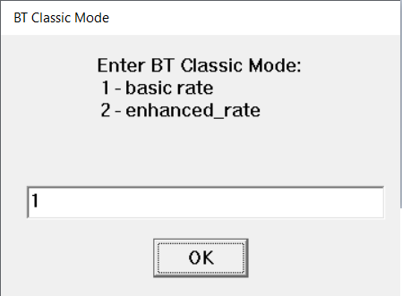 
                            
10. Select type of channel to be used. 
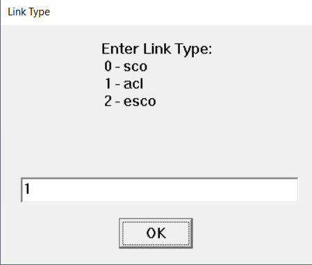 

11. Select the Frequency Hopping type to be used. 
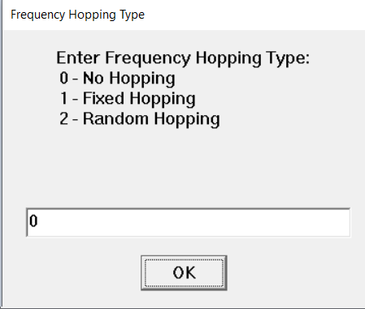 

12. Enter Receive mode RX channel number. (Valid if selected *No Hopping* or *Fixed Hopping*) 
 

13. Enter Receive mode TX channel number. (Valid if selected *Fixed Hopping*) 
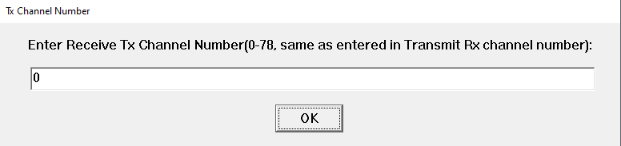 

14. Select antenna to be used. If the test is performed using a Spectrum Analyzer or Signal Generator, select *EXT_ANT_SEL* but if the test is performed between two RS9116 NCP modules select *ONBOARD_ANT_SEL*. 
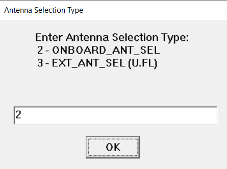 

15. Enable/Disable the loopback feature. 
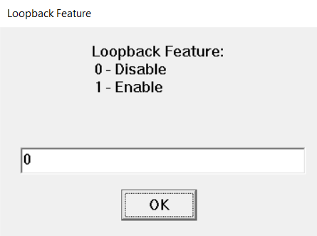 

16. Click on **OK**. 
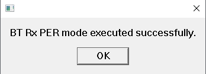 

17. To run BT PER Transmit mode, connect another RS9116 NCP module to the PC. 
    > **Note:**  Parameters: *Device Address, Packet Type, BT Classic Mode, Link Type* and *Frequency Hopping* should have same values in both Transmit and Receive mode.
 

18. To run the BT Classic PER Transmit mode in <a href = "#dut22">DUT 2</a>, follow the steps as mentioned below:  
    i. Open a new Teraterm Terminal, configure the Teraterm settings and follow steps 1 to 4 as mentioned <a href = "#exe2">here</a>.  

    > **Note:** Make sure to select correct COM port while setting up <a href = "#dut22">DUT 2</a>.
    
    ii. In step 5, enable Transmit mode. 
    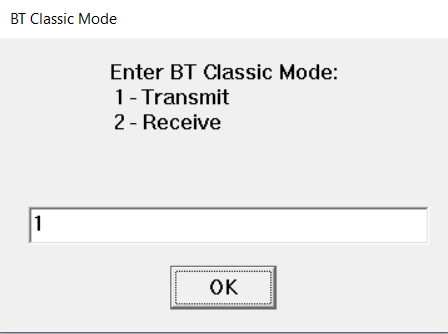 

    iii. Follow steps 6 to 11. In step 12, enter the Transmit Rx Channel number, same as Receive Tx Channel number. (Valid if selected *No Hopping* or *Fixed Hopping*) 
    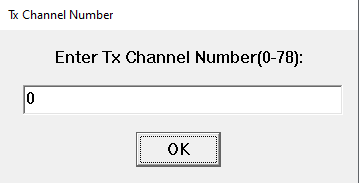 

    iv. In step 13, enter the Transmit Rx Channel number, same as Receive Tx Channel number. (Valid if selected *Fixed Hopping*) 
    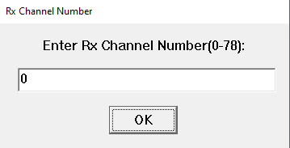  

    v. Select antenna to be used. 
     

19. Enter the packet length based on selected data rate. 
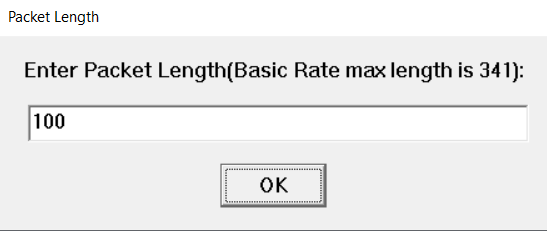 

20. Enter type of payload data sequence. 
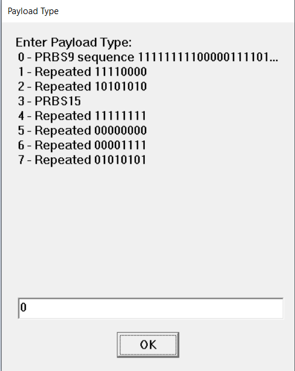 

21. Enter Transmit power index. 
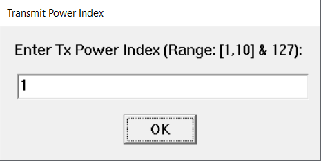 

  

22. Select the PER mode to be executed. 
 

23. Click on **OK**. 
 

24. The Teraterm screen should be populated with PER stats: 
    i. Transmit mode stats: 
    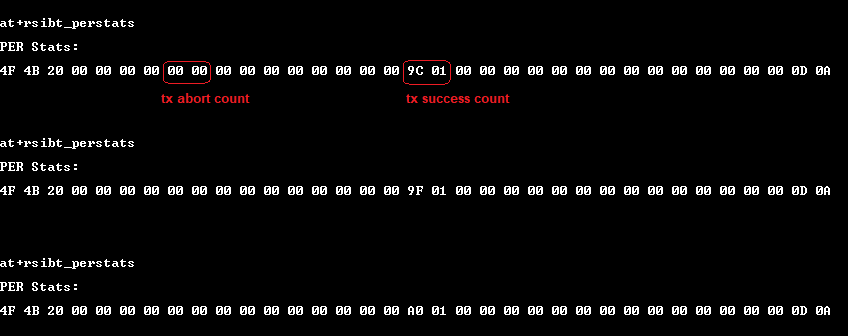 

    ii. Receive mode stats: 
    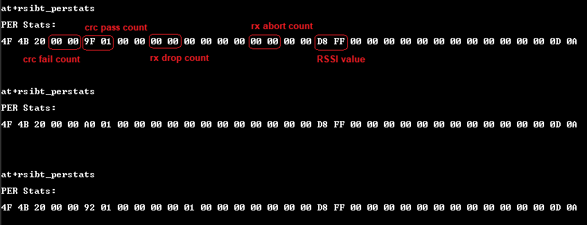 

25. To stop the execution, click on End. 
     

    > **Note:**  To run Continuous PER Mode and Continuous Wave PER mode, follow the same procedure with change of PER mode value (<a href = "#per2">here</a>).

# Summary

This document helps the user to test BLE/BT Classic PER mode using RS9116 NCP module. The procedure is followed with minimal traffic and using on-board antenna of the NCP EVK. 

> **Note:** If Tx and Rx characteristics is to be observed separately, we can use a Spectrum Analyzerr and Signal Generator respectively as shown below: 
- *Tx Block Diagram:* 
  
     - The test has been carried out in Conducted Mode between Spectrum Analyzer and DUT to avoid losses. Expected Spectrum Analyzer result is mentioned below: 
        - *Burst Mode* (BLE) 
        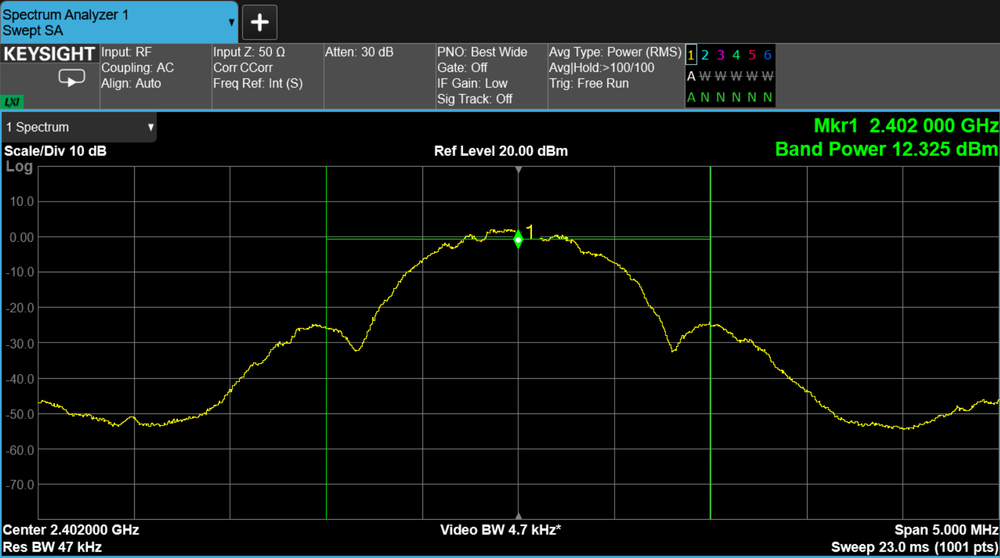  
        - *CW Mode* (BLE) 
          
        - *Burst Mode* (BT Classic) 
        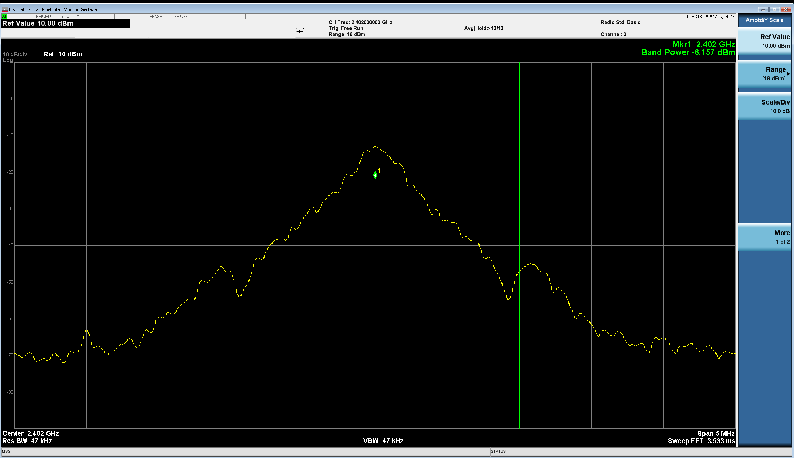  
        - *CW Mode* (BT Classic) 
          
        
- *Rx Block Diagram:* 
  

# Troubleshoot

1. If UART port is undetected by the PC, reset the module and try again. There's a reset button available on the module. If the port is still undetected, disconnect the module and re-connect the module to the PC.

2. Use a thick USB cable for avoiding losses and getting accurate results.

3. After every iteration of measurement with Spectrum Analyzer, ensure the module has been properly reset. 

4. If the Teraterm application stops midway, end the application, close the Teraterm window and re-run the application.  

# References

1. [RS9116 NCP BLE AT Command Programming Reference Manual](https://docs.silabs.com/rs9116/wiseconnect/rs9116w-ble-at-command-prm/latest/)
2. [RS9116 NCP BT Classic AT Command Programming Reference Manual](https://docs.silabs.com/rs9116/wiseconnect/rs9116w-bt-classic-at-command-prm/latest/)    

