# Introduction

This document details the requirements, steps and commands needed for the execution of BT Classic/BLE PER mode via RS9116 NCP module using AT commands. Customers going for regulatory tests (FCC, CE/RED, TELEC, etc) can utilize this script to setup the module in PHY test mode.

# Terminology

1. EVK - Evaluation Kit
2. DUT - Device Under Test
3. BT Classic - Bluetooth Classic
4. BLE - Bluetooth Low Energy
5. PER - Packet Error Rate
6. CW - Continuous Wave

# Prerequisites

## Hardware and Software Requirements

1. Windows PC
2. RS9116 NCP EVK along with USB-Micro cable - 2
3. Tera-term application. Download [ link](https://ttssh2.osdn.jp/index.html.en)
 
## Hardware Setup

Connect EVK to PC over UART port using USB-Micro cable.
Make sure the RS9116 NCP EVK is connected to the Spectrum Analyzer through u.Fl. 
*Rx Block Diagram:* 
 

*Tx Block Diagram:* 
 

## PER Commands

1. For BT Classic PER commands, refer [RS9116 NCP BT PER AT COMMANDS](https://docs.silabs.com/rs9116/wiseconnect/rs9116w-bt-classic-at-command-prm/2.6/08-bt-classic-commands#rsibt-perstats----per-stats) 
2. For BLE PER commands, refer [RS9116 NCP PER AT COMMANDS](https://docs.silabs.com/rs9116/wiseconnect/rs9116w-ble-at-command-prm/2.6/08-ble-commands#rsibt-bletransmit----ble-per-transmit)  

# Bluetooth PER Mode Execution

Refer [Getting Started with PC using AT Commands](http://docs.silabs.com/rs9116-wiseconnect/2.4/wifibt-wc-getting-started-with-pc/) for getting hands on experience with TeraTerm.

### 
***Teraterm Settings***

1. Configure the serial port settings to 115200 baud / 8-bit data / No parity / 1 stop bit. 
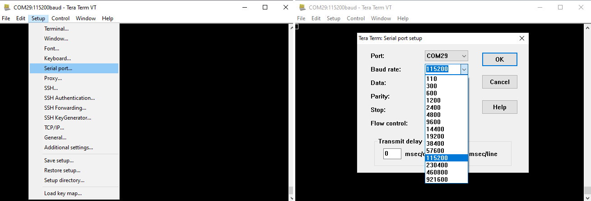 
2. Enable **local echo**. Set receive and transmit new-line characters to **CR+LF**. 
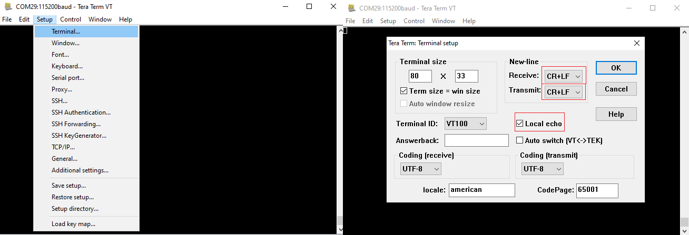 

## 1. BLE
### 
***Execution Procedure***

This section list the steps to be followed for getting BLE Tx and Rx PER statistics: 
1. Connect RS9116 NCP module to the PC and reset it.    
2. Open Teraterm, configure it as mentioned <a href = "#teraterm1">here</a>.
3. Click on Control -> Macro. Run the BLE PER TTL script mentioned in <a href = "#append1">APPENDIX A.1</a>. 
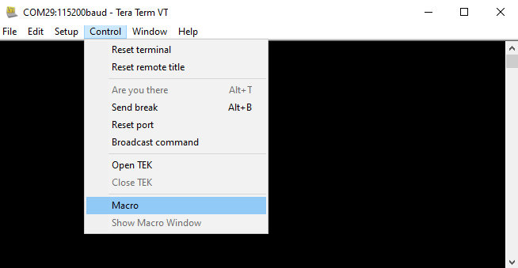 

4. Click on **OK** for the succcessful event pop-ups. 
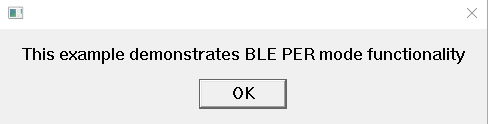 
 
 

5. Enable Receive mode. 
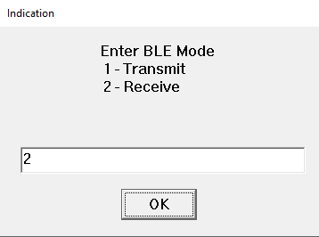  
**Note:** Always run Receive mode first, followed by Transmit mode.  

6. Enable PER mode. 
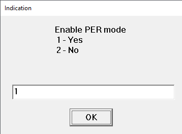 

7. Enter 4 bytes Device Access Address with which packets are transmitted. 
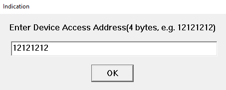 

8. Select BLE PHY rate at which packets are transmitted. 
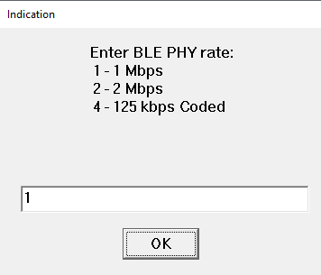 

9. Select BLE Channel type. 
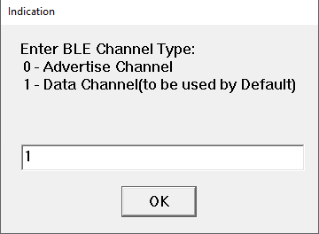 

10. Select the Frequency Hopping type to be used. 
 

11. Enter Receive mode TX channel number. 
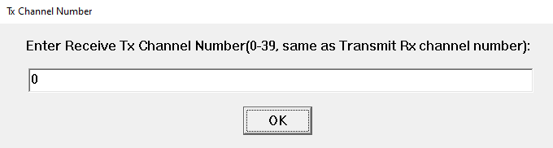 

12. Enter Receive mode RX channel number. 
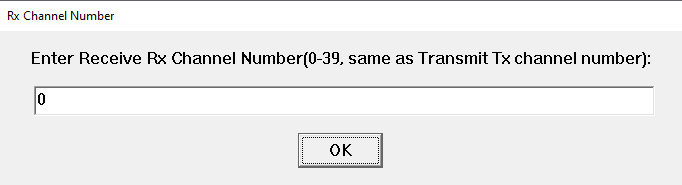 

13. Select antenna to be used. 
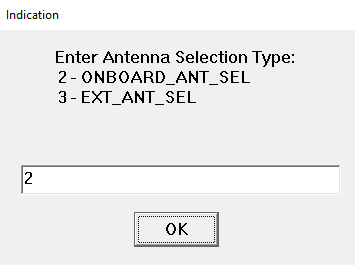 

14. Select BLE RF Chain (High Power/Low Power). 
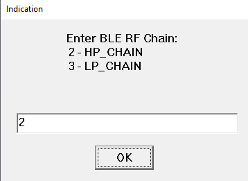 

15. Enable/Disable the extended data length feature. 
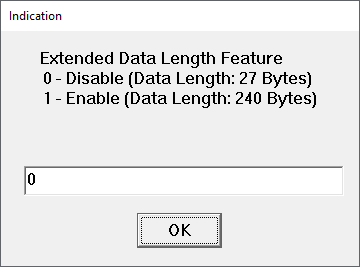 

16. Enable/Disable the loopback feature. 
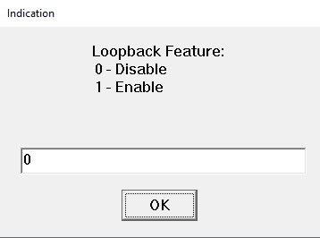 

17. Click on **OK**. 
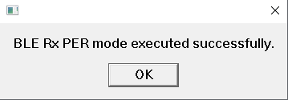 

18. To run BLE PER Transmit mode, connect another RS9116 NCP module to the PC.  
**Note:**  Parameters: *Device Access Address, BLE PHY rate, BLE Channel Type* and *Frequency Hopping* should have same values in both Transmit and Receive mode.

19. To run the BLE PER Transmit mode, follow the same steps as mentioned for the Receive mode with some input changes as mentioned below: 
    i. Open a New Teraterm Terminal, configure the Teraterm settings and follow steps 1 to 4 as mentioned <a href = "#exe1">here</a>.  
    
    ii. In step 5, enable Transmit mode. 
    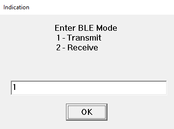 

    iii. Follow steps 6 to 10. In step 11, enter the Transmit Tx Channel number, same as Receive Rx Channel number. 
    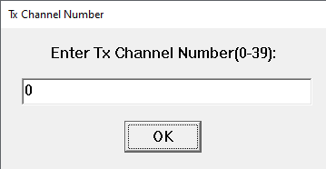 

    iv. In step 12, enter the Transmit Rx Channel number, same as Receive Tx Channel number. 
    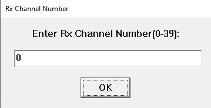 

    v. Select antenna to be used. 
     

    vi. Select BLE RF Chain (High Power/Low Power). 
     

20. Enter length of the packet to be transmitted.  
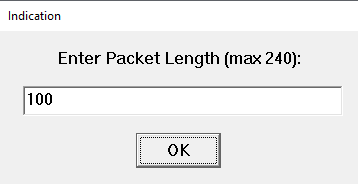 

21. Enter type of payload data sequence. 
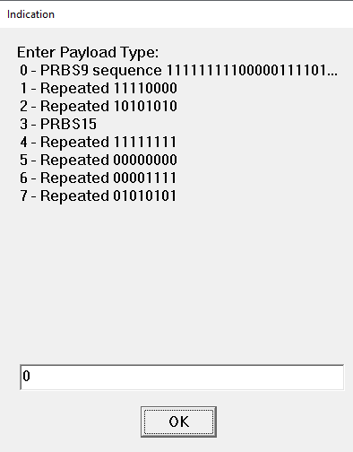 

22. Enter Transmit power index based on selected BLE RF Chain. 
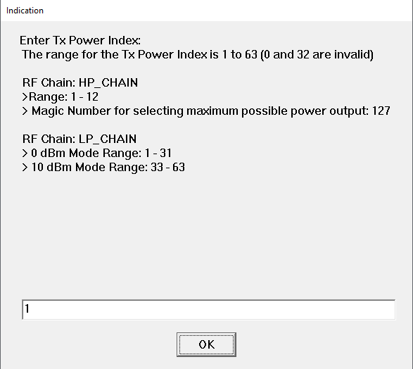 

23. Select the PER mode to be executed. 
 

24. Click on **OK**. 
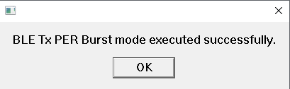 

25. The Teraterm screen should be populated with PER stats: 
    i. Transmit mode stats: 
     

    ii. Receive mode stats: 
    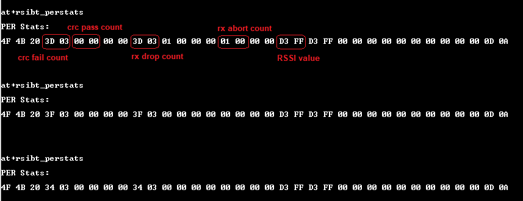 

26. To stop the execution, click on End. 
     

27. Expected Spectrum Analyzer result is mentioned below: 
	a. *Burst Mode* 
    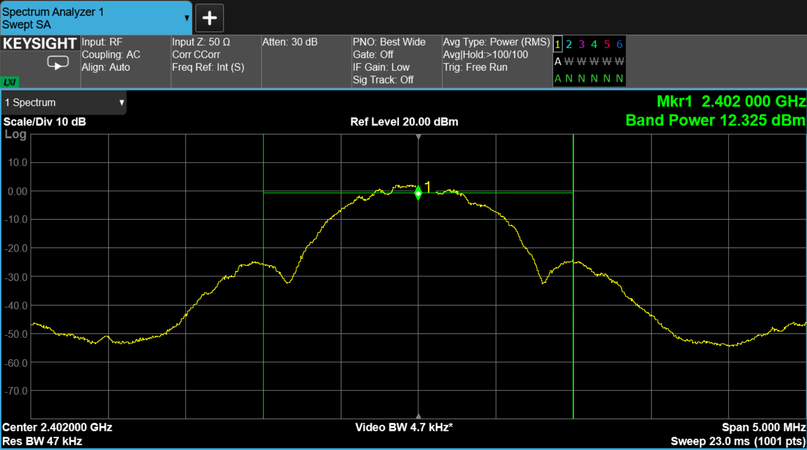  
	b. *CW Mode* 
    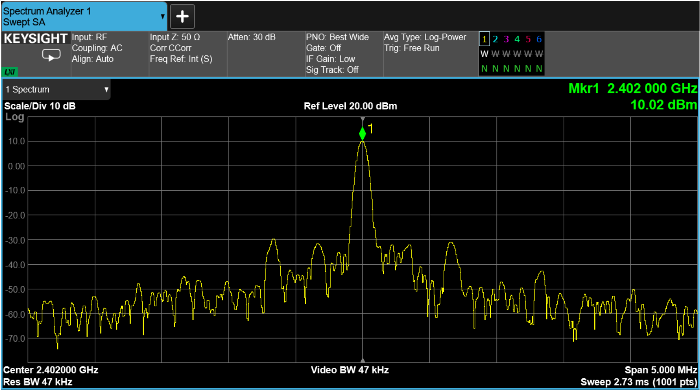  

**Note:**  To run Continuous PER Mode and Continuous Wave PER mode, follow the same procedure with change of PER mode value (<a href = "#per1">here</a>).

## 2. BT Classic

### 
***Execution Procedure***

This section list the steps to be followed for getting BLE Tx and Rx PER statistics: 
1. Connect RS9116 NCP module to the PC and reset it.    
2. Open Teraterm, configure it as mentioned <a href = "#teraterm1">here</a>.
3. Click on Control -> Macro. Run the BT PER TTL script mentioned in <a href = "#append2">APPENDIX A.2</a>. 
 

4. Click on **OK** for the succcessful event pop-ups. 
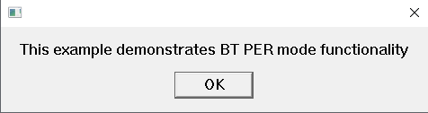 
 
 

5. Enable Receive mode. 
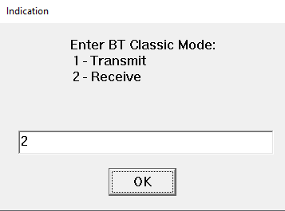 
**Note:** Always run Receive mode first, followed by Transmit mode. 

6. Enable PER mode. 
 

7. Enter 48-bit device address in hexadecimal format. 
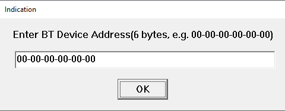 

8. Enter <a href ="https://docs.silabs.com/rs9116/wiseconnect/rs9116w-bt-classic-at-command-prm/latest/08-bt-classic-commands#bt-packet-summary">packet type</a> to be received, as per the Bluetooth standard. 
 

9. Select the desired data rate. 
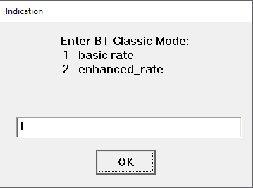 

10. Select type of channel to be used. 
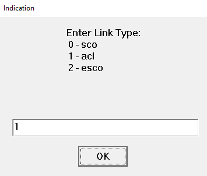 

11. Select the Frequency Hopping type to be used. 
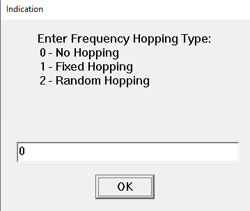 

12. Enter Receive mode TX channel number. 
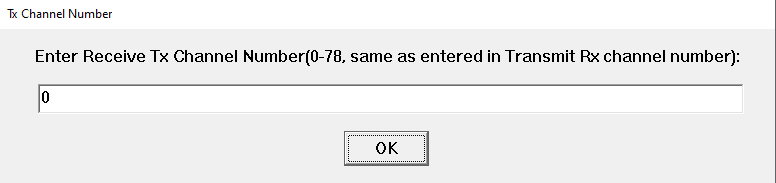 

13. Enter Receive mode RX channel number. 
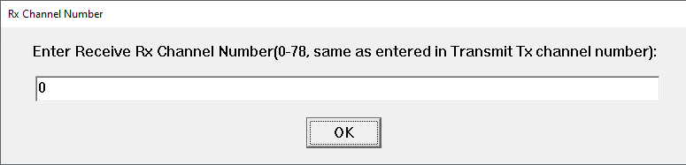 

14. Select antenna to be used. 
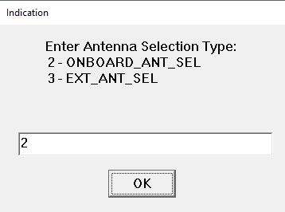 

15. Enable/Disable the loopback feature. 
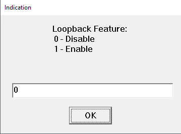 

16. Click on **OK**. 
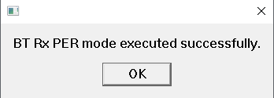 

17. To run BT PER Transmit mode, connect another RS9116 NCP module to the PC.  
**Note:**  Parameters: *Device Address, Packet Type, BT Classic Mode, Link Type* and *Frequency Hopping* should have same values in both Transmit and Receive mode.

18. To run the BT Classic PER Transmit mode, follow the same steps as mentioned for the Receive mode with some input changes as mentioned below: 
    i. Open a New Teraterm Terminal, configure the Teraterm settings and follow steps 1 to 4 as mentioned <a href = "#exe2">here</a>.  
    
    ii. In step 5, enable Transmit mode. 
     

    iii. Follow steps 6 to 11. In step 12, enter the Transmit Rx Channel number, same as Receive Tx Channel number. 
    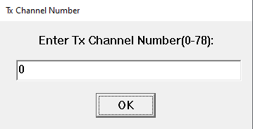 

    iv. In step 13, enter the Transmit Rx Channel number, same as Receive Tx Channel number. 
    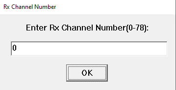 

    v. Select antenna to be used. 
     

19. Enter the packet length based on selected data rate. 
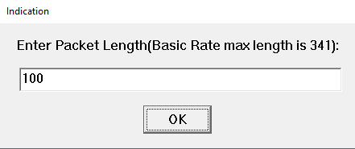 

20. Enter type of payload data sequence. 
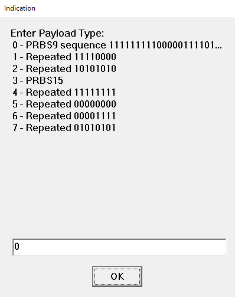 

21. Enter Transmit power index. 
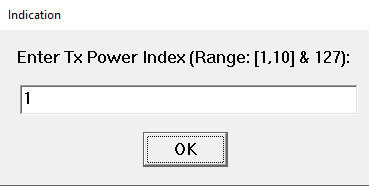 

  

22. Select the PER mode to be executed. 
 

23. Click on **OK**. 
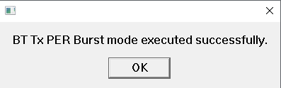 

24. The Teraterm screen should be populated with PER stats: 
    i. Transmit mode stats: 
    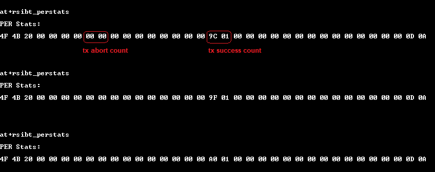 

    ii. Receive mode stats: 
    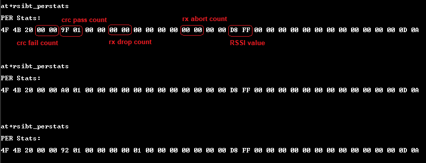 

25. To stop the execution, click on End. 
     

26. Expected Spectrum Analyzer result is mentioned below: 
	a. *Burst Mode* 
    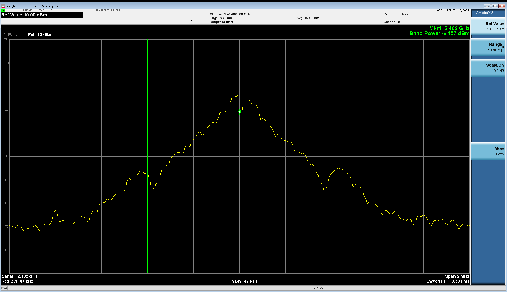  
	b. *CW Mode* 
    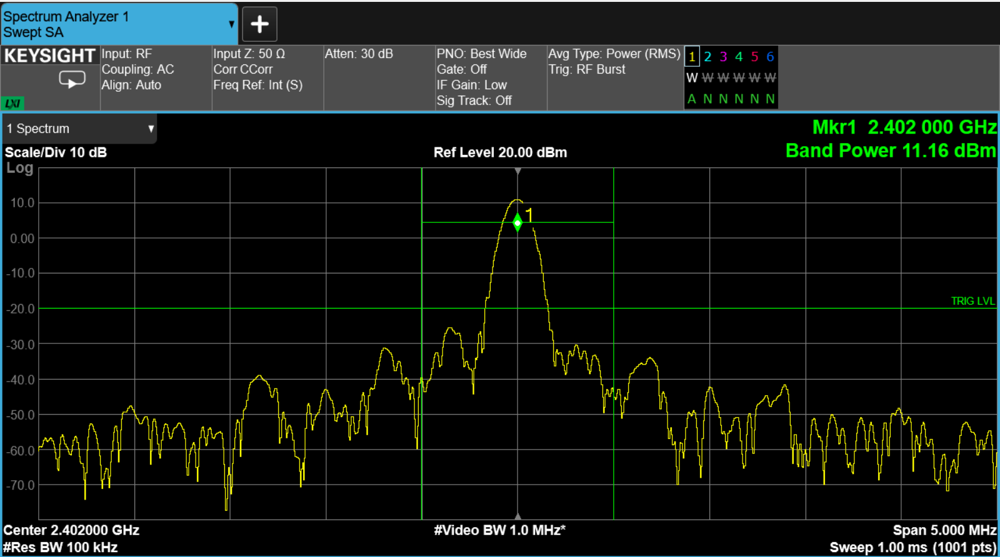  
**Note:**  To run Continuous PER Mode and Continuous Wave PER mode, follow the same procedure with change of PER mode value (<a href = "#per2">here</a>).

# Summary

This document helps the user to test BLE/BT Classic PER mode using RS9116 NCP module. The procedure is followed with minimal traffic and using internal RF of the EVK. The test has been carried out in Conducted Mode between Spectrum Analyzer and DUT to avoid losses.

# References

1. [RS9116 NCP BLE AT Command Programming Reference Manual](https://docs.silabs.com/rs9116/wiseconnect/rs9116w-ble-at-command-prm/2.6/index)
2. [RS9116 NCP BT Classic AT Command Programming Reference Manual](https://docs.silabs.com/rs9116/wiseconnect/rs9116w-bt-classic-at-command-prm/2.6/)

# Troubleshooting

1. If UART port is undetected by the PC, reset the module and try again. There's a reset button available on the module. If the port is still undetected, disconnect the module and re-connect the module to the PC.

2. Use a thick USB cable for avoiding losses and getting accurate results.

3. After every iteration of measurement with Spectrum Analyzer, ensure the module has been properly reset. 

4. If the Teraterm application stops midway, end the application, close the Teraterm window and re-run the application.

# Revision History

| **Revision No.**  | **Version No**  | **Date**  | **Changes**  |
|-------------------|-----------------|-----------|--------------|
| 1  | 1.1  | May, 2020  | Initial version  |
| 2  | 1.2  | Oct, 2020  | 1. Updated the command sequences based on latest PRM updates  2. Added TTL Images.  3. Added APPENDIX Section with the TTL Script used for this APP notes  4. Updated links and document names  |
| 3 | 1.3 | July, 2022 | 1. Updated the command parameter descriptions based on latest PRM updates 2. Modified TTL script images 3.Added BT PER Receive TTL images 4.Updated the TTL scripts in APPENDIX Section used for this App notes 5. Updated the document links |

