<h1> Wi-Fi Provisioning over BLE using AT commands</h1>

## Introduction

This project helps to securely send Wi-Fi network credentials from a Provisioning Tool to RS9116 NCP module over BLE. The communication between Provisioning Tool and RS9116 NCP module happens using AT commands via UART/USB-CDC interface with PC as the Host Platform. Wi-Fi Provisioning over BLE offers numerous advantages, notably interoperability and ease of implementation. It provides a wide range of useful applications, such as Wi-Fi enabled Garage Door opener, smart led bulb, Wi-Fi Speakers and other smart home appliances.      
 

## Prerequisites

This section details on the hardware and software required for running the application.

### **Hardware**

1. Windows PC

2. Silicon Labs [RS9116 Wi-Fi Evaluation Kit](https://www.silabs.com/development-tools/wireless/wi-fi/rs9116x-sb-evk-development-kit?tab=overview)

3. Smartphone with [EFR Connect App](https://www.silabs.com/developers/efr-connect-mobile-app) 

4. Wi-Fi Access Point

### **Software**

- Programming Language: Python 3.7.9

   - Python packages: Tkinter, pillow, pyserial
 

### **Setup Diagram**
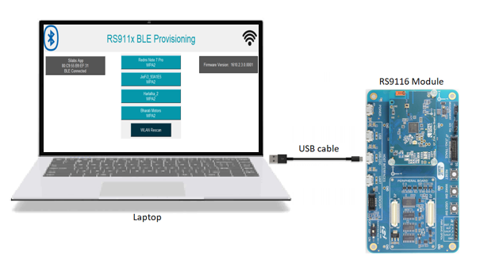 

### **Python Installation**

To execute the AT command application, python and its packages need to be installed. However, skip this section if the application is being executed directly from executable (.exe or .app) files.

-  For Windows OS, run the **installation.bat** file, available at path: `\python_installation\windows\installation.bat`
- For macOS, run the **installation.command** file, available at path: `\python_installation\mac\installation.command`

**Note:** The installation provided will install python version **3.7.9** for Windows OS and version **3.10.8** for macOS. For Python version 3.4 or later, **PIP** package is included by default.    

## Terminologies

   1.  WLAN    : Wireless Local Area Network

   2.  BLE    : Bluetooth Low Energy

   3.  GUI    : Graphical User Interface

   4.  AP      : Access Point
  

## Application Design Flow

This section demonstrates the Services and Characteristics created in the project to exchange data between RS9116 NCP module and Provisioning App.

###  **Services & Characteristics**

   A customized service, **0xAABB** is created for communication between RS9116 NCP module and Provisioning App. Below are the **Characteristics** defined for the 0xAABB service:

1. **1AA1**

   *Definition*: This characteristic is used by Provisioning App to send commands to the RS9116 NCP module.

   *Property*: This characteristic has **Write with response** property.

2. **1BB1**

   *Definition*: This characteristic is used by RS9116 NCP module to respond to the Provisioning App.

   *Property*: This characteristic has **Read** and **Write with response** properties.

3. **1CC1**

   *Definition*: This characteristic is used by RS9116 NCP module to notify list of APs to the Provisioning App.

   *Property*: This characteristic has **Read**, **Write with response** and **Notification** properties.
  
## **Communication between RS9116 NCP module & Provisioning App**

   The Provisioning tool communicates with the RS9116 NCP module by sending the following commands over 1AA1 characteristic: 

| Command ID | Command Type | Description (Data exchange between RS9116 NCP & Provisioning App) |
|------------|--------------|---------------------------------------------------------------|
| 8 | Firmware query | This Command requests the firmware version. |
| 7 | WLAN Status | This Command is used to know the  RS9116 NCP module connection status with an AP. |
| 3 | WLAN Scan | This Command requests the list of APs available nearby. |
| 5 | Security Type | This Command is used to get the security type of the AP. Below are the supported security types: 1. Open →0  2. WPA → 1 3. WPA2 →2 4. WPA/WPA2 Mixed →6 **Note**:  If “security type” is “0”, the Provisioning Tool directly issues join command instead of requesting the password. |
| 6 | PSK | This Command requests to enter the password of the network (AP) to connect to. |
| 2 | Join | This Command is used for joining the RS9116 NCP module to a network (AP). |
| 4 | WLAN Disconnect | This Command disconnects the RS9116 NCP module with the AP. |

### **Message Sequence Chart**

The figure below, explains about the data communication between RS9116 NCP module and Provisioning Tool: 
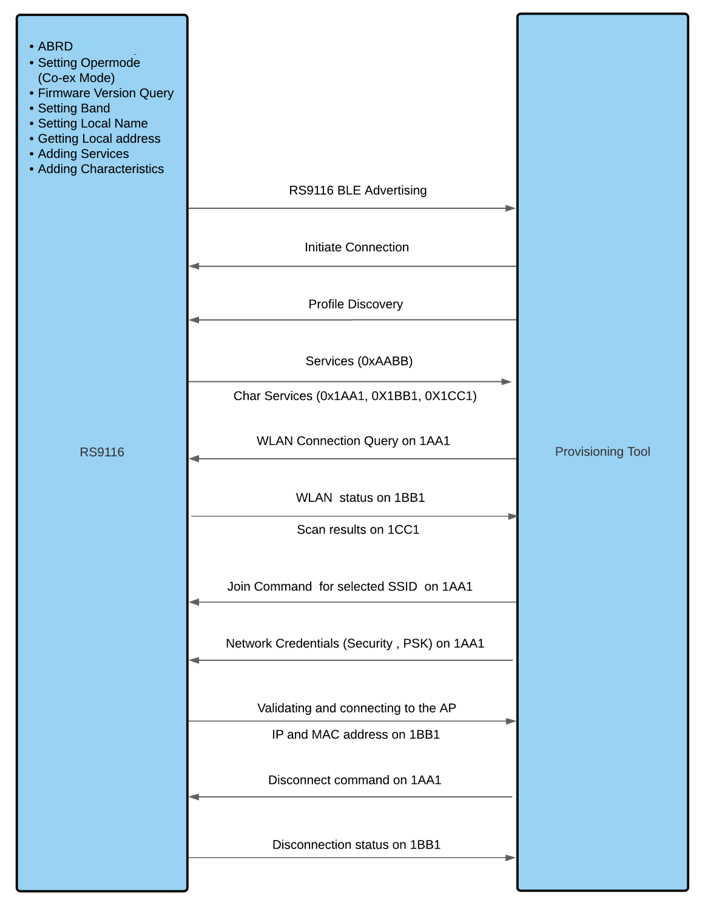 

## Project Execution

This section lists the steps to execute the project and use EFR Connect Application as the Provisioning Tool:

1. Install **EFR Connect** Application from Play Store/App Store. 

2. Run the **EFR Connect** Application. The following interface will appear: 
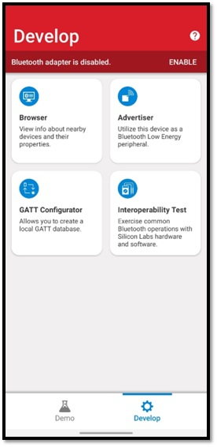 

3. If BLE is not enabled, enable using the following option: 
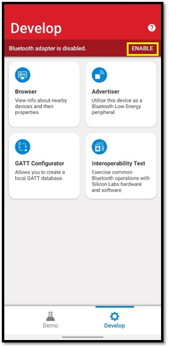 

4. Switch to Demo Section as shown below: 
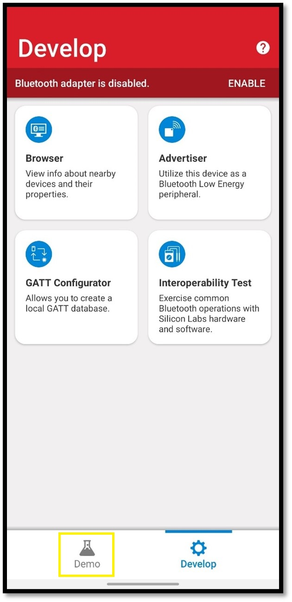 

5. Connect RS9116 NCP module with PC using a micro-USB cable either in **USB-CDC** or **UART** interface. 

6. Execute the Wi-Fi Provisioning application using **any one** of the following ways: 
   - Running using executable file:
      - For Windows OS, run **Wi-Fi Provisioning.exe**, available at path `\applications\windows\Wi-Fi Provisioning.exe` 
      - For macOS, run **Wi-Fi Provisioning.app**, available at path `\applications\mac\Wi-Fi Provisioning.app`
   - Running using python script:
      - For Windows OS, open command at the location where the python script is stored (`\code_base\WiFi_Provisioning_over_BLE_AT_app.py`). Run the command:<pre>python WiFi_Provisioning_over_BLE_AT_app.py</pre>
      - For macOS, open terminal at the location where the python script is stored (`\code_base\WiFi_Provisioning_over_BLE_AT_app.py`). Run the command:<pre>python3 WiFi_Provisioning_over_BLE_AT_app.py</pre>

      **Note:** For this method, keep all the associated images in the same folder. 

7. Select the desired **Interface**(USB-CDC / UART) and **Port** (if multiple available). Click **OK**. 
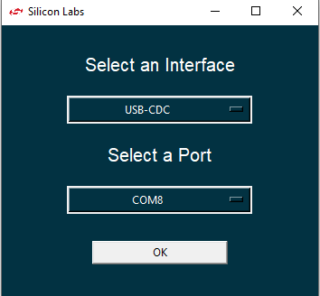 
   **Note:** USB-CDC is prefered.

8. The Desktop GUI will appear as shown below: 
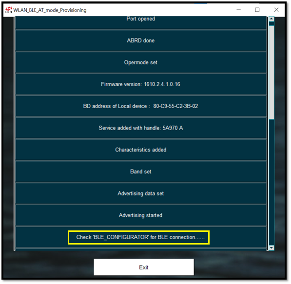 

9. Select **Wi-Fi Commissioning** from the list of available options in the **EFR Connect** mobile Application as shown below: 
 

10. Select **BLE_CONFIGURATOR** from the list of available Bluetooth Device options: 
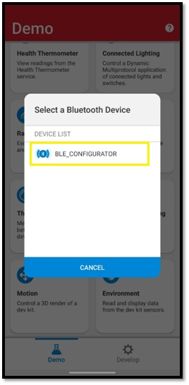 

11. The Desktop GUI will be updated with the device MAC address once the Provisioning Tool is connected to the RS9116 NCP module.  
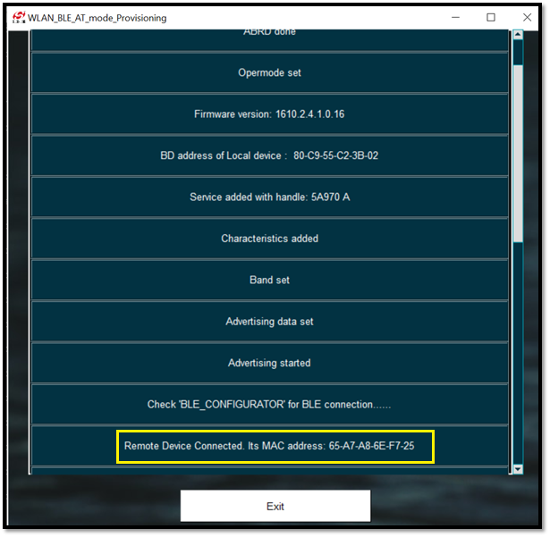 

12. The WLAN scan results will be fetched to the EFR Connect App as shown below: 
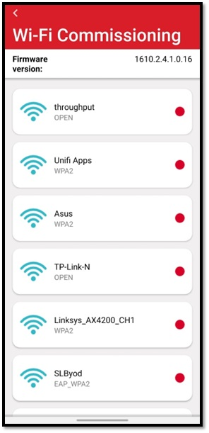 

    **Note:** Wait until the entire list of AP is updated on the EFR Connect App to prevent any lengthy hold-ups.

13. Select the desired AP and enter the password (if any). Click on **Connect**. 
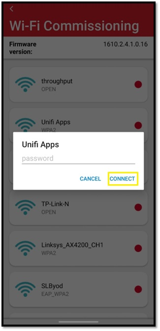 

14. The password will be sent to the RS9116 NCP module. If correct credentials are provided, the module will be connected to the selected AP. The WLAN MAC address and the IP address will then be sent to the **EFR Connect** Application. The Desktop GUI will appear as shown below: 
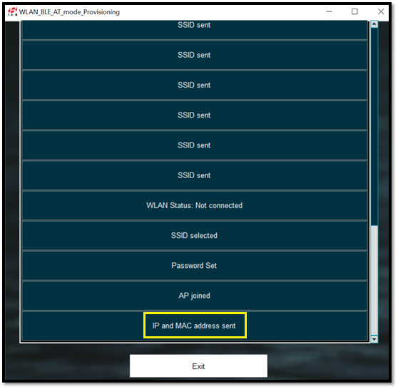 

15. The **EFR Connect** Application will be updated with a green symbol highlighted across the selected AP. 
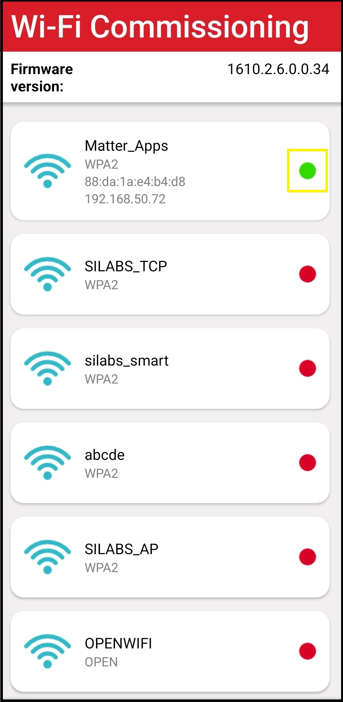 

16. For WLAN disconnection from the AP, select the connected AP in the **EFR Connect** Application and click  on **Yes**. 
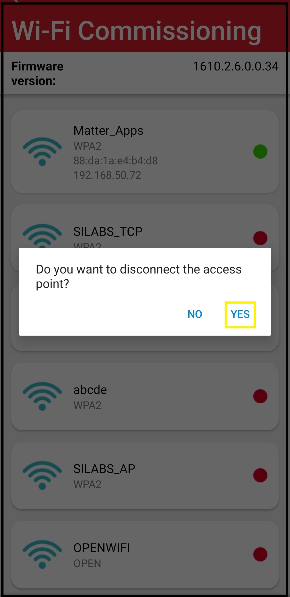  

## Troubleshooting

1. In case of any application halts or lags, re-run the application using the Restart button. 
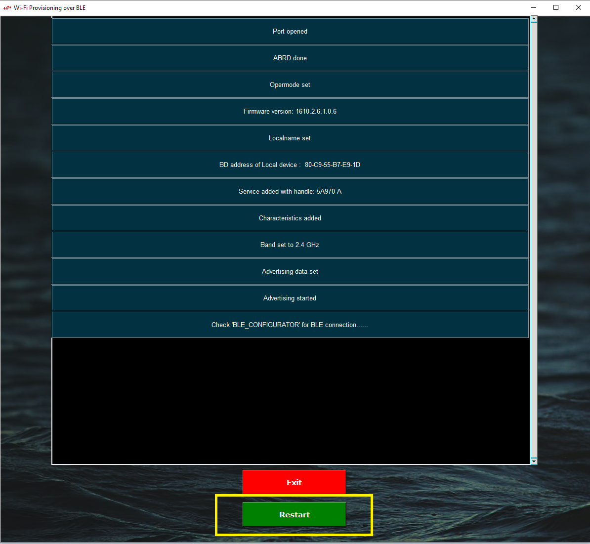 
2. Choose the correct interface (UART/USB-CDC) in the GUI as RS9116 NCP is connected to the PC.

3. If any error occurs, reset the RS9116 NCP module, and re-run/Restart the application. **ERROR 4D09** typically occurs when RS9116 NCP module is not reset.

4. If "Module not Responding" message pops up again and again, flash the latest firmware in the RS9116 NCP module.
  

## Limitations
   1. Maximum 11 APs can be displayed at a time.

   2. Length of password should be greater than 7 and less than or equal to 17.

   3. If a password of length \> 17 is entered in EFR Connect App, it stops responding.

   4. The RS9116 NCP radio is configured only for 2.4 GHz band.

   5. The RS9116 NCP module works as a normal client that can connect to an Access Point with security modes: Open, WPA and WPA2.  
   
## References

1. [RS9116 NCP BLE AT Command Programming Reference Manual](https://docs.silabs.com/rs9116/wiseconnect/rs9116w-ble-at-command-prm/latest/)
2. [RS9116 NCP BT Classic AT Command Programming Reference Manual](https://docs.silabs.com/rs9116/wiseconnect/rs9116w-bt-classic-at-command-prm/latest/)
3. [RS9116 Wi-Fi AT Command Programming Reference Manual](https://docs.silabs.com/rs9116/wiseconnect/rs9116w-wifi-at-command-prm/latest/)   

    

