# Amazon EC2 instance SSL throughput 

## Description 

This application demonstrates the procedure to measure the throughput of the data transmitted by RS9116 NCP module to an OpenSSL server running on the Amazon EC2 (Elastic Compute Cloud) instance. In this application, the RS9116 NCP module connects to a Wi-Fi access point as a station, obtains an IP address, connects to the OpenSSL server running on the remote Amazon EC2 instance and sends data to the OpenSSL server using SSL.

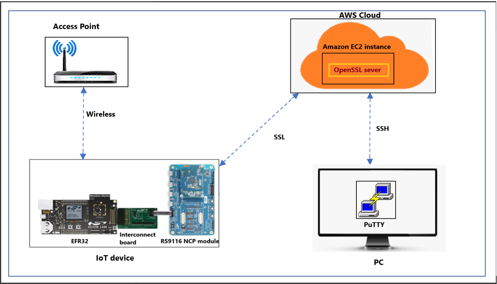

## Prerequisites

To run this application, you will need the following:

### Hardware Requirements

- EFR32xG21 Starter Kit with Wireless Gecko (SLSWSTK6006A Base board: BRD4001A, Radio board: BRD4180a or BRD4180b)

- RS9116 Evaluation Board (RS9116W-SB-EVK1/RS9116W-DB-EVK1)

- Mini-USB to USB Type-A cable (included with EFR32xG21)

- Micro-USB to USB Type-A cable (included with RS9116X-SB-EVK1/RS9116W-DB-EVK1)

- Interconnect board and SPI ribbon cable (for SPI communication)

- One Female to Female connector (For the *RST-PS* pin connection)

- Windows PC with two USB ports

- Access Point (AP) with active internet connection.

- A PC for running the PuTTY terminal (can be the same PC that is used to program the Host MCU).

### Software Requirements

- Simplicity Studio v5 (v5.4.1.0 or higher).

   a. Download [Simplicity Studio](https://www.silabs.com/developers/simplicity-studio).

   b. Follow the [Simplicity Studio user guide](https://docs.silabs.com/simplicity-studio-5-users-guide/1.1.0/ss-5-users-guide-getting-started/install-ss-5-and-software#install-ssv5) to install Simplicity Studio.

- [2.6.0 RS9116 NCP release package](https://github.com/SiliconLabs/wiseconnect-wifi-bt-sdk/archive/refs/tags/2.6.0.zip)

- [PuTTY](https://www.putty.org/)

- **amazon_ec2_instance_ssl_throughput** project folder

**NOTE:**
1. This application project 
   - is designed to work with EFR32 radio boards BRD4180A/BRD4180B.
   - is tested with the 2.6.0 SDK and 2.6.0.0.34 firmware.
   - works with both Bare metal and FreeRTOS configurations.
2. By default, the application is configured to run over FreeRTOS. Refer to **Appendix**, to make Bare metal configurations.

## Setup

This section describes the hardware setup and the connections.

 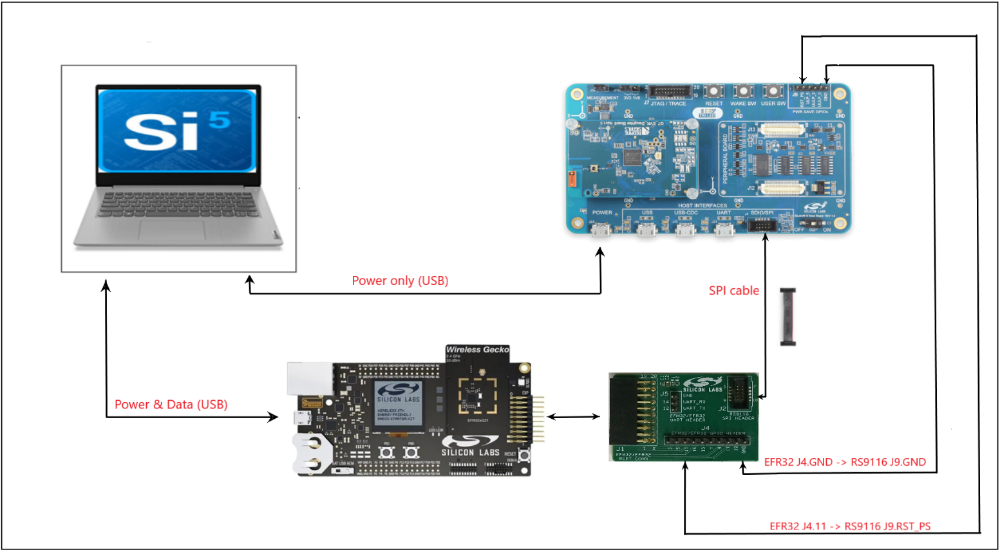

   1. Connect the Interconnect adapter board provided with the RS9116 NCP Development Kit to the EXP header of EFR32.

   2. Connect the SPI header of Interconnect adapter board to the SDIO/SPI connector of the RS9116 NCP using the 10-pin ribbon cable (SPI cable) provided  with RS9116 NCP.

   3. Connect the RST_PS pin on J9 header of RS9116 NCP to the pin labeled 11 on the J4 header of the Interconnect adapter board using a female-to-female connector.

   4. Ensure the ISP switch on the RS9116 NCP module is set to OFF position. 

   5. Connect the RS9116 NCP to a PC using the USB interface labeled POWER. Note that this connection only provides power. There is no USB communication over this connection.

   6. Connect the EFR32 Starter Kit to a PC using a Mini USB cable.

   7. Connect the GND pin on J9 header of RS9116 NCP to pin labeled GND on J4 header of the Interconnect adapter board using a female-to-female connector.

## Procedure to launch Amazon EC2 instance

### Amazon EC2 Instance Creation

1. Log in to your AWS (Amazon Web Services) account. 

2. After successfully logging in to your account, set your region by clicking on the region button present at the top-right corner of the screen. Select appropriate region from the dropdown.

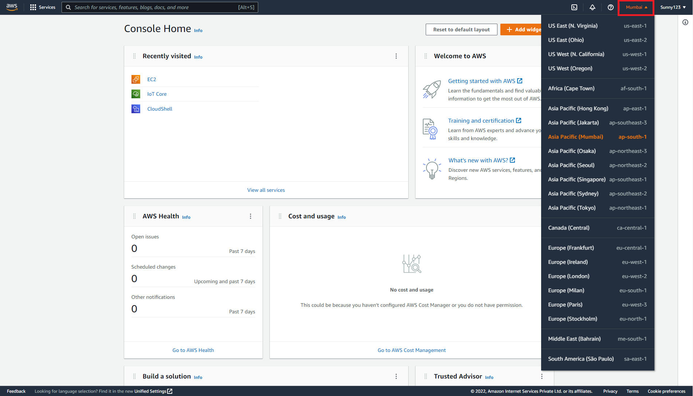

3. Go to EC2 service.

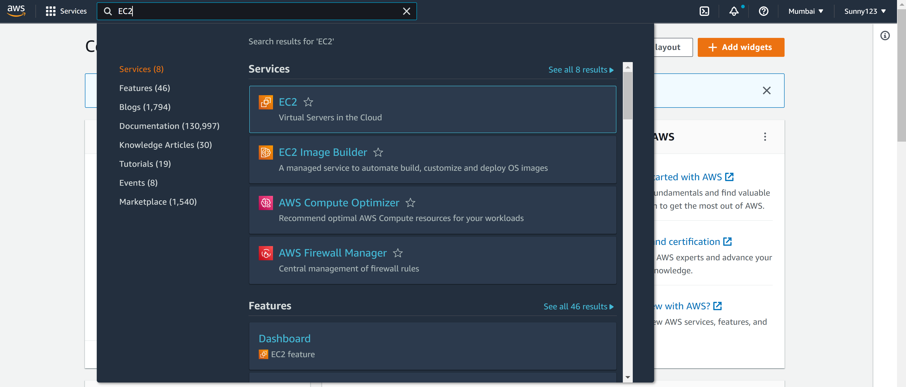

4. Launch an instance. An instance is a virtual server in the AWS cloud.
  - Select *Instances* and click on *Launch instances* button present at the top-right corner of the screen. 

    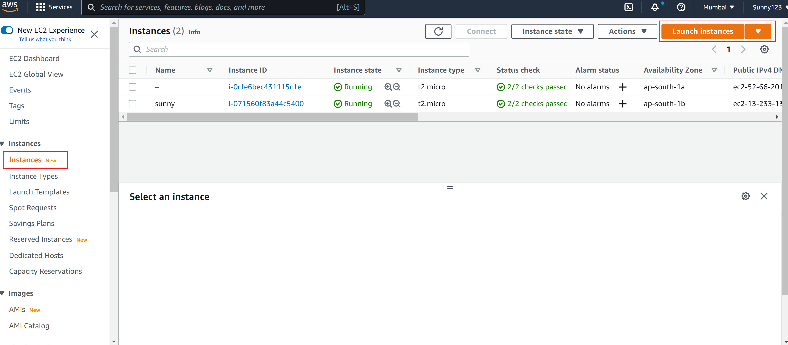

  - Under *Name and tags*, for *Name*, enter a descriptive name for your instance. 

    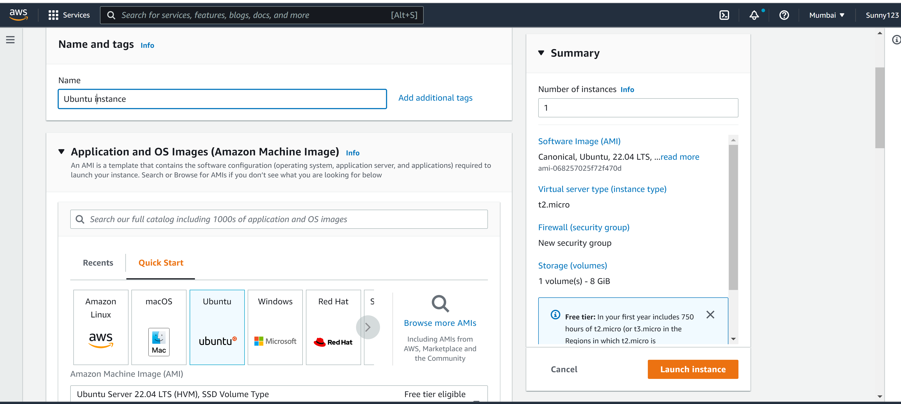

5. Choose an AMI to run your instance. 
An AMI (Amazon Machine Image) is a template that contains the software configuration (operating system, application server, and applications) required to launch your instance.  
 - Choose an Amazon Machine Image (AMI) under the *Application and OS Images* section. You can even select your own AMI. For this example, *Ubuntu Server 22.04 LTS (HVM), SSD Volume Type* is selected, which is free tier eligible.

   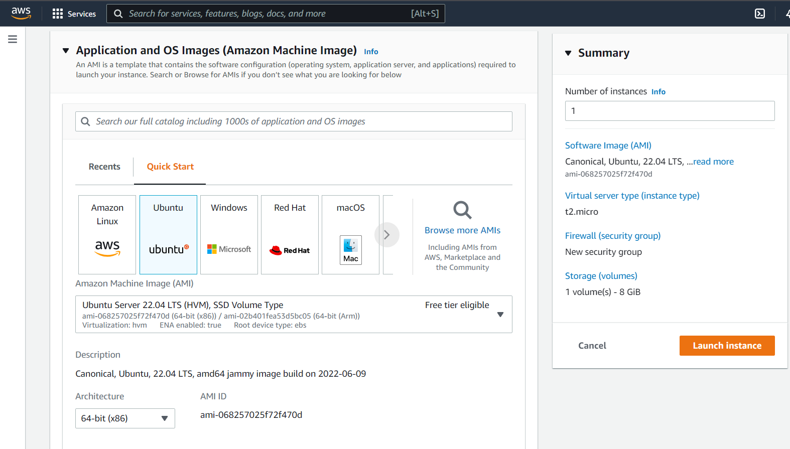

6. Choose an Instance Type.  
The instance type determines the hardware of the host computer used for your instance. Instance have varying combinations of CPU, memory, storage, networking capacity and give you the flexibility to choose the appropriate mix of resources for your applications. 
 - Choose an instance type from the *Instance type* section. For this example, *t2.micro* is chosen, which is free tier eligible.

   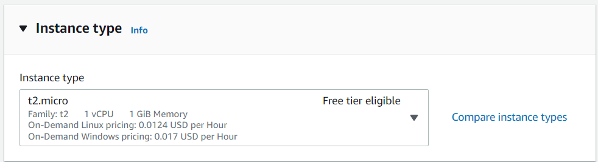

7. Create a key pair to securely connect to your Amazon EC2 instance. Ensure that you have access to the selected key pair before you launch the instance.  
   - Under the *Key pair (login)* section, click on *Create a new key pair* .
   - Enter a valid key pair name and select any key pair type. In this example, RSA is used as key pair type. 
   - Select *.ppk* as the private key file format for this application to be used with PuTTY. Then click on *Create key pair*.
   - Store the private key pair generated at any location on your drive.

     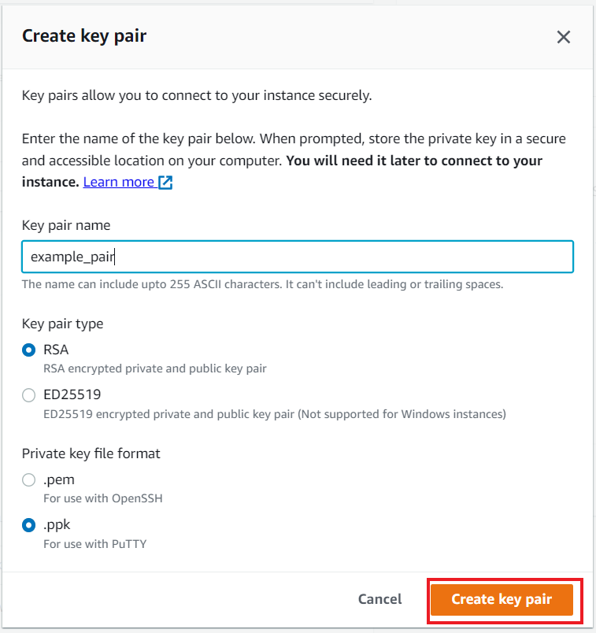

8. Create a security group for your instance.  
 A security group is a set of firewall rules that allow specific traffic to reach your instance. For example, if you want to set up a web server and allow Internet traffic to reach your instance, add rules that allow unrestricted access to the HTTP and HTTPS ports. Configure the source as *Anywhere* with the address *0.0.0.0/0*.
  - Under *Network settings* section, click on the *Create security group* radio button.

    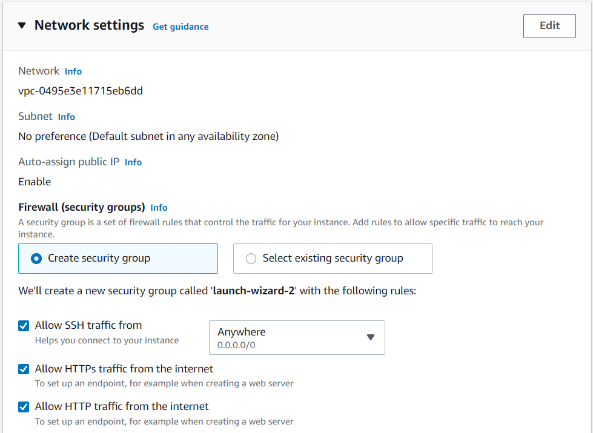

9. Add Storage to your instance. Your instance will be launched with the selected storage device settings. You can attach additional EBS volumes and instance store volumes to your instance, or edit the settings of the root volume. 
 - Keep the default configuration under *Configure storage* section unless it is necessary to change.

   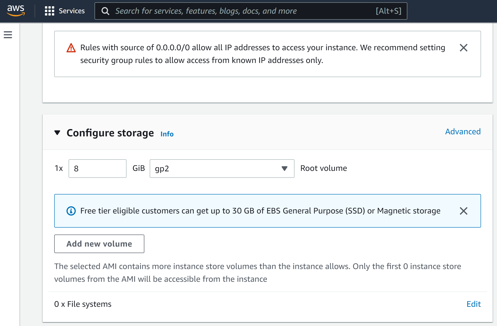

10. Keep the default options for the *Advanced details* section.

11. Click on *Launch instance*. It might take a few minutes for your instance to start running and be ready to use. Usage hours on your new instances will start immediately and continue to accrue until you stop or terminate your instances. Once your instances are in the running state, you can manage them from the *Instances* screen.

    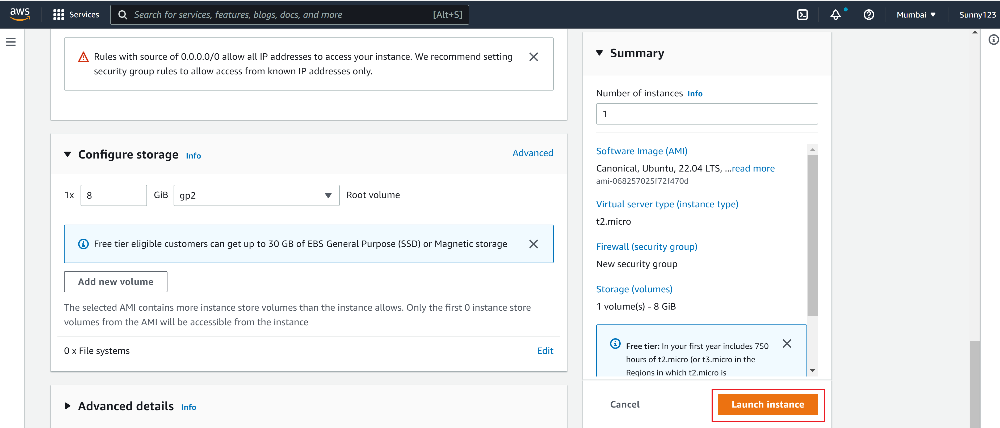 
	
**NOTE:** After creating the instance successfully, if you donot see the instance created under *Instances Info*, try refreshing the browser.

12. Once you launch the Amazon EC2 instance, ensure the following.

   - Verify that the instance is ready after you launch the instance, it might take a few minutes for the instance to be ready so that you can connect to it.

   - Check that your instance has passed its status checks. You can view this information in the Status check column on the *Instances* page.

     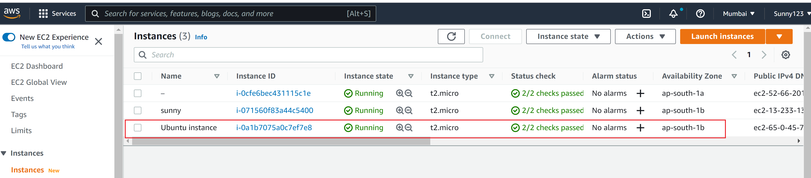 

   - Verify the general prerequisites for connecting to your instance. 
      
      1. Find the public DNS name or public IPv4 address of your instance by clicking on the instance ID.
   
      2. Get the user name by clicking on *Connect* in the *Instance summary* section. By default, the user name for any Ubuntu AMI instance is *ubuntu*. You can also change the user name as desired.
   
         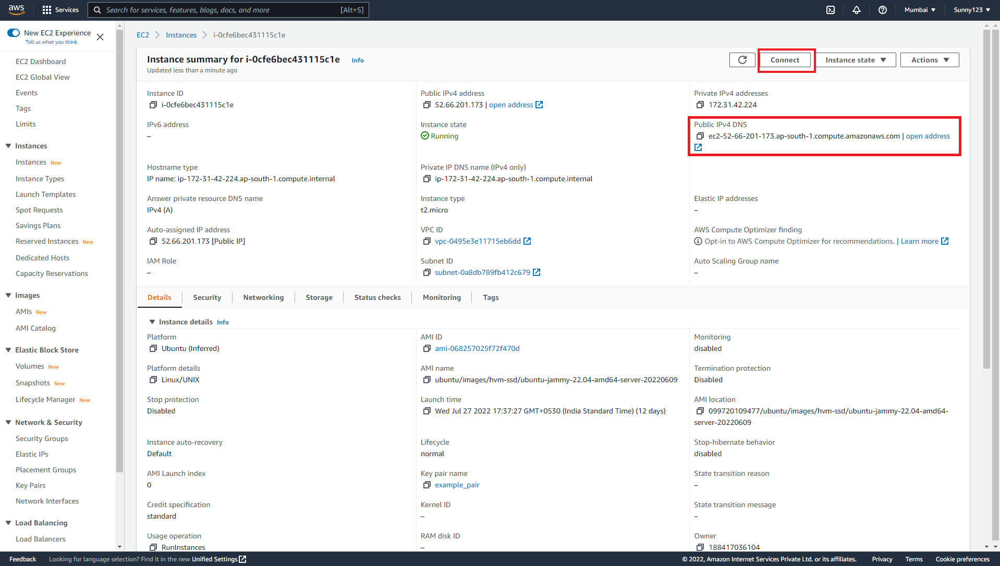

### Connect to the Amazon EC2 instance

Use the following procedure to connect to your Amazon EC2 instance using PuTTY.
PuTTY is a command prompt for remote computer. PuTTY is used to remotely access any Linux, UNIX, or Windows computer using SSH, Telnet etc.,.

1. Install *PuTTY* software on your local computer.  If you already have an older version of PuTTY installed, we recommend you to replace it with the latest version.
 
2. Launch PuTTY on your PC.

3. Under the *Category* pane, go to *Session*. In the Host Name box, enter either the Public DNS host name or IP address of your Amazon EC2 instance.

   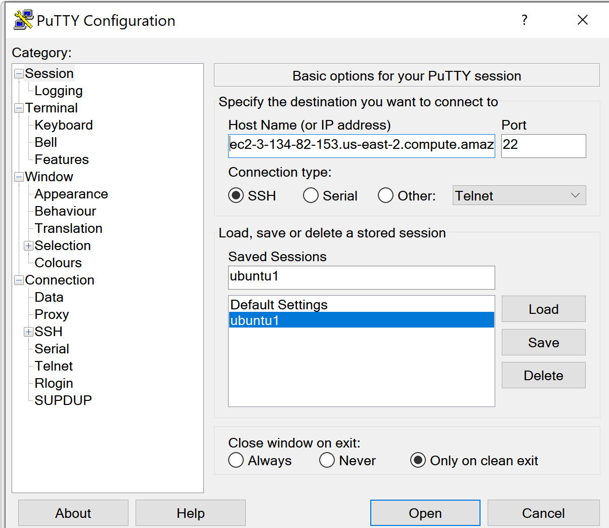

   - Ensure that the Port value is 22.

4. Select SSH as the connection type and browse your .ppk file. 

   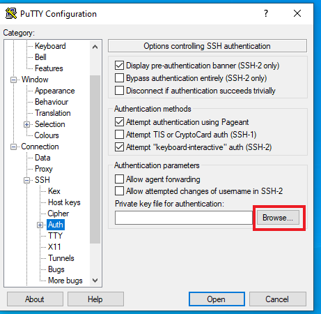

5. Under the *Connection* pane, go to *Data* and give the user name as *ubuntu*.

   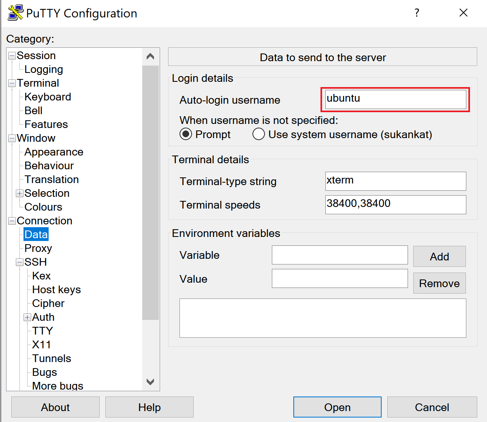

6. Now click on *Open* to open a terminal for your instance. After the sucessful connection, command prompt with window pane will pop up as shown below.

   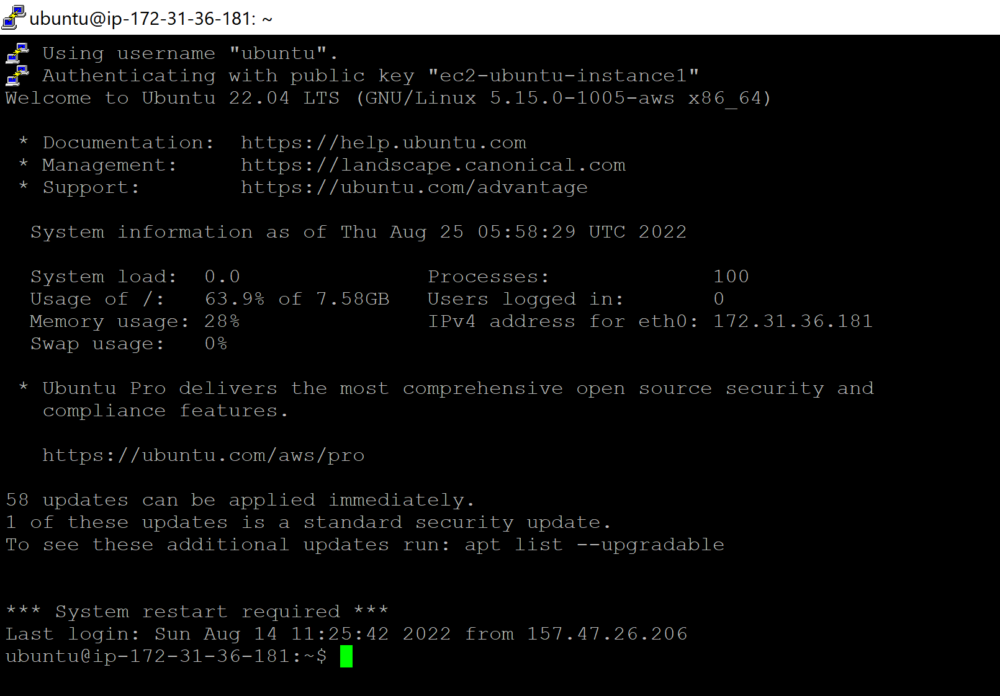

### Inbound and Outbound traffic rules over the instance

Inbound Rules:

1. Log in to your AWS console, go to the instance, and click on the instance that you have created.

2. Under *Security* section, click on Security groups that is being displayed.

   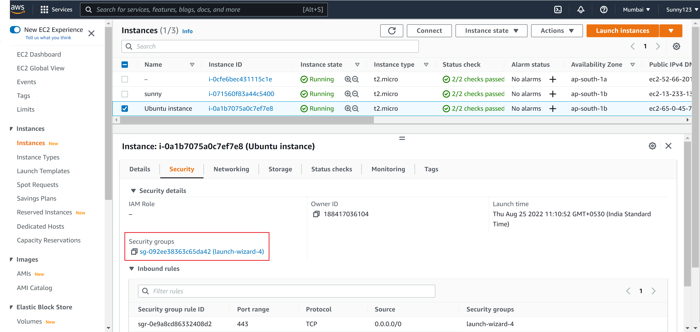

2. Click on the *Security Group*, then you can see the inbound and outbound rules. Edit the inbound rules and outbound rules as below.
    
    - Click on *Edit Inbound Rules* button and then click on *Add rule* to add an inbound rule. 

    - Select the custom TCP with the port number 5000-5050, and select the IP as 0.0.0.0.

    - Select the custom SSH with the port number 22, and select the IP as 0.0.0.0

    - Select the custom HTTPS with the port number 443, and select the IP as 0.0.0.0

    - Select the custom HTTP with the port number 80, and select the IP as 0.0.0.0.

    - Select the custom TCP with the port number 0, and select the IP as 0.0.0.0

    - Click on *Save Rules* button to make changes to your inbound rules.

    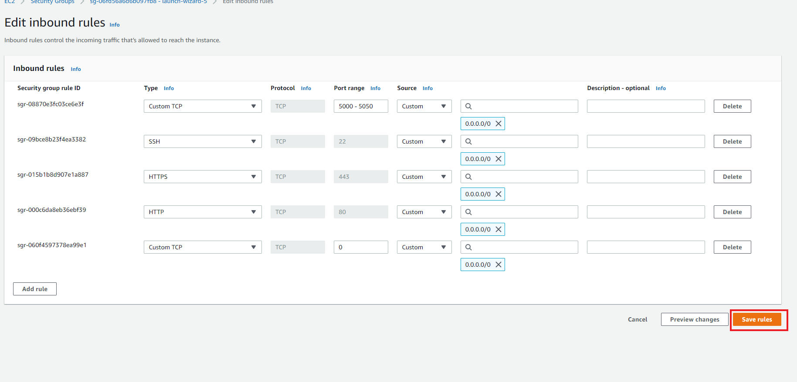

3. Click on the security group, then you can see the outbound rules. Edit the outbound rules as below:

    - Select the type as *All traffic* with protocol as *All* and with port range as *All*. Click on *Save rules*.

    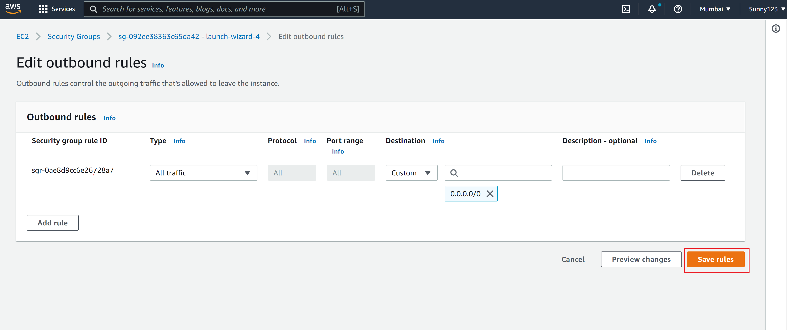

### Installing OpenSSL over the Instance using PuTTY

1. In the instance terminal, update all the existing packages.
 Before installing any new package or software application, it is suggested that you refresh your system cache. To do this, run the below mentioned command to update the apt packages list on Ubuntu.
      ```
      sudo apt update
      ```
2. Grab OpenSSL source code.
Next, you will need to download OpenSSL from the source. OpenSSL is the programming library used to implement TLS (Transport Layer Security), i.e. the actual encryption and authentication. To install OpenSSL, type the following command.
   ```
   sudo apt-get install openssl
   ```  
3. Clone the RS9116 release packages using the below command.

  ```
   git clone https://github.com/SiliconLabs/wiseconnect-wifi-bt-sdk
  ```
4. Run an OpenSSL server on port number 5001.
  - change the directory to *wiseconnect-wifi-bt-sdk/resources/certificates/* and run the following command:

  ```
  openssl s_server -accept 5001 -cert server-cert.pem -key server-key.pem
  ```
  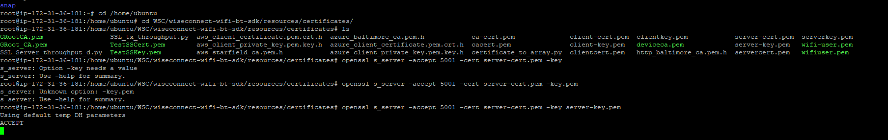

  NOTE: From the next time you restart the Ubuntu terminal, follow the above *step 4* alone to run an OpenSSL server as the previous configurations are stored in the instance.

## Setting up the Development Environment

The following section describes how to set up the Simplicity IDE in Windows Operating System.

1. Place the *amazon_ec2_instance_ssl_throughput* project folder in the 2.6.0 SDK downloaded at path: *<SDK_path> → examples → snippets → wlan*.

1. Ensure the RS9116 NCP module is pre-loaded with 2.6.0.0.34 firmware (RS9116W.2.6.0.0.34.rps) following the steps mentioned in [firmware update](https://docs.silabs.com/rs9116-wiseconnect/latest/wifibt-wc-getting-started-with-pc/update-evk-firmware).

2. Launch the Simplicity Studio IDE on your PC.

3. Select the desired path as workspace directory. The following directory has been chosen for the workspace as shown in the image below.

4. Click on *Launch*.

   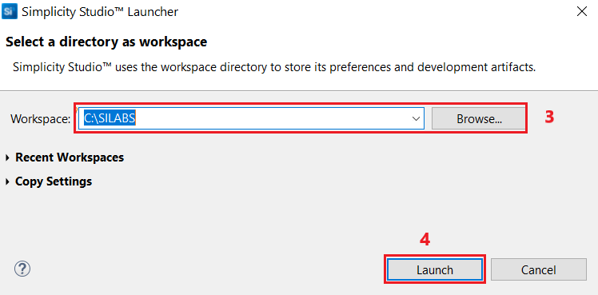

5. When EFR32 is connected to the PC, radio board detection is indicated as below.

   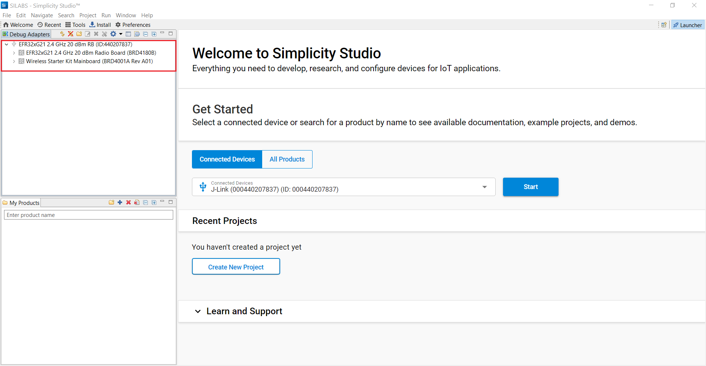

### Import the Project in to Simplicity Studio IDE

This section provides the steps for importing the project in to Simplicity Studio IDE.

1. In the Simplicity Studio IDE, go to *File* and select *Import*.

    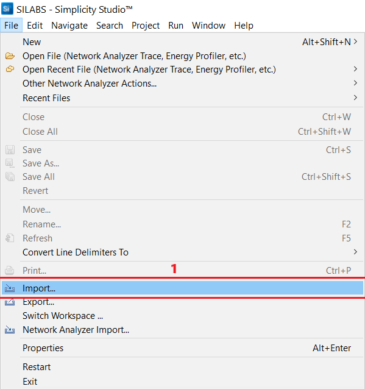**

2. A pop up window appears. Click on *Browse*.

3. Navigate to the path, *\<SDK_path\> -> examples -> snippets -> amazon_ec2_instance_ssl_throughput -> Projects* in the 2.6.0 release SDK downloaded.

4. Select the appropriate project as per the detected radio board variant i.e., *amazon_ec2_instance_ssl_throughput_brd4180a-mg21* for *BRD4180A*.
*amazon_ec2_instance_ssl_throughput_brd4180a-mg21* for *BRD4180B*.

5. Click on *Next* → *Next*.

    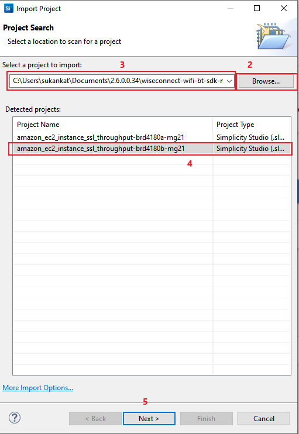 

6. Now click on *Finish*.

### Application configuration

1. Once the project is successfully imported, expand the project folder by clicking on drop down.

2. Open the *amazon_ec2_instance_ssl_throughput.c* file present at *amazon_ec2_instance_ssl_throughput-brd4180b-mg21 → amazon_ec2_instance_ssl_throughput* folder.

   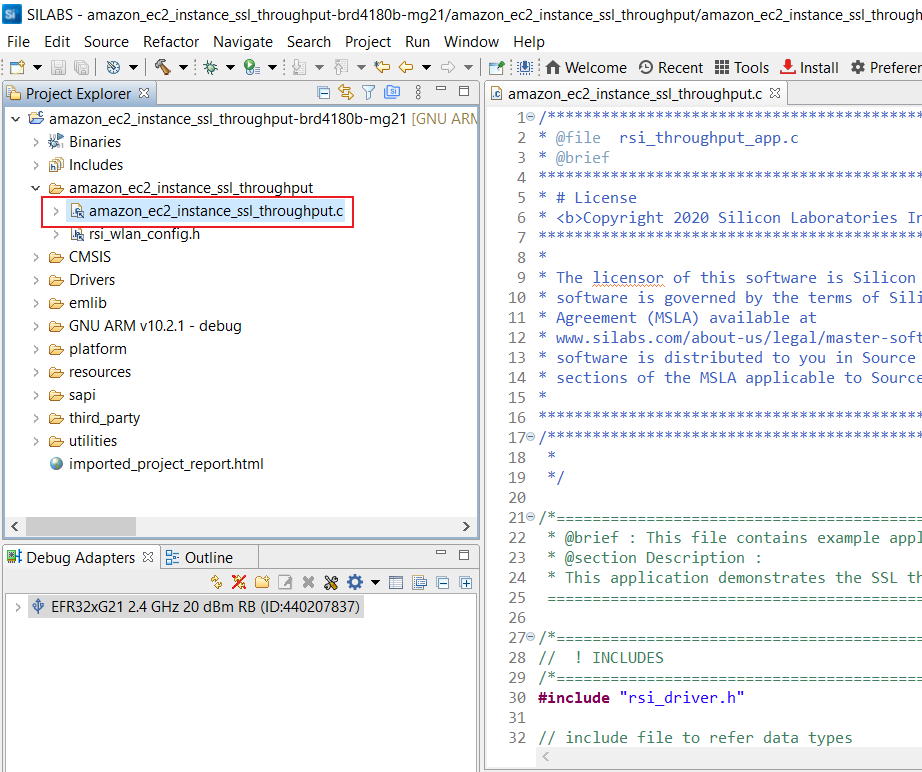 

3. Configure the *SSID*, *SECURITY_TYPE*, *PSK* and *DHCP_MODE* macros.

   - In this application the RS9116 NCP (station) gets connected to Access Point. SSID refers to the advertised name of the Access point's network.
     
     ```
     #define SSID                               "SILABS_AP"
     ```
     
   - SECURITY_TYPE refers to the mode of security in which the Access Point's network is configured. In this application STA supports Open, WPA-PSK, WPA2-PSK securities.

     Valid configuration is:

     - RSI_OPEN - For OPEN security mode

     - RSI_WPA  - For WPA security mode

     - RSI_WPA2 - For WPA2 security mode

     - RSI_WPA3 - For WPA3 security mode
 
     ``` 
     #define SECURITY_TYPE                        RSI_WPA2 
     ```

   - PSK refers to the secret key if the Access point is configured in WPA-PSK / WPA2-PSK security modes.

     ``` 
     #define PSK                                 "123456789" 
     ```
4. Configure the IPv4 address of the Amazon EC2 instance thas has been created to connect to the instance.
	 
	 ```
     #define  SERVER_IP_ADDRESS                 "3.134.82.53"                                
     ```
5. Configure the Server port number of OpenSSL server running on the Amazon EC2 instance. 
     ```
     #define  SERVER_PORT                           5001                                
     ```

### Build the project

1. Build the project by right clicking on *amazon_ec2_instance_ssl_throughput* project name and select *Build Project*. It takes a few seconds to build.

   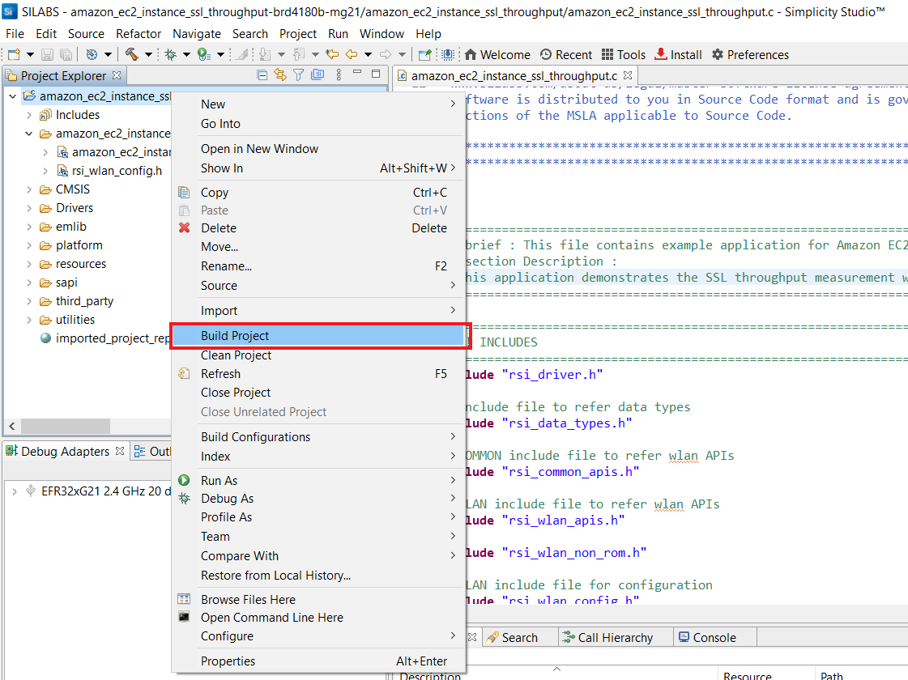

If there are no errors, you can go ahead with flashing the code onto EFR32xG21.
 
  **NOTE:** Make sure the setup (EFR32, RS9116 NCP module) is connected to PC, before flashing.

### Set up the Virtual COM port on Simplicity Studio IDE

The Virtual COM (VCOM) port interface is used for printing out debug prints from the application.
1. In the Debug Adapters pane, right-click on the detected device and choose Launch Console to launch a console connection.

   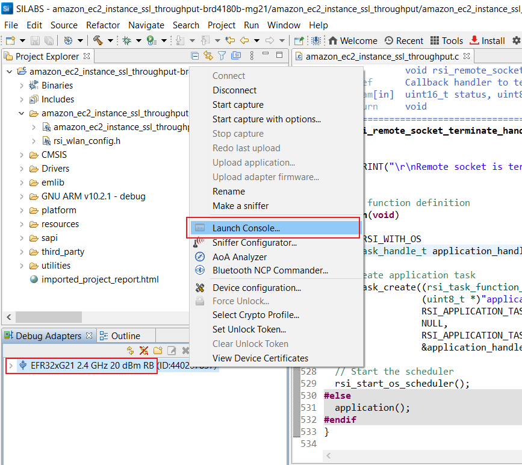

2. J-link Silicon Labs console pane opens as shown below. Switch to the Serial 1 tab in the console pane, for viewing the debug prints from the application.

3. Hit Enter on the Serial 1 tab to establish a serial connection between PC and setup.

   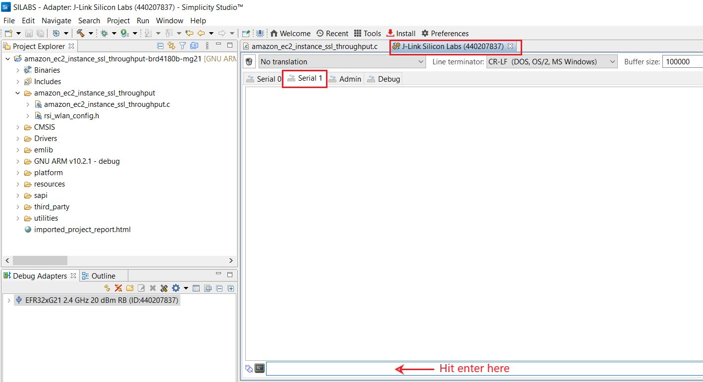

### Debug and run the project

1. To flash the code, right click on the project name and select *Debug As → Silicon Labs ARM Program*.
  - If the EFR32xG21 has an older SE firmware, the following warning may pop up. Click *Yes* to continue

    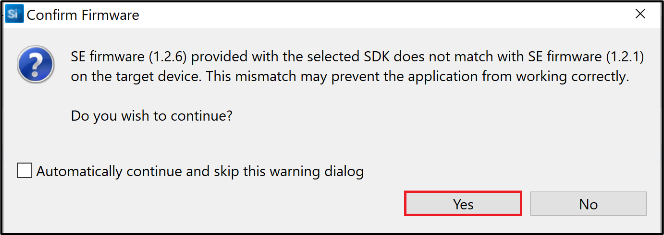

  - If the connected EFR32 board has any other radio board other than 20dbm, Simplicity Studio will not be able to detect the device and gives the below pop-up window for Device Selection. Select the device displayed and click OK.

    

  - The following warning might pop-up as shown below, Click Yes and continue. 

    

2. As soon as the debug process is completed, the application control branches to the main().

3. Go to the J-link Silicon Labs console pane to observe the debug prints in the Serial 1 tab.

   **NOTE**: The OpenSSL server should be started in PuTTY before running the application in Simplicity Studio IDE.

4. Click Resume icon from the Simplicity Studio IDE toolbar to run the project.

   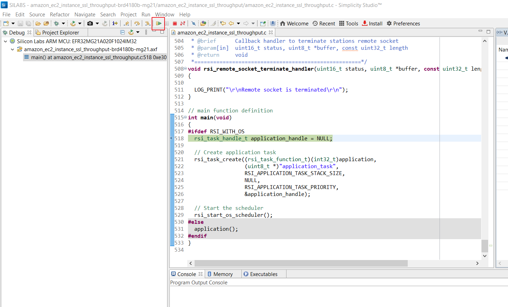

5. The following debug prints will appear on the Serial 1 tab.

   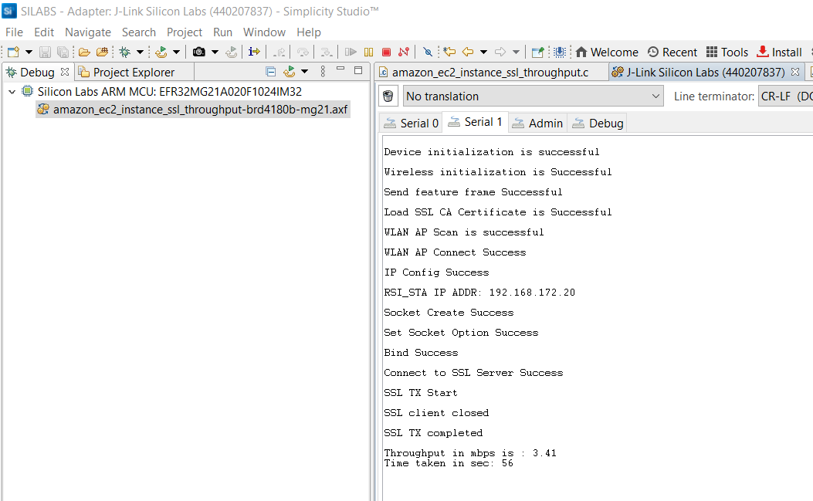

### Server side logs (Displayed on PuTTY)

You will find the prints at server once the client connected sucessfully.

  

### Appendix

To run the application using Bare metal configuration, do the following:
 - Right click on project name and go to *Properties -> C/C++ General -> Paths and Symbols -> GNU C*.
 - Select *RSI_WITH_OS* macro, and click on delete as shown in the picture below.
 - Click on *Apply and Close*. 

  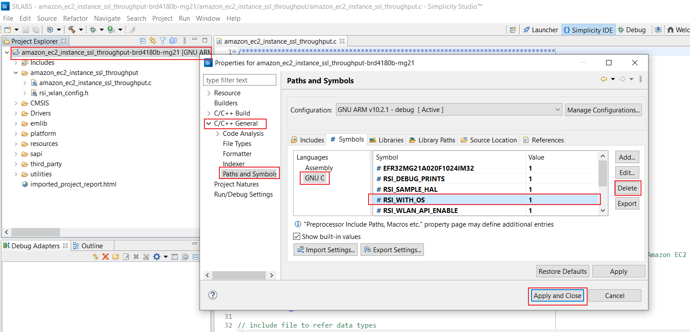
 


