# Firmware upgrade via bootloader

## Description
This example application demonstrates the procedure to flash and load the firmware via bootloader.
In this application, the firmware file is stored either in an SD card or in a buffer in the application.

## Prerequisites
																																							   
For this lab, you will need the following:

### Hardware Requirements

- EFM32GG11 Starter Kit with Wireless Gecko (SLSTK3701A Base board: BRD2204A)

- RS9116 Evaluation Board (RS9116W-SB-EVK1)/(RS9116W-DB-EVK1)

- MicroSD card

- Mini-USB to USB Type-A cable 

- Micro-USB to USB Type-A cable (included with RS9116X-SB-EVK1/RS9116W-DB-EVK1)

- Interconnect board and SPI ribbon cable (for SPI communication)
 
- Female to Female connectors - 2
																
- Windows PC with 2 USB ports 
																				
### Software Requirements
																																												   
- The latest Simplicity Studio IDE(v5.1.2.0 or higher)

   a. Download the Simplicity Studio IDE from [Simplicity Studio](https://www.silabs.com/developers/simplicity-studio).

   b. Follow the [Simplicity Studio user guide](https://docs.silabs.com/simplicity-studio-5-users-guide/latest/ss-5-users-guide-overview/) to install Simplicity Studio.

- Download and extract the 2.7.0 RS9116 NCP release package from the [link](https://github.com/SiliconLabs/wiseconnect-wifi-bt-sdk/tree/2.7.0). 
														 
- **firmware_upgrade_via_bootloader** project folder

- [Python tool with version higher than 3.10.6](https://www.python.org/downloads/)

**NOTE**:
- This application project is designed to work with EFM32GG11.
- This application is tested with the 2.7.0 SDK and 2.7.0.0.39 firmware.
- This example application supports Bare metal only.

## Setup
														
This section describes the hardware setup and the connections.

**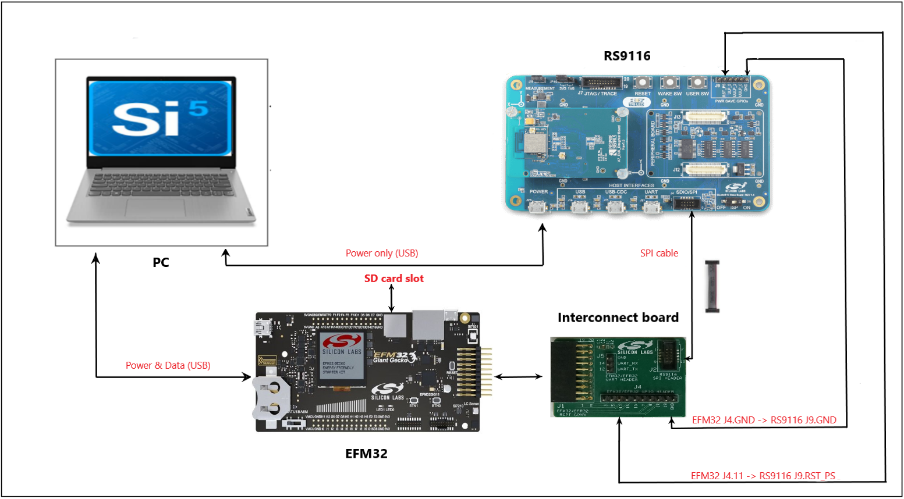**

   1. Connect the Interconnect adapter board provided with the RS9116 NCP Development Kit to the EXP header of EFM32.

   2. Connect the SPI header of Interconnect adapter board to the SDIO/SPI connector of the RS9116 NCP using a 10-pin ribbon cable (SPI cable) provided with RS9116 NCP.

   3. Connect the RST_PS pin on J9 header of RS9116 NCP to the pin labeled 11 on the J4 header of the Interconnect adapter board using a female-to-female connector.

   4. Connect the GND pin on J9 header of RS9116 NCP to the pin labeled GND on the J4 header of the Interconnect board using a female-to-female connector.

   5. Ensure the ISP switch on the RS9116 NCP module is set to OFF position. 

   6. Connect the EFM32 Starter Kit to the PC using a Mini USB cable.
   
   7. Connect the RS9116 NCP to a PC using the USB interface labeled POWER. Note that this connection only provides power. There is no USB communication over this connection.

**NOTE**: 
If you don't have an Interconnect board, make the SPI connections between EFM32 and RS9116 NCP using a SPI cable following the below references.

****

1. Pin definitions of EFM32 expansion header are as shown below.

   **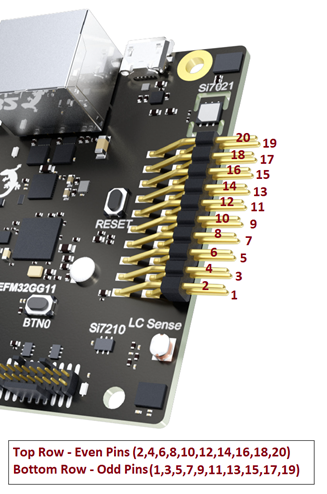**

2. SPI pin numbers are as shown below.

   **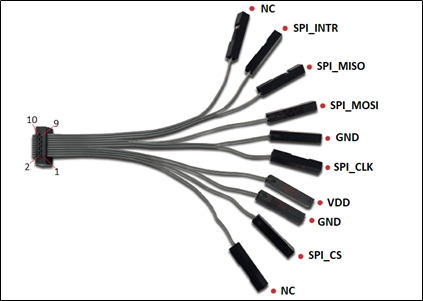**

3. Pin Configurations for EFM32GG11 with RS9116

   **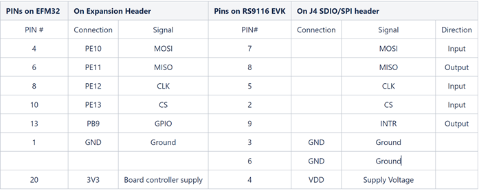**

## Setting up the development environment

The following section describes how to set up Simplicity Studio IDE in Windows Operating System.

1. Ensure the RS9116 NCP module is pre-loaded with 2.7.0.0.39 firmware (RS9116W.2.7.0.0.39.rps) following the steps mentioned in the [update EVK firmware](https://docs.silabs.com/rs9116-wiseconnect/latest/wifibt-wc-getting-started-with-pc/update-evk-firmware).

2. Place the **firmware_upgrade_via_bootloader** project folder in the downloaded 2.7.0 SDK at path: **\<SDK_path\> → examples → featured**

   **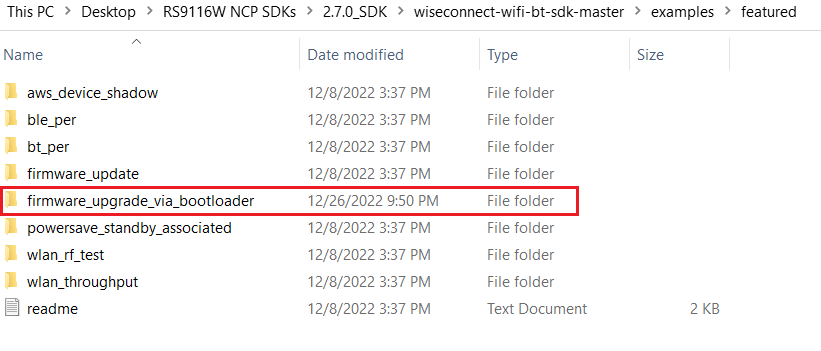** 

3. Launch the Simplicity Studio IDE on your PC.

4. Select the desired path as workspace directory by clicking on **Browse**. The following directory has been chosen for the workspace as shown in the image below.
												  
5. Click on **Launch**.
							 
   **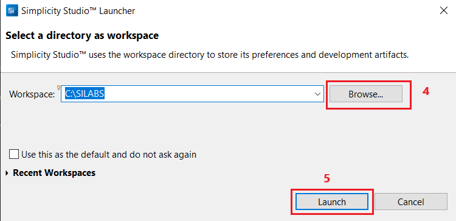**
									
6. Ensure the EFM32 and RS9116 NCP setup is connected to your PC. 

7. When EFM32 is connected to the PC, the board detection appears under **Debug Adapters** pane as shown below.

   **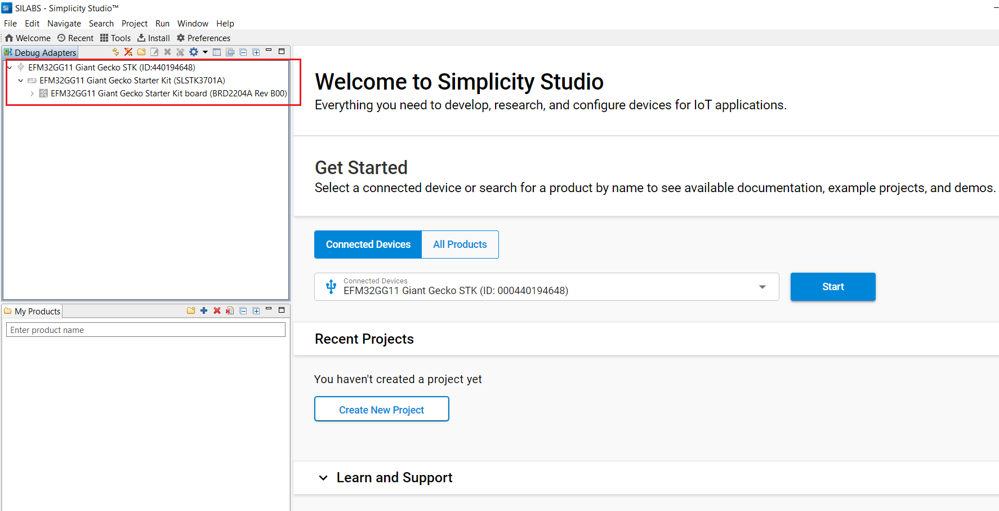**

### Import the Project

This section provides the steps for importing the project into Simplicity Studio IDE.

1. In the Simplicity Studio IDE, go to **File** and select **Import**.

   ****

2. A pop up window appears.Click on **Browse**.

3. Navigate to the path, **\<SDK_path\> → examples → featured → rsi\_firmware\_upgrade\_via\_bootloader → projects** in the 2.7.0 release SDK downloaded.

4. Select the project **firmware\_upgrade\_via\_bootloader-brd2204a-gg11.slsproj**.

5. Click on **Next** → **Next**.

   **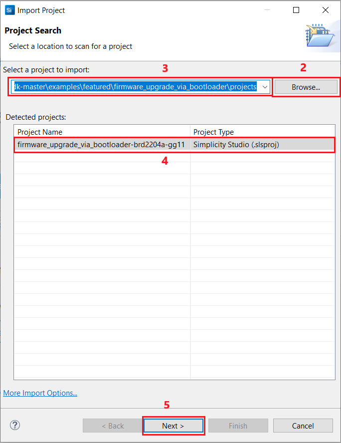** 

6. Now click on **Finish**.

### Application configuration

1. Once the project is successfully imported, the project name appears in the **Project Explorer** pane.

2. Expand the project folder by clicking on drop down.

   **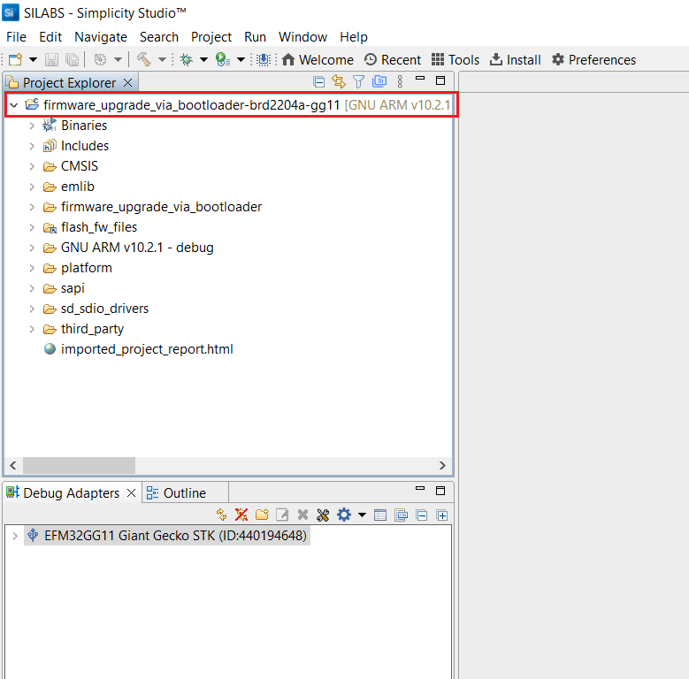**
   
3. Navigate to the **firmware\_upgrade\_via\_bootloader** folder. Open the **rsi_wlan_config.h** file and ensure that the below macro is set to 1 for fast firmware upgradation.

   ``#define RSI_FAST_FW_UP                    1``

   ****

#### Case 1: Storing the firmware file in an SD card and burning it to RS9116's flash

In this case, you need a microSD card with an available size of more than 2 MB because the RS9116 firmware file (.rps) is closer to 2 MB. In this example, one among the below mentioned microSD cards is used.

https://www.flipkart.com/transcend-4-gb-microsd-card-class-memory/p/itmd4sbmhvbjptmq

https://www.amazon.in/SanDisk-Ultra-microSD-Adapter-SDSQUAR-016G-GN6MA/dp/B073K14CVB/ref=psdc_1375393031_t1_B001F7AJKI

1. Insert the microSD card into the SD card slot of you PC.
2. Format the microSd card to FAT32 file system.
NOTE: FAT32 is a 32-bit version of the FAT file system and is a format typically used for USB sticks and SD cards. This file system arranges the space on your drive so that you can store files and access them on any kind of computer. FAT32 is an extension of file systems in which the data is stored in chunks of 32 bits.

   a. Right click on the microSD card detected on your PC and choose **Format...**.

   **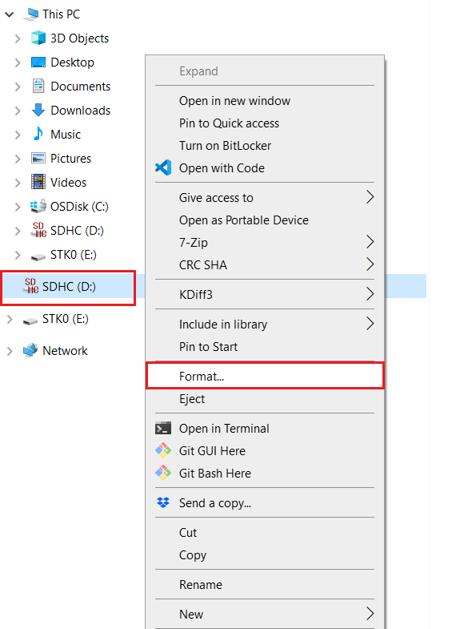** 

   b. Select the **File system** as **FAT32** and click on **Start**.

   **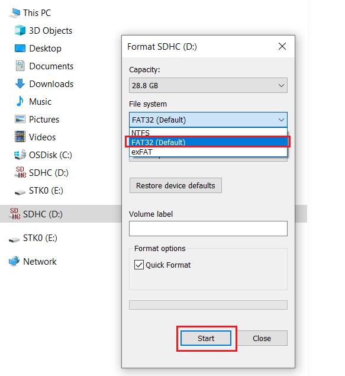** 

3. Copy one or more firmware files in to the microSD card. In this example, only one firmware file is copied.
   **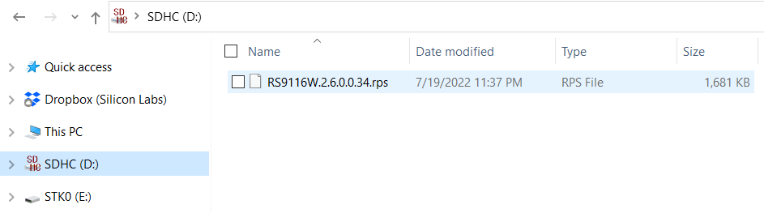** 

4. Go back to Simplicity Studio IDE and open the **rsi\_firmware\_upgrade\_via\_bootloader.c** and **main.c** files present in **firmware\_upgrade\_via\_bootloader-brd2204a-gg11 → firmware\_upgrade\_via\_bootloader** folder.

   **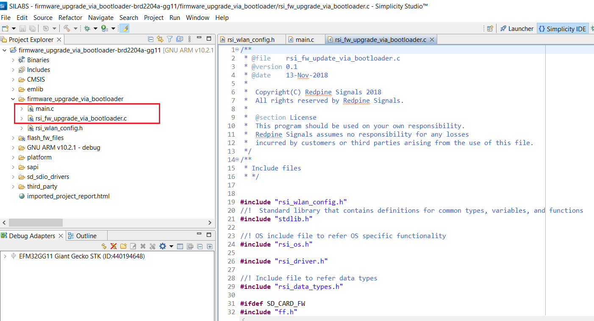** 

4. Navigate to the following macro definition in the **rsi\_firmware\_upgrade\_via\_bootloader.c** file and define the firmware file name same as in the microSD card.

    ``#define FW_FILE_NAME1        "RS9116W.2.6.0.0.34.rps"``

    **** 

NOTE: If you want to include more firmware files, 
- define them with macros FW_FILE_NAME2, FW_FILE_NAME3,....etc., in the **rsi\_firmware\_upgrade\_via\_bootloader.c** file.
- navigate to **openFile_sd()** function and replace the existing macro (in this example FW_FILE_NAME1) with the desired macro (say FW_FILE_NAME2).

   **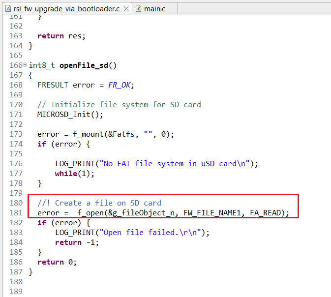** 

5. In the project that has been imported in to the Simplicity Studio IDE, the **SD_CARD_FW** preprocessor symbol is enabled by default.

**Note**: If you are facing any issues, please copy only one firmware file (.rps) file on to the microSD card.

#### Case 2: Storing the firmware file on the internal flash of EFM32 and burning it to RS9116's flash

In this case, a python utility script **GenerateHexArray.py** present at **\<SDK_path\> → examples → featured → rsi\_firmware\_upgrade\_via\_bootloader → resources** is used for converting the RS9116's firmware file into a character array. The character array/buffer is stored on EFM32's internal flash.

1. Copy the desired firmware file (in this case, RS9116W.2.6.0.0.34.rps) to the path - **\<SDK_path\> → examples → featured → rsi\_firmware\_upgrade\_via\_bootloader → resources**.

   **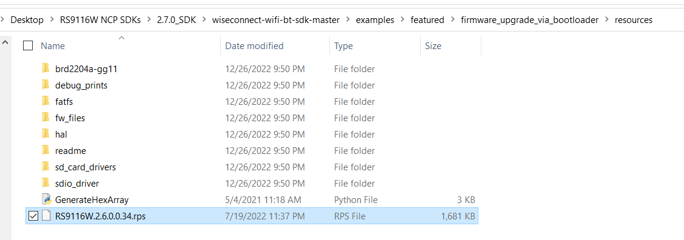** 

2. Give the following command to convert the firmware file to array.
   
   ``python GenerateHexArray.py RS9116W.2.6.0.0.34.rps``

   **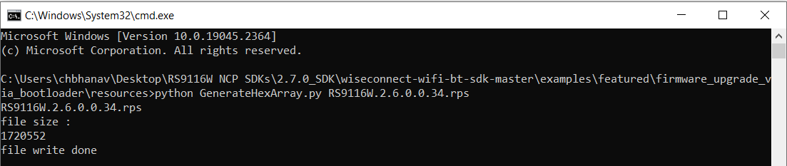** 

3. The **fw_file.h** file will be generated. Replace the **fw_file.h** present at **\<SDK_path\> → examples → featured → rsi\_firmware\_upgrade\_via\_bootloader → resources → fw_files** folder with the **fw_file.h** file generated file.

   **** 

4. Delete the **SD_CARD_FW** pre-processor symbol and add the **INTERNAL_FLASH_FW** pre-processor symbol.

   a. Right click on the Project → Properties → C/C++ General → Paths and Symbols → Symbols. Under GNU C, add **INTERNAL_FLASH_FW** as shown in the below image.
   
   b. Click on **Apply and Close**.

   **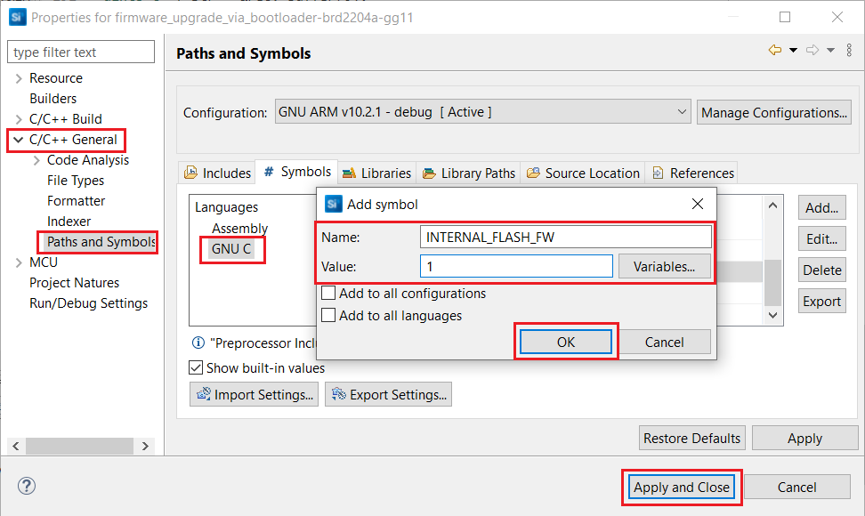**

### Set up the Virtual COM port on Simplicity Studio IDE

The Virtual COM (VCOM) port interface is used for printing out debug prints from the application.
1. In the Debug Adapters pane, right-click on the detected device and choose **Launch Console** to launch a console connection.

   **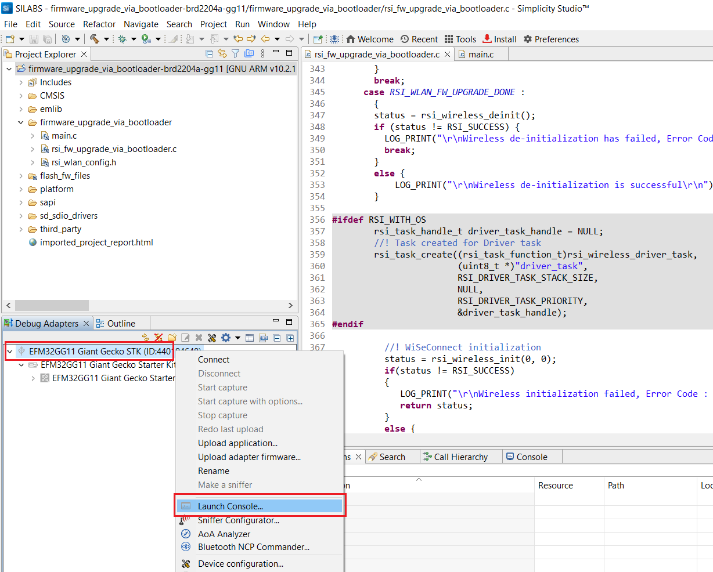**

2. J-link Silicon Labs console pane opens as shown below. Switch to the Serial 1 tab in the console pane, for viewing the debug prints from the application.

3. Hit Enter on the Serial 1 tab to establish a serial connection between PC and setup.

   ****

## Build the Project

1. Build the project by right clicking on **firmware\_upgrade\_via\_bootloader-brd2204a-gg11** and select **Build Project**. It takes a few seconds to build.

   ****

2. Make sure that the build returns with 0 errors and 0 warnings.

### Execution of the project

1. To flash the code, right click on the project name and select **Debug As** → **Silicon Labs ARM Program**.

   **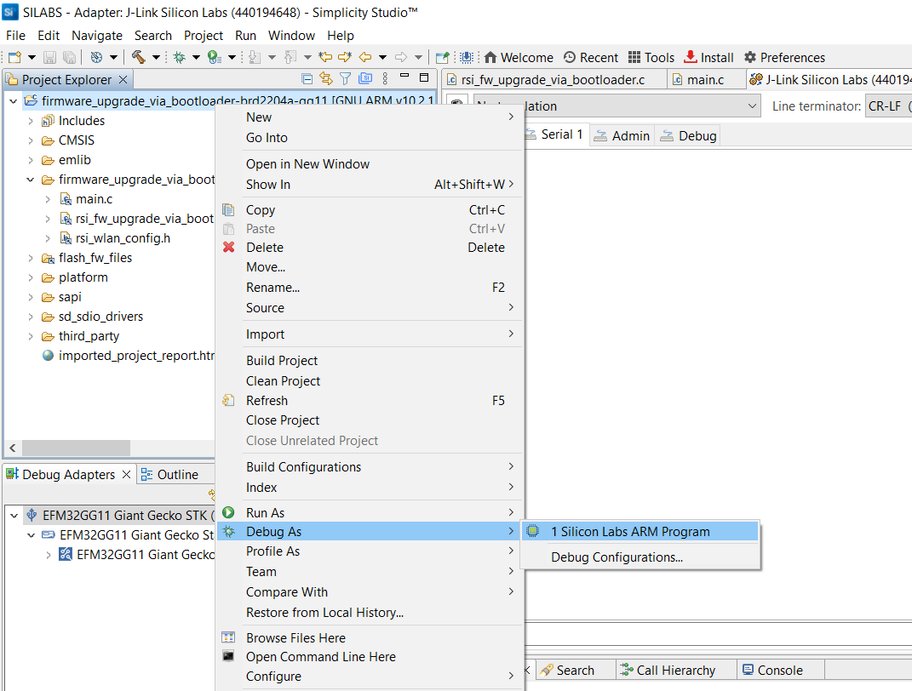**

  - If the EFM32 has an older SE firmware, the following warning may pop up. Click **Yes** to continue.

    ****

2. As soon as the debug process is completed, the application control branches to the main().

3. Go to the J-link Silicon Labs console pane to observe the debug prints in the Serial 1 tab.
NOTE: If you do not see any application prints, re-install Simplicity Studio IDE and follow the steps from [setting up the development environment](#Setting-up-the-development-environment) session.

4. Click Resume icon in the Simplicity Studio IDE toolbar to run the project.

   ****

5. For case #1, the following application prints are observed on the serial console.

   **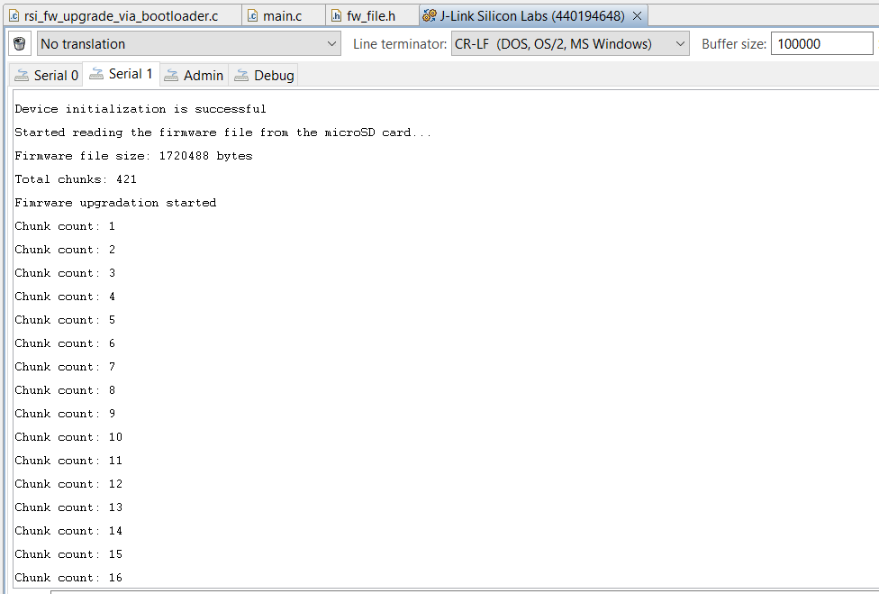**
   **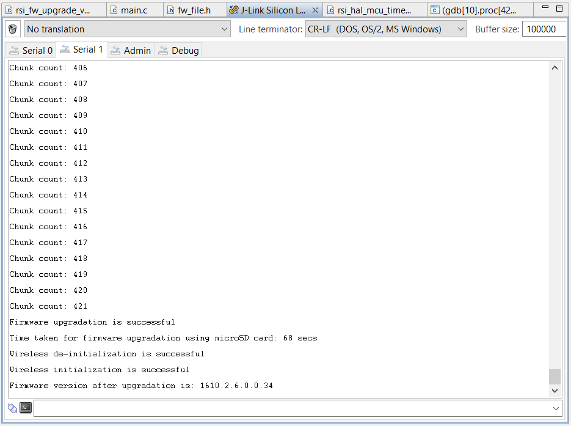**

6. For case #2, the following application prints are observed on the serial console.

   ****
   ****

**NOTE**: 
1. In this example, the firmware file size is around 1.7 MB. 
2. The time taken for burning the firmware on to RS9116 using microSD card is ~68 seconds.
3. The time taken for burning the firmware on to RS9116 using EFM32 internal flash is ~32 seconds.

  
 

