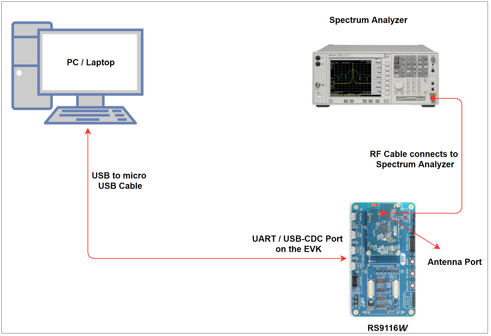
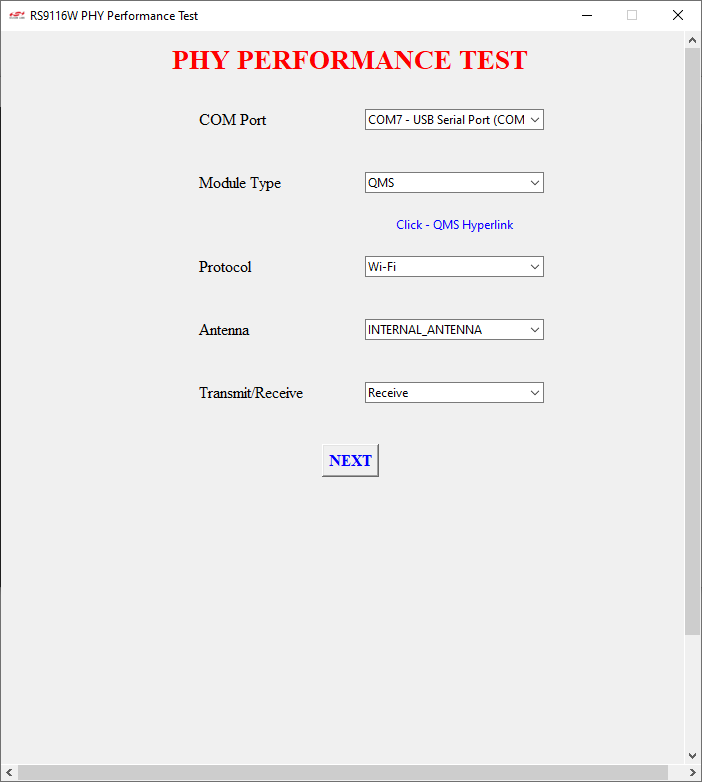
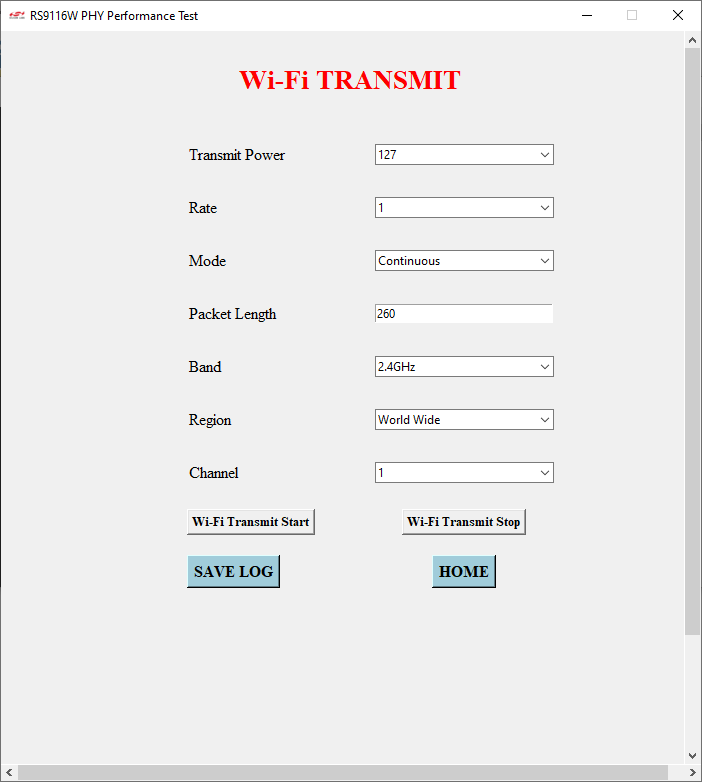
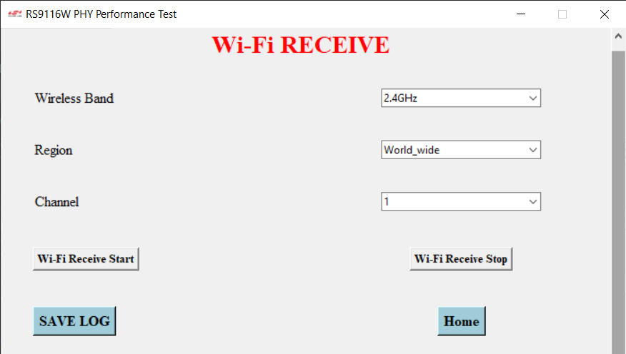
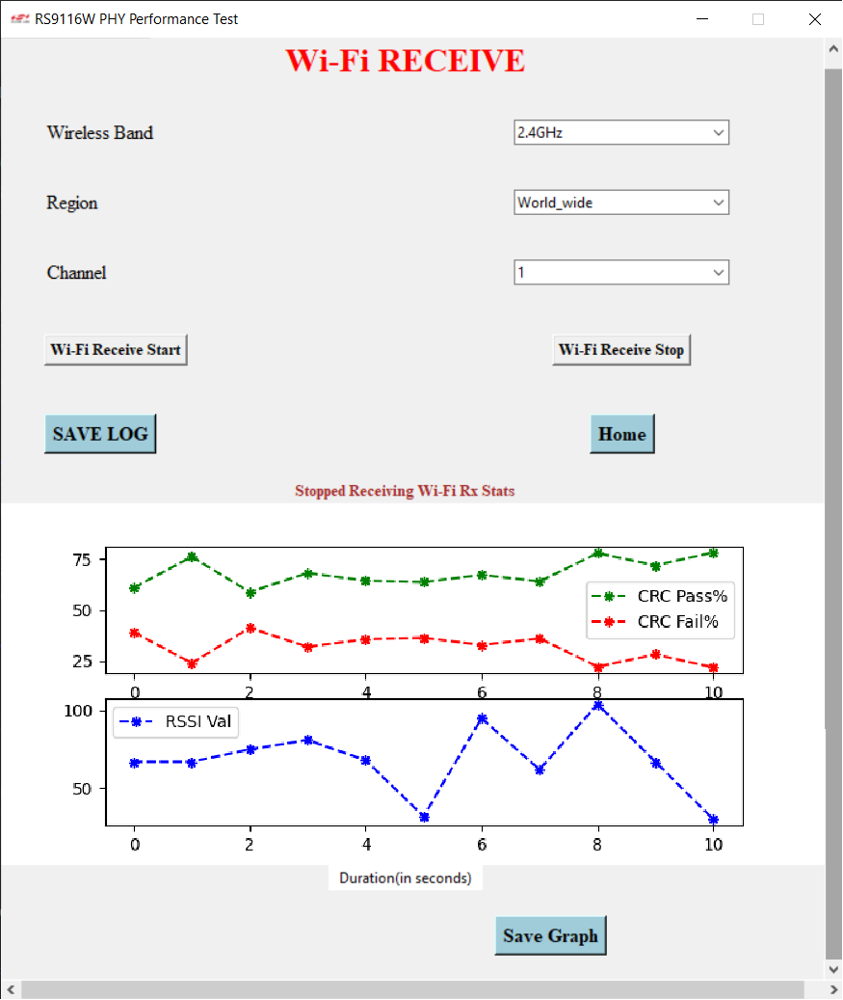
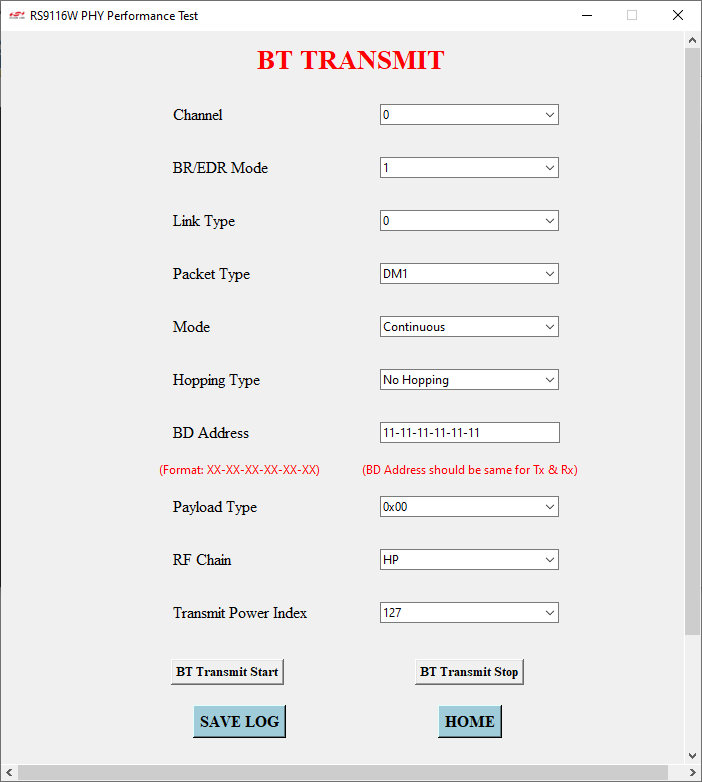
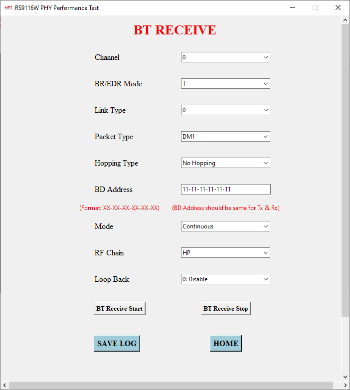
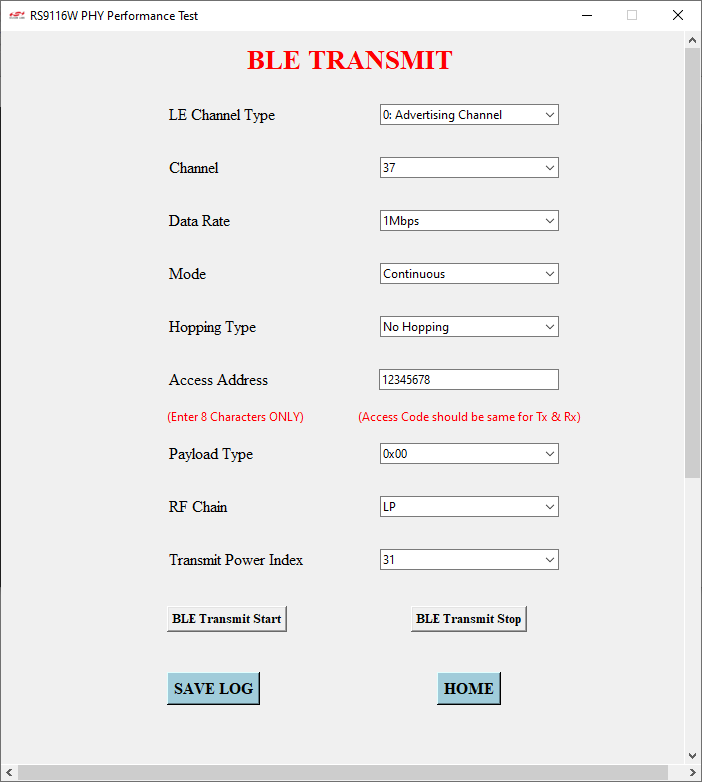
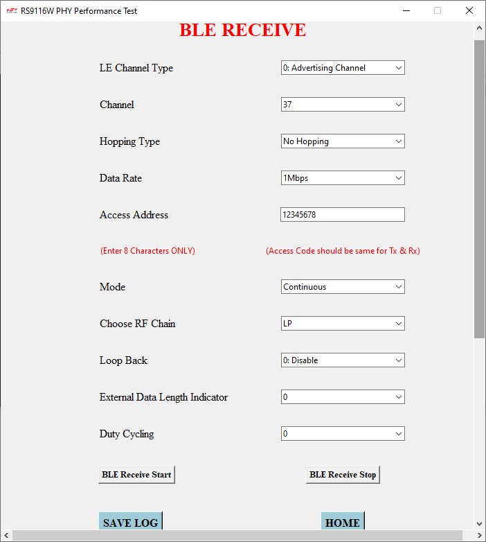

# PHY Performance Test GUI

## About this Document 

This document provides the steps to evaluate PHY Performance Test using simple GUI in NCP products (UART/USB-CDC host interface) using python script for Windows and Mac users. PHY Performance GUI analyzes Packet Error Rate which helps users analyze the performance of the module. This process is widely used in regulatory certifications like FCC, IC, CE, TELEC, ETSI, etc.

## 1 Prerequisites

### 1.1 Hardware 

1. RS9116 NCP module 
2. Micro USB Cable 
3. Windows/ Mac PC 
4. Spectrum Analyzer and RF Cables

### 1.2 Software  

1. Python (Optional)

Once you have the hardware and software, prepare a setup for executing the PHY Performance Test application.

## 2 Setup 

1. Make the connections as per the setup picture shown below.  

As described in the picture, connect the RS9116 NCP module to PC/Laptop using a USB to micro USB cable via UART/USB-CDC port on the module and then connect the antenna port on the module to Spectrum Analyzer by using an RF cable. Then power up the spectrum analyzer.

**NOTE:** If you don't have Spectrum Analyzer, graphs can be observed in the GUI after Rx Stop. 

2. Download and extract the **phy_performance_test_gui.zip**. 

3. To open GUI, follow one of the methods mentioned below:

**METHOD 1:**
- Navigate to the **applications** folder.
- If you are using Windows OS, navigate to **Windows** folder. 
- If you are using mac OS, navigate to **macOS** folder.
- Double-click on the file to open GUI.

(OR)

**METHOD 2:**
- Navigate to the **python_installation** folder.
- If you are using Windows OS, navigate to **Windows** folder. 
- If you are using mac OS, navigate to **macOS** folder.
- Double-click the file to install python and the supporting modules needed for running the python script.
- Then, navigate to **code_base** and execute **phy_performance_test_gui.py**.

**Note:** The installation provided will install python version **3.7.9** for Windows OS and version **3.10.8** for macOS. For Python version 3.4 or later, **PIP** package is included by default.

## 3 PHY Performance Test

### 3.1 Homepage 

On the home page, follow the below sequence of selecting appropriate options given to the user. 

1. User must select the COM Port that is detected after connecting the RS9116 NCP module to Windows/ Mac PC. 
2. Select Module Type: QMS, B00, CC0, CC1. 
3. Select the Protocol depending on the choice. We have added support for Wi-Fi, BT Classic, and  BLE. 
4. Choose the antenna that you would like to transmit the signals on, either INTERNAL_ANTENNA, RF_PORT1/U.FL, and RF_PORT2/INTERNAL_ANTENNA.
5. Choose the type of mode either transmit or receive. 
6. Click **Next** button to move to the next page depending on the options selected by the user.

**NOTE:**

- Default parameters are set on the GUI. Click **Next** button to use them as testing values. 
- Click on the hyperlink below module type to know more information on the module type.

### 3.2 Wi-Fi Transmit PHY Performance Test Page

On Wi-Fi Transmit PHY Performance Test Page choose the following options:

1. Transmit Power: Valid values are from 2dBm to 18dBm and 127dBm.
2. Rate: Select transmit data rate from the dropdown. Date rates of 1, 2, 5.5, and, 11 Mbps are not supported when operating in a 5 GHz channel.
3. Mode: Select the transmit mode to be used among Burst, Continuous, and CW Mode.
4. Packet Length: Configure the length of the transmit packet. Valid values are in the range:
    1. Burst Mode: 24- 1500 bytes 
    2. Continuous Mode: 24- 260 bytes 
    3. CW Mode: 24- 1500 bytes 
5. Band:  
    1. If RS9116 NCP module is Single Band : 2.4GHz 
    2. If RS9116 NCP module is Dual Band : 2.4GHz, 5GHz 
6. Region: Select region between Worldwide, FCC(US), ETSI(Europe), and JP(Japan) 
7. Channel: Select the channel from the dropdown. Channels are available based on the region and the band selected.
    1. If the band is 2.4 GHz
        1. Worldwide: 1-14 channels are available.
        2. FCC(US): 1-11 channels are available.
        3. ETSI(Europe): 1-13 channels are available.
        4. JP(Japan): 1-14 channels are available.
    2. If the band is 5 GHz – Channels available are 36, 40, 44, 48, 52, 56, 60, 64, 100, 104, 108, 112,  116, 120, 124, 128, 132, 136, 140, 149, 153, 157, 161, 165.

**NOTE:**

1. Since packet length depends on the mode, choose the mode before selecting packet length.  
2. Since Channel depends on the band and region, choose the band and region before selecting the channel. 
3. Since the rate depends on the band, choose the band before selecting the rate.

Finally, click the **Wi-Fi Transmit Start** button to start transmitting the data and **Wi-Fi Transmit Stop** button to stop transmitting. The **Save Log** button will download the list of commands executed. The **Home** button will navigate to the PHY Performance Test homepage. 

### 3.3 Wi-Fi Receive PHY Performance Test Page

On Wi-Fi Receive PHY Performance Test Page choose the following options: 

1. Wireless Band:  
    1. If 2.4GHz (if Single Band is selected on the home page, 2.4GHz will be set by default)
    2. If 2.4GHz, 5Ghz (if Dual Band is selected on the home page, 2.4GHz will be set by default)

2. Region: Select region between Worldwide, FCC(US), ETSI(Europe), and JP(Japan) 
3. Channel: Select the channel from the dropdown. Channels are available based on the region and band selected.
    1. If the band is 2.4GHz
        1. Worldwide: 1-14 channels are available.
        2. FCC(US): 1-11 channels are available.
        3. ETSI(Europe): 1-13 channels are available.
        4. JP(Japan): 1-14 channels are available.
    2. If the band is 5GHz – Channels available are 36, 40, 44, 48, 52, 56, 60, 64, 100, 104, 108, 112,  116, 120, 124, 128, 132, 136, 140, 149, 153, 157, 161, 165.

Once the appropriate parameters are selected and when the user clicks on the “Wi-Fi Receive Stop”  button, the following graph will be displayed on the GUI with the pass and fail percentage of CRC.  

**NOTE:**

- Since Channel depends on Wireless Band and Region, choose Wireless Band and Region before selecting Channel. 

- Finally, click the **Wi-Fi Receive Start** button to start receiving the data and **Wi-Fi Receive Stop** button to stop receiving. The graph will be displayed once the **Wi-Fi Receive Stop** button is pressed. The **Save Log** button will download the list of commands executed. The **Home** button will navigate to the PHY Performance Test homepage.

- The **Save Graph** button will be displayed once the **Wi-Fi Receive Stop** button is pressed, along with Graph. Click the **Save Graph** button to download the generated graph. It saves the graph into the same folder of the application that is running.

### 3.4 BT Transmit PHY Performance Test Page

On BT Transmit PHY Performance Test Page choose the following options:

1. Channel: Select channel as per Bluetooth standard i.e., 0 to 78.
2. BR/EDR Mode: Select the BT Classic mode.
    1. 1 is the basic rate.
    2. 2 and 3 are enhanced rates.
3. Link Type: Select the type of channel used.
    1. 0 - sco
    2. 1 - acl
    3. 2 - esco
4. Packet Type: Select type of the packet to be transmitted as per the Bluetooth standard. Available values are DM1, DH1, DH3, DM3, DH5, DM5, 2-DH1, 2-DH3, 2-DH5, 3-DH1, 3-DH3, 3-DH5, HV1,  HV2, HV3, DV, EV3, EV4, EV5, 2-EV3, 2-EV5, 3-EV3, 3-EV5 
5. Mode: Select the transmit mode to be used among Burst, Continuous, and CW Mode. 
6. Hopping Type: This field defines the frequency hopping type to be used.
    1. 0 - No Hopping Enable, Disable, AFH_Enable 
    2. 1 - Fixed Hopping
    3. 2 - Random Hopping (Channel is unused in this mode)
7. BD Address: 
    1. Enter a 48-bit address in hexadecimal format, e.g., XX-XX-XX-XX-XX-XX  
    2. This parameter does not need to be the module's BD address, it can be any 48-bit BD address. However, the same address should be used for the transmit and receive modes.
8. Payload Type: Select the type of payload data sequence between PRBS9 sequence, 0xF0, 0xAA, PRBS15 sequence, 0xFF, 0x00, 0x0F and 0x55.
9. RF Chain: Select the RF Chain to be used either HP or LP. 
10. Transmit Power Index: Select the value between 0 and 10.

**NOTE:**

- Since Transmit Power depends on RF Chain, select RF chain before Transmit Power. 
- Finally, click the **BT Transmit Start** button to start transmitting the data and **BT Transmit Stop** button to stop transmitting. The **Save Log** button will download the list of commands executed. The **Home** button will navigate to the PHY Performance Test homepage. 

### 3.5 BT Receive PHY Performance Test Page

On BT Receive PHY Performance Test Page choose the following options:

1. Channel: Select channel as per Bluetooth standard i.e., 0 to 78. 
2. BR/EDR Mode: Select the BT Classic mode.
    1. 1 is the basic rate.
    2. 2 is enhanced rate.
3. Link Type: Select the type of channel used.
    1. 0 - sco
    2. 1 - acl
    3. 2 - esco
4. Packet Type: Select the type of packet to be transmitted as per the Bluetooth standard. Available values are DM1, DH1, DH3, DM3, DH5, DM5, 2-DH1, 2-DH3, 2-DH5, 3-DH1, 3-DH3, 3-DH5, HV1,  HV2, HV3, DV, EV3, EV4, EV5, 2-EV3, 2-EV5, 3-EV3, 3-EV5.
5. Hopping Type: This field defines the frequency hopping type to be used.
    1. 0 - No Hopping Enable, Disable, AFH_Enable 
    2. 1 - Fixed Hopping
    3. 2 - Random Hopping (Channel is unused in this mode)
6. BD Address: 
    1. Enter a 48-bit address in hexadecimal format, e.g., XX-XX-XX-XX-XX-XX  
    2. This parameter does not need to be the module's BD address, it can be any 48-bit BD address. However, the same address should be used for the transmit and receive modes.
7. RF Chain: Select the RF Chain to be used either HP or LP. 
8. Loop Back: Select the loopback mode from the dropdown. 
    1. 0 - Disable
    2. 1 - Enable 

**NOTE:**

- Finally, click the **BT Receive Start** button to start receiving the data and **BT Receive Stop** button to stop receiving. The graph will be displayed once the **BT Receive Stop** button is pressed. The **Save Log** button will download the list of commands executed. The **Home** button will navigate to the PHY Performance Test homepage.

- The **Save Graph** button will be displayed once the **BT Receive Stop** button is pressed, along with Graph. Click the **Save Graph** button to download the generated graph. It saves the graph into the same folder of the application that is running.

### 3.6 BLE Transmit PHY Performance Test Page

On BLE Transmit PHY Performance Test Page choose the following options:

1. LE Channel Type: Select the LE Channel Type
    1. 0 - Advertising Channel
    2. 1 - Data Channel 
2. Channel: Select channel number from 0 to 39. 
3. Data Rate: This is the rate at which packets are transmitted. Available values are 1Mbps, 2Mbps, 125Kbps, and 500Kbps.
4. Mode: Select the transmit mode to be used among Burst, Continuous, and CW Mode.
5. Hopping Type: This field defines the frequency hopping type to be used.
    1. 0 - No Hopping Enable, Disable, AFH_Enable 
    2. 1 - Fixed Hopping
    3. 2 - Random Hopping (Channel is unused in this mode)
6. Access Address: Enter 8-digit access address. This is the access address with which packets are transmitted. However, the same address should be used for the transmit and receive modes.
7. Payload Type: Select the type of payload data sequence between 0x00, 0xFF, 0xF0, 0x55, PRBS9, PRBS15, 0x0F and 0xAA.
8. RF Chain: Select the RF Chain to be used either HP or LP. 
9. Transmit Power Index:  
    1. If RF Chain is HP: 127, 1-12 are the available ranges.
    2. If RF Chain is LP: 1-31, 33-63 are the available ranges.

**NOTE:**

- Since Transmit Power depends on RF Chain, select RF chain before Transmit Power. 
- Finally, click the **BLE Transmit Start** button to start transmitting the data and **BLE Transmit Stop** button to stop transmitting. The **Save Log** button will download the list of commands executed. The **Home** button will navigate to the PHY Performance Test homepage. 

### 3.7 BLE Receive PHY Performance Test Page

On BLE Receive PHY Performance Test Page choose the following options:

1. LE Channel Type: Select the LE Channel Type
    1. 0 - Advertising Channel
    2. 1 - Data Channel 
2. Channel: Select channel number from 0 to 39. 
3. Hopping Type: This field defines the frequency hopping type to be used.
    1. 0 - No Hopping Enable, Disable, AFH_Enable 
    2. 1 - Fixed Hopping
    3. 2 - Random Hopping (Channel is unused in this mode)
4. Data Rate: Select the values between 1Mbps, 2Mbps, 125Kbps, and 500Kbps.
5. Access Address: Enter 8-digit access address. However, the same address should be used for the transmit and receive modes.
6. RF Chain: Select the RF Chain to be used either HP or LP. 
7. Loop Back: Select the loopback mode from dropdown. 
    1. 0 - Disable
    2. 1 - Enable 
8. External Data Length Indicator: This field enables/disables the extended data length
    1. 0 - Extended Data length disabled
    2. 1 - Extended Data length enabled
9. Duty Cycle: This field enables/disables duty cycling.
    1. 0 - Duty Cycling Disabled
    2. 1 - Duty Cycling Enabled

**NOTE:**

- Finally, click the **BLE Receive Start** button to start receiving the data and **BLE Receive Stop** button to stop receiving. The graph will be displayed once the **BLE Receive Stop** button is pressed. The **Save Log** button will download the list of commands executed. The **Home** button will navigate to the PHY Performance Test homepage.

- The **Save Graph** button will be displayed once the **BLE Receive Stop** button is pressed, along with Graph. Click the **Save Graph** button to download the generated graph. It saves the graph into the same folder of the application that is running.

## 4 Troubleshooting

- If any error occurs, terminate the application, reset the RS9116 NCP module, and re-run the application.

## 5 References

- [Wi-Fi AT Command PRM](https://docs.silabs.com/rs9116/wiseconnect/rs9116w-wifi-at-command-prm/latest/)
- [Bluetooth Classic AT Command PRM](https://docs.silabs.com/rs9116/wiseconnect/rs9116w-bt-classic-at-command-prm/latest/)
- [BLE AT Command PRM](https://docs.silabs.com/rs9116/wiseconnect/rs9116w-ble-at-command-prm/latest/)
