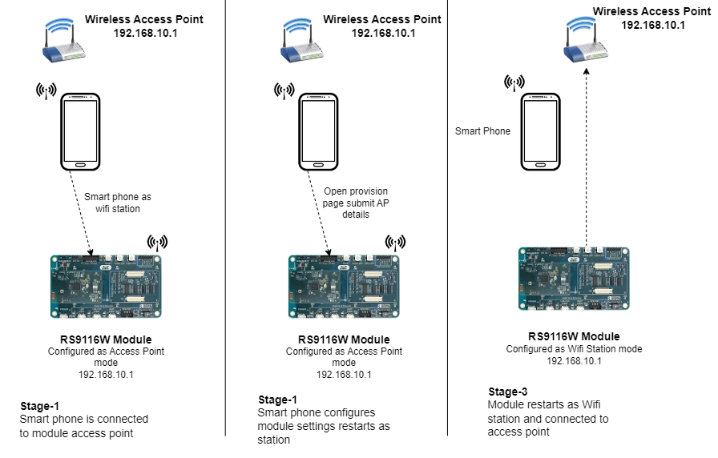
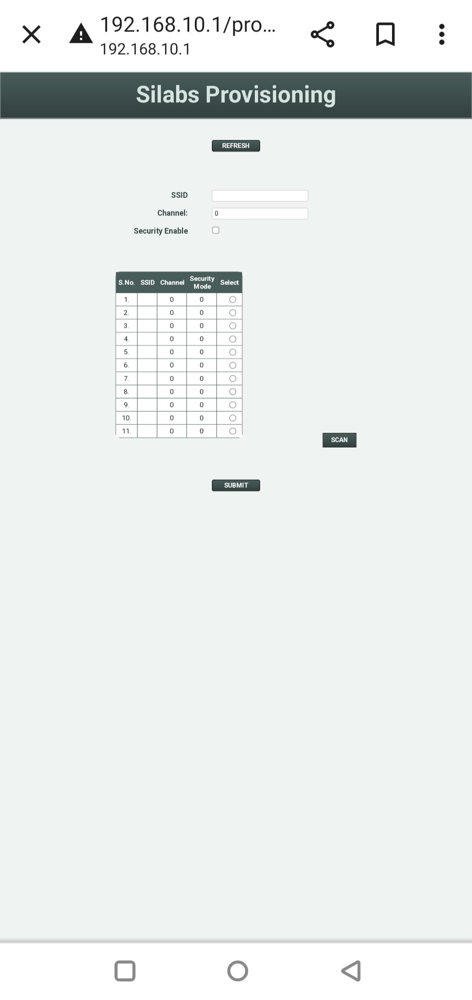
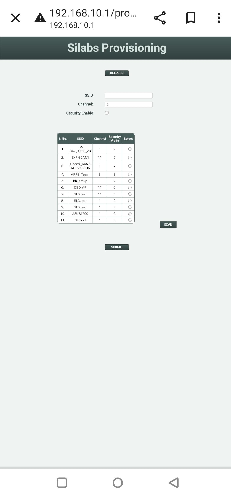
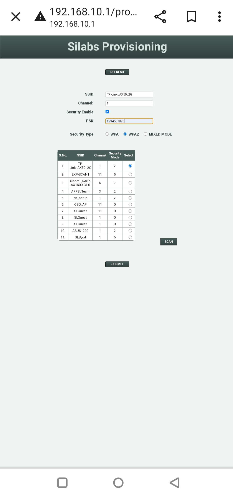

# Provisioning Example

## 1. Purpose / Scope

The provisioning application demonstrates how to provide provisioning to connect desired Access Point using the HTTP server, MDNS functionality of the Silabs device. In this application, the Silabs device starts as an Access point. After the successful creation of AP, the application initializes and registers the MDNS service. And application waits for the input to connect with the desired Access Point in station mode. Now, the User can open the provisioning page by connecting to the HTTP server running in the device and do scan and select the required Access point to connect and submit the configuration. Once the configuration submits, the application receives the configuration set by the user and restarts the device in station mode, and connects to the desired Access Point.

### Sequence of Events

This Application explains to the users how to:
   - Start the Silabs device as an Access Point after powering up
   - Connect a station to the device and get an IP address through DHCP
   - Open the provisioning page of the Device from the browser of the connected station (STA)
   - Click on the scan button, this updates scan results in the scan results table
   - Select the required Access point (AP) settings in the scan results table and submit the provisioning page
   - Silabs Device would restart as a Wi-Fi station and join to the configured Access point (AP)

## 2. Prerequisites / Setup Requirements

Before running the application, the user will need the following things to set up.

### 2.1 Hardware Requirements
- Windows PC with Host interface (UART / SPI / SDIO).
- Silicon Labs [RS9116 Wi-Fi Evaluation Kit](https://www.silabs.com/development-tools/wireless/wi-fi/rs9116x-sb-evk-development-kit) 
- Host MCU Eval Kit. This example has been tested with:
  - Silicon Labs [WSTK + EFR32MG21](https://www.silabs.com/development-tools/wireless/efr32xg21-bluetooth-starter-kit)
  - Silicon Labs [WSTK + EFM32GG11](https://www.silabs.com/development-tools/mcu/32-bit/efm32gg11-starter-kit)
  - [STM32F411 Nucleo](https://st.com/)
- Wireless Access Point
- Smart phone



### 2.2 Software Requirements

- [WiSeConnect SDK](https://github.com/SiliconLabs/wiseconnect-wifi-bt-sdk/)
- Embedded Development Environment
   - For STM32, use licensed [Keil IDE](https://www.keil.com/demo/eval/arm.htm)
   - For Silicon Labs EFx32, use the latest version of [Simplicity Studio](https://www.silabs.com/developers/simplicity-studio)

## 3. Application Build Environment

### 3.1 Platform

The Application can be built and executed on below Host platforms
* [STM32F411 Nucleo](https://st.com/)
* [WSTK + EFR32MG21](https://www.silabs.com/development-tools/wireless/efr32xg21-bluetooth-starter-kit)
* [WSTK + EFM32GG11](https://www.silabs.com/development-tools/mcu/32-bit/efm32gg11-starter-kit)

### 3.2 Host Interface

* By default, the application is configured to use the SPI bus for interfacing between Host platforms(STM32F411 Nucleo / EFR32MG21) and the RS9116W EVK.
* This application is also configured to use the SDIO bus for interfacing between Host platforms(EFM32GG11) and the RS9116W EVK.

### 3.3 Project Configuration

The Application is provided with the project folder containing Keil and Simplicity Studio project files.

* Keil Project
  - The Keil project is used to evaluate the application on STM32.
  - Project path: `<SDK>/examples/snippets/wlan/provisioning/projects/provisioning-nucleo-f411re.uvprojx`

* Simplicity Studio
  - The Simplicity Studio project is used to evaluate the application on EFR32MG21.
  - Project path:
    - If the Radio Board is **BRD4180A**, then access the path `<SDK>/examples/snippets/wlan/provisioning/projects/provisioning-brd4180a-mg21.slsproj`
    - If the Radio Board is **BRD4180B**, then access the path `<SDK>/examples/snippets/wlan/provisioning/projects/provisioning-brd4180b-mg21.slsproj`
        - User can find the Radio Board version as given below

   

  - EFM32GG11 platform
    - The Simplicity Studio project is used to evaluate the application on EFM32GG11.
      - Project path:`<SDK>/examples/snippets/wlan/provisioning/projects/provisioning-brd2204a-gg11.slsproj`
    
### 3.4 Bare Metal/RTOS Support

This application supports bare metal only. The application project files (Keil and Simplicity Studio) are provided with bare metal configuration.

## 4. Application Configuration Parameters

User has to configure the below parameters for executing the application.

## 4.1 Open rsi_provisioning_app.c file and update/modify following macros:
   
SSID refers to the name of the Access point to be created:
    
```c
#define SSID                                    "SILABS_AP"
```
    
CHANNEL_NO refers to the channel in which AP would be started:
    
```c
#define CHANNEL_NO                                 11
```

> Note:
Valid values for CHANNEL_NO in the 2.4GHz bands are 1 to 11 and 5GHz bands are 36 to 48 and 149 to 165. In this example, default configured band is 2.4GHz.
So, if the user wants to use a 5GHz band then the user has to set the RSI_BAND macro to a 5GHz band in (Example folder $) rsi_wlan_config.h file.


SECURITY_TYPE refers to the type of security. Access point supports Open, WPA, WPA2 securities.
   
   Valid configuration is:

   - RSI_OPEN - For OPEN security mode
   - RSI_WPA  - For WPA security mode
   - RSI_WPA2 - For WPA2 security mode
   
```c
#define SECURITY_TYPE                           RSI_WPA2
```

ENCRYPTION_TYPE refers to the type of Encryption method. Access point supports OPEN, TKIP, CCMP methods.

   Valid configuration is:

   - RSI_CCMP - For CCMP encryption
   - RSI_TKIP - For TKIP encryption
   - RSI_NONE - For open encryption

```c
#define ENCRYPTION_TYPE                        RSI_NONE
```   

PSK refers to the secret key if the Access point configured in WPA-PSK/WPA2-PSK security modes.
   
```c
#define PSK                                   "1234567890"
```    

BEACON_INTERVAL refers to the time delay between two consecutive beacons in milliseconds. Allowed values are integers from 100 to 1000 which are multiples of 100.

```C
#define BEACON_INTERVAL                         100
```

DTIM_INTERVALrefers DTIM interval of the Access Point. Allowed values are from 1 to 255.
```C
#define DTIM_INTERVAL                            4
```

To configure MDNSD parameters with desired values, To configure the MDNS IP version
Configure MDNSD_IP_VERSION to 4 for IPv4 or 6 for IPv6

```C
#define MDNSD_IP_VERSION                         4
```

To configure the MDNS time to live in seconds

```C
#define MDNSD_INIT_TTL                          300
```

To configure the time of the added service to live in seconds

```C
#define MDNSD_SERVICE_TTL                       300
```

MDNS service port number to be used

```C
#define MDNSD_SERVICE_PORT                      80
```

Users can add multiple services, but this example is designed to add only one service (HTTP). So more services are set to zero.
To add multiple services user should call rsi_mdnsd_register_service multiple times, each time setting the service more parameter to 1, and setting the service_more parameter to 0 for the last service.

```C
#define MDNSD_SERVICE_MORE                        0
```

Configure MDNS host name

```C
#define MDNSD_HOST_NAME                       "wiseconnect.local."
```

Configure MDNS service pointer name

```C
#define MDNSD_POINTER_NAME                    "_http._tcp.local."
```

Configure MDNS service name

```C
#define MDNSD_SERVICE_NAME                    "wiseconnect._http._tcp.local"
```

Configure MDNS service text filed

```C
#define MDNSD_SERVICE_TEXT                     "<text field>"
```

FILE_NAME refers File name of the webpage and Json object.

```C
#define FILE_NAME                              "provisioning.html"
```

**To configure IP address**

IP address to be configured to the device in STA mode.
```c
#define DEVICE_IP                                 "192.168.10.1"
```

IP address of the gateway.
```c
#define GATEWAY                                   "192.168.10.1"
```

IP address of the network mask.
```c
#define NETMASK                                   "255.255.255.0"
```

> Note: In AP mode, configure same IP address for both DEVICE_IP and GATEWAY macros.
   
## 4.2 Open ***rsi\_wlan\_config.h*** file and update/modify following macros:
   
```c
#define CONCURRENT_MODE                         RSI_DISABLE
#define RSI_FEATURE_BIT_MAP                    (FEAT_SECURITY_PSK )
#define RSI_TCP_IP_BYPASS                       RSI_DISABLE
#define RSI_TCP_IP_FEATURE_BIT_MAP             (TCP_IP_FEAT_DHCPV4_SERVER | TCP_IP_FEAT_DHCPV4_CLIENT | TCP_IP_FEAT_MDNSD | TCP_IP_FEAT_HTTP_SERVER)
#define RSI_CUSTOM_FEATURE_BIT_MAP              FEAT_CUSTOM_FEAT_EXTENTION_VALID
#define RSI_EXT_CUSTOM_FEAT_BIT_MAP             EXT_FEAT_256k_MODE
#define RSI_BAND                                RSI_BAND_2P4GHZ
```
   
> Note: `rsi_wlan_config.h` file is already set with desired configuration in respective example folders user need not change for each example.
  
## 5. Steps for Executing the Application

User has to follow the below steps for the successful execution of the application.

### 5.1 Loading the RS9116W Firmware

Refer [Updating RS9116W Firmware](https://docs.silabs.com/rs9116-wiseconnect/2.6/wifibt-wc-getting-started-with-pc/update-evk-firmware) to load the firmware into RS9116W EVK. The firmware file is located in `<SDK>/firmware/`

### 5.2 Steps for Compiling and Building the Application on the Host Platform

### 5.2.1 Using STM32

Refer [Getting started with STM32](https://docs.silabs.com/rs9116-wiseconnect/latest/wifibt-wc-getting-started-with-stm32/), for setting-up STM32 host platform.

- Open the project `<SDK>/examples/snippets/wlan/provisioning/projects/provisioning-nucleo-f411re.uvprojx` in Keil IDE.
- Build and Debug the project
- Check for the RESET pin:
  - If the RESET pin is connected from STM32 to RS9116W EVK, then the user needs not press the RESET button on RS9116W EVK before the free run.
    - RESET pin configuration for STM32: CN10 (pin number 6) to RS9116 (CN J9 RST_PS)
  - If the RESET pin is not connected from STM32 to RS9116W EVK, then the user needs to press the RESET button on RS9116W EVK before the free run.
- Free run the project
- Then continue the common steps from **Section 5.3**

### 5.2.2 Using EFX32

Refer [Getting started with EFX32](https://docs.silabs.com/rs9116-wiseconnect/latest/wifibt-wc-getting-started-with-efx32/), for settin-up EFR32 & EFM32 host platforms.

- Open Simplicity Studio and import the EFR32/EFM32 project from `<SDK>/examples/snippets/wlan/provisioning/projects`
    - Select the appropriate .slsproj as per Radio Board type mentioned in **Section 3.3** for EFR32 board.
   (or)
    - Select the *.brd2204a-gg11.slsproj  for EFM32GG11 board.
- Compile and flash the project in to Host MCU
- Debug the project
- Check for the RESET pin:
  - If the RESET pin is connected from EFR32/EFM32 to RS9116W EVK, then the user needs not press the RESET button on RS9116W EVK before the free run
      - RESET pin configuration for EFR32: Interconnect board (J4 GPIO header pin number 11) to RS9116 (CN J9 RST_PS)
      - RESET pin configuration for EFM32: Pin number 11 to RS9116 (CN J9 RST_PS)
  - If RESET pin is not connected from EFR32/EFM32 to RS9116W EVK, then the user needs to press the RESET button on RS9116W EVK before the free run
- Free run the project
- Then continue the common steps from **Section 5.3**

### 5.3 Common Steps

   1. After the program gets executed, Silicon Labs device will be started as Access point having the configuration same as that of in the application.

   > Note:
   Sometimes user may get Junk data in webpage so we are recommending to erase previous webpage using rsi_webpage_erase() api before loading new webpage.

   2. Now connect a Smart phone (STA) to RS9116W Device and get IP address.

   3. After successful connection, open the provisioning page from Smart Phone (STA) browser by giving the following URL:

     URL: wiseconnect.local/provisioning.html

   > Note:
   Silicon Labs device responds to the MDNS requests destined to 5353 port only. So ensure that the Wi-Fi station do request for the URL to the Device on 5353 port.

   If webpage not opened with the above URL, Use following URL to open provisioning page.

    URL: DEVICE_IP/provisioning.html (Exa: 192.168.10.1/provisioning.html)

   4. Provisioning page is displayed in the browser. Please refer the given below image for provisioning page.

   

   5. Click on scan button, scan list table will be updated after a 10 seconds timeout.
  
   

   > Note: Enterprise security mode is not supported

   6. Select the required Access point (AP) to which user wants to connect and provide the required PSK in case of AP secured and submit the configuration.

   

   7. WiSeConnect device will restart as WiFi Client and automatically will connect to the selected access Point.

   
