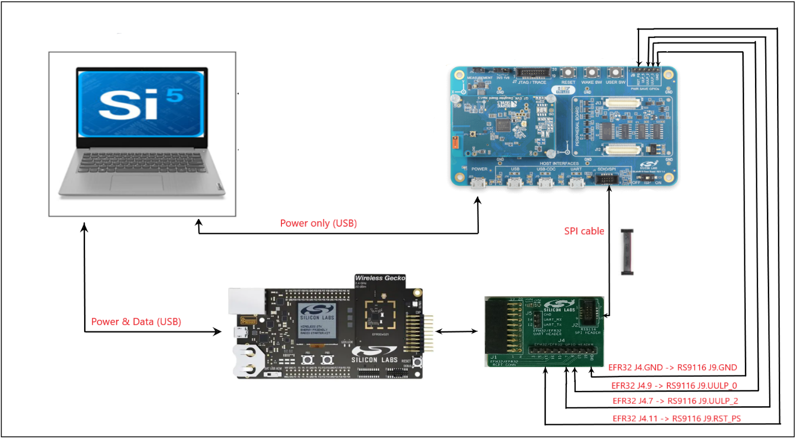
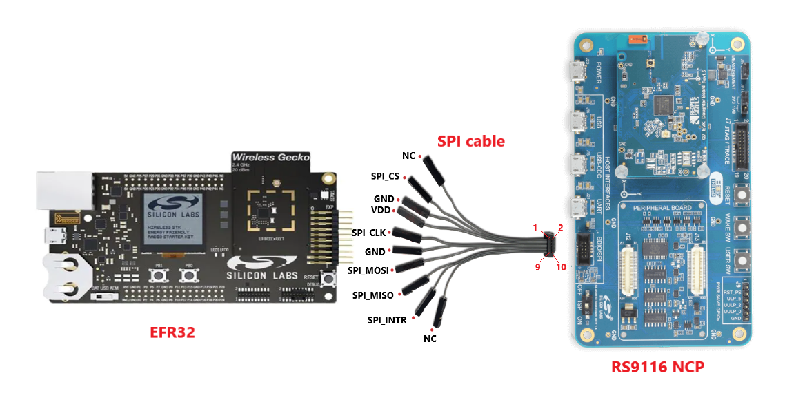
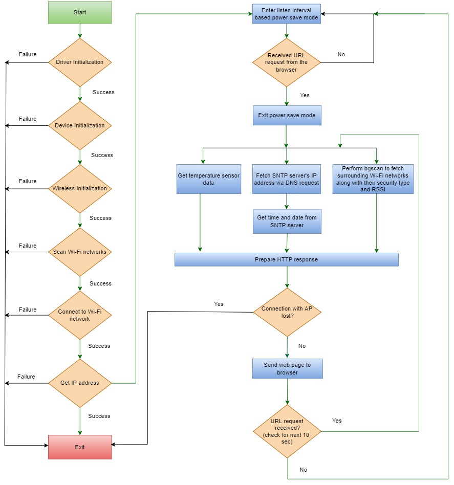
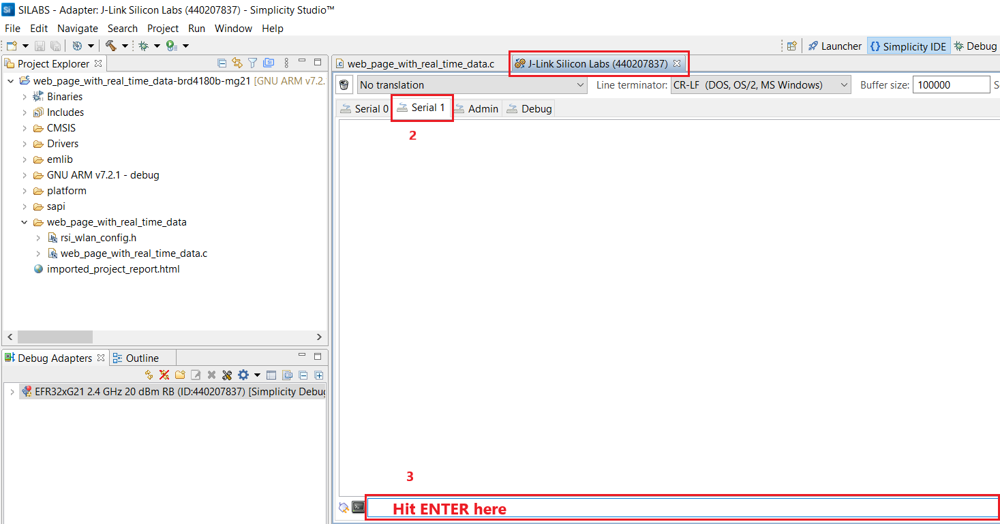
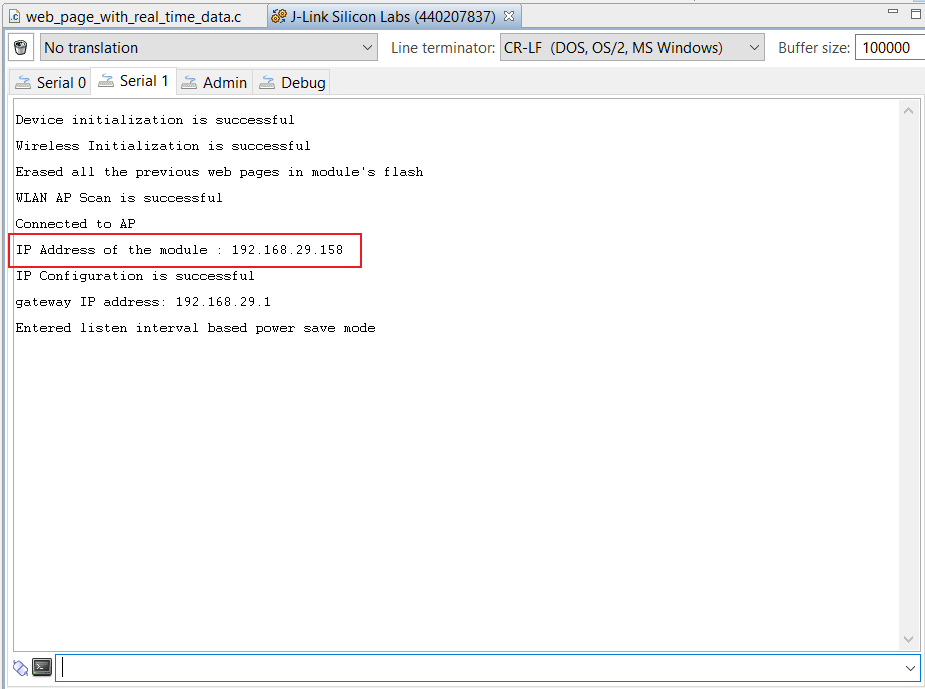
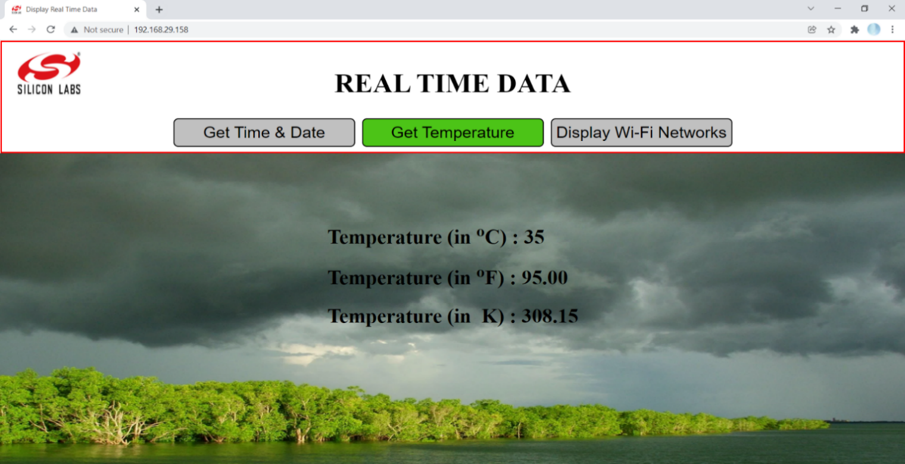

# Webpage with Real Time Data

## Description 

This application demonstrates how to send real time data such as region based time and date, temperature and surrounding Wi-Fi networks scan results onto a web page from the host MCU(EFR32) to browser via RS9116 NCP module upon URL Request.

## Prerequisites

For this lab, you will need the following:

### Hardware Requirements

- EFR32xG21 Starter Kit with Wireless Gecko (SLSWSTK6006A Base board: BRD4001A, Radio board: BRD4180a or BRD4180b)

- RS9116 Evaluation Board (RS9116X-SB-EVK1) / RS9116 Evaluation Board (RS9116X-DB-EVK1)

- Mini-USB to USB Type-A cable (included with EFR32xG21)

- Micro-USB to USB Type-A cable (included with RS9116X-SB-EVK1)

- Interconnect board and SPI ribbon cable (for SPI communication)

- Female to Female connectors - 4

- Windows PC with 2 USB ports and any browser

- Access Point (AP) with active internet connection

### Software Requirements

- Simplicity Studio v5 (v5.1.2.0 or higher)
         a. Download the simplicity studio from [Simplicity Studio](https://www.silabs.com/developers/simplicity-studio).

- Follow the [Simplicity Studio user guide](https://docs.silabs.com/simplicity-studio-5-users-guide/1.1.0/ss-5-users-guide-getting-started/install-ss-5-and-software#install-ssv5) to install Simplicity Studio.

- Download the latest RS9116 release package from the [link](https://github.com/SiliconLabs/wiseconnect-wifi-bt-sdk). 

**NOTE:**
- This application project is designed to work with EFR32 with the radio board as either BRD4180A OR BRD4180B.
- This application is tested with the latest 2.5.1 SDK and 2.5.1 firmware.
- This example application supports Bare metal as well as FreeRTOS.

## Setup

This section describes the hardware setup and the connections.

****

   1. Connect the Interconnect adapter board provided with the RS9116 NCP Development Kit to the EXP header of EFR32.

   2. Connect the SPI header of Interconnect adapter board to the SDIO/SPI connector of the RS9116 NCP using the 10-pin ribbon cable (SPI cable) provided  with RS9116 NCP.

   3. Connect the RST_PS pin on J9 header of RS9116 NCP to the pin labeled 11 on the J4 header of the Interconnect adapter board using a female-to-female   connector.

   4. Ensure the ISP switch on the RS9116 NCP module is set to OFF position. 

   5. Connect the RS9116 NCP to a PC using the USB interface labeled POWER. Note that this connection only provides power. There is no USB communication over this connection.

   6. Connect the EFR32 Starter Kit to a PC using a Mini USB cable.

   7. Connect the GND pin on J9 header of RS9116 NCP to pin labeled GND on J4 header of the Interconnect adapter board using a female-to-female   connector.

      **NOTE**: Connect the power save GPIOs as mentioned below.

       | **RS9116 J9 header**         | **Interconnect Board J4 header** |
       |------------------------------|---------------------------------:|
       | UULP_2                       |                                7 |
       | UULP_0 (for RS9116 chip version-1.4 & above)|                 9 |
       | UULP_3 (for RS9116 chip version-1.3 & below)|                 9 |

If the interconnect board is not available, make the connections between RS9116 NCP and EFR32 Host MCU as described below.
****
****

## Application flow

This flow chart describes the application flow.

**** 

**NOTE**: 
1. The application does not automatically resume from the beginning, in case the application flow fails at any point. The module should be reset again.
2. When the module gets connected to an Access Point that has got no internet connection, the module gets an IP and enters
power save mode. Thereafter, the application flow gets halted as no URL request frame will be forwarded over that network.

## Setting up the development environment

The following section describes how to set up Simplicity IDE in Windows Operating System.
1. Place the web_page_with_real_time_data folder in the downloaded SDK at path: <Release_Package>/examples/snippets/wlan
**NOTE:** It is optional to add the readme.md file and resources folder inside the web_page_with_real_time_data folder so that the folder structure looks similar to other project folders in the SDK.																																		
2. Ensure the RS9116 NCP module is pre-loaded with 2.5.1 firmware released by Silicon Labs following the steps mentioned in https://docs.silabs.com/rs9116-wiseconnect/latest/wifibt-wc-getting-started-with-pc/update-evk-firmware.

3. Ensure the EFR32 and RS9116 NCP setup is connected to your PC and the power save connections are properly made.

4. Launch the Simplicity Studio IDE on your PC.

5. Select the desired path as workspace directory. The following directory has been chosen for the workspace as shown in the image below.

6. Click on **Launch**.

****

7. When EFR32 is connected to the PC, radio board detection is indicated as below.

****

**Note:** While importing, select the project based on radio board version:

- For **BRD4180A** Select project related to brd4180a.
- For **BRD4180B** Select project related to brd4180b.
   
### Import the Project

This section provides the steps for importing the project into Simplicity Studio IDE.

1. In the Simplicity Studio IDE, go to **File** and select **Import**.
****

2. A pop up window appears.Click on **Browse**.

3. Navigate to the path, **\<Release package\> → examples → snippets → wlan → web\_page\_with\_real\_time\_data → projects** in the release package downloaded.

4. Select the appropriate project as per the detected radio board variant i.e., **web\_page\_with\_real\_time\_data\_brd4180a-mg21** → **BRD4180A**.
**web\_page\_with\_real\_time\_data\_brd4180b-mg21** → **BRD4180B**.

5. Click on **Next** → **Next**.

**** 

6. Now click on **Finish**.
  
### Application configuration

1. Once the project is successfully imported, the project name appears in the Project Explorer tab.

2. Expand the project folder by clicking on drop down.

3. Open the **web\_page\_with\_real\_time\_data.c** file present in **web\_page\_with\_real\_time\_data -brd4180b-mg21 → web\_page\_with\_real\_time\_data** folder.

**** 

4. Configure the SSID, SECURITY_TYPE, PSK and DHCP_MODE macros.
   - In this application the RS9116 NCP (station) gets connected to Access Point. SSID refers to the advertised name of the Access point's network.
     
     ```#define SSID                               "SILABS_AP"```
     
   - SECURITY_TYPE refers to the mode of security in which the Access Point's network is configured. In this application STA supports Open, WPA-PSK, WPA2-PSK securities.

     Valid configuration is:

     - RSI_OPEN - For OPEN security mode

     - RSI_WPA  - For WPA security mode

     - RSI_WPA2 - For WPA2 security mode

     - RSI_WPA3 - For WPA3 security mode
 
     ``` #define SECURITY_TYPE                        RSI_WPA2 ```

   - PSK refers to the secret key if the Access point is configured in WPA-PSK / WPA2-PSK security modes.

     ``` #define PSK                                 "123456789" ```

5. The google server's address is used as primary server address for making a DNS request by default. 

     ``` #define primary_server_address               "8.8.8.8" ```

   **NOTE:**
   - Some Access points do not get the response for the DNS query (return 0xBBA3 error) when the primary address is set to google server's address (8.8.8.8), in such a case enable the `DHCP_DNS` pre-processor symbol so that the gateway address obtained during DHCP (IP configuration) will serve as the primary DNS server.
   - The primary_server_address field can also be hard-coded with the gateway address of network to which the module gets connected, with the `DHCP_DNS`pre-processor symbol disabled. 

6. By default, the global URL names for SNTP servers have been provided. These fields can also be configured with the URL names of SNTP servers provided in the available AP’s Configuration. 
    - Domain name1 for SNTP server
      ```c
      #define RSI_DNS_URL_NAME1                "time.nist.gov"
      
    - Domain name2 for SNTP server (Backup)
      ```c
      #define RSI_DNS_URL_NAME2                "0.pool.ntp.org"

7. Open the **rsi\_wlan\_config.h** file and update/modify the following macros.

   **Note**: The required features are already set with the default values. It is optional to update the macros.

   - Opermode parameters
     ```c  
     #define RSI_FEATURE_BIT_MAP           (FEAT_SECURITY_PSK | FEAT_ULP_GPIO_BASED_HANDSHAKE | FEAT_AGGREGATION)

     #define RSI_TCP_IP_BYPASS              RSI_DISABLE

     #define RSI_TCP_IP_FEATURE_BIT_MAP    (TCP_IP_FEAT_DHCPV4_CLIENT | TCP_IP_FEAT_DNS_CLIENT | TCP_IP_FEAT_HTTP_SERVER  | TCP_IP_FEAT_SNTP_CLIENT | TCP_IP_FEAT_EXTENSION_VALID)

     #define RSI_CUSTOM_FEATURE_BIT_MAP     (CUSTOM_FEAT_DUAL_BAND_ROAM_VCSAFD | FEAT_CUSTOM_FEAT_EXTENTION_VALID)

     #define RSI_EXT_CUSTOM_FEATURE_BIT_MAP (EXT_FEAT_LOW_POWER_MODE | EXT_FEAT_XTAL_CLK_ENABLE)

     #define RSI_EXT_TCPIP_FEATURE_BITMAP   (EXT_TCP_IP_HTTP_SERVER_BYPASS | CONFIG_FEAT_EXTENTION_VALID)

     #define RSI_CONFIG_FEATURE_BITMAP      (RSI_FEAT_SLEEP_GPIO_SEL_BITMAP | ENABLE_ENHANCED_MAX_PSP) 
     ```
     **NOTE**: If you are using RS9116 chip version-1.3 & below, remove the macro EXT_FEAT_LOW_POWER_MODE
from RSI_EXT_CUSTOM_FEATURE_BITMAP.

   - Make sure the rejoin parameters are configured as shown below.
     ```c
     #define RSI_REJOIN_PARAMS_SUPPORT       RSI_ENABLE

     #define RSI_REJOIN_MAX_RETRY               10

     #define RSI_REJOIN_SCAN_INTERVAL            4

     #define RSI_REJOIN_BEACON_MISSED_COUNT     40

     #define RSI_REJOIN_FIRST_TIME_RETRY     RSI_ENABLE
     ```
     **NOTE**: By enabling Rejoin parameters, the module tries to rejoin the AP (in case of disconnection from the AP). After trying for
40 seconds (according to the above parameters), the application prints Connection with AP is lost.
8. Clean the Project. Build the project by right clicking on **web\_page\_with\_real\_time\_data-brd4180b-mg21** and select **Build Project**. It takes a few seconds to build.

****

  If there are no errors, you can go ahead with flashing the code into EFR32xG21.
  **NOTE:** If the application is not compatible (in case of errors while executing the project) with the latest SDK in the link or if the compatiblility of this application is to be tested with various SDKs, refer to the appendix section to link the compatible SDK in Simplicity Studio IDE.

**NOTE:** Make sure the setup (EFR32, RS9116 NCP module) is connected to PC, before flashing.

## Execution of Project

### Code Walkthrough

Below are some important APIs used in the application.

1. The following APIs have been used in the application for fetching temperature data.
   ```TEMPDRV_Init()``` -  This API initializes the temperature Driver.

   ```TEMPDRV_Enable(bool enable)``` -  This API enables the temperature Driver.

                        
2. The IP addresses of SNTP servers are erratic and unstable. Therefore, using the following API, a DNS request is made for fetching SNTP server’s IP address.

    ```int32_t rsi_dns_req (uint8_t ip_version, uint8_t *url_name, uint8_t *primary_server_address, uint8_t  *secondary_server_address, rsi_rsp_dns_query_t *dns_query_resp, uint16_t length)```

   For more info about DNS network API, refer to [DNS](https://docs.silabs.com/rs9116-wiseconnect/latest/wifibt-wc-sapi-reference/network6) .

3. The fetched SNTP server's IP address is fed into server_ip field of the following API, which creates SNTP client.

   ```int32_t rsi_sntp_client_create_async (uint8_t flags, uint8_t *server_ip, uint8_t sntp_method, uint16_t sntp_timeout, void(*rsi_sntp_client_create_response_handler) (uint16_t status, const uint8_t cmd_type, const uint8_t *buffer))```


4. Upon reception of response from SNTP server (implicitly connection establishment with SNTP server), **rsi\_sntp\_client\_create\_response\_handler** in the aforementioned API gets triggered and time and date info can be fetched from the same using the following API and is stored in **sntp\_time\_date\_rsp** buffer.

    ```int32_t rsi_sntp_client_gettime_date (uint16_t length, uint8_t *sntp_time_date_rsp)```

5. After getting time & date info, the SNTP client will be deleted using the following API.
   ```int32_t rsi_sntp_client_delete_async (void)```

   For more info about SNTP network APIs, refer to [SNTP](https://docs.silabs.com/rs9116-wiseconnect/latest/wifibt-wc-sapi-reference/network12) .

6. Wi-Fi networks scan results can be obtained via instant background scan (bg scan).

   ```int32_t rsi_wlan_bgscan_profile (uint8_t cmd, rsi_rsp_scan_t *result, uint32_t length)```

   For more info about bg scan WLAN API, refer to [WLAN](https://docs.silabs.com/rs9116-wiseconnect/latest/wifibt-wc-sapi-reference/wlan#rsi-wlan-bgscan-profile) .

7. All the data obtained above will be included in the HTML code. This resulting HTML code will be stored in a buffer called **webpage** in the following API. This API is used to send web page to browser.

    ```int32_t rsi_webpage_send (uint8_t flags, uint8_t *webpage, uint32_t length)```
  
   For more info about web page send API, refer to [Webpage](https://docs.silabs.com/rs9116-wiseconnect/latest/wifibt-wc-sapi-reference/network14).
8. The following API sets the module in power save mode with listen interval-based wakeup. After listen interval elapses (set to
500 milliseconds by default), the module wakes up and checks for the buffered data in the beacon frames.

   ```rsi_wlan_power_save_with_listen_interval (PSP_MODE, PSP_TYPE, PS_LISTEN_INTERVAL) ```

   **NOTE:** The PS_LISTEN_INTERVAL macro, which is used to configure sleep duration in power save should be less than the listen interval configured by RSI_LISTEN_INTERVAL Macro in join command parameters in rsi_wlan_config.h file.

### Set up the Virtual COM port on Simplicity Studio IDE

The Virtual COM (VCOM) port interface is used for printing out debug prints from the application.
1. In the Debug Adapters pane, right-click on the detected device and choose Launch Console to launch a console connection.

****

2. J-link Silicon Labs console pane opens as shown below. Switch to the Serial 1 tab in the console pane, for viewing the debug prints from the application.

3. Hit Enter on the Serial 1 tab to establish a serial connection between PC and setup.

****

### Debug the project

1. To flash the code, right click on the project name and select **Debug As** → **Silicon Labs ARM Program**.
  - If the EFR32xG21 has an older SE firmware, the following warning may pop up. Click ‘Yes’ to continue

  ****

  - If the connected EFR32 board has any other radio board other than 20dbm, Simplicity Studio will not be able to detect the device and gives the below pop-up window for Device Selection. Select the device displayed and click OK.

  ****

  - The following warning might pop-up as shown below, Click Yes and continue. 

  ****

2. As soon as the debug process is completed, the application control branches to the main().

### Execute the Project

1. Go to the J-link Silicon Labs console pane to observe the debug prints in the Serial 1 tab.
2. Click Resume icon in the Simplicity Studio IDE toolbar to run the project.

****

3. If the flow of application until IP configuration is successful, the following debug prints will appear on the Serial 1 tab.

**** 

4. Now enter the IP Address of the module (which is displayed on the Serial 1 tab) in the URL field of Smart Phone/Laptop/PC’s
browser (make sure that the device you are using to browse is connected to the same network to which RS9116 NCP module is connected). The following webpage will be displayed. Observe the debug prints parallelly on the Serial 1 tab.

****

****

**NOTE**: 
- The web page will be displayed on the browser only after the **Responded with the requested web page** print appeared
on the Serial 1. It takes about 3-4 seconds for the preparation of HTTP Response. Hence it is recommended not to refresh the 
web page until it gets completely loaded on the browser.
- After an URL request is made, the module
    1. exists power save mode,
    2. sends the HTTP response to the browser,
    3. checks for the URL requests for 10 seconds.
    4. again enters power save mode, if no URL request is made within 10 seconds else serves the URL request. 
5. When clicked on Get Time & date tab, the following will be displayed on the web page.

****

  - Upon clicking the dropdown menu, the regions will be listed as shown below. Select any of the regions listed.

****  

  - Click on Submit. The date along with running time in the selected region will be displayed.

****

  - When clicked on the Get Temperature tab, the temperature value in Kelvin, Celsius, and Fahrenheit units will be displayed on the web page.

****

     - The background image of the webpage changes in accordance with the temperature, depicting the degree of hotness or coldness.

****


6. When clicked on the Display Wi-Fi Networks tab, the scan results along with their Security Mode and RSSI values in dBm will be displayed on the web page in the descending order of their RSSI values.

****

   **NOTE**:
   - The network to which the device (which is currently being used for browsing IP address of module) is connected, will be highlighted. In the above case, SILABS_AP1 is the network, which is used for browsing. Hence it is highlighted.
   - The Wi-Fi icon varies in accordance with the RSSI signal strength for each network. In the Wi-Fi icon, the lower the RSSI value, the more faded the curves are and vice versa. In the above case, among all the networks, from the network SILABS_AP3, the module received a signal of lowest strength. Hence most of the curves appear faded in the Wi-Fi the icon associated with that network.
   - A maximum of 11 networks can be scanned by the RS9116 NCP module and hence a maximum of 11 networks will be shown on the web page.

## Optional features

1. In the application, there are many intermediate debug prints. By default, these debug prints are disabled. When
DEBUG_PRINTS macro in the web_page_with_real_time_data.c is set, these prints can be viewed on the Serial 1 tab of
the J-link Silicon Labs console.

   ``` #define DEBUG_PRINTS           1```

2. The Intermediate Debug prints include
   - Security type and RSSI value for each network scanned, during bg scan.
   - Creation and deletion of SNTP client.
   - UTC (Coordinated Universal Time) and date (obtained from SNTP server) string segregated into the month, day, year, hours, minutes, and seconds.
3. In the picture below, highlighted are the intermediate prints obtained when DEBUG_PRINTS macro is set.

****

4. By default, the application runs on FreeRTOS. Remove the `RSI_WITH_OS` preprocessor symbol to run the application on Bare metal.
5. Assume that the connection with current AP to which the module is connected with is lost. In this scenario, module will try to rejoin the AP for a rejoin interval of time(40 sec). If the AP is not found during this period, the application prints `Connection with AP is lost`.

## Appendix

### How to link the desired SDK in to Simplicity Studio IDE?

1. Clone the external GitHub repo which contains the latest SDK.

   a. In the Simplicity Studio IDE, go to **Preferences > Simplicity Studio > External Repos**. 

   ****

   b. By default, the **WiseConnect Wi-Fi/BT SDK** repo's GitHub path is available in external repos. Click on **update** as shown below so that the latest SDK at https://github.com/SiliconLabs/wiseconnect-wifi-bt-sdk gets cloned at path: **C:\SimplicityStudio\v5\developer\repos\wiseconnect-wifi-bt-sdk**.

   ****

   c. After updating the repo, the SDK gets updated locally as shown below.

   ****

   ****

2. Check the available tags (repos pointing to other SDKs whose version is lower than the latest one) for the repo by giving the below command in command prompt

     ``` git tag ```
**** 
****  
        
3. Select the desired tag and create a new folder (in this case, it is **gitSDK_tag**) locally at any path and give the below git command at that path.

     ```git clone https://github.com/SiliconLabs/wiseconnect-wifi-bt-sdk.git --branch=<tag name> ```

In this case, the tag name selected was **2.4.1**. Hence the command given is as follows:

   ```git clone https://github.com/SiliconLabs/wiseconnect-wifi-bt-sdk.git --branch=2.4.1 ```

****  

4. Now you can place the webpage with real time data project folder in the above cloned SDK as shown below. 

**** 

5. Link the local SDK path in Simplicity studio.
						
	a. Navigate to **Preferences > Simplicity Studio > External Repos** and click on **Add**.
   
   b. Browse to the local SDK location (append the path with **.git**extension) and click on **Finish**. Click on **Apply and Close**.

   **** 
   
   c. Open Launcher perspective, you could see the linked SDK as below.

   ****
   																										  
6. Then, follow the steps from **Import the project** section.

  


